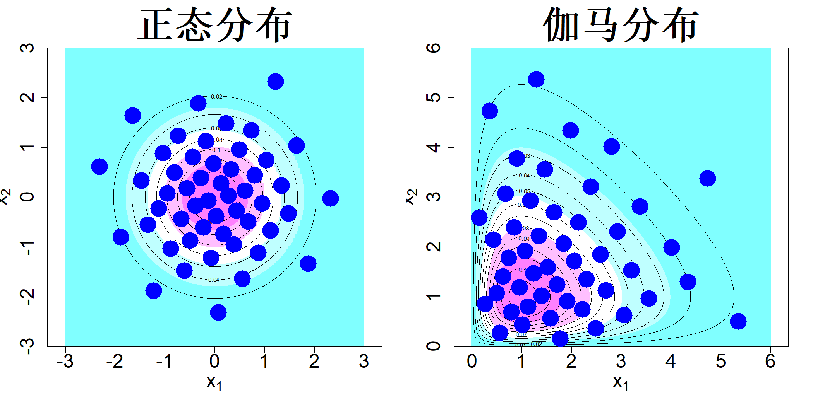
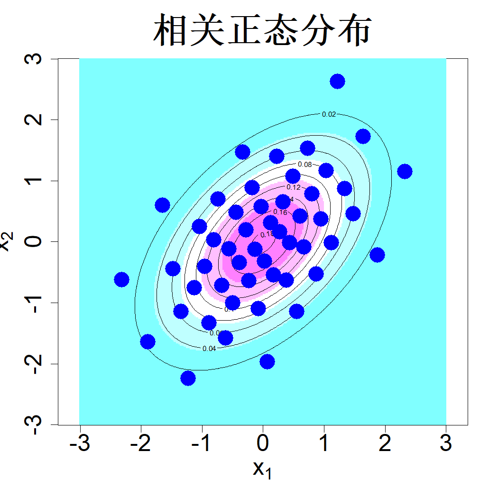

## 5.2 非均匀分布

在本节中，我们将研究从非均匀分布中进行最优采样的问题。本节所得结果在数据科学领域也有着重要应用，我们将在本书的第四部分后续展开探讨。

### 5.2.1 变换方法

假设我们的目标是获取分布 $f(\boldsymbol{x})$（$\boldsymbol{x}\in\mathbb{R}^p$）的代表性样本。一旦得到样本 $D=\{\boldsymbol{x}_1,\dots,\boldsymbol{x}_n\}$，就可以利用该样本，通过样本均值

$$
\widehat{I}=\frac{1}{n}\sum_{i=1}^nh(\boldsymbol{x}_i)
$$

来近似积分

$$
I=\int h(\boldsymbol{x})f(\boldsymbol{x})\mathrm{d}\boldsymbol{x}
$$

我们的目标是找到最优样本集 $D$，使得对任意被积函数 $h(\cdot)$，积分误差 $|\widehat{I}-I|$都尽可能小。

既然我们已经知道如何求解均匀分布情形下的上述问题，那么对于一般分布的情形，是否可以设法利用该结果呢？为解答这一问题，首先考虑一维问题的情况。概率论中的如下结论会很有用。

> **引理 5.1**：若 $U\sim\mathcal{U}(0,1)$，则 $X=F^{-1}(U)$ 的分布函数为 $F(\cdot)$。

该结果易于证明，因为

$$
P\{X\le x\}=P\{F^{-1}(U)\le x\}=P\{U\le F(x)\}=F(x)
$$

因此，若有独立同分布的随机样本 $u_i\sim\mathcal{U}(0,1)$，其中 $i=1,\dots,n$，则 $\{F^{-1}(u_i)\}_{i=1}^n$ 是服从分布 $F$ 的随机样本。如方与王（1993）所述，若 $\{u_i\}_{i=1}^n$ 在均匀分布下使星型偏差达到最小，则 $\{F^{-1}(u_i)\}_{i=1}^n$ 可使星型偏差 $\sup|F(x)-F_n(x)|$ 最小。据此我们可以采用下式得到 $I$ 的估计值：

$$
\widehat I=\frac1n\sum_{i=1}^nh(F^{-1}(u_i))
$$

其中 $\{u_i\}_{i=1}^n$ 为蒙特卡罗样本、拟蒙特卡罗样本或是均匀设计样本。若对积分做变量替换，令 $F(x)=u$，该结论便显而易见：

$$
I=\int h(x)f(x)\,\mathrm{d}x=\int_0^1h(F^{-1}(u))\,\mathrm{d}u
$$

遗憾的是，一般情况下，除部分特殊情形外，上述结果并不能用于多维积分。该变换方法能够适用的一类重要特殊情形是随机变量相互独立：

$$
F(\boldsymbol{x})=\prod_{i=1}^{p}F_i(x_i)
$$

其中 $F_i(x_i)$ 为第 $i$ 个变量的分布函数。此时我们可以对每个变量执行逆概率变换，将积分写为：

$$
\begin{align*}
I&=\int h(\boldsymbol{x})f(\boldsymbol{x})\,\mathrm{d}\boldsymbol{x}\\
&=\int h(\boldsymbol{x})\prod_{i=1}^{p}f_i(x_i)\,\mathrm{d}x_1\cdots\mathrm{d}x_p\\
&=\int_{[0,1]^p} h\big(F_1^{-1}(u_1),\dots,F_p^{-1}(u_p)\big)\mathrm{d}u_1\cdots\mathrm{d}u_p.
\end{align*}
$$

图 5.4 左子图展示了利用均匀设计的逆概率变换生成的 50 个独立二元正态分布样本点。该图右子图给出 50 个样本点，对应两个变量分别服从形状参数为 2、率参数为 1 的独立伽马分布。两组样本点均能够较好表征对应分布。李等人（2020）阐述了逆概率变换可以生成具备良好代表性分布样本集的相关条件。

> **图 5.4**：通过均匀设计的逆概率变换得到的二元正态分布（左）与伽马分布（右）的 50 个代表点。图中同时展示了两种分布的图像与等高线

{width=67%}

当变量存在相关性时，有时可以采用如下罗森布拉特变换（罗森布拉特，1952）：

$$
\begin{align*}
u_1&=F_1(x_1)\\
u_2&=F_2(x_2|x_1)\\
&\vdots\\
u_p&=F_p(x_p|x_1,\dots,x_{p-1})
\end{align*}
$$

式中 $F_i(x_i|x_1,\dots,x_{i-1})$ 为给定 $x_1,\dots,x_{i-1}$ 条件下 $x_i$ 的条件分布函数，且 $u_i$ 独立同分布服从 $\mathcal{U}(0,1)$。为证明该变换的有效性，首先给出变换的雅可比行列式：

$$
|J|=\left|\frac{\partial(u_1,\dots,u_p)}{\partial(x_1,\dots,x_p)}\right|
=f_1(x_1)f_2(x_2|x_1)\cdots f_p(x_p|x_1,\dots,x_{p-1})
=f(x_1,x_2,\dots,x_p)
$$

该结果来源于雅可比矩阵为上三角矩阵，其行列式等于对角线元素的乘积。由关系式 $f(x_1,\dots,x_p)=f_u(u_1,\dots,u_p)|J|$，可得 $u_1,\dots,u_p$ 的概率密度必为 1。

举一个示例，考虑从如下二元正态分布生成样本点：

$$
\begin{bmatrix}x_1\\x_2\end{bmatrix}
\sim \mathcal{N}_2\left(\begin{bmatrix}0\\0\end{bmatrix},
\begin{bmatrix}1&\rho\\\rho&1\end{bmatrix}\right)
\tag{5.8}
$$

依据引理 2.2 可得：

$$
\begin{align*}
x_1&\sim\mathcal{N}(0,1)\\
x_2|x_1&\sim\mathcal{N}(\rho x_1,1-\rho^2)
\end{align*}
$$

因此可以按如下方式生成样本点：

$$
\begin{align*}
x_{1i}&=\Phi^{-1}(u_{1i})\\
x_{2i}&=\rho x_{1i}+\sqrt{1-\rho^2}\Phi^{-1}(u_{2i})
\end{align*}
$$

其中 $i=1,\dots,n$，$\{(u_{1i},u_{2i})\}_{i=1}^n$ 为均匀设计样本，$\Phi(\cdot)$ 代表标准正态分布函数。图 5.5 展示了取 $\rho=0.5$ 时按上述方式生成的 50 个样本点。可以看到，这些样本点能够很好地还原图示分布的特征。

> **图 5.5**：通过对均匀设计进行罗森布拉特变换得到的相关二元正态分布代表点，叠加绘制于该分布的图像之上

{width=33%}

方与王（1993）阐述了如何利用罗森布拉特变换在球体或单纯形内生成拟蒙特卡罗（QMC）样本或均匀设计。但该变换无法适用于约束条件更为复杂的区域，例如 4.5.1 节所讨论的各类区域。此外，上述变换方法在其他统计问题中的适用范围有限。举例来说，在贝叶斯统计中，通常仅能得到未归一化的后验密度，即我们一般无法获知概率密度及其分布函数；变量之间还很可能存在相关性，且条件分布未知。因此，总体而言，我们无法使用逆概率变换或罗森布拉特变换开展抽样。更为棘手的是常规数据分析问题：我们仅拥有样本数据，却对生成该数据的分布一无所知。由此，我们需要一种适用性更广的非均匀分布抽样方法，相关内容将在下一节展开讨论。