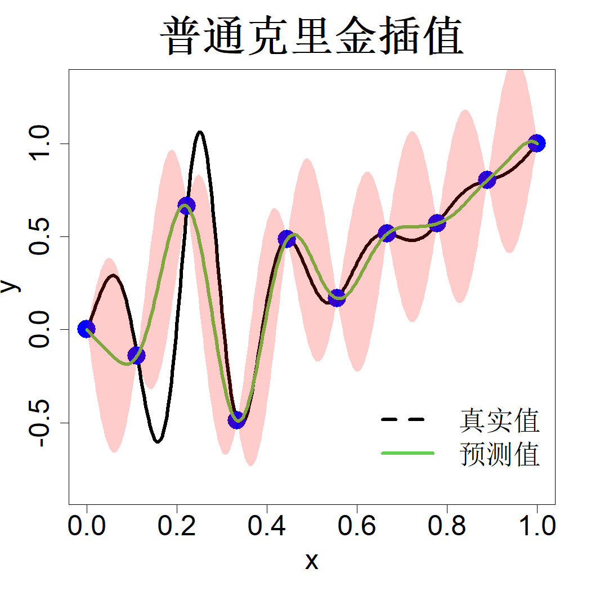

### 2.1.3 克里金

克里金法是一种多元插值技术，以克里格（1951）命名，马瑟荣（1963）通过开创性研究将其发展应用于地质统计学领域。该方法的起源可参阅克雷西（1990）的著作。克雷西（1993）探讨了克里金法在空间统计问题中的应用，斯坦（1999）阐述了其理论基础。萨克斯等人（1989）将这一技术引入计算机实验领域。

克里金法的核心思想是将确定性函数 $h(\boldsymbol{x})$ 视作随机过程 $Y(\boldsymbol{x})$ 的一次实现。设该随机过程均值恒为 $\mu$，协方差函数为 $K(\boldsymbol{u},\boldsymbol{v})=\mathrm{cov}\{Y(\boldsymbol{u}),Y(\boldsymbol{v})\}$。对于二阶平稳随机过程，其协方差函数可写为：

$$
K(\boldsymbol{u},\boldsymbol{v})=\tau^2R(\boldsymbol{u}-\boldsymbol{v})
$$

式中 $\tau^2$ 为方差，$R(\cdot)$ 为相关函数。我们可以选用哪些相关函数呢？由于 $\mathrm{cor}\{Y(\boldsymbol{u}),Y(\boldsymbol{u})\}=1$，必然满足 $R(\boldsymbol{0})=1$；同时 $\mathrm{cor}\{Y(\boldsymbol{u}),Y(\boldsymbol{v})\}=\mathrm{cor}\{Y(\boldsymbol{v}),Y(\boldsymbol{u})\}$，因此 $R(\boldsymbol{u}-\boldsymbol{v})=R(\boldsymbol{v}-\boldsymbol{u})$，说明 $R(\cdot)$ 必须是偶函数。最后，对任意向量 $\boldsymbol{c}$ 均满足 $\mathrm{var}\{\boldsymbol{c}'\boldsymbol{Y}\}\ge0$，等价于 $\boldsymbol{c}'\boldsymbol{R}\boldsymbol{c}\ge0$，这就要求 $R(\cdot)$ 为半正定函数。满足上述条件的函数有很多，式 (2.8) 中的高斯函数便是其中之一。不过并非一定要选用径向（各向同性）函数。实际上，为各个输入变量设置不同的长度尺度参数往往具备显著优势。由矩阵代数结论可知：正定矩阵的哈达玛积仍为正定矩阵（法斯豪尔，2007，第 30 页），由此可推得正定函数的乘积同样具备正定性。据此定义高斯乘积相关函数：

$$
R(\Delta)=\prod_{i=1}^{p}e^{-\Delta_i^2/\theta_i^2}=e^{-\sum_{i=1}^{p}\Delta_i^2/\theta_i^2}
\tag{2.11}
$$

表 2.1 列出了几种常用一维相关函数。多维相关函数有两种构造方式：一是仿照式 (2.11) 将一维相关函数相乘；二是将自变量差值 $\Delta$ 替换为加权欧几里得范数：$\|\Delta\|_\theta=\sqrt{\sum_{i=1}^{p}(\Delta_i/\theta_i)^2}$。相关函数的选取决定了随机过程的光滑程度。例如，高斯相关函数对应的样本路径无穷阶可微，而指数相关函数对应的样本路径处处不可微。详细内容可参阅拉斯穆森与威廉姆斯（2006，第 4 章）以及法斯豪尔与麦考特（2015，第 3 章）。

> **表 2.1**：若干常用相关函数

|名称|相关函数$R(\Delta)$|参数条件|
|:--|:--|:--|
|高斯型|$\mathrm{e}^{-\Delta^2/\theta^2}$|$\theta>0$|
|指数型|$\mathrm{e}^{-\|\Delta\|/\theta}$|$\theta>0$|
|幂指数型|$\mathrm{e}^{-(\|\Delta\|/\theta)^\alpha}$|$\theta>0,0<\alpha\le2$|
|3/2阶马特恩函数|$\left(1+\sqrt{3}\frac{\left\|\Delta\right\|}{\theta}\right)\mathrm{e}^{-\sqrt{3}\|\Delta\|/\theta}$|$\theta>0$|
|5/2阶马特恩函数|$\left(1+\sqrt{5}\frac{\left\|\Delta\right\|}{\theta}+\frac53\frac{\Delta^2}{\theta^2}\right)\mathrm{e}^{-\sqrt{5}\|\Delta\|/\theta}$|$\theta>0$|
|有理二次型|$\left(1+\frac{\Delta^2}{\theta^2}\right)^{-\alpha}$|$\theta>0,\alpha>0$|

现有数据集 $\{(\boldsymbol{x}_i,y_i)\}_{i=1}^n$，我们可以构造线性预测器：

$$
\widehat{y}(\boldsymbol{x})=\boldsymbol{a}(\boldsymbol{x})'\boldsymbol{y}
$$

并通过最小化预测均方误差来求解最优线性预测器：

$$
\mathrm{MSE}(\boldsymbol{x})=\mathrm{E}\left\{\boldsymbol{a}(\boldsymbol{x})'\boldsymbol{Y}-Y(\boldsymbol{x})\right\}^2
\tag{2.12}
$$

式中的期望是针对随机过程求取。采用频率学派视角时，我们将观测数据向量 $\boldsymbol{y}$ 替换为其随机形式 $\boldsymbol{Y}=\left(Y(\boldsymbol{x}_1),\dots,Y(\boldsymbol{x}_n)\right)'$。若满足

$$
\mathrm{E}\left\{\boldsymbol{a}(\boldsymbol{x})'\boldsymbol{Y}\right\}=\mu,\quad\forall x
$$

则该线性预测器为无偏预测器。

由于 $\mathrm{E}(\boldsymbol{Y})=\mu\boldsymbol{1}$（$\boldsymbol{1}$ 为由 $n$ 个 1 构成的向量），无偏条件可简化为：

$$
\boldsymbol{a}(\boldsymbol{x})'\boldsymbol{1}=1
$$

此时均方误差可推导为：

$$
\begin{align*}
\mathrm{MSE}(\boldsymbol{x})&=\mathrm{var}\left\{\boldsymbol{a}(\boldsymbol{x})'\boldsymbol{Y}-Y(\boldsymbol{x})\right\}\\
&=\boldsymbol{a}(\boldsymbol{x})'\mathrm{var}\{\boldsymbol{Y}\}\boldsymbol{a}(\boldsymbol{x})-2\boldsymbol{a}(\boldsymbol{x})'\mathrm{cov}\{\boldsymbol{Y},Y(\boldsymbol{x})\}+\tau^2\\
&=\tau^2\boldsymbol{a}(\boldsymbol{x})'\boldsymbol{R}\boldsymbol{a}(\boldsymbol{x})-2\tau^2\boldsymbol{a}(\boldsymbol{x})'\boldsymbol{r}(\boldsymbol{x})+\tau^2
\end{align*}
$$

其中矩阵 $\boldsymbol{R}$ 与向量 $\boldsymbol{r}(\boldsymbol{x})$ 定义如下：

$$
\boldsymbol{R}=
\begin{bmatrix}
1&&\cdots&&\\\\
\vdots&&R(\boldsymbol{x}_{i}-\boldsymbol{x}_{j})&&\vdots\\\\
&&\cdots&& 1
\end{bmatrix},\quad\boldsymbol{r}(\boldsymbol{x})=\begin{bmatrix}
\vdots\\\\R(\boldsymbol{x}-\boldsymbol{x}_i)\\\\\vdots
\end{bmatrix}
\tag{2.13}
$$

因此，该优化问题为

$$
\begin{align*}
&\min_{\boldsymbol{a}(\boldsymbol{x})}\boldsymbol{a}(\boldsymbol{x})'\boldsymbol{R}\boldsymbol{a}(\boldsymbol{x})-2\boldsymbol{a}(\boldsymbol{x})'\boldsymbol{r}(\boldsymbol{x})+1\\
&\;\text{s.t.}\quad\boldsymbol{a}(\boldsymbol{x})'\boldsymbol{1}=1
\end{align*}
$$

可采用拉格朗日乘数法求解（为简便起见省略自变量 $\boldsymbol{x}$）：

$$\min L=\boldsymbol{a}'\boldsymbol{R}\boldsymbol{a}-2\boldsymbol{a}'\boldsymbol{r}+1+2\lambda(\boldsymbol{a}'\boldsymbol{1}-1)$$

将 $L$ 对向量 $\boldsymbol{a}$ 求偏导并令导数等于 0，可得：

$$
\frac{\partial L}{\partial\boldsymbol{a}}=2\boldsymbol{R}\boldsymbol{a}-2\boldsymbol{r}+2\lambda\boldsymbol{1}=0
$$

整理得到 $\boldsymbol{a}=\boldsymbol{R}^{-1}(\boldsymbol{r}-\lambda\boldsymbol{1})$。将该式代入约束条件并求解 $\lambda$，可得 $\lambda=(\boldsymbol{r}'\boldsymbol{R}^{-1}\boldsymbol{1}-1)/\boldsymbol{1}'\boldsymbol{R}^{-1}\boldsymbol{1}$，进而求得：

$$
\widehat{\boldsymbol{a}}=\boldsymbol{R}^{-1}\boldsymbol{r}-\frac{(\boldsymbol{r}'\boldsymbol{R}^{-1}\boldsymbol{1}-1)}{\boldsymbol{1}'\boldsymbol{R}^{-1}\boldsymbol{1}}\boldsymbol{R}^{-1}\boldsymbol{1}
$$

由此，最优线性无偏预测（BLUP）表达式为：

$$
\begin{align*}
\widehat{\boldsymbol{y}}(\boldsymbol{x})&=\widehat{\boldsymbol{a}}(\boldsymbol{x})'\boldsymbol{y}\\
&=\boldsymbol{r}(\boldsymbol{x})'\boldsymbol{R}^{-1}\boldsymbol{y}-\frac{(\boldsymbol{r}(\boldsymbol{x})'\boldsymbol{R}^{-1}\boldsymbol{1}-1)}{\boldsymbol{1}'\boldsymbol{R}^{-1}\boldsymbol{1}}\boldsymbol{1}'\boldsymbol{R}^{-1}\boldsymbol{y}\\
&=\widehat{\mu}+\boldsymbol{r}(\boldsymbol{x})'\boldsymbol{R}^{-1}(\boldsymbol{y}-\widehat{\mu}\boldsymbol{1})
\tag{2.14}
\end{align*}
$$

其中

$$
\widehat{\mu}=\frac{\boldsymbol{1}'\boldsymbol{R}^{-1}\boldsymbol{y}}{\boldsymbol{1}'\boldsymbol{R}^{-1}\boldsymbol{1}} 
\tag{2.15}
$$

易证式 (2.15) 中的 $\mu$ 估计量，是当期望 $\mathrm{E}(\boldsymbol{y})=\mu\boldsymbol{1}$、方差 $\mathrm{var}(\boldsymbol{y})=\tau^2\boldsymbol{R}$ 成立时的广义最小二乘（GLS）估计量。因此式 (2.14) 的预测过程可拆解为三步：(1) 利用广义最小二乘法由数据估计均值 $\mu$；(2) 计算残差 $\boldsymbol{y}-\widehat{\mu}\boldsymbol{1}$；(3) 对残差进行插值运算，再将插值结果叠加至均值估计值 $\widehat{\mu}$ 上。

该预测式 (2.14) 即为普通克里金插值。注意

$$
\begin{align*}
\boldsymbol{I}=\boldsymbol{R}^{-1}\boldsymbol{R}&=\boldsymbol{R}^{-1}
\begin{bmatrix}
\boldsymbol{r}(\boldsymbol{x}_{1})&\cdots&\boldsymbol{r}(\boldsymbol{x}_{i})&\cdots&\boldsymbol{r}(\boldsymbol{x}_{n})
\end{bmatrix}\\&=\begin{bmatrix}
\boldsymbol{R}^{-1}\boldsymbol{r}(\boldsymbol{x}_{1})&\cdots&\boldsymbol{R}^{-1}\boldsymbol{r}(\boldsymbol{x}_{i})&\cdots&\boldsymbol{R}^{-1}\boldsymbol{r}(\boldsymbol{x}_{n})
\end{bmatrix}
\end{align*}
$$

由此可得，对任意 $i=1,\dots,n$，有 $\boldsymbol{R}^{-1}\boldsymbol{r}(\boldsymbol{x}_i)=\boldsymbol{I}_i$，其中 $\boldsymbol{I}_i$ 为单位矩阵的第 $i$ 列。于是

$$
\begin{align*}
\widehat{y}(\boldsymbol{x}_{i})&=\widehat{\mu}+\boldsymbol{I}_{i}'(\boldsymbol{y}-\widehat{\mu}\boldsymbol{1})\\
&=\widehat{\mu}+(y_{i}-\widehat{\mu})=y_{i},\quad\forall i
\end{align*}
$$

综上，普通克里金预测算子属于插值算子。

将普通克里金预测子代入均方误差表达式并化简后，可得：

$$
\mathrm{MSE}(\boldsymbol{x})=\tau^2\left[
1-\boldsymbol{r}(\boldsymbol{x})'\boldsymbol{R}^{-1}\boldsymbol{r}(\boldsymbol{x})
+\frac{\{\boldsymbol{r}(\boldsymbol{x})'\boldsymbol{R}^{-1}\boldsymbol{1}-1\}^2}{\boldsymbol{1}'\boldsymbol{R}^{-1}\boldsymbol{1}}
\right]
\tag{2.16}
$$

该式用于量化预测结果的不确定性。由于 $\boldsymbol{R}^{-1}\boldsymbol{r}(\boldsymbol{x}_i)=\boldsymbol{I}_i$、$\boldsymbol{R}(\boldsymbol{0})=1$，于是对任意下标 $i$ 均有：

$$
\begin{align*}
\mathrm{MSE}(\boldsymbol{x}_i)&=\tau^2\left[1-\boldsymbol{r}(\boldsymbol{x}_i)'\boldsymbol{I}_i
+\frac{(\boldsymbol{I}_i'\boldsymbol{1}-1)^2}{\boldsymbol{1}'\boldsymbol{R}^{-1}\boldsymbol{1}}\right]\\
&=\tau^2\left[1-R(\boldsymbol{x}_i-\boldsymbol{x}_i)+\frac{(1-1)^2}{\boldsymbol{1}'\boldsymbol{R}^{-1}\boldsymbol{1}}\right]=0
\end{align*}
$$

也就是说，在观测点位处不存在不确定性。这一结论合乎逻辑，因为我们正是在这些位置无误差地采集了观测数据。

再次考察式 (2.1) 中的一维算例，其中取值区域 $D=\{(i-1)/(n-1)\}_{i=1}^n$，且 $n=10$。在开展预测前，仍需给定相关参数 $\theta$。既可以沿用 2.1.2 节中的交叉验证法确定该参数；若对随机过程的分布作出假设，也可采用基于极大似然的求解方法，下一节将采用该方法展开分析。本节暂时沿用先前通过最小化均方交叉验证误差得到的参数估计值 $\widehat{\theta}=0.08$。普通克里金预测结果与 95% 预测区间 $\pm2\sqrt{\mathrm{MSE}(x)}$ 绘制于图 2.4 中（系数 2 由正态分布假设推导而来，相关原理将在下一节详细说明）。该模型的预测结果与径向基函数插值法的预测结果相近，区别在于克里金方法可同步给出预测结果的不确定性估计。与理论规律一致：当预测点靠近观测点时，预测不确定性降低；预测点远离观测点时，预测不确定性升高。

> **图 2.4**：一维实例下的普通克里金插值，95% 预测区间以阴影条带呈现

{width=33%}