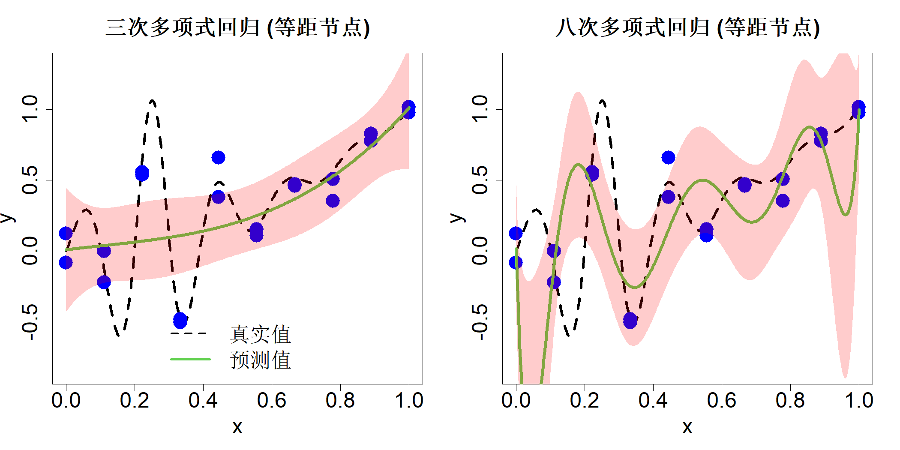
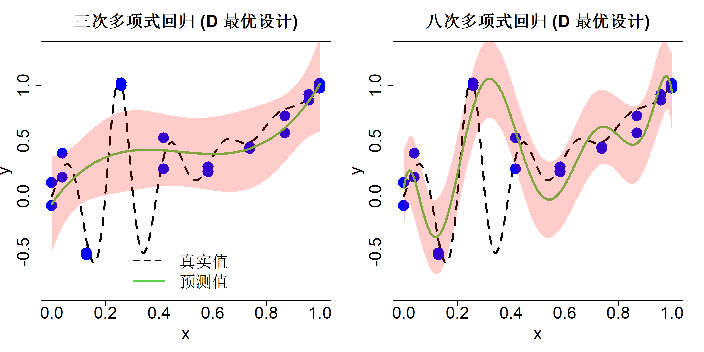

## 2.2 回归

接下来我们探讨被随机噪声污染的数据场景。噪声在物理实验（吴与滨田，2021）以及随机模拟（克莱宁，2008）中十分常见。针对这类含噪声数据，我们需要寻找具备拟合效果而非插值效果的模型。本书第三、四部分将大量运用此类方法。

### 2.2.1 线性回归

线性回归是统计学中主要的数据分析工具之一，已有诸多优质教材对该内容展开论述（法拉韦，2015、2016）。因此本文仅做简要介绍，引出部分便于后续构建试验设计的符号与概念。

再次考察式 (2.1) 中的同一一元函数，不过此时数据由下式生成：

$$
y_i=h(x_i)+\epsilon_i,\quad i=1,\dots,n
\tag{2.29}
$$

式中 $\epsilon_i$ 为其余未观测变量发生变动或是测量误差所带来的随机误差。假定通过开展 $n=20$ 次实验生成数据，实验设计选取区间 $[0,1]$ 内等间距分布的 10 个采样点，每个采样点重复实验两次。图 2.6 中绘制了测试函数（黑色虚线）与数据集 $\{(x_i,y_i)\}_{i=1}^{20}$（蓝色圆点）。

> **图 2.6**：采用 10 个等间隔设计点、两次重复试验开展多项式回归分析。左侧图像为三次多项式拟合结果，右侧为八次多项式拟合结果，阴影区域代表 95% 预测区间

{width=67%}

假设我们希望借助多项式

$$
y=\beta_0+\beta_1x+\dots+\beta_mx^m
\tag{2.30}
$$

来近似函数 $h(x)$。线性回归方法将上述多项式视作真实模型，并假定数据由下式生成：

$$
y_i=\beta_0+\beta_1x_i+\dots+\beta_mx_i^m+\epsilon_i,\quad i=1,\dots,n
\tag{2.31}
$$

而非式 (2.29)。因此该方法忽略了多项式逼近 $h(x)$ 带来的偏差，而这一点对于不确定性量化有着重要影响。需要注意的是，尽管式 (2.31) 能够刻画非线性关系，但在统计学中它仍属于线性回归模型，原因是该模型关于参数向量 $\boldsymbol{\beta}=(\beta_0,\dots,\beta_m)'$ 呈线性形式。我们可以选取合适的参数，让拟合模型尽可能贴合实测数据。可以选用多种损失函数衡量模型与数据的“贴合程度”，其中最简单的是平方误差损失，这也是勒让德与高斯最初提出的方法。关于最小二乘法有趣的发展历史可参阅普拉凯特（1972 年）的文献。由此，优化问题可写为：

$$
\min_{\boldsymbol{\beta}}\sum_{i=1}^n\left\{y_i-[\beta_0+\dots+\beta_mx_i^m]\right\}^2
$$

采用矩阵形式表述该优化问题：

$$
\min_{\boldsymbol{\beta}} (\boldsymbol{y}-\boldsymbol{X}\boldsymbol{\beta})'(\boldsymbol{y}-\boldsymbol{X}\boldsymbol{\beta})
$$

其中矩阵 $\boldsymbol{X}=\{x_i^{j-1}\}$ 是维度为 $n\times(m+1)$ 的模型设计矩阵。将目标函数对 $\boldsymbol{\beta}$ 求导并令导数等于零，可得正规方程：

$$
\boldsymbol{X}'\boldsymbol{X}\boldsymbol{\beta}=\boldsymbol{X}'\boldsymbol{y}
$$

若 $\boldsymbol{X}'\boldsymbol{X}$ 为非奇异矩阵，则存在唯一解：

$$
\widehat{\boldsymbol{\beta}}=(\boldsymbol{X}'\boldsymbol{X})^{-1}\boldsymbol{X}'\boldsymbol{y}
\tag{2.32}
$$

在本例一维场景中，自变量 $x$ 仅有 10 个互不相同的采样点，想要保证矩阵 $\boldsymbol{X}$ 的列向量线性无关，多项式阶数 $m$ 必须满足 $m\le9$。

预测函数 $\widehat{y}(x)=\boldsymbol{x}'\widehat{\boldsymbol{\beta}}$（其中 $\boldsymbol{x}=(1,x,\dots,x_m)'$）在阶数 $m=3$ 与 $m=8$ 时的拟合曲线，在图 2.6 中以绿色实线绘制。相较于八次多项式拟合，三次多项式拟合在观测点处产生的偏差更大。但整体拟合效果上，三次多项式的拟合效果并不逊色于八次多项式，甚至表现更佳。

再进一步假设 $\epsilon_i$ 独立同分布，满足 $\epsilon_i\sim\mathcal{N}(0,\sigma^2)，i=1,\dots,n$，不难证明：

$$
\widehat{\boldsymbol{\beta}}\sim\mathcal{N}\left(\boldsymbol{\beta},\sigma^2(\boldsymbol{X}'\boldsymbol{X})^{-1}\right)
\tag{2.33}
$$

据此可求得预测值的方差：

$$
\mathrm{var}\{\widehat{y}(\boldsymbol{x})\}=\mathrm{var}\{\boldsymbol{x}'\widehat{\boldsymbol{\beta}}\}=\sigma^2\boldsymbol{x}'(\boldsymbol{X}'\boldsymbol{X})^{-1}\boldsymbol{x}
$$

该方差仅体现参数 $\boldsymbol{\beta}$ 估计过程带来的不确定性。由此可得新观测值预测结果的 95% 置信区间：

$$
\widehat{y}(\boldsymbol{x})\pm 2\sigma\sqrt{1+\boldsymbol{x}'(\boldsymbol{X}'\boldsymbol{X})^{-1}\boldsymbol{x}}
$$

式中在原有方差基础上额外增加一项 $\sigma^2$，用以刻画新增扰动项 $\epsilon$ 带来的不确定性，该置信区间在图 2.6 中以阴影区域呈现。可以发现，三次多项式拟合对应的置信区间比八次多项式拟合的置信区间更窄，但三次多项式拟合在观测数据点附近存在更大的偏差；因此更窄的置信区间并不代表其预测精度更高。之所以出现这种不确定性刻画上的偏差，是因为我们在式 (2.31) 中错误假定三次多项式为真实模型。这是线性回归模型的一大缺陷，后续两个小节介绍的非参数回归模型可以解决该问题。

在继续展开分析前，我们先来探究能否借助试验设计方法优化线性回归的拟合效果。若回归系数估计量 $\widehat{\boldsymbol{\beta}}$ 的方差足够小，那么系数 $\boldsymbol{\beta}$ 的估计结果就会具备较高精度。由于 $\sigma^2$ 为常数，该目标等价于最小化矩阵 $(\boldsymbol{X}'\boldsymbol{X})^{-1}$。为实现最小化目标，学者们提出了若干具备实际意义的标量优化准则（瓦尔德，1943；埃尔夫温，1952；基弗、沃尔福威茨，1960）。应用最为广泛的准则是矩阵 $(\boldsymbol{X}'\boldsymbol{X})^{-1}$ 的行列式，该行列式能够表征系数估计量 $\widehat{\boldsymbol{\beta}}$ 置信椭球的体积。因此求解最优设计的问题可写为：

$$
\begin{align*}
\min_D|(\boldsymbol{X}'\boldsymbol{X})^{-1}|&=\min_D1/|\boldsymbol{X}'\boldsymbol{X}|\\
&\equiv\max_D|\boldsymbol{X}'\boldsymbol{X}|
\tag{2.34}
\end{align*}
$$

该最优设计被称为 D 最优设计，字母 D 代表行列式。另一常用准则是最小化各系数估计量 $\widehat{\beta}_i$ 的方差之和，也就是矩阵 $(\boldsymbol{X}'\boldsymbol{X})^{-1}$ 的迹：

$$
\min_D\mathrm{tr}\left[(\boldsymbol{X}'\boldsymbol{X})^{-1}\right]
\tag{2.35}
$$

满足该准则的设计称作 A 最优设计。上述两类准则均以精准估计系数 $\boldsymbol{\beta}$ 为核心，进而间接提升模型预测效果。我们也可构建直接面向预测效果的优化准则。G 最优设计通过在整个定义域 $\mathcal{X}$ 上最小化最大预测方差得到：

$$
\min_D\max_{\boldsymbol{x}\in\mathcal{X}}\boldsymbol{x}'(\boldsymbol{X}'\boldsymbol{X})^{-1}\boldsymbol{x}
\tag{2.36}
$$

而 I 最优设计则是对预测方差做积分平均后再进行最小化求解：

$$
\min_D\int_{\boldsymbol{x}\in\mathcal{X}}\boldsymbol{x}'(\boldsymbol{X}'\boldsymbol{X})^{-1}\boldsymbol{x}\mathrm{d}\boldsymbol{x}
\tag{2.37}
$$

有关最优设计的更多详细内容可参阅普克尔舍姆（1993）、西尔维（1980）、阿特金森等人（2007）以及洛佩斯-菲达尔戈（2023）的专著；古斯与琼斯（2011）针对该主题给出了更贴合实际应用的讲解。

想要优化上述设计准则并非易事，原因在于目标函数具备非线性、多模态的特征，且计算成本高昂。因此，通用优化算法处理该问题时效果欠佳。解决这类问题最常用的手段是采用各类互换算法：即给定初始设计方案 D 与候选集合 C，若目标函数能够得到优化，便将设计方案 D 中的某一行与候选集合 C 中的某一行进行互换。此类算法最终只会收敛至局部最优解，故而需要设置多组初始设计方案，才有可能求解出全局最优设计。下文将介绍用于构造 D 最优设计的费多罗夫互换算法（费多罗夫，1972年）。其他互换算法的详细内容可参考库克与纳赫茨海姆（1980）、阮与米勒（1992）的相关研究。

设 $\boldsymbol{x}_i$ 为矩阵 $\boldsymbol{X}$ 的第 $i$ 行，即 $\boldsymbol{X}=(\boldsymbol{x}_1',\dots,\boldsymbol{x}_n')'$，则 $\boldsymbol{X}'\boldsymbol{X}=\sum_{i=1}^n\boldsymbol{x}_i\boldsymbol{x}_i'$。假设将行向量 $\boldsymbol{x}_i$ 与候选集合 $\mathcal{C}$ 中的某一行向量 $\boldsymbol{c}$ 互换，得到新的模型矩阵 $\boldsymbol{X}_{\mathrm{new}}$，此时 D 最优目标函数满足 $|\boldsymbol{X}_{\mathrm{new}}'\boldsymbol{X}_{\mathrm{new}}|=|\boldsymbol{X}'\boldsymbol{X}+\boldsymbol{c}\boldsymbol{c}'-\boldsymbol{x}_i\boldsymbol{x}_i'|$。我们需要确定将哪个 $\boldsymbol{x}_i$ 与集合 $\mathcal{C}$ 中的向量 $\boldsymbol{c}$ 进行互换。下述矩阵结论可用于简化计算，其中第二条即为谢尔曼-莫里森矩阵恒等式。

> **引理 2.4**：若 $\boldsymbol{A}$ 为 $m\times m$ 阶矩阵，$\boldsymbol{a}$ 为 $m\times1$ 维向量，则 $$\begin{align*}|\boldsymbol{A}+\boldsymbol{a}\boldsymbol{a}'|&=|\boldsymbol{A}|(1+\boldsymbol{a}'\boldsymbol{A}^{-1}\boldsymbol{a})\\(\boldsymbol{A}+\boldsymbol{a}\boldsymbol{a}')^{-1}&=\boldsymbol{A}^{-1}-\frac{\boldsymbol{A}^{-1}\boldsymbol{a}\boldsymbol{a}'\boldsymbol{A}^{-1}}{1+\boldsymbol{a}'\boldsymbol{A}^{-1}\boldsymbol{a}}\end{align*}$$

将第一个矩阵结论运用两次：

$$
\begin{align*}
|\boldsymbol{X}_{\mathrm{new}}'\boldsymbol{X}_{\mathrm{new}}|&=|\boldsymbol{X}'\boldsymbol{X}+\boldsymbol{c}\boldsymbol{c}'-\boldsymbol{x}_{i}\boldsymbol{x}_{i}'|\\
&=|\boldsymbol{X}'\boldsymbol{X}+\boldsymbol{c}\boldsymbol{c}'|\{1-\boldsymbol{x}_{i}'(\boldsymbol{X}'\boldsymbol{X}+\boldsymbol{c}\boldsymbol{c}')^{-1}\boldsymbol{x}_{i}\}\\
&=|\boldsymbol{X}'\boldsymbol{X}|(1+\boldsymbol{c}'(\boldsymbol{X}'\boldsymbol{X})^{-1}\boldsymbol{c})\{1-\boldsymbol{x}_{i}'(\boldsymbol{X}'\boldsymbol{X}+\boldsymbol{c}\boldsymbol{c}')^{-1}\boldsymbol{x}_{i}\}
\end{align*}
$$

再代入第二个矩阵结论并化简可得：

$$
\begin{align*}
|\boldsymbol{X}_{\mathrm{new}}'\boldsymbol{X}_{\mathrm{new}}|&=|\boldsymbol{X}'\boldsymbol{X}|(1+\boldsymbol{c}'(\boldsymbol{X}'\boldsymbol{X})^{-1}\boldsymbol{c})\left\{1-\boldsymbol{x}_{i}'(\boldsymbol{X}'\boldsymbol{X})^{-1}\boldsymbol{x}_{i}+\frac{\{\boldsymbol{c}'(\boldsymbol{X}'\boldsymbol{X})^{-1}\boldsymbol{x}_{i}\}^{2}}{1+\boldsymbol{c}'(\boldsymbol{X}'\boldsymbol{X})^{-1}\boldsymbol{c}}\right\}\\
&=|\boldsymbol{X}'\boldsymbol{X}|\{1+\Delta(\boldsymbol{x}_{i},\boldsymbol{c})\}
\end{align*}
$$

其中

$$
\Delta(\boldsymbol{x}_{i},\boldsymbol{c})=\boldsymbol{c}'(\boldsymbol{X}'\boldsymbol{X})^{-1}\boldsymbol{c}-\boldsymbol{x}_{i}'(\boldsymbol{X}'\boldsymbol{X})^{-1}\boldsymbol{x}_{i}\{1+\boldsymbol{c}'(\boldsymbol{X}'\boldsymbol{X})^{-1}\boldsymbol{c}\}+\{\boldsymbol{c}'(\boldsymbol{X}'\boldsymbol{X})^{-1}\boldsymbol{x}_{i}\}^{2}
$$

通过最大化 $\Delta(\boldsymbol{x}_i,\boldsymbol{c})$ 即可求得最优替换方案，该方式的计算成本远低于直接计算 $|\boldsymbol{X}'\boldsymbol{X}+\boldsymbol{c}\boldsymbol{c}'-\boldsymbol{x}_i\boldsymbol{x}_i'|$。可持续执行此类替换操作直至结果不再优化。该算法已在 R 语言程序包 AlgDesign（惠勒、布劳恩，2024）中实现。

再次回顾一维实例。若想要得到 10 个互不相同的点，可取参数 $m=9$。为构造候选点集，先在区间 $[0,1]$ 上选取 301 个等距节点，随后构造向量 $c_j=(1,c_j,\dots,c_j^9)$，其中 $j=1,2,\dots,301$。随后借助 AlgDesign 程序包中的 optFederov 函数求解得到 D 最优设计，设计点结果绘制于图 2.7 中。可以观察到，生成的节点向区间两端边界靠拢。两组多项式拟合效果相比之前有所提升，尤其是八次多项式在边界处剧烈震荡的现象已经消失。

> **图 2.7**：采用 10 个 D 最优设计点并设置两组重复试验的多项式回归。左侧图表为三次多项式拟合结果，右侧为八次多项式拟合结果，阴影区域代表 95% 预测区间

{width=67%}

仔细观察图 2.7 中的设计点与图 2.1 中的切比雪夫节点可以发现，二者位置高度相近。这并非巧合！德特与斯图登（1992）证明：D 最优设计的经验分布收敛于反正弦密度函数：

$$
f(x)=\frac{1}{\pi\sqrt{x(1-x)}},\quad x\in[0,1]
$$

或者

$$
f(x)=\frac{1}{\pi\sqrt{1-x^2}},\quad x\in[-1,1]\tag{2.38}
$$

本书第 5 章将介绍用于拟合分布的试验设计，此处先采用简便方法。众所周知，点集

$$
\{0.5/n,1.5/n,\dots,(n-0.5)/n\}
$$

是区间 $[0,1]$ 上逼近均匀分布的最优 $n$ 个点位。结合逆概率变换法（5.2.1 节），即可求出逼近反正弦密度的最优点位。当 $x\in[-1,1]$ 时，分布函数为：

$$
F(x)=\int_{-1}^{x}\frac{1}{\pi\sqrt{1-t^2}}\mathrm{d}t=1-\frac{1}{\pi}\arccos x
$$

其逆函数为 $F^{-1}(x)=\cos\left(\pi(1-x)\right)$。由于 $\{(i-0.5)/n\}_{i=1}^n$、$\{(n-i+0.5)/n\}_{i=1}^n$ 是均匀分布的最优代表点，对均匀分布点位做逆概率变换 $\{F^{-1}\left((n-i+0.5)/n\right)\}_{i=1}^n$，得到的点位恰好就是式 (2.5) 定义的切比雪夫节点。也就是说，当 $n$ 足够大时，用于拟合 $n-1$ 次多项式的 D 最优设计点，完全可以用切比雪夫节点近似替代。这就在试验设计与逼近理论两大领域之间建立了巧妙的关联。

现在考虑包含多个输入变量的情形。仅纳入变量主效应的线性回归模型可写为：

$$
y=\beta_0+\beta_1x_1+\dots+\beta_px_p+\epsilon
$$

我们还可以引入多项式项 $x_j^2、x_j^3\cdots$（$j=1,\dots,p$）、二阶交互项 $x_ix_j$、$x_ix_j^2\cdots$，以及高阶交互项 $x_ix_jx_k\cdots$。因此，线性回归模型中可纳入的效应总数 $P$ 可以非常大，甚至远大于样本量 $n$。设 $\boldsymbol{X}$ 为 $n\times P$ 的模型矩阵，则 $\boldsymbol{X}'\boldsymbol{X}$ 的秩满足 $\text{rank}(\boldsymbol{X}'\boldsymbol{X})=n < P$，无法像式 (2.32) 中那样对 $\boldsymbol{X}'\boldsymbol{X}$ 求逆以得到最小二乘估计。我们可以通过岭回归（霍尔、肯纳德，1970）解决该问题。假设矩阵 $\boldsymbol{X}$ 的各列与响应变量 $\boldsymbol{y}$ 均经过标准化处理，均值为 0、标准差为 1，接下来考虑不含截距项的回归模型。岭回归求解如下优化问题：

$$
\min_{\boldsymbol{\beta}}(\boldsymbol{y}-\boldsymbol{X}\boldsymbol{\beta})'(\boldsymbol{y}-\boldsymbol{X}\boldsymbol{\beta})+\lambda\boldsymbol{\beta}'\boldsymbol{\beta}
\tag{2.39}
$$

其中 $\lambda>0$ 为正则化参数，对应的解为：

$$
\widehat{\boldsymbol{\beta}}=(\boldsymbol{X}'\boldsymbol{X}+\lambda\boldsymbol{I}_P)^{-1}\boldsymbol{X}'\boldsymbol{y}
\tag{2.40}
$$

正则化参数 $\lambda$ 可通过交叉验证法选定。下面的结论有助于推导留一交叉验证误差。记帽子矩阵 $\boldsymbol{L}=\boldsymbol{X}(\boldsymbol{X}'\boldsymbol{X}+\lambda\boldsymbol{I}_P)^{-1}\boldsymbol{X}'$，则留一交叉验证误差 $y_i-\widehat{y}_{\sim i}$ 可借助简便公式计算（瓦瑟曼，2006，第 70 页）。

> **引理 2.5**：对于线性预测值 $\widehat{\boldsymbol{y}}=\boldsymbol{L}\boldsymbol{y}$，留一交叉验证误差可通过下式计算： $$cv_i=\frac{y_i-\widehat{y}_i}{1-l_i},\quad i=1,\dots,n$$ 其中 $l_i=\boldsymbol{L}_{ii}$ 为帽子值（也称杠杆值）。

因此，均方交叉验证误差的表达式为：$\mathrm{MSCV}=\sum_{i=1}^{n}\mathrm{cv}_i^2/n$。戈卢布等人（1979）提出了一种均方交叉验证误差的近似形式，称为广义交叉验证（GCV），其公式如下：

$$
\mathrm{GCV}=\frac{1}{n}\frac{\sum_{i=1}^{n}(y_i-\widehat{y}_i)^2}{(1-\overline{l})^2}
$$

其中 $\overline{l}=\sum_{i=1}^{n}l_i/n=\mathrm{tr}\{(\boldsymbol{X}'\boldsymbol{X}+\lambda\boldsymbol{I}_P )^{-1}\boldsymbol{X}'\boldsymbol{X}\}/n$。广义交叉验证具备优良性质，例如模型矩阵具有旋转不变性。因此，可以通过最小化均方交叉验证误差或广义交叉验证的值，利用数据求解得到参数 $\lambda$。

然而，式 (2.40) 中的岭回归仅包含单一正则化参数 $\lambda$，这隐含假定主效应、二因子交互效应等各类效应具有同等重要性。但在实际应用中，该假设几乎无法成立。因此，我们需要对岭回归表达式进行修正，使其适用于试验数据分析。为此，首先需要引入效应分层原理、效应遗传原理等试验设计准则（吴与滨田，2021）。相关内容将在第 8 章探讨实体试验数据分析时展开介绍。