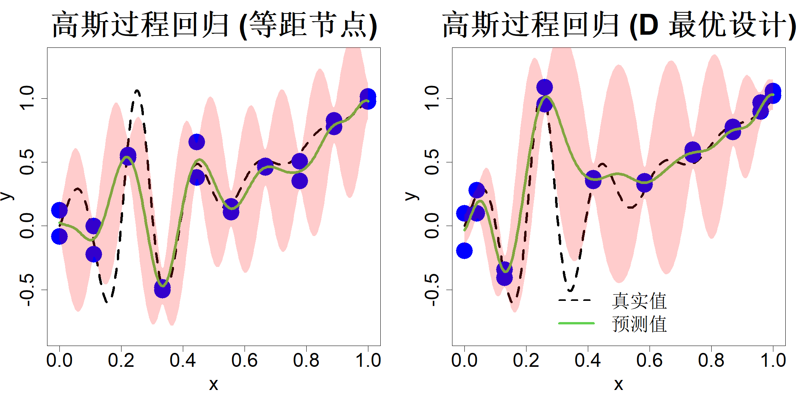

### 2.2.3 高斯过程回归

由于克里金法与高斯过程均采用概率化表达形式，很容易对其进行拓展以处理含噪声数据。鉴于克里金法与高斯过程的表达式相近，本节仅围绕高斯过程展开分析。我们构建的统计模型为：

$$
y=h(\boldsymbol{x})+\epsilon
$$

其中 $h(\boldsymbol{x})\sim\mathrm{GP}(\mu,\tau^2R(\cdot))$，噪声项 $\epsilon$ 独立同分布，服从正态分布 $\epsilon\stackrel{\text{iid}}{\sim}\mathcal{N}(0,\sigma^2)$。现有数据集 $\{(\boldsymbol{x}_i,y_i)\}_{i=1}^n$。暂且假定参数 $\mu$、$\tau^2$、$\sigma^2$ 以及相关参数 $\boldsymbol{\theta}$ 均为已知量，后续将采用经验贝叶斯方法对这些参数进行估计。

设 $\boldsymbol{y}=(y_1,\dots,y_n)'$ 的边缘分布为

$$
\boldsymbol{y}\sim\mathcal{N}(\mu\boldsymbol{1},\tau^2\boldsymbol{R}+\sigma^2\boldsymbol{I})
$$

而 $h(\boldsymbol{x})$ 与 $\boldsymbol{y}$ 的联合分布满足

$$
\begin{bmatrix}
h(\boldsymbol{x})\\\boldsymbol{y}
\end{bmatrix}
\sim\mathcal{N}_{1+n}
\left(\begin{bmatrix}
\mu\\\mu\boldsymbol{1}
\end{bmatrix},\begin{bmatrix}
\tau^2&\tau^2\boldsymbol{r}(\boldsymbol{x})'\\
\tau^2\boldsymbol{r}(\boldsymbol{x})&\tau^2\boldsymbol{R}+\sigma^2\boldsymbol{I}
\end{bmatrix}\right)
$$

式中 $\boldsymbol{r}(\boldsymbol{x})=\{R(\boldsymbol{x}-\boldsymbol{x}_i)\}_{i=1}^n$，$\boldsymbol{R}=\{R(\boldsymbol{x}_i-\boldsymbol{x}_j)\}_{i,j=1}^n$，定义方式与式 (2.13) 一致。由于误差 $\epsilon$ 服从正态分布，上述推导过程较为简便。若数据服从二项分布、泊松分布等非正态分布，对应的分析过程会变得十分复杂，本书不再展开介绍。针对非正态数据下的高斯过程回归，可参阅班纳吉等人（2003）、迪格尔与小里贝罗（2007）的相关研究。

利用引理 2.2，对于固定的 $\boldsymbol{x}$，可求得 $h(\boldsymbol{x})$ 的后验分布：

$$
h(\boldsymbol{x})|\boldsymbol{y}\sim\mathcal{N}\left(\mu+\boldsymbol{r}(\boldsymbol{x})'(\boldsymbol{R}+\lambda\boldsymbol{I})^{-1}(\boldsymbol{y}-\mu\boldsymbol{1}),\\tau^2\left\{1-\boldsymbol{r}(\boldsymbol{x})'(\boldsymbol{R}+\lambda\boldsymbol{I})^{-1}\boldsymbol{r}(\boldsymbol{x})\right\}\right)
\tag{2.43}
$$

其中 $\lambda=\sigma^2/\tau^2$。可以发现，当 $\mu=0$ 时，后验均值

$$
\widehat{y}(\boldsymbol{x})=\mu+\boldsymbol{r}(\boldsymbol{x})'(\boldsymbol{R}+\lambda\boldsymbol{I})^{-1}(\boldsymbol{y}-\mu\boldsymbol{1})
$$

退化为核岭回归预测值。两种方式的预测结果一致，但此处可以得到预测方差，进而构造置信区间。关于这两种方法更为全面的对比可参考金川等人（2018）的研究。位置 $\boldsymbol{x}$ 处新增观测值的预测方差为：

$$
\begin{align*}
s^2(\boldsymbol{x})&=\mathrm{var}\{h(\boldsymbol{x})+\epsilon|\boldsymbol{y}\}\\
&=\mathrm{var}\{h(\boldsymbol{x})|\boldsymbol{y}\}+\mathrm{var}(\epsilon)\quad\text{(由相互独立性可得)}\\
&=\tau^2\left\{1+\lambda-\boldsymbol{r}(\boldsymbol{x})'(\boldsymbol{R}+\lambda\boldsymbol{I})^{-1}\boldsymbol{r}(\boldsymbol{x})\right\}
\end{align*}
$$

据此可得 95% 预测区间为 $\widehat{y}(\boldsymbol{x})\pm2s(\boldsymbol{x})$。

高斯过程表达式还提供了一种不同于交叉验证法的方式来估计未知参数。参数的似然函数满足：

$$
L\propto\frac{1}{\tau^n |\boldsymbol{R}+\lambda\boldsymbol{I}|^{1/2}}\exp\left\{-\frac{1}{2\tau^2}(\boldsymbol{y}-\mu\boldsymbol{1})'(\boldsymbol{R}+\lambda\boldsymbol{I})^{-1}(\boldsymbol{y}-\mu\boldsymbol{1})\right\}
$$

将该似然函数关于 $\mu$、$\tau^2$、$\lambda$ 和 $\boldsymbol{\theta}$ 最大化，可得：

$$
\widehat{\mu}=\frac{\boldsymbol{1}'(\boldsymbol{R}+\lambda\boldsymbol{I})^{-1}\boldsymbol{y}}{\boldsymbol{1}'(\boldsymbol{R}+\lambda\boldsymbol{I})^{-1}\boldsymbol{1}}\tag{2.44}
$$

$$
\widehat{\tau}^2=\frac{1}{n}(\boldsymbol{y}-\widehat{\mu}\boldsymbol{1})'(\boldsymbol{R}+\lambda\boldsymbol{I})^{-1}(\boldsymbol{y}-\widehat{\mu}\boldsymbol{1})\tag{2.45}
$$

$$
(\widehat{\lambda},\widehat{\boldsymbol{\theta}})=\argmin_{\lambda,\boldsymbol{\theta}}\left\{n\log\widehat{\tau}^2+\log|\boldsymbol{R}+\lambda\boldsymbol{I}|\right\}\tag{2.46}
$$

2.1.4 节所介绍的高斯过程回归与高斯过程插值二者的主要区别在于：相关矩阵 $\boldsymbol{R}$ 被替换为 $\boldsymbol{R}+\lambda\boldsymbol{I}$。实际上，即便针对无噪声数据，引入极小的 $\lambda$ 做这一替换也有助于提升数值稳定性（兰詹等人，2011；格拉马西、李，2012；彭、吴，2014）。在地统计学文献中，$\lambda$ 被称作块金值。

再次考察由式 (2.1) 中的一维测试函数生成的 20 个数据点。借助 R 语言程序包 rkriging（黄与约瑟夫，2024），采用高斯相关函数 $R(u-v)=\exp\left\{-(u-v)^2/\theta^2\right\}$ 拟合高斯过程回归模型。针对两种采样方案——等间距采样点与适配九次多项式的 D 最优采样点，其预测结果及 95% 置信区间如图 2.9 所示。不出所料，该模型的预测效果与核岭回归相近，但高斯过程回归的优势在于可为预测值给出不确定性区间。对比图 2.6、图 2.7 右侧子图里的八次多项式模型，高斯过程回归无论是预测结果还是不确定性区间的表现都更为优异。高斯过程回归的不确定性区间具备合理特性：在已有观测数据的区间内区间宽度更窄，在数据稀疏区域区间则更宽。

> **图 2.9**：采用 10 点等间隔设计点（左侧）与 10 点 D 最优设计点（右侧）并设置两组重复试验的高斯过程回归

{width=67%}