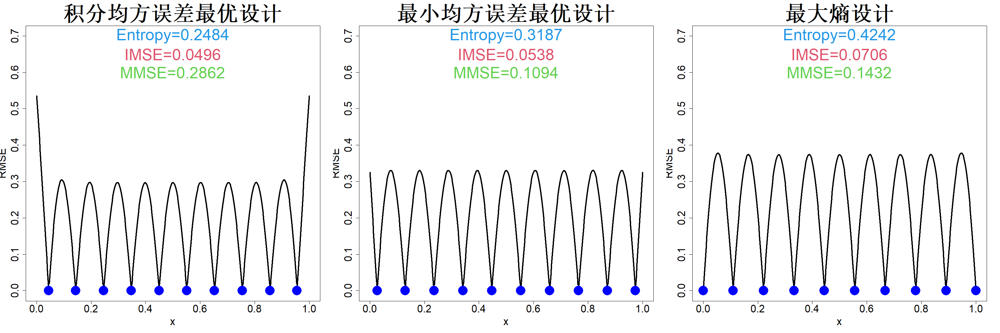

## 3.2 最大熵试验设计

谢夫里与温恩（1987）针对空间采样提出最大熵设计，柯林等人（1991）将其引入计算机试验领域。熵是一种不确定性度量（香农，1948）。设有离散集合 $\mathcal{X}=\{\boldsymbol{X}_1,\dots,\boldsymbol{X}_N\}$，以 $\boldsymbol{Y}_\mathcal{X}$ 代表随机向量 $(Y_1,\dots,Y_N)$，其中 $Y_i=h(\boldsymbol{X}_i)$，$h(\cdot)$ 为某随机函数。则 $\boldsymbol{Y}_\mathcal{X}$ 的熵定义为：

$$
\mathrm{Ent}(\boldsymbol{Y}_\mathcal{X})=-\int f(\boldsymbol{y})\log f(\boldsymbol{y})\mathrm{d}\boldsymbol{y}
$$

式中 $f(\boldsymbol{y})$ 为 $\boldsymbol{Y}_\mathcal{X}$ 的概率密度函数。优化目标是选取设计 $D$（集合 $\mathcal{X}$ 的子集），由设计 $D$ 可得到观测数据 $\boldsymbol{Y}_D$。我们需要选定设计 $D$，使得在已知观测数据 $\boldsymbol{Y}_D$ 的条件下，未观测数据 $\boldsymbol{Y}_{\mathcal{X}\backslash D}$ 的熵最小。熵存在如下分解形式（科弗、托马斯，1991）：

$$
\mathrm{Ent}(\boldsymbol{Y}_\mathcal{X})=\mathrm{Ent}(\boldsymbol{Y}_D)+\mathrm{E}\{\mathrm{Ent}(\boldsymbol{Y}_{\mathcal{X}\backslash D}|\boldsymbol{Y}_D)\}
$$

由于等式左侧与设计 $D$ 无关，因此只需通过最大化 $\mathrm{Ent}(\boldsymbol{Y}_D)$ 来最小化等式右侧第二项，由此便得到最大熵设计。

假设输入输出关系由高斯过程实现：$h(\boldsymbol{x})\sim GP(\mu,\tau^2R(\cdot))$，其中 $\mu$、$\tau^2$ 以及相关参数 $\boldsymbol{\theta}$ 均为已知量。设试验设计集合 $D=\{\boldsymbol{x}_i\}_{i=1}^n$，观测数据 $\boldsymbol{y}=(y_1,\dots,y_n)'$，则

$$
\boldsymbol{y}\sim N_n(\mu\boldsymbol{1},\tau^2\boldsymbol{R})
$$

式中 $\boldsymbol{R}=\{R(x_i- x_j)\}_{i,j=1}^n$。我们的目标是选取设计集合 $D$，最大化 $\boldsymbol{y}$ 的熵。$\boldsymbol{y}$ 的熵计算公式如下：

$$
\begin{align*}
\mathrm{Ent}(\boldsymbol{y})&=-\int\left[-\frac{n}{2}\log2\pi-\frac{n}{2}\log\tau^2-\frac{1}{2}\log|\boldsymbol{R}|-\frac{1}{2\tau^2}(\boldsymbol{y}-\mu\boldsymbol{1})'\boldsymbol{R}^{-1}(\boldsymbol{y}-\mu\boldsymbol{1})\right] f(\boldsymbol{y})\mathrm{d}\boldsymbol{y}\\
&=\frac{n}{2}\log2\pi+\frac{n}{2}\log\tau^2+\frac{1}{2}\log|\boldsymbol{R}|+\frac{1}{2\tau^2}\mathrm{E}\left[(\boldsymbol{y}-\mu\boldsymbol{1})'\boldsymbol{R}^{-1}(\boldsymbol{y}-\mu\boldsymbol{1})\right]\\
&=\frac{n}{2}\log2\pi+\frac{n}{2}\log\tau^2+\frac{1}{2}\log|\boldsymbol{R}|+\frac{1}{2\tau^2}\mathrm{tr}\left[\boldsymbol{R}^{-1}\mathrm{var}(\boldsymbol{y})\right]\\
&=\frac{n}{2}\log2\pi+\frac{n}{2}\log\tau^2+\frac{1}{2}\log|\boldsymbol{R}|+\frac{n}{2}
\end{align*}
$$

推导过程用到二次型期望公式：$\mathrm{E}(\boldsymbol{y}'\boldsymbol{A}\boldsymbol{y})=\mathrm{E}(\boldsymbol{y})'\boldsymbol{A}\mathrm{E}(\boldsymbol{y})+\mathrm{tr}\{\boldsymbol{A}\mathrm{var}(\boldsymbol{y})\}$。剔除不影响优化求解的常数项与对数项，将 $\boldsymbol{y}$ 的熵简化定义为：

$$
\mathrm{Ent}(\boldsymbol{y}):=|\boldsymbol{R}|
\tag{3.4}
$$

由此可得最大熵设计满足：

$$
D^*=\argmax_{D}|\boldsymbol{R}|
\tag{3.5}
$$

针对一维问题，在 $R(x)=\exp(−x^2/\theta^2)$、$\theta=0.1$ 的条件下，构造得到一组含 10 个试验点的熵设计，该熵设计与均方根误差变化曲线一同展示于图3.4右侧子图。为便于对比，图 3.2 中的最优积分均方误差设计与最小最大均方误差设计也一并绘于此处。不难发现，相较于积分均方误差最优设计和最小最大均方误差最优设计，熵设计的试验点向区间边界靠拢。最大熵设计与图 3.2 中的等间隔设计形态相近，但其最大均方根误差更小。

> **图 3.4**：在参数 $\theta=0.1$ 的条件下，采用集成均方误差最优设计、最小均方误差最优设计与最大熵设计（蓝色圆点）

{width=100%}

最大熵设计与上一节所述的积分均方误差（IMSE）最优设计、最小均方误差（MMSE）最优设计具备相同的实际局限性。第一，只有给定相关参数后才能完成求解计算，但在试验设计阶段这些参数是未知的。第二，尽管最大熵准则相较于积分均方误差/最小均方误差准则形式更为简洁，可求解相关矩阵 $\boldsymbol{R}$ 行列式的计算开销依旧很大，该运算的时间复杂度为 $\mathcal{O}(n^3)$，因此熵优化过程十分耗时。除此之外，目标函数可能存在多峰特性，进一步提升了优化求解的难度。针对图 3.4 中的最优设计，本文采用多初始点局部优化算法或优质初始迭代点进行求解，但该方式在高维场景下求解效率偏低。柯林等人（1991）采用了米切尔（1974）提出的 DETMAX 算法；针对离散优化问题的进阶优化算法可查阅范帕与李（2022）的研究成果。

我们将通过在低相关区域（粗糙曲面）开展求解工作，解决最大熵设计存在的稳健性与优化难题，由此得到一类填充空间设计，相关内容将在下一章展开探讨。