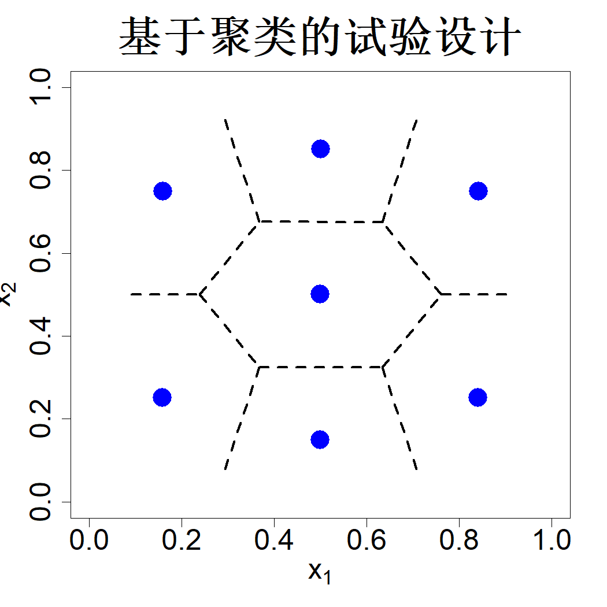

# 4 空间填充设计

尽管基于模型的方法为构建最优试验设计提供了一套严谨的理论思路，但该方法存在一定的实际局限。基于模型的最优设计依赖相关系数等未知模型参数，并且在参数设定出现偏差时不具备稳健性。除此之外，基于模型的准则计算成本高昂，数值稳定性较差，不仅优化过程难度大，运算开销也居高不下。为此，本章将对基于模型的准则进行近似处理，并构造可填满试验区域的试验设计方案。这类设计具备清晰的几何内涵，可依托各类建模方法推导得出，说明其具备一定的模型稳健特性。

## 4.1 基于聚类的设计

设设计集合 $D=\{\boldsymbol{x}_i\}_{i=1}^n$，试验区域为 $\mathcal{X}=[0,1]^p$。考察式 (3.1) 中的积分均方根误差准则：

$$
\mathrm{IRMSE}(D;\theta)=\int_{\mathcal{X}}\sqrt{1-\boldsymbol{r}(\boldsymbol{x})'\boldsymbol{R}^{-1}\boldsymbol{r}(\boldsymbol{x})}\mathrm{d}\boldsymbol{x}
$$

式中 $\boldsymbol{r}(\boldsymbol{x})=\{R(\boldsymbol{x}-\boldsymbol{x}_i)\}_{i=1}^n$，$\boldsymbol{R}=\{R(\boldsymbol{x}_i-\boldsymbol{x}_j)\}_{i,j=1}^n$，$R(\cdot)$ 为相关函数。将试验区域划分为 $n$ 个沃罗诺伊区域：$\mathcal{X}=V_1\cup\dots\cup V_n$，其中

$$
V_i=\{\boldsymbol{x}\in\mathcal{X}:\|\boldsymbol{x}-\boldsymbol{x}_i\|\le\|\boldsymbol{x}-\boldsymbol{x}_j\|,\quad\forall j\ne i\}
\tag{4.1}
$$

由于当 $i\ne j$ 时 $V_i\cap V_j=\emptyset$，可得：

$$
\mathrm{IRMSE}(D;\theta)=\sum_{i=1}^n\int_{V_i}\sqrt{1-\boldsymbol{r}(\boldsymbol{x})'\boldsymbol{R}^{-1}\boldsymbol{r}(\boldsymbol{x})}\mathrm{d}\boldsymbol{x}
$$

新增采样点会使后验方差减小，因此 $1-\boldsymbol{r}(\boldsymbol{x})'\boldsymbol{R}^{-1}\boldsymbol{r}(\boldsymbol{x})$ 的值小于仅采用单个设计点得到的方差（勒普基等人，2010），由此可得：

$$
1-\boldsymbol{r}(\boldsymbol{x})'\boldsymbol{R}^{-1}\boldsymbol{r}(\boldsymbol{x})\le1-R^2(\boldsymbol{x}-\boldsymbol{x}_i),\quad\forall i
\tag{4.2}
$$

进而有：

$$
\mathrm{IRMSE}(D;\theta)\le\sum_{i=1}^n\int_{V_i}\sqrt{1-R^2(\boldsymbol{x}-\boldsymbol{x}_i)}\mathrm{d}\boldsymbol{x}
$$

采用各向同性高斯相关函数

$$
R(\boldsymbol{\Delta})=\exp\left(-\frac{\|\boldsymbol{\Delta}\|^2}{\theta^2}\right)
\tag{4.3}
$$

则

$$
\begin{align*}
\mathrm{IRMSE}(D;\theta)&\le\sum_{i=1}^n\int_{V_i}\sqrt{1-\exp\left(-\frac{2\|\boldsymbol{x}-\boldsymbol{x}_i\|^2}{\theta^2}\right)}\mathrm{d}\boldsymbol{x}\\
&\approx\sum_{i=1}^n\int_{V_i}\sqrt{1-\left(1-\frac{2\|\boldsymbol{x}-\boldsymbol{x}_i\|^2}{\theta^2}\right)}\mathrm{d}\boldsymbol{x}\\
&=\frac{\sqrt{2}}{\theta}\sum_{i=1}^n\int_{V_i}\|\boldsymbol{x}-\boldsymbol{x}_i\|\mathrm{d}\boldsymbol{x}
\end{align*}
$$

当 $\max_i\max_{\boldsymbol{x}\in V_i}\|\boldsymbol{x}-\boldsymbol{x}_i\|\ll\theta$ 时，上述近似具备较高精度。通过最小化该上界，可求得最优设计：

$$
\min_{D}\;\sum_{i=1}^n\int_{V_i}\|\boldsymbol{x}-\boldsymbol{x}_i\|\mathrm{d}\boldsymbol{x}
\tag{4.4}
$$

可以注意到，相关参数已被分离至上界之外，因此求解最优设计时不再需要该参数。式 (4.4) 的优化问题属于量化问题（格拉夫、卢施吉，2007），可借助聚类算法求解。求解步骤如下：首先在区域 $X$ 内生成大量均匀样本 $\{\boldsymbol{X}_i\}_{i=1}^N$，再结合蒙特卡洛近似（见 5.1.2 节），原问题可转化为求解：

$$
\min_{D}\;\frac{1}{N}\sum_{j=1}^N\sum_{i=1}^n\delta_{ij}\|\boldsymbol{X}_j-\boldsymbol{x}_i\|
\tag{4.5}
$$

其中若 $\boldsymbol{X}_j\in V_i$，则 $\delta_{ij}=1$，否则 $\delta_{ij}=0$。

同理，式 (3.2) 中的均方积分误差准则可导出 $L_2$ 量化问题：

$$
\min_D\sum_{i=1}^n\int_{V_i}\|\boldsymbol{x}-\boldsymbol{x}_i\|^2\mathrm{d}\boldsymbol{x}
\tag{4.6}
$$

以及对应的蒙特卡洛近似形式：

$$
\min_D\frac{1}{N}\sum_{j=1}^N\sum_{i=1}^n\delta_{ij}\|\boldsymbol{X}_j-\boldsymbol{x}_i\|^2
\tag{4.7}
$$

$L_2$ 量化问题在数学层面更易求解，劳埃德于 1957 年、马克斯于 1960 年在通信理论领域提出了该问题。它还与最优分层抽样思想（达伦纽斯，1950；考克斯，1957）、分布代表点理论（弗卢里，1990；方开泰、王，1993）存在关联。式 (4.7) 是聚类分析中应用最为广泛的准则，可通过劳埃德 k 均值算法求解，该算法交替执行沃罗诺伊区域划分、求解区域均值两个步骤。然而，式 (4.5) 最小化距离和的问题，早在 1929 年韦伯的设施选址分析与计算几何研究中便已出现。我们可以采用一种与 k 均值结构相似、利用迭代最小二乘法求解聚类中心的算法处理式 (4.5)，该算法即为韦茨菲尔德算法。

假设我们需要在试验区域 $X=[0,1]^2$ 内选取 $n=7$ 个试验点，可借助 R 语言程序包 SFDesign（王、约瑟夫，2025c）求得基于聚类的最优试验设计。由式 (4.4) 构造的试验设计结果如图 4.1 所示。不难发现这些试验点能够很好地布满整个区域，但点位明显向中心过度聚拢，这种布局并不适用于预测类问题。原因在于绝大多数统计模型与机器学习模型擅长插值预测（在 7 个试验点构成的凸包内部开展预测），而外推预测（在凸包外部做预测）的结果往往缺乏可靠性。莱基维茨与琼斯（2015）为解决该问题，不再选取沃罗诺伊区域的质心作为试验点，而是从每个沃罗诺伊单元内另行挑选点位，并搭配后续将会介绍的最大投影准则（MaxPro，约瑟夫等人，2015）作为次级筛选准则。

> **图 4.1**：基于 7 个聚类点的设计方案，同时展示了沃罗诺伊区域

{width=33%}