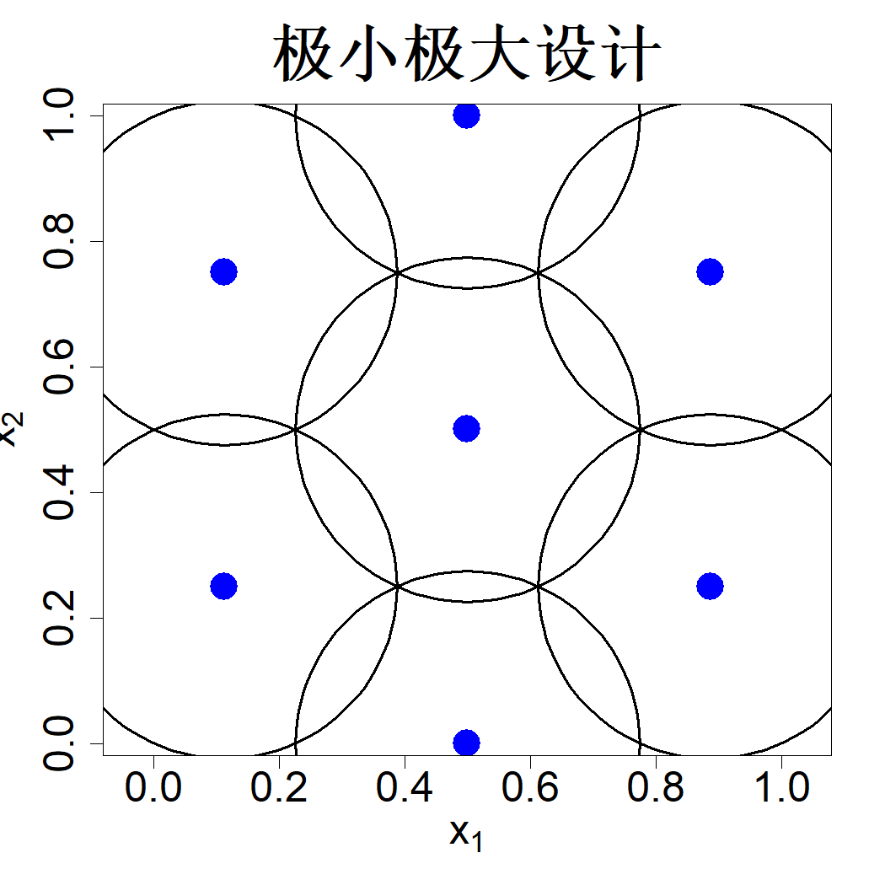

## 4.2 极小极大设计

考虑式 (3.3) 中的最小均方误差准则：

$$
\mathrm{MMSE}(D;\theta)=\max_{\boldsymbol{x}\in\mathcal{X}}\left\{1-\boldsymbol{r}(\boldsymbol{x})'\boldsymbol{R}^{-1}\boldsymbol{r}(\boldsymbol{x})\right\}
$$

仿照式 (4.1) 的方式采用沃罗诺伊区域对试验区域 $\mathcal{X}$ 进行划分后，可得

$$
\begin{align*}
\mathrm{MMSE}(D;\theta)
&=\max_{i=1:n}\max_{\boldsymbol{x}\in V_i}\left\{1-\boldsymbol{r}(\boldsymbol{x})'\boldsymbol{R}^{-1}\boldsymbol{r}(\boldsymbol{x})\right\}\\
&\le\max_{i=1:n}\max_{\boldsymbol{x}\in V_i}\left\{1-R^2(\boldsymbol{x}-\boldsymbol{x}_i)\right\}\\
&=1-\min_{i=1:n}\min_{\boldsymbol{x}\in V_i}R^2(\boldsymbol{x}-\boldsymbol{x}_i),
\end{align*}
$$

推导过程中，方差所采用的上界与式 (4.2) 保持一致。

假设采用式 (4.3) 中的各向同性高斯相关函数，则

$$
\begin{align*}
\mathrm{MMSE}(D;\theta)
&\leq1-\min_{i=1:n}\min_{\boldsymbol{x}\in V_i}\exp\left(-2\frac{\|\boldsymbol{x}-\boldsymbol{x}_i\|^2}{\theta^2}\right)\\
&=1-\exp\left(-2\max_{i=1:n}\max_{\boldsymbol{x}\in V_i}\frac{\|\boldsymbol{x}-\boldsymbol{x}_i\|^2}{\theta^2}\right)\\
&=1-\exp\left(-2\frac{\phi^2(D)}{\theta^2}\right)
\tag{4.8}
\end{align*}
$$

式中

$$
\phi(D)=\max_{i=1:n}\max_{\boldsymbol{x}\in V_i}\|\boldsymbol{x}-\boldsymbol{x}_i\|
$$

称为设计 $D$ 的填充距离（也称作覆盖半径）。能够最小化填充距离的设计被称为极小极大距离设计，简称极小极大设计（约翰逊等人，1990），即满足

$$
\min_D\max_{i=1:n}\max_{\boldsymbol{x}\in V_i}\|\boldsymbol{x}-\boldsymbol{x}_i\|
\tag{4.9}
$$

该类设计可最小化式 (4.8) 中均方最小误差的上界。约翰逊等人（1990）给出了形式略有差异的极小极大设计定义：

$$
\min_D\max_{\boldsymbol{x}\in X}\min_{\boldsymbol{x}_i\in D}\|\boldsymbol{x}-\boldsymbol{x}_i\|
\tag{4.10}
$$

上述两种定义相互等价，原因如下：

$$
\begin{align*}
\max_{\boldsymbol{x}\in X}\left(\min_{\boldsymbol{x}_i\in D}\|\boldsymbol{x}-\boldsymbol{x}_i\|\right)
&=\max_{j=1:n}\max_{\boldsymbol{x}\in V_j}\left(\min_{\boldsymbol{x}_i\in D}\|\boldsymbol{x}-\boldsymbol{x}_i\|\right)\\
&=\max_{j=1:n}\left(\max_{\boldsymbol{x}\in V_j}\min_{\boldsymbol{x}_i\in D}\|\boldsymbol{x}-\boldsymbol{x}_i\|\right)\\
&=\max_{j=1:n}\max_{\boldsymbol{x}\in V_j}\|\boldsymbol{x}-\boldsymbol{x}_j\|
\end{align*}
$$

因此，根据式 (4.9)，若要构造极小极大设计，需先找出各个沃罗诺伊区域内距离最远的点。这类点位远离设计点，故而在这些位置很难实现精准预测，其中最远的点位即为最差点位。极小极大设计的核心目标是缩小至最差点位的距离。试验区域内可能存在多个最差点位，包围单个最差点位所需的最少设计点数量，被称作该设计的（极小极大）指数。我们期望该指数尽可能大，原因在于最差点位处的预测难度极高，但若在其周边布置更多设计点，预测难度便会下降。约翰逊等人于1990 年证明了下述结论。

> **定理 4.1**：设相关函数 $R(\boldsymbol{u},\boldsymbol{v})=\rho k(d(\boldsymbol{u},\boldsymbol{v}))$，其中 $d$ 为距离度量，$\rho$ 为递减函数，且 $k>0$。则当 $k\to\infty$ 时，最高指标的极小极大设计渐近满足最小均方误差最优。

可以发现，我们所采用的各向同性高斯相关函数是该定理中相关函数的一种特例。具体而言，若采用 $L_q$ 距离度量 $d(\boldsymbol{u},\boldsymbol{v})=\|\boldsymbol{u}-\boldsymbol{v}\|_q$，其中 $\|\boldsymbol{x}\|_q=\left\{\sum_{i=1}^p |x_i|^q\right\}^{1/q}$，则极小极大设计可写为

$$
\min_D\max_{i=1:n}\max_{\boldsymbol{x}\in V_i}\|\boldsymbol{x}-\boldsymbol{x}_i\|_q
\tag{4.11}
$$

除非另有说明，后续均采用欧氏距离求解极小极大设计。

举个例子，假设一家石油企业打算在某片区域新建若干加油站。极小极大布局方案的思路是规划加油站位置，使得距离最近加油站最远的顾客，其这段最大距离尽可能缩短。因此采用极小极大布局，能够保证所有顾客前往该企业任意一座加油站的距离都不会过远。最高阶极小极大布局，则代表距离加油站最远的顾客，可选择的备选加油站数量达到最大值。

当 $p=1$ 时，求解极小极大设计较为简便。举例来说，若 $n=2$，定义域 $\mathcal{X}=[0,1]$ 上的极小极大设计为 $\{0.25,0.75\}$。最坏位置点为 $x=0$、$0.5$、$1$，这三个点距离两个设计点的距离均为 0.25，该数值是所有可行设计所能得到的最坏距离中的最小值。推广至一般情形，$n$ 点极小极大设计的表达式为：

$$
D=\left\{\frac{i-0.5}{n}\right\}_{i=1}^{n}\tag{4.12}
$$

总体而言，当维度 $p\ge2$ 时，求解极小极大试验设计难度很高（不过相较于最小均方误差试验设计要简单得多）。图 4.2 展示了样本量 $n=7$、维度 $p=2$ 对应的极小极大设计。和图 4.1 中的聚类型设计相比，该设计的样本点更靠近区域边界。每个设计点周围还绘制了半径为 $\phi(D)$（即填充距离）的球体。不难看出，这些球体能够完整覆盖整个区域 $\mathcal{X}$。实际上，极小极大设计的本质是采用半径最小且大小一致的球体铺满整个试验区域。因此，极小极大设计也被称作覆盖设计。

> **图 4.2**：7 点极小极大设计

{width=33%}

极小极大设计突破了基于模型的最优设计存在的部分实际局限。首先，该类设计无需设定尺度参数（$\theta$）。定理 4.1 表明，对于高斯相关函数而言，由于 $\theta$ 与 $k$ 呈反比关系，当 $\theta$ 趋近于 0 时，极小极大设计的效果接近于最优设计。图 3.3 中的实例证明，相较于采用较大 $\theta$ 值生成的设计，由较小 $\theta$ 值生成的设计具备更强的稳健性。除此之外，极小极大设计亦可视为适用于非高斯过程（GP）建模方法的最优设计，例如最近邻预测器（1-NN），原因在于最近邻预测器的预测性能取决于设计点与预测点之间的距离远近。实际上，仅依靠几何思路（缩小区域内空白间隔的设计方案）即可构建极小极大设计，无需依托任何建模方法，这一特性再次印证了其稳健特性。

其次，极小极大设计相比对应的最小均方误差最优设计更容易构造，原因是无需计算矩阵 $\boldsymbol{R}^{-1}$；当样本量 $n$ 较大时，求解该逆矩阵不仅计算成本高昂，还容易出现数值不稳定问题。但即便如此，当 $n$ 与变量维度 $p$ 数值较大时，构造极小极大设计依旧耗费大量算力。谭（2013）提出一种二进制整数规划方法，可在给定候选点集合中求解极小极大设计，然而一旦候选点数量增多，该方法就会面临计算难解的问题。马克与约瑟夫（2018a）针对极小极大设计提出了一种基于聚类的生成方法，相关研究收录于《填充空间设计》第 52 页，具体步骤如下：第一步，从设计域 $\mathcal{X}$ 中生成规模为 $N$ 的均匀样本 $\{\boldsymbol{X}_j\}_{j=1}^N$；当 $q$ 取值足够大时，满足：

$$
\begin{align*}
\left(\frac{1}{N}\sum_{j=1}^N\sum_{i=1}^n\delta_{ij}\|\boldsymbol{X}_j-\boldsymbol{x}_i\|^q\right)^{1/q}&\approx\max_{1\le i\le n}\max_{1\le j\le N}\delta_{ij}\|\boldsymbol{X}_j-\boldsymbol{x}_i\|\\
&=\max_{1\le i\le n}\max_{\boldsymbol{X}_j\in V_i}\|\boldsymbol{X}_j-\boldsymbol{x}_i\|
\end{align*}
$$

式中，若 $\boldsymbol{X}_j$ 属于聚类区域 $V_i$，则 $\delta_{ij}=1$，否则 $\delta_{ij}=0$。上述公式说明：只需将 $q$ 设置为较大数值（数值不宜过大，避免引发数值不稳定），借助劳埃德 k 均值类算法即可构造极小极大设计。由于劳埃德算法通常仅能收敛至局部最优解，二人结合粒子群优化算法进一步优化设计方案。该整套算法的实现代码封装于 R 语言程序包 minimaxdesign 中（马克，2021）。何（2017a）提出借助一类特殊格子构造极小极大设计，效率更高，但该方法仅适用于变量维度 $p$ 较小的场景，对应的工具为 R 程序包 LatticeDesign。