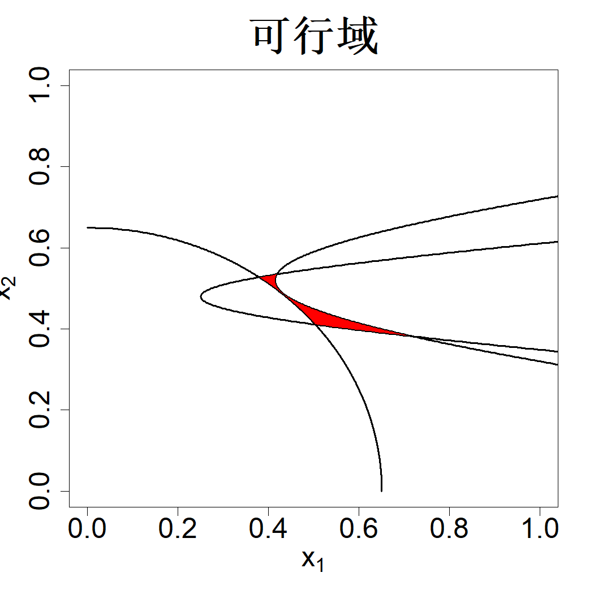
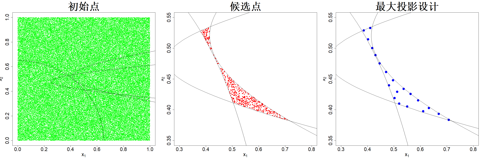

### 4.5.1 约束区域

到目前为止，我们研究的实验区域均为超立方体。然而，部分因子组合有时是不可采用的。例如，若已知高压与高温的组合会造成系统故障，则无需对这类组合开展实验。假设输入的可行域由一组约束条件定义：

$$
X=\{x \in[0,1]^p: g_k(x) \leq 0,\ \forall k\}
\tag{4.29}
$$

式中 $\{g_k(x)\le 0\}_{k=1}^K$ 为 $K$ 个任意不等式约束。这些约束可以是黑箱函数，且计算代价较高。下面是取自黄等人（2021）的一个简易示例：

$$
\begin{align*}
&g_1(x) = x_1-\sqrt{50(x_2-0.52)^2+2}+1 \le 0\\
&g_2(x) = \sqrt{120\big((x_2-0.48)^2+1\big)}-0.75-x_1 \le 0\\
&g_3(x) = 0.652-x_1^2-x_2^2 \le 0\\
&\text{其中}\;0 \le x_1,x_2 \le 1
\tag{4.30}
\end{align*}
$$

该可行域在图 4.15 中以阴影区域呈现。假设我们的实验预算仅支持开展 20 次实验。

> **图 4.15**：式 (4.30) 中约束条件对应的可行域以阴影区域展示

{width=33%}

下面是从约束区域生成试验设计的通用方法：（1）首先从包含可行域的超立方体中生成大量均匀样本；（2）剔除不满足约束条件的样本；（3）从剩余样本（候选集）中选取试验设计点。为得到式 (4.30) 所示试验区域的 20 个设计点，我们首先生成 100000 个随机拉丁超立方样本，结果如图 4.16 左图所示。剔除不满足式 (4.30) 的点后得到 538 个点，构成候选集，如图的中间子图所示。此时可采用式 (4.27) 中的序列最大投影（MaxPro）方法得到最大投影设计，对应图 4.16 的右图。后续将在 4.6.2 节介绍一种生成候选集的更优方法，该方法能够进一步提升最大投影设计的质量。

> **图 4.16**：100000 个拉丁超立方采样点（左）、可行点（中）以及最大投影设计（右）

{width=100%}
