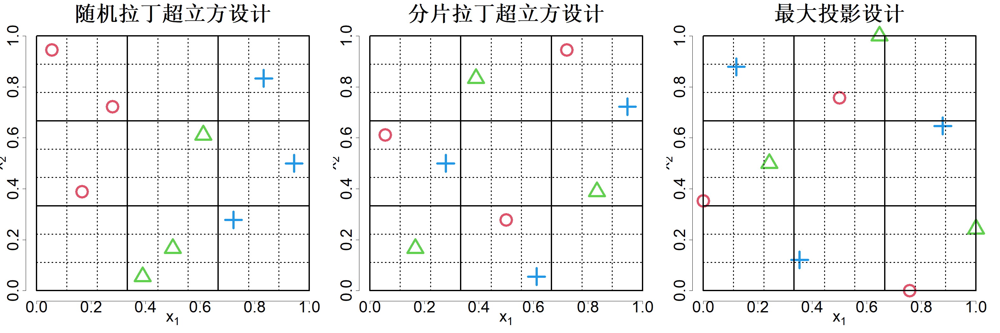

### 4.5.2 定性因子

到目前为止，我们研究的都是连续输入。但在实际情况中，部分输入属于定性类型。例如，1.2 节介绍的加工模拟器可以指定工件材料，如各类钛合金（Ti‑6Al‑4V 或 Ti‑6Al‑6V‑2Sn），也可以指定刀具路径优化类型（无优化、切削内优化、空切优化，或同时启用两种优化）。这类因子被称为名义定性因子。

一般而言，系统输入可分为定量输入与定性输入。定量输入可以是连续型，也可以是离散数值型。离散数值因子仅可取离散值，例如 1、2、3... 举例来说，可在加工仿真器中设定铣刀的容屑槽数量，这就是一个离散数值因子。定性输入可分为名义型与有序型。有序因子的取值具备一定顺序，例如可取值：优秀、很好、良好、一般、较差。在上述加工案例中，刀具状态就属于这类有序因子。

我们该如何构建可容纳定性因子的空间填充设计？现有文献中的一种处理方法是将拉丁超立方设计（LHD）切分为若干片段，并将每个片段分配给定性因子的一个水平。钱（2012）提出了分片拉丁超立方设计（SLHD），该设计能够保证每一个片段本身也属于拉丁超立方设计（LHD）。举个例子，假设有两个连续因子 $x_1$、$x_2$，以及一个含有三个水平的名义定性因子 $x_3$，试验预算为 9 次试验。图 4.17 左侧子图展示了一个随机拉丁超立方设计，其中定性因子的三个水平分别用黑色圆圈（"1"）、红色三角形（"2"）和绿色加号（"3"）表示。可以看出该设计效果不佳：定性因子取水平 1 时，$x_1$ 的取值落在区间 $[0, 1/3]$；定性因子取水平 2 时，$x_1$ 的取值落在区间 $[1/3, 2/3]$；定性因子取水平 3 时，$x_1$ 的取值落在区间 $[2/3, 1]$。也就是说，在定性因子的各个水平内部，$x_1$ 没有遍历全部取值范围。与之相对，图 4.17 中间子图中的分片拉丁超立方设计则是一个优质设计，在定性因子的每一个水平下，$x_1$ 和 $x_2$ 均可遍历全部取值范围。如图所示，若忽略定性因子，可得到一个 9×9 的拉丁超立方设计（虚线）；同时，定性因子的每个水平内部各自构成 3×3 的拉丁超立方设计（实线）。

> **图 4.17**：包含两个定量因子（$x_1$、$x_2$）和一个三水平定性因子（$x_3$）的设计：随机拉丁超立方设计（左）、分片拉丁超立方设计（中）以及最大投影设计（右）

{width=100%}

若存在 $p$ 个定性因子，其水平数分别为 $L_1,\dots,L_p$，则我们可以首先构造一个拥有 $t=\prod_{i=1}^{p}L_i$ 个水平的“新”定性因子，再构建具有 $t$ 个切片的分层拉丁超立方设计（SLHD）。分层拉丁超立方设计的高效构造方法可见杨等人（2013）与尹等人（2014）的研究。巴等人（2015）提出最大最小分层拉丁超立方设计，该设计能够保证整体设计以及各个切片均具备良好的最大最小性质。图 4.17 中间子图展示的分层拉丁超立方设计，实际是借助 R 语言软件包 SLHD（巴，2015）生成的最大最小分层拉丁超立方设计。不过分层拉丁超立方设计存在缺陷：随着定性因子数量及其水平数增加，设计规模会变得极其庞大。邓等人（2015）提出边缘耦合设计（MCD），该设计可处理更多名义因子。边缘耦合设计的结构将用于名义因子的正交表（OA）（可参考吴与浜田（2021））和用于连续因子的拉丁超立方设计（LHD）相结合，使得该拉丁超立方设计能够按照任意单个名义因子的水平拆分为多个规模更小的拉丁超立方设计。换言之，边缘耦合设计中，连续因子对应的拉丁超立方设计与任意一列名义因子组合后，就构成一个分层拉丁超立方设计。由于边缘耦合设计针对名义因子采用正交表，而非全因子组合，相较于分层拉丁超立方设计，它可以实现更精简的试验运行规模。但边缘耦合设计的结构存在约束：不仅需要存在对应规模的正交表，还需要一类特殊的拉丁超立方设计，该拉丁超立方设计与正交表的每一列配对后都能够形成分层拉丁超立方设计。约瑟夫等人（2020）提出最大投影设计来处理定性因子，该设计的试验运行规模选择灵活，由此克服了分层拉丁超立方设计与边缘耦合设计的局限。除此之外，该方法同样可以纳入离散数值因子与有序因子。

在讨论针对定性因子的最大投影设计之前，我们需要掌握如何拟合含定性因子的高斯过程（GP）模型。首先，通过评分法将有序因子转换为离散数值因子（可参见吴与滨田（2021，第 14 章））。具体而言，若某有序因子的水平为“差”、“一般”和“良好”，试验人员可根据分类的实际属性，选取 $\{1,2,3\}$ 或 $\{1,4,5\}$ 这类离散数值水平来代表这三个有序等级。因此，在假定有序因子已经通过评分法转换为离散数值因子的前提下，我们仅需考虑连续因子、名义因子以及离散数值因子。

钱等人（2008）提出了若干种相关关系构建方案，同时给出了可构建包含定量因子与名义型定性因子的高斯过程（GP）模型的通用框架。本文针对名义因子采用如下可交换相关结构，该结构同样被约瑟夫与德拉尼（2007）所使用：

$$
R(\boldsymbol{w}_i -\boldsymbol{w}_j; \alpha, \beta, \gamma) = \exp\left\{-\sum_{l=1}^{p_1}\alpha_l|x_{il}-x_{jl}| -\sum_{k=1}^{p_2}\beta_k|u_{ik}-u_{jk}| -\sum_{h=1}^{p_3}\gamma_hI(v_{ih} \neq v_{jh})\right\}
\tag{4.31}
$$

式中 $\boldsymbol{w}_i = (\boldsymbol{x}_i, \boldsymbol{u}_i, \boldsymbol{v}_i)$；$\boldsymbol{x}$ 代表 $p_1$ 个连续因子；$\boldsymbol{u}$ 代表 $p_2$ 个离散数值因子（包含有序因子）；$\boldsymbol{v}$ 代表 $p_3$ 个名义因子；$I(v_{ih} \neq v_{jh})$ 为指示函数，当 $v_{ih} \neq v_{jh}$ 时取值为 1，否则取值为 0。假定离散数值因子同样缩放至区间 $[0,1]$，使得三类因子的相关参数处于同一量纲尺度。与式 (4.24) 中的高斯相关函数不同，此处对连续因子采用指数相关函数。可以发现，为指数相关函数的相关参数设置信息先验，能够得到与高斯相关函数情形下完全一致的最大投影准则。这种引入信息先验的处理方式对于离散数值因子十分关键，因为试验设计中离散数值因子无法拥有 $n$ 个水平。

假定相关参数的先验分布如下：

$$
\alpha_l \stackrel{\text{iid}}{\sim} \mathrm{Gamma}(2, \overline{\alpha}_l),\ l = 1, \dots, p_1
$$

$$
\beta_k \stackrel{\text{iid}}{\sim} \mathrm{Gamma}(2, \overline{\beta}_k),\ k = 1, \dots, p_2
$$

$$
\gamma_h \stackrel{\text{iid}}{\sim} \mathrm{Gamma}(2, \overline{\gamma}_h),\ h = 1, \dots, p_3
$$

此处选用伽马先验，目的是得到目标函数的显式表达式。此外，将伽马分布的形状参数取为 2，使得所得结果与式 (4.23) 中连续因子的最大投影准则保持一致。于是

$$
\begin{aligned}
&\mathrm{E}\{\|\boldsymbol{R}-\boldsymbol{I}_n\|_1\}\\
&=\iiint\sum_{i=1}^{n}\sum_{j\neq i}R(\boldsymbol{w}_i-\boldsymbol{w}_j;\alpha,\beta,\gamma)\\
&\quad\prod_{l=1}^{p_1}\overline{\alpha}_l^2\alpha_l \mathrm{e}^{-\overline{\alpha}_l\alpha_l}
\prod_{k=1}^{p_2}\overline{\beta}_k^2\beta_k \mathrm{e}^{-\overline{\beta}_k\beta_k}
\prod_{h=1}^{p_3}\overline{\gamma}_h^2\gamma_h \mathrm{e}^{-\overline{\gamma}_h\gamma_h}\mathrm{d}\alpha \mathrm{d}\beta \mathrm{d}\gamma\\
&=\sum_{i=1}^{n}\sum_{j\neq i}
\prod_{l=1}^{p_1}\int \overline{\alpha}_l^2\alpha_l \mathrm{e}^{-\{|x_{il}-x_{jl}|+\overline{\alpha}_l\}\alpha_l}\mathrm{d}\alpha_l
\prod_{k=1}^{p_2}\int \overline{\beta}_k^2\beta_k \mathrm{e}^{-\{|u_{ik}-u_{jk}|+\overline{\beta}_k\}\beta_k}\mathrm{d}\beta_k\\
&\quad\prod_{h=1}^{p_3}\int \overline{\gamma}_h^2\gamma_h \mathrm{e}^{-\{I(v_{ih}\neq v_{jh})+\overline{\gamma}_h\}\gamma_h}\mathrm{d}\gamma_h\\
&=\sum_{i=1}^{n}\sum_{j\neq i}
\prod_{l=1}^{p_1}\frac{\overline{\alpha}_l^2}{\{|x_{il}-x_{jl}|+\overline{\alpha}_l\}^2}
\prod_{k=1}^{p_2}\frac{\overline{\beta}_k^2}{\{|u_{ik}-u_{jk}|+\overline{\beta}_k\}^2}\\
&\quad\prod_{h=1}^{p_3}\frac{\overline{\gamma}_h^2}{\{I(v_{ih}\neq v_{jh})+\overline{\gamma}_h\}^2}\end{aligned}
$$

由此得到一个新的设计准则，即最小化

$$
\sum_{i=1}^{n}\sum_{j\neq i}
\frac{1}{\prod_{l=1}^{p_1}\{|x_{il}-x_{jl}|+\overline{\alpha}_l\}^2
\prod_{k=1}^{p_2}\{|u_{ik}-u_{jk}|+\overline{\beta}_k\}^2
\prod_{h=1}^{p_3}\{I(v_{ih}\neq v_{jh})+\overline{\gamma}_h\}^2}
\tag{4.32}
$$

直观来看，为提高式 (4.32) 对设计变更的敏感度，应当在该式中采用较小的 $\overline{\alpha}_l$、$\overline{\beta}_k$ 与 $\overline{\gamma}_h$ 值。对于连续因子，我们可直接令 $\overline{\alpha}_l = 0$（$l=1,\dots,p_1$），这会强制每个连续因子拥有 $n$ 个不同水平。但对于名义因子与离散数值因子，每个因子可使用的总水平数小于 $n$。因此必须取 $\overline{\beta}_k > 0$（$k=1,\dots,p_2$）和 $\overline{\gamma}_h > 0$（$h=1,\dots,p_3$），避免当存在某些 $(i,j)$ 使得 $u_{ik}=u_{jk}$ 或 $v_{ih}=v_{jh}$ 时，式 (4.32) 的分母变为零。设 $L_h$ 为第 $h$ 个名义因子的不同水平数，$h=1,\dots,p_3$。由于 $P\{I(v_{ih} \neq v_{jh}) = 0\}=1/L_h$，可得对 $h=1,\dots,p_3$，$\mathrm{E}\{I(v_{ih} \neq v_{jh})\}=1-1/L_h$。据此建议选取 $\overline{\gamma}_h=1/L_h$，该值是使 $\mathrm{E}\{I(v_{ih} \neq v_{jh})+\overline{\gamma}_h\}$ 与 $L_h$ 无关的 $\overline{\gamma}_h$ 的最小可行取值。与之类似，对于离散数值因子，同样可令 $\overline{\beta}_k=1/m_k$，其中 $m_k$ 为第 $k$ 个离散数值因子的水平数。可以看出，随着 $m_k$ 增大，对应的离散数值因子行为会愈发接近连续因子，相应的 $\overline{\beta}_k$ 也会如预期般趋近于 0。

在上述超参数取值下，最优设计准则变为

$$
\min_{D}\sum_{i=1}^{n-1}\sum_{j\neq i}\frac{1}{\prod_{l=1}^{p_1}(x_{il}-x_{jl})^2\prod_{k=1}^{p_2}\left\{|u_{ik}-u_{jk}|+\frac{1}{m_k}\right\}^2\prod_{h=1}^{p_3}\left\{I(v_{ih}\neq v_{jh})+\frac{1}{L_h}\right\}^2}
\tag{4.33}
$$

当仅存在连续因子（$p_1\ge 1$，$p_2=p_3=0$）时，该准则退化为式 (4.23) 中的最大投影准则。因此，该准则具备最大投影设计全部优良性质，不仅可以在整个设计空间，还可以在所有向低维子空间的投影上最大化空间填充特性。对于名义因子，该准则的思想与徐 (2002) 在构造混合水平正交表与近似正交表时提出的 $\boldsymbol{J}_2$ 最优性准则相近，后者通过最大化行之间的相异程度实现，其定义为 $\min_{D}\sum_{i=1}^{n-1}\sum_{j=i+1}^{n}\{\sum_{h=1}^{p_3}I(v_{ih}=v_{jh})\}^2$。

式 (4.33) 中的最大投影设计可通过 R 语言 MaxPro 程序包中的 MaxProQQ 函数生成（巴与约瑟夫，2018）。包含 9 次试验、2 个连续因子以及 1 个具有 3 个水平的定性名义因子的最大投影设计如图 4.17 右侧子图所示。可以发现，尽管在优化过程中并未施加相关约束，但该最大投影设计具备分层拉丁超立方设计的性质。另一方面，最大投影设计灵活性很高：它可以针对任意试验次数、任意数量的定量与定性因子生成。关于 MaxProQQ 在液体制剂设计中的近期应用可参见奇特雷等人（2025）的研究。