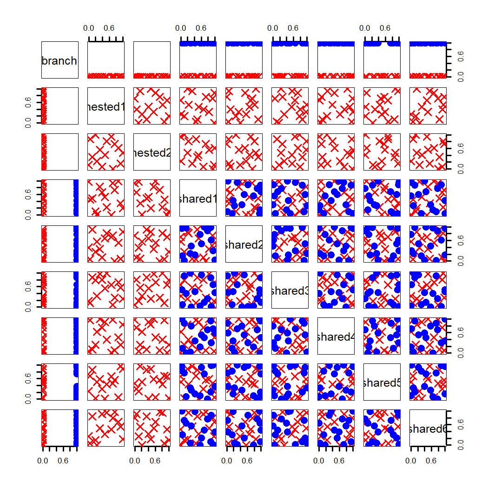

### 4.5.3 分支设计

洪等人（2009）报道了一项计算机仿真试验，该试验旨在优化采用立方氮化硼（cBN）刀具对淬硬轴承钢进行车削加工的工艺。该工艺通常被称为硬车削。由于被加工材料硬度很高（洛氏 C 硬度超过 60），加工过程中刀具会承受巨大的切削力、应力与温度。实际应用中，刀具切削刃会被加工成特定形状，使其能够承受极端工况。存在两种常用的切削刃构型：钝化刃和倒角刃。倒角刃刀具可通过两个参数进行调整：倒角长度与倒角角度，而钝化刃的结构是固定不变的。换言之，长度与角度这两个参数嵌套于倒角刃工况下，钝化刃工况不存在嵌套参数。参照田口（1987）与法德克（1995，第 168 页）的研究，我们将刀具刃口称为分支因子。因此，当分支因子取倒角刃水平时，试验中会存在另外两个因子；当分支因子取钝化刃水平时，则无额外因子。还有部分因子对两种刃口均适用，例如切削刃圆角半径、刀尖圆角半径和前角。切削速度、进给量、切削深度等加工参数同样不随刀具刃口类型改变。为与分支因子、嵌套因子加以区分，这类因子称为共享因子。本试验涉及的全部因子及其允许取值范围如表 4.1 所示。该试验采用商用有限元软件 AdvantEdge 完成。

> **表 4.1**：硬车削实验中的因子及其取值范围

|因子类型|符号|因子|取值范围|
|:--|:--|:--|:--|
|分支因子|$z_1$|切削刃形状|钝化或倒角|
|嵌套因子|$v_1\|z_1$：倒角|角度（度）|$[-20,-17]$|
||$v_2\|z_1$：倒角|长度（微米）|$[-140,-115]$|
||$v_1\|z_1$：钝化|无|无|
||$v_2\|z_1$：钝化|无|无|
|公共因子|$x_1$|切削刃半径（微米）|$[-25,-5]$|
||$x_2$|前角（度）|$[-15,-5]$|
||$x_3$|刀尖圆弧半径（毫米）|$[-1.6,-0.4]$|
||$x_4$|切削速度（米/分钟）|$[-240,-120]$|
||$x_5$|进给量（毫米/转）|$[-0.15,-0.05]$|
||$x_6$|切削深度（毫米）|$[-0.25,-0.1]$|

由于分支因子的每个层级下嵌套因子可以各不相同，因此每个分支因子层级内的投影就显得十分重要。洪等人（2009）提出了分支拉丁超立方设计，该设计兼顾公共因子空间，以及分支因子各层级下嵌套因子与公共因子共同构成空间中的距离。由于分支因子通常属于定性因子，我们也可以采用上一节介绍的 MaxProQQ 设计。但需要对该设计做相应调整，以适配嵌套因子。

我们将以硬车削实验为例对该方法进行说明。我们的预算可支持 30 次试验。首先，可以借助 MaxProQQ 生成 MaxPro(30,9) 设计，将切削刃形状设为名义因子，其余八个因子设为连续因子。接下来选取两列，剔除与钝化刃刀具对应的条目，并对倒角刃刀具对应的条目重新缩放与优化。我们可以计算分支因子两个水平内，共享因子设计以及嵌套‑共享设计的最大投影准则，并针对这两列的选取对其进行优化。最终设计的优劣同样取决于初始的 MaxPro(30,9) 设计。因此，整个流程可以重复若干次，并依据最大投影准则选出最优设计。由此得到的最优设计的散点图矩阵如图 4.19 所示。

> **图 4.19**：硬车削实验 30 次分支设计的散点图矩阵

{width=33%}