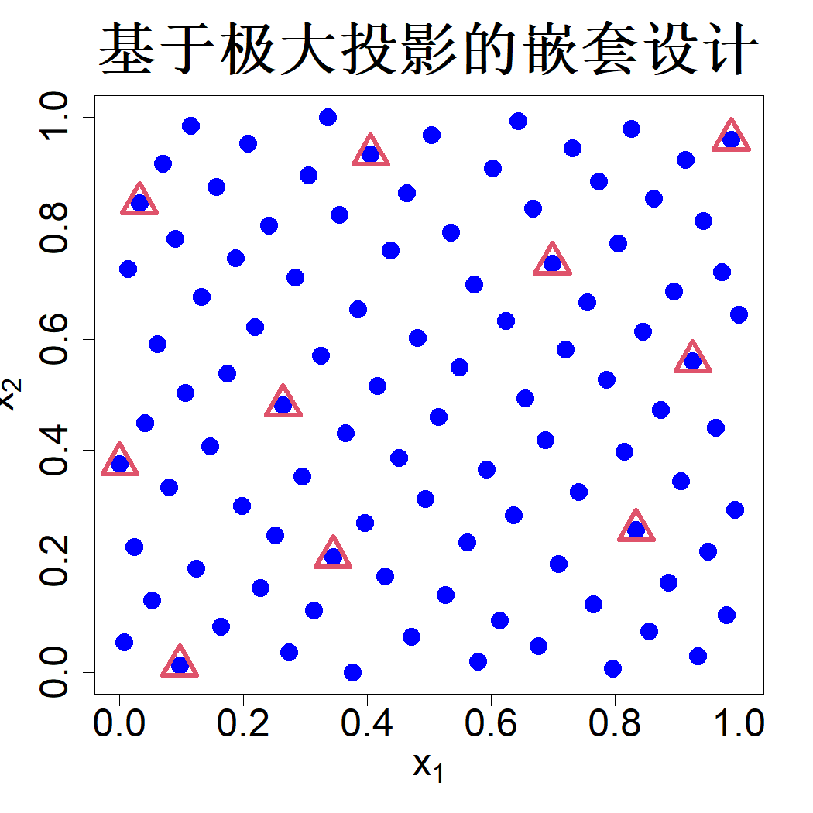

### 4.5.4 嵌套设计

有时可以编写计算机代码，求解描述物理系统的数学方程，这些方程可具备不同保真度等级，例如有限元分析中的相关方程。例如，金属板的热传导问题，采用了两种网格布置方式来施加混合边界条件：底边温度恒定为 100 摄氏度，顶边与左边向 0 摄氏度的外界环境发生热对流，右边为绝热边界（卡梅伦等人，1986）。细网格能够得到精度更高的数值解，但计算耗时也会更长。因此，在既定计算资源限制下，开展大量粗网格（低保真度）仿真，搭配少量细网格（高保真度）仿真是合理的做法。

假设存在 $K$ 个保真度等级，其中“1”代表最低保真度，“$K$”代表最高保真度。设 $D_k=\{\boldsymbol{x}_i^{(k)}\}_{i=1}^{n_k}$ 为第 $k$ 级保真度下包含 $n_k$ 次试验的试验设计，$\{y_k=h_k(\boldsymbol{x}_i^{(k)})\}_{i=1}^{n_k}$ 为对应的输出数据，满足 $n_1 \ge n_2 \ge \dots \ge n_K$。肯尼迪与奥黑根（2000）提出下述模型对数据进行融合：

$$
h_k(\boldsymbol{x})=h_{k-1}(\boldsymbol{x})+\delta_k(\boldsymbol{x}),\quad k=2,\dots,K
\tag{4.34}
$$

式中 $\delta_k(\boldsymbol{x})$ 表示第 $k-1$ 级与第 $k$ 级保真度输出之间的偏差。作出如下高斯过程假设：

$$
\begin{align*}
&\delta_k(\boldsymbol{x})\sim\mathrm{GP}(0,\tau_k^2R_k(\cdot)),\quad k=2,\dots,K
\tag{4.35}\\
&y_1(\boldsymbol{x})\sim\mathrm{GP}(\mu,\tau_1^2R_1(\cdot))
\tag{4.36}
\end{align*}
$$

我们应当如何选取 $D_1,\dots,D_K$ 开展多保真度模拟，从而拟合上述模型，并得到最高保真度水平下响应曲面的良好近似？肯尼迪与奥黑根（2000）推荐采用嵌套设计 $D_1 \supseteq D_2 \supseteq \dots \supseteq D_K$，该类设计有助于估计各 $\delta_k(\cdot)$，且不必过度依赖模型假设。钱等人（2006）介绍了一个两级保真度的实际应用案例：基于正交阵列的拉丁超立方设计选取 $D_1$，再依据极小极大准则从 $D_1$ 中选出子集作为 $D_2$。钱等人（2009）给出了多种构造嵌套空间填充设计的代数方法。

为理解嵌套空间填充设计的适用性，我们首先考察基于模型的设计。为简化符号表示，考虑 $K=2$ 的情形，即仅存在两种保真度水平：“1”（低保真）与“2”（高保真）。设 $\boldsymbol{y}_1$ 和 $\boldsymbol{y}_2$ 为采用设计 $D_1$ 和 $D_2$ 开展实验得到的数据。由于此处涉及两套设计，我们需要引入适用性更广的符号来定义相关矩阵。令 $A = \{\boldsymbol{a}_i\}_{i=1}^m$、$B = \{\boldsymbol{b}_i\}_{i=1}^n$，其中 $\boldsymbol{a}_i,\boldsymbol{b}_i \in \mathcal{X} \subset \mathbb{R}^p$。再令 $\boldsymbol{R}(A,B)$ 为 $m\times n$ 矩阵，其第 $ij$ 个元素为 $R(\boldsymbol{a}_i-\boldsymbol{b}_j)$。由此可知，此前我们将 $\boldsymbol{R}(D,D)$ 简记为 $\boldsymbol{R}$。易知：

$$
\begin{bmatrix}
\boldsymbol{y}_1\\\boldsymbol{y}_2
\end{bmatrix}
\sim \mathcal{N}_{n_1+n_2}\left(\mu
\begin{bmatrix}
\boldsymbol{1}_{n_1}\\\boldsymbol{1}_{n_2}
\end{bmatrix},
\begin{bmatrix}
\tau_1^2 \boldsymbol{R}_1(D_1,D_1) & \tau_1^2 \boldsymbol{R}_1(D_1,D_2)\\
\tau_1^2 \boldsymbol{R}_1(D_2,D_1) & \tau_1^2 \boldsymbol{R}_1(D_2,D_2)+\tau_2^2 \boldsymbol{R}_2(D_2,D_2)
\end{bmatrix}\right)
\tag{4.37}
$$

现在考虑最大熵设计：

$$
\max_{D_1,D_2}
\begin{vmatrix}
\tau_1^2 \boldsymbol{R}_1(D_1,D_1) & \tau_1^2 \boldsymbol{R}_1(D_1,D_2)\\
\tau_1^2 \boldsymbol{R}_1(D_2,D_1) & \tau_1^2 \boldsymbol{R}_1(D_2,D_2)+\tau_2^2 \boldsymbol{R}_2(D_2,D_2)
\end{vmatrix}
$$

利用分块矩阵相关结论（引理 2.1），该问题等价于

$$
\max_{D_1,D_2}\left|\tau_1^2 \boldsymbol{R}_1(D_1,D_1)\right|\times
\left|\tau_1^2 \boldsymbol{R}_1(D_2,D_2)+\tau_2^2 \boldsymbol{R}_2(D_2,D_2)-\tau_1^2 \boldsymbol{R}_1(D_2,D_1)\boldsymbol{R}_1^{-1}(D_1,D_1)\boldsymbol{R}_1(D_1,D_2)\right|
\tag{4.38}
$$

注意若 $D_2 \subseteq D_1$，则 $\boldsymbol{R}_1(D_2,D_2)-\boldsymbol{R}_1(D_2,D_1)\boldsymbol{R}_1^{-1}(D_1,D_1)\boldsymbol{R}_1(D_1,D_2)=0$。因此，当 $D_2$ 嵌套于 $D_1$ 内时，式 (4.38) 可简化为

$$
\max_{D_1,D_2\subseteq D_1} \left|\boldsymbol{R}_1(D_1,D_1)\right| \times \left|\boldsymbol{R}_2(D_2,D_2)\right|
\tag{4.39}
$$

作为式 (4.39) 的一种近似，我们可以考虑两组规模更小的序贯优化问题：

$$
\begin{align*}
D_1^* &= \argmax_{D_1}\left|\boldsymbol{R}_1(D_1,D_1)\right|\\
D_2^* &= \argmax_{D_2\subseteq D_1^*}\left|\boldsymbol{R}_2(D_2,D_2)\right|\tag{4.40}
\end{align*}
$$

这表明可以先针对低保真度层级求解最大熵设计，再通过求解式 (4.40) 得到高保真度层级的设计。但在实际中无法求得上述设计，因为我们并不知晓 $R_1(\cdot)$ 与 $R_2(\cdot)$ 中的相关参数。因此，和前文一样，我们寻找合适的空间填充设计来近似上述最优解。

如 4.5 节所述，最大投影设计是 $D^*_1$ 与 $D^*_2$ 的理想选择，因为这类设计倾向于使熵最大化。我们需要解决的唯一问题是如何求解嵌套于另一套设计内的最大投影设计。一种实现思路是从 $D^*_1$ 中逐次剔除样本点，以此构造 $D^*_2$。由于

$$
\sum_{i=1}^{n}\sum_{j\neq i}\frac{1}{\prod_{l}\left\{\left|x_{il}-x_{jl}\right|+\beta_{l}\right\}^{2}}
=\sum_{i=1,i\neq k}^{n}\sum_{j\neq i}\frac{1}{\prod_{l}\left\{\left|x_{il}-x_{jl}\right|+\beta_{l}\right\}^{2}}
+\sum_{j\neq k}\frac{1}{\prod_{l}\left\{\left|x_{kl}-x_{jl}\right|+\beta_{l}\right\}^{2}}
$$

由此可以确定应当从 $D_1$ 中剔除的最优样本点：

$$
x^*_k=\argmax_{x_k\in D_1}\sum_{j\neq k}\frac{1}{\prod_{l=1}^{p}\left\{\left|x_{kl}-x_{jl}\right|+\beta_{l}\right\}^{2}}
\tag{4.41}
$$

注意我们在分母中引入了大于 0 的常数 $\beta_l$。这是因为 $D_2$ 中的取值不再具备连续性，只能选取 $D_1$ 中的离散取值。因此，参照式 (4.33)，对所有 $l=1,\dots,p$，可取 $\beta_l=1/n_1$。倘若将式 (4.31) 中的指数相关函数替换为高斯相关函数，则相应准则变为：

$$
x^*_k=\argmax_{x_k\in D_1}\sum_{j\neq k}\frac{1}{\prod_{l=1}^{p}\left\{(x_{kl}-x_{jl})^{2}+\beta_{l}\right\}}
\tag{4.42}
$$

该准则在 R 语言程序包 SFDesign 的 maxpro.remove 函数中已实现（王和约瑟夫，2025c），此时对 $l=1,\dots,p$，需要设定 $\beta_l=1/n_1^2$。

上述嵌套设计的算法构造方法，相较于前文提到的代数构造方法，通用性与灵活性要强得多。此外，该方法可轻松拓展至任意数量的保真度层级。我们来看一个简单示例：设定两层保真度，$p=2$。假设我们需要从低保真度层级得到 $n_1=100$ 次运算，从高保真度层级得到 $n_2=10$ 次运算。图 4.21 展示了通过最大投影设计得到的 $D_1$ 的 100 个点（蓝色圆点），以及利用 maxpro.remove 函数从 $D_1$ 中选出的属于 $D_2$ 的 10 个点（红色三角形）。

> **图 4.21**：包含两个保真度层级的多保真度模拟嵌套设计。$D_1$ 以蓝色圆点表示，$D_2$ 以红色三角形表示

{width=33%}

成硕等人（2024）提出了一种嵌套设计（称为堆叠设计），该设计会考虑每个保真度水平下代码的计算成本与精度。许与成硕（2025）近期提出了可关联两个相邻保真度水平数据的非线性模型：

$$
h_k(\boldsymbol{x}) = W_k(\boldsymbol{x}, h_{k-1}(\boldsymbol{x}))
$$

该模型是式 (4.34) 中加法模型的推广。非线性函数 $W_k$ 被建模为另一高斯过程，其建模方式与深度高斯过程类似（达米亚努与劳伦斯，2013；绍尔等人，2023）。许与成硕（2025）探讨了基于该嵌套设计结构、采用此模型的序贯设计（第 7 章）。针对保真度水平无法按从低到高排序的场景，季等人（2024）提出了图高斯过程模型，该模型借助有向无环图（DAG）嵌入多保真度代码间的科学依赖关系。此外，他们还提出了嵌套广度优先遍历设计，用于对此类代码开展高效试验。