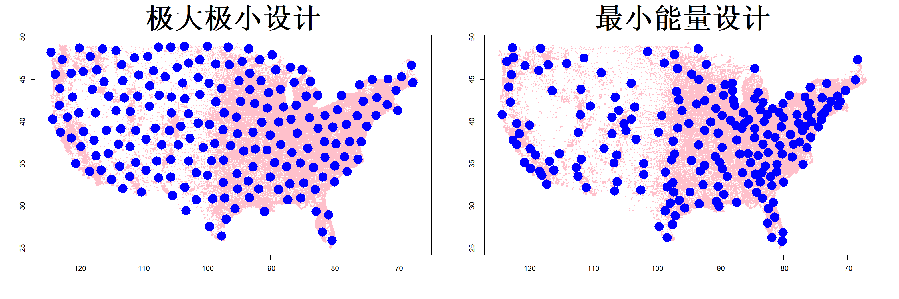

## 4.6 最小能量设计

图 4.22 展示了美国（不含阿拉斯加州与夏威夷州）不同邮政编码区域的人口密度（罗齐，2022）。图中的点以粉色绘制，点的大小与对数人口密度成正比。假设我们计划布设 200 个传感器，用以监测全美各地的污染水平。获取传感器的测量数据后，我们可以利用克里金插值法或高斯过程（GP）来预测美国任意地点的污染情况。应当如何布设这些传感器，才能保证预测结果准确？图 4.22 左图展示了借助 R 语言 maximin 包生成的 200 个采样点极大极小设计（孙与格拉马西，2024），该设计的实际意义不大，因为我们知道人口稠密区域的污染程度会更高。因此理想情况下，我们应当在人口密度较高的区域布设更多传感器，在人口密度较低的区域布设更少传感器。由此我们需要一种加权空间填充设计（鲍曼与伍兹，2013），其权重与人口密度成正比。约瑟夫等人（2015）提出的最小能量设计便是这类方案中的一种。

> **图 4.22**：极大极小设计与最小能量设计以蓝色圆点展示。2020 年人口普查得到的美国各地邮政编码点位以粉色圆点展示，圆点大小与人口密度成正比

{width=67%}

最小能量设计（MED）具有一种物理类比。考虑 $n$ 个带电粒子。不失一般性，将它们视作带正电。若把这些粒子放置在一个盒子内部，粒子之间会相互排斥，并在盒子内占据使总势能最小的位置。设 $q(x)$ 为粒子位于位置 $x \in X = [0, 1]^p$ 处时的电荷量。那么 $n$ 个粒子的总势能由下式给出：

$$
E=\sum_{i=1}^{n-1}\sum_{j=i+1}^{n}\frac{q(\boldsymbol{x}_i)q(\boldsymbol{x}_j)}{\|\boldsymbol{x}_i-\boldsymbol{x}_j\|}
$$

最小能量设计可通过对设计 $D=\{\boldsymbol{x}_1,\dots,\boldsymbol{x}_n\}$ 最小化 $E$ 得到。若对所有 $\boldsymbol{x}\in[0,1]^p$ 都有 $q(\boldsymbol{x})=1$，则该准则退化为式 (4.18) 中当 $\alpha=1/2$ 时的 TRD 准则。因此，我们考虑能量准则的一种广义形式：

$$
\min_{D}\left\{\sum_{i=1}^{n-1}\sum_{j=i+1}^{n}\left(\frac{q(\boldsymbol{x}_i)q(\boldsymbol{x}_j)}{\|\boldsymbol{x}_i-\boldsymbol{x}_j\|_\alpha}\right)^k\right\}^{1/k}
$$

式中 $\|\boldsymbol{x}\|_\alpha=\left\{\sum_{i=1}^p|x_i|^\alpha\right\}^{1/\alpha}$。当 $k\to\infty$ 时，该准则变为

$$
\min_{D}\max_{i\neq j}\frac{q(\boldsymbol{x}_i)q(\boldsymbol{x}_j)}{\|\boldsymbol{x}_i-\boldsymbol{x}_j\|_\alpha}\equiv\max_{D}\min_{i\neq j}\frac{\|\boldsymbol{x}_i-\boldsymbol{x}_j\|_\alpha}{q(\boldsymbol{x}_i)q(\boldsymbol{x}_j)}
\tag{4.43}
$$

这可以看作是式 (4.16) 中极大极小准则的加权形式。约瑟夫等人（2019）证明了下述渐近结果。

> **定理 4.4**：假设电荷函数 $q(\cdot)$ 是利普希茨连续的，即对任意 $\boldsymbol{u},\boldsymbol{v}\in \mathcal{X}=[0,1]^p$，满足 $|q(\boldsymbol{u})-q(\boldsymbol{v})|\le Ld(\boldsymbol{u},\boldsymbol{v})$，其中常数 $L>0$。设 $D^*=\{\boldsymbol{x}^*_1,\dots,\boldsymbol{x}^*_n\}$ 为采用式 (4.43) 得到的具有最小指标的 $n$ 点最小能量设计，$\mathscr{B}$ 为 $\mathcal{X}$ 上的博雷尔 $\sigma$ 代数。在可测空间 $(\mathcal{X},\mathscr{B})$ 上定义如下概率测度：$$P_n(A)=\frac{\mathrm{card}\{\boldsymbol{x}^*_i:1\le i\le n,\;\boldsymbol{x}^*_i\in A\}}{n},\quad \forall A\in \mathscr{B}\tag{4.44}$$ 则当 $n\to\infty$ 时，对任意固定的 $\alpha\in(0,\infty)$，存在概率测度 $P$ 使得 $P_n$ 弱收敛于 $P$。此外，在集合 $\mathcal{X}$ 上，$P$ 具有与 $q^{-2p}(\boldsymbol{x})$ 成比例的密度。

有趣的是，在球堆积相关文献中，最小能量设计也被称作极小里斯能量点。当 $\alpha = 2$ 时，与定理 4.4 相类似的结果可见于博罗达乔夫等人（2008a,b）的研究。

定理 4.4 十分实用，因为如果我们预先设定一个目标密度，例如 $f(\boldsymbol{x})$，那么我们可以将电荷函数取为 $q(\boldsymbol{x})=f(\boldsymbol{x})^{-1/(2p)}$，这样最大熵分布（MED）就会近似服从目标分布。采用该电荷函数时，最大熵分布（MED）可表示为

$$
\max_{D}\min_{i\neq j} f^{1/(2p)}(\boldsymbol{x}_i)f^{1/(2p)}(\boldsymbol{x}_j)\|\boldsymbol{x}_i-\boldsymbol{x}_j\|_\alpha
\tag{4.45}
$$

最小能量设计具有很好的概率解释。当 $\alpha=2$ 时，式 (4.45) 中的准则等价于

$$
\max_{\boldsymbol{x}_{D}}\min_{i\neq j}\sqrt{f(\boldsymbol{x}_i)f(\boldsymbol{x}_j)}V_S(\boldsymbol{x}_i,\boldsymbol{x}_j)
$$

式中 $V_S(\boldsymbol{x}_i,\boldsymbol{x}_j)=\frac{\pi^{p/2}}{\Gamma(p/2+1)}\{\frac{d(\boldsymbol{x}_i,\boldsymbol{x}_j)}{2}\}^p$ 是以 $\frac{(\boldsymbol{x}_i+\boldsymbol{x}_j)}{2}$ 为球心、且经过点 $\boldsymbol{x}_i$ 与 $\boldsymbol{x}_j$ 的球体体积。项 $\sqrt{f(\boldsymbol{x}_i)f(\boldsymbol{x}_j)}$ 是 $\boldsymbol{x}_i$ 和 $\boldsymbol{x}_j$ 处密度值的几何均值。因此，$P_{ij}(D)=\sqrt{f(\boldsymbol{x}_i)f(\boldsymbol{x}_j)}V_S(\boldsymbol{x}_i,\boldsymbol{x}_j)$ 近似为 $x$ 落入该球体的概率。令 $i^*=\arg\min_{j\neq i}P_{ij}(D)$，则最小能量设计准则可写成

$$
\max_{\boldsymbol{x}_{D}}\min_{i=1:n}P_{ii^*}(D)
$$

最大化最小概率会使得所有 $i=1,\dots,n$ 对应的概率 $P_{ii^*}(D)$ 趋于相等。因此粗略来讲，最小能量设计准则力求使试验设计中相邻点之间的概率达到均衡。如式 (4.25) 所示，当 $\alpha=0$ 时，式 (4.45) 中的准则等价于

$$
\max_{\boldsymbol{x}_{D}}\min_{i\neq j}\sqrt{f(\boldsymbol{x}_i)f(\boldsymbol{x}_j)}V_R(\boldsymbol{x}_i,\boldsymbol{x}_j)
$$

式中 $V_R(\boldsymbol{x}_i,\boldsymbol{x}_j)=\prod_{l=1}^{p}|\boldsymbol{x}_{il}-\boldsymbol{x}_{jl}|$ 为超长方体的体积；该超长方体以 $\boldsymbol{x}_i$、$\boldsymbol{x}_j$ 为一对对角顶点，各边平行于坐标轴。因此该准则同样具备与欧氏距离情形一致的概率均衡解释，只需将超球体体积元替换为超长方体体积元即可。当 $f(x)=1$ 时，$\alpha=2$ 与 $\alpha=0$ 两种情况分别对应极大极小设计与最大投影设计。

约瑟夫等人（2015）提出了最小能量设计的如下序贯构造方法：

$$
\boldsymbol{x}_{k+1}=\argmax_{\boldsymbol{x}\in \mathcal{X}}\min_{i=1:k} f(\boldsymbol{x})f(\boldsymbol{x}_i)\|\boldsymbol{x}-\boldsymbol{x}_i\|^{2p}_\alpha,\quad k=2,\dots,n
\tag{4.46}
$$

其中

$$
\boldsymbol{x}_1=\argmax_{\boldsymbol{x}\in \mathcal{X}}f(\boldsymbol{x})
$$

再次考虑这样一个问题：依据人口密度函数 $f(x)$ 在美国各地布设传感器，用以测量污染水平。公式 (4.46) 中的序贯算法已在 R 语言包 mined 中实现。取 $\alpha=1$，采用最小能量设计方法选出的 200 个点位如图 4.22 右侧子图所示。可以看到，人口更多的邮政编码区域分配到了更多传感器，这有助于构建精度更高的美国全域污染水平预测模型。