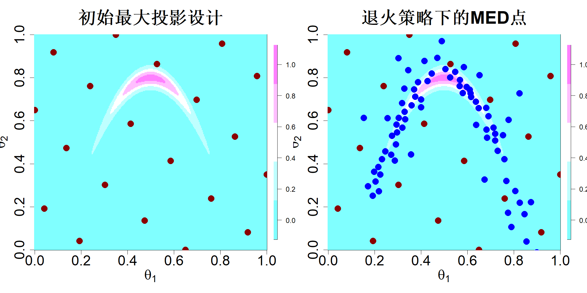
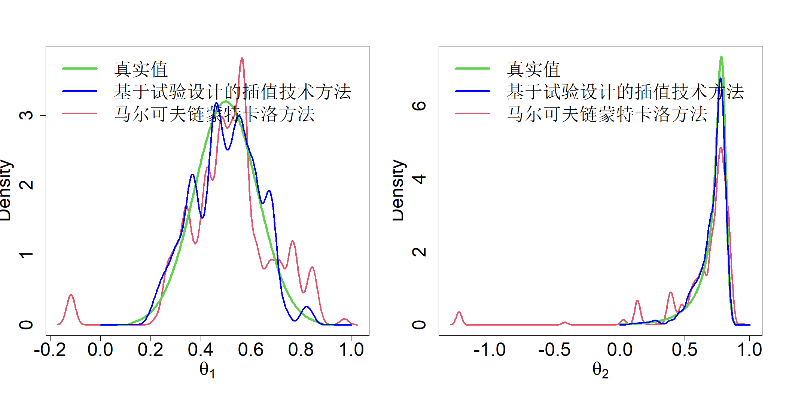

### 4.6.1 贝叶斯计算

假设数据 $\boldsymbol{y}$ 由抽样模型 $f(\boldsymbol{y}|\boldsymbol{\theta})$ 生成，其中 $\boldsymbol{\theta}$ 为未知参数集合。在经典统计学中，通过最大化似然函数得到 $\boldsymbol{\theta}$ 的估计值，即 $\widehat{\boldsymbol{\theta}} = \argmax_{\boldsymbol{\theta}} f(\boldsymbol{y}|\boldsymbol{\theta})$，之后利用该抽样模型对 $\boldsymbol{y}$ 进行重复抽样，以此评估 $\widehat{\boldsymbol{\theta}}$ 的不确定性。在贝叶斯统计学中，会设定先验分布 $f(\boldsymbol{\theta})$，用以表征观测数据之前 $\boldsymbol{\theta}$ 的不确定性；随后借助贝叶斯定理（假定 $\boldsymbol{\theta}$ 为连续型）得到更新后的分布，即后验分布：

$$
f(\boldsymbol{\theta}|y) = \frac{f(y|\boldsymbol{\theta})f(\boldsymbol{\theta})}{\int f(y|\boldsymbol{\theta})f(\boldsymbol{\theta})\mathrm{d}\boldsymbol{\theta}}
$$

分母（归一化常数）可能是高维积分，计算难度较大。因此，通常采用马尔可夫链蒙特卡洛（MCMC）方法，从 $f(\boldsymbol{\theta}|\boldsymbol{y})$ 中抽取若干个 $\boldsymbol{\theta}$ 样本值完成推断，该方法无需获知归一化常数。

马尔可夫链蒙特卡洛（MCMC）方法通常需要大量样本（数千甚至数百万个），才能对后验分布实现较好的近似。若未归一化后验分布 $h(\boldsymbol{\theta})=f(\boldsymbol{y}|\boldsymbol{\theta})f(\boldsymbol{\theta})$ 的计算代价很高，该过程就会十分耗时。在这类情形下，我们可以考虑采用试验设计来计算未归一化后验分布，并利用高斯过程（GP）模型对其进行近似（Joseph，2012，2013）。

如何获取适合近似后验分布的实验设计？显然，我们应当在后验分布的高密度区域放置更多采样点，而在后验分布的低密度区域放置少量采样点或者不放置采样点。这很适合采用最小能量设计，其中电荷函数取为 $q(\boldsymbol{x}) = f(\boldsymbol{\theta}|\boldsymbol{y})^{-1/(2p)}$。因此，

$$
\begin{align*}
D^* &= \argmax_{D}\min_{i\neq j} f(\boldsymbol{\theta}_i|\boldsymbol{y})f(\boldsymbol{\theta}_j|\boldsymbol{y})\|\boldsymbol{\theta}_i -\boldsymbol{\theta}_j\|^{2p}_\alpha \\
&\propto \argmax_{D}\min_{i\neq j} h(\boldsymbol{\theta}_i)h(\boldsymbol{\theta}_j)\|\boldsymbol{\theta}_i -\boldsymbol{\theta}_j\|^{2p}_\alpha \\
&\propto \argmax_{D}\min_{i\neq j} \left\{\log h(\boldsymbol{\theta}_i) + \log h(\boldsymbol{\theta}_j) + 2p\log \|\boldsymbol{\theta}_i -\boldsymbol{\theta}_j\|_\alpha\right\}
\tag{4.47}
\end{align*}
$$

注意，在该优化过程中归一化常数已被分离出去。因此，求解最小能量设计（MED）时我们并不需要归一化常数，这一点十分有利！我们在最后一步取对数，是因为未归一化的后验分布数值可能会变得极小，进而引发数值计算误差。

上述公式存在一个问题。式 (4.47) 中的优化过程需要对未归一化后验分布进行大量求值计算，这就违背了采用试验设计来近似计算开销高昂的后验分布的初衷。约瑟夫等人（2019）提出了一种高效算法，仅通过少量对未归一化后验分布的求值即可生成最小能量设计。其核心思路是使用退火形式的未归一化后验密度：

$$
h^\gamma(\boldsymbol{\theta}),\ \gamma\in[0,1]
\tag{4.48}
$$

其中 $\gamma=1$ 对应目标分布。当 $\gamma=0$ 时，得到后验分布支撑集上的均匀分布。假设经过适当缩放后，后验分布的支撑集为 $\mathcal X=[0,1]^p$。那么我们可以从 $[0,1]^p$ 内的一个设计出发，缓慢将 $\gamma$ 增大至 1，同时迭代学习未归一化后验分布。

例如，考虑哈里奥等人（1999）提出的香蕉形密度函数

$$
f(\boldsymbol{\theta}) \propto \exp\left\{-\frac12\frac{\theta_1^2}{100}-\frac12\left(\theta_2+0.03\theta_1^2-3\right)^2\right\},\quad \boldsymbol{\theta}\in\mathbb R^2
\tag{4.49}
$$

该后验分布的计算开销并不大，此处仅用于举例说明。假设我们已知该后验分布的高密度区域位于 $[-40,40]\times[-25,10]$。我们可以将该矩形区域缩放为单位正方形 $[0,1]^2$。首先在该正方形上选取一个包含 20 次试验的最大投影（MaxPro）设计。图 4.24 左子图中，在后验分布云图上展示了这 20 个采样点。可以看到，最大投影设计完全没有覆盖到后验分布的高密度区域。接下来，我们新增 80 个最大能量设计（MED）点，这些点由式 (4.46) 给出的序贯算法生成，其中 $\gamma=1/4$，且 $h(\cdot)$ 替换为局部近似 $\widehat h(\cdot)$。该过程依次取 $\gamma=2/4$、$3/4$，最终取 $\gamma=1$。该算法在 R 语言包 mined 中实现（王与约瑟夫，2022）。由此生成的 100 个 MED 点展示在图 4.24 的右子图中。可以看到采样点分布在了后验分布的高密度区域内，这显然是一套能够对后验分布进行近似的优良试验设计。

> **图 4.24**：左图展示初始 20 次试验的最大投影设计点（红色）叠加在香蕉形后验分布上。右图展示经过四步退火处理后依次添加得到的 80 个最小能量设计点（蓝色）

{width=67%}

考虑约瑟夫（2013）提出的基于试验设计的插值技术（DoIt），该技术用于近似后验分布。设 $D = \{\boldsymbol{\nu}_1, \dots, \boldsymbol{\nu}_n\}$ 为试验设计点集，且对 $i=1,\dots,n$，有 $h_i = h(\boldsymbol{\nu}_i)$。那么，未归一化密度的平方根可通过基函数展开进行近似：

$$
\sqrt{h(\boldsymbol{\theta})} \approx \sum_{i=1}^{m} c_i g(\boldsymbol{\theta}; \nu_i, \boldsymbol{\Sigma})
\tag{4.50}
$$

取平方根是为了保证密度的预测值非负，

$$
g(\boldsymbol{\theta}; \boldsymbol{\mu}, \boldsymbol{\Sigma}) = \exp\left\{ -\frac12\sum_{i=1}^{p}\frac{(\theta_i-\mu_i)^2}{\sigma_i^2} \right\}
$$

且 $\boldsymbol{\Sigma} = diag\{\sigma_1^2,\dots,\sigma_p^2\}$。$\sigma_i^2$ 可按照 2.1.2 节所述的交叉验证方法进行估计。对每个 $\theta_i$ 在 $(-\infty,+\infty)$ 上积分，可得归一化常数

$$
\int \widehat h(\boldsymbol{\theta})\mathrm{d}\boldsymbol{\theta} = \int \widehat{\boldsymbol{c}}'g(\boldsymbol{\theta})g(\boldsymbol{\theta})'\widehat{\boldsymbol{c}} \,\mathrm{d}\boldsymbol{\theta} = \pi^{p/2}|\boldsymbol{\Sigma}|^{1/2}\widehat{\boldsymbol{c}}'\boldsymbol{G}_2\widehat{\boldsymbol{c}}
\tag{4.51}
$$

其中 $\boldsymbol{G}_2$ 为 $n\times n$ 矩阵，其第 $ij$ 个元素为 $g(\nu_i;\nu_j,2\boldsymbol{\Sigma})$。由此，后验密度的近似表达式为

$$
\widehat f(\boldsymbol{\theta}|y) = \frac{\{\widehat{\boldsymbol{c}}'g(\boldsymbol{\theta})\}^2}{\pi^{p/2}|\boldsymbol{\Sigma}|^{1/2}\widehat{\boldsymbol{c}}'\boldsymbol{G}_2\widehat{\boldsymbol{c}}}
\tag{4.52}
$$

由上式可以得到边缘密度：

$$
\widehat p(\theta_k|y) = \frac{\sum_{i=1}^{n}\sum_{j=1}^{n} d_{ij}\phi\left(\theta_k;\frac{\boldsymbol{\nu}_{ik}+\boldsymbol{\nu}_{jk}}{2},\frac{\boldsymbol{\Sigma}_{kk}}{2}\right)}{\sum_{i=1}^{n}\sum_{j=1}^{n} d_{ij}}
\tag{4.53}
$$

式中 $\phi(\theta;\mu,\sigma^2)$ 代表均值为 $\mu$、方差为 $\sigma^2$ 的正态密度函数，且 $d_{ij}=\widehat c_i\widehat c_j g(\boldsymbol{\nu}_i;\boldsymbol{\nu}_j,2\boldsymbol{\Sigma})$。

由于基于试验设计的插值技术方法应用于 $\sqrt{h(\boldsymbol{\theta})}$，由此生成了一个 100 点的最小能量设计（MED），如图 4.24 所示，其中 $\sqrt{h(\boldsymbol{\theta})}$ 为目标密度。公式 (4.49) 中香蕉形密度下，$\theta_1$ 与 $\theta_2$ 的基于试验设计的插值技术边缘密度如图 4.25 所示。该情形下的真实后验分布可通过数值积分求得，在同一幅图中以绿色曲线展示。作为对比，采用维霍拉（2012）提出的自适应梅特罗波利斯算法生成的 10000 个马尔可夫链蒙特卡洛（MCMC）样本对应的密度，也在该图中以红色曲线展示。可以看出，相较于马尔可夫链蒙特卡洛方法，基于试验设计的插值技术对真实后验分布的逼近效果要好得多。在此案例中，基于试验设计的插值技术仅使用 100 次函数求值，而马尔可夫链蒙特卡洛则需要 10000 次函数求值，这在处理计算开销较大的后验分布时具备优势。

> **图 4.25**：采用数值积分（绿色）、基于 100 点最小能量设计的基于试验设计的插值技术方法（蓝色）以及采样量为 10000 的自适应梅特罗波利斯算法（红色）得到的香蕉形后验分布的边缘后验密度

{width=67%}