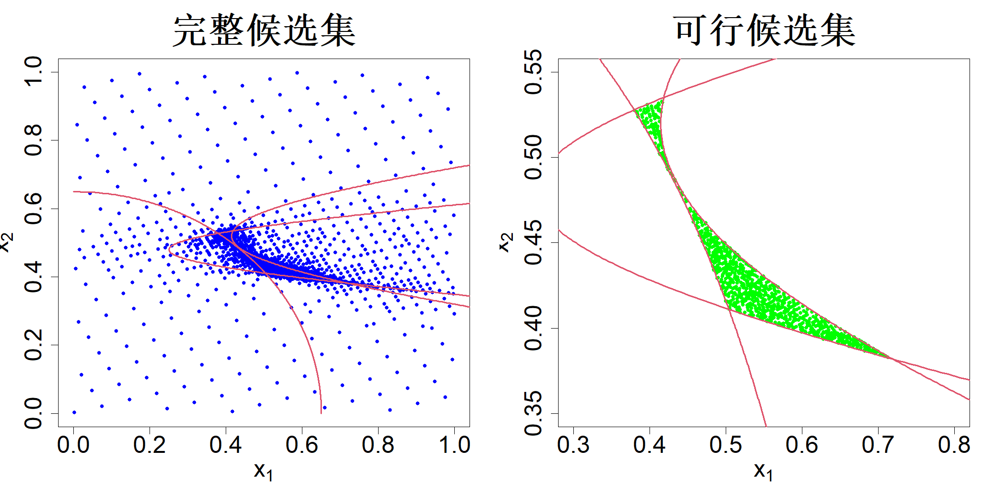

### 4.6.2 候选集生成

回顾 4.5.1 节，我们是先在可行域内生成候选点集，再从中构造试验设计。当可行域在单位超立方体 $\mathcal{X}=[0,1]^p$ 中占比很小时，该节所用的拒绝采样法效率会变得很低。如图 4.16 所示，在二维单位正方形 $[0,1]^2$ 中抽取 10000 个均匀样本，最终仅有 538 个样本满足可行条件。基于这样规模很小的候选点集得到的设计，效果往往欠佳。此外，如果约束条件的计算代价很高，大量样本被拒绝会造成大量算力资源浪费。我们可以采用最小能量设计（黄等人，2021）来提升这一流程的效率。

核心思想是将不等式约束 $\{g_k(\boldsymbol x)\le 0\}_{k=1}^K$ 转化为概率分布，从而可以利用最小能量设计（MED）进行采样。戈尔奇与勒普基（2015）提出了如下基于概率单位函数的概率松弛：

$$
f_\tau(\boldsymbol x) \propto \Phi(-\tau g(\boldsymbol x))
\tag{4.54}
$$

式中 $\Phi$ 为标准正态累积分布函数；$\tau\ge0$ 是控制约束严格程度的参数。可以看到，函数 $\rho_\tau=\Phi(-\tau g(\boldsymbol x))$ 对满足约束的 $\boldsymbol x$ 取值接近于 1，不满足约束的 $\boldsymbol x$ 取值接近于 0。此外，取极限可得：

$$
\lim_{\tau\to\infty}f_\tau(\boldsymbol x) \propto \lim_{\tau\to\infty}\Phi(-\tau g(\boldsymbol x)) = I(g(\boldsymbol x)\le 0) \tag{4.55}
$$

该形式可以推广到多个不等式约束 $\{g_k(\boldsymbol x)\le 0\}_{k=1}^K$：

$$
f_\tau(\boldsymbol x) \propto \prod_{k=1}^K \Phi(-\tau g_k(\boldsymbol x)) \tag{4.56}
$$

现在选取刚度参数的一个递增序列 $0 = \tau_0 < \tau_1 < \dots < \tau_T$，并依次求解最小能量设计问题：

$$
\boldsymbol{x}_{m+1}=\argmax_{\boldsymbol{x}}\min_{i=1:m}\left\{\sum_{k=1}^{K}\log\Phi(-\tau_t g_k(\boldsymbol{x}))+\sum_{k=1}^{K}\log\Phi(-\tau_t g_k(\boldsymbol{x}_i))+2p\log\|\boldsymbol{x}_i-\boldsymbol{x}\|_\alpha\right\}
\tag{4.57}
$$

其中 $t=1,\dots,T$。该算法的完整细节可参见黄等人（2021）的研究。

再次考虑式 (4.30) 中的约束条件。图 4.26 左图展示了利用上述算法生成的 2340 个点，其中参数 $T=8$，目标是构造一个 53 次运行的最大投影（MaxPro）设计。右图展示了 925 个可行候选点。由此可得，可行点占比为 $\frac{925}{2340} \times 100 = 39.5\%$；相较于采用 10000 个拉丁超立方样本生成得到的可行点占比 $\frac{538}{10000} \times 100 = 5.4\%$，该占比处于很高水平。当约束条件的计算代价很高时，这一特性将会带来极大的优势。

> **图 4.26**：左图展示了通过约束最小能量设计法得到的 2340 个候选点。右图展示了 925 个可行候选点

{width=67%}