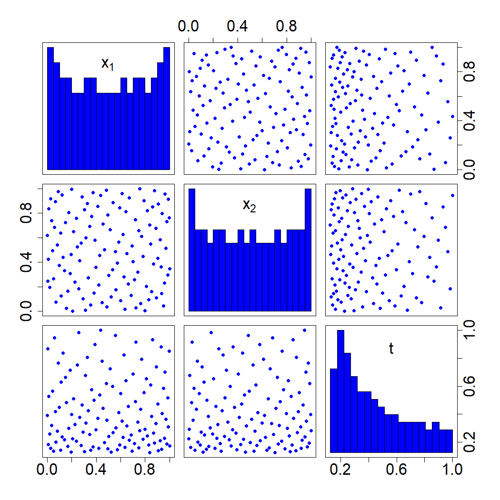

### 4.6.3 连续保真度参数

在许多仿真代码中，可以通过连续参数来控制结果的保真度，例如有限元分析中的网格密度。相比粗网格，更细密的网格能够得到更为精确的结果，但会带来更高的计算开销。

设网格密度调节参数为 $t$，$t$ 可以为正方形或长方体网格单元的边长。涂等人（2014）提出了如下模型：

$$
y(\boldsymbol{x},t)=y(\boldsymbol{x},0)+\delta(\boldsymbol{x},t)=\phi(\boldsymbol{x})+\delta(\boldsymbol{x},t)
\tag{4.58}
$$

式中 $\phi(\boldsymbol{x})$ 为真实响应，$\delta(\boldsymbol{x},t)$ 表示网格密度为 $t$ 时输入 $\boldsymbol{x}$ 对应的仿真偏差。在有限元分析（FEA）中无法得到真实响应函数 $\phi(\boldsymbol{x})$，因为无法执行 $t=0$ 条件下的仿真计算。涂等人方法的精妙之处在于：通过对不同保真度等级的数据进行建模，我们可以外推并预测 $t=0$ 条件下的响应。该模型与肯尼迪和奥黑根（2000）所用模型类似，$\phi(\boldsymbol{x})$ 与 $\delta(\boldsymbol{x},t)$ 这两项可分别由两个独立高斯过程建模，其中 $\phi(\boldsymbol{x})$ 采用平稳协方差函数：

$$
\mathrm{cov}\{\phi(\boldsymbol{x}_1),\phi(\boldsymbol{x}_2)\}=\sigma_0^2R_0(\boldsymbol{x}_1-\boldsymbol{x}_2)
\tag{4.59}
$$

但 $\delta(\boldsymbol{x},t)$ 不能使用平稳高斯过程建模，因为无论 $\boldsymbol{x}$ 取何值，当 $t\to0$ 时 $\delta(\boldsymbol{x},t)\to0$，这破坏了平稳过程所需满足的条件。因此，涂等人（2014）提出采用非平稳协方差函数：

$$
\mathrm{cov}\{\delta(\boldsymbol{x}_1,t_1),\delta(\boldsymbol{x}_2,t_2)\}=\sigma_1^2 R_1(\boldsymbol{x}_1-\boldsymbol{x}_2)K(t_1,t_2)
\tag{4.60}
$$

具体而言，他们选用布朗运动核：

$$
K(t_1,t_2)=\min(t_1,t_2)^l
$$

受有限元仿真误差分析启发，参数 $l$ 一般取 4。注意 $\mathrm{var}\{\delta(\boldsymbol{x},t)\}=\sigma_1^2 t^l$，当 $t\to0$ 时该值趋于 0，因此模型中的偏差会消失。古尔等人（2018）提出了另一种协方差形式。设 $Z(t)$ 为协方差函数，是 $\tau^2R_t(t-\cdot)$ 的平稳高斯过程，则过程 $Z(t)-Z(0)$ 在 $t=0$ 时取值为 0，其协方差函数为：

$$
\begin{align*}
K(t_1,t_2)&=\mathrm{cov}\{Z(t_1)-Z(0),Z(t_2)-Z(0)\}\\
&=\tau^2\{R_t(t_1-t_2)-R_t(t_1)-R_t(t_2)+1\}.
\tag{4.61}
\end{align*}
$$

关于该非平稳协方差函数在多保真度核物理问题中的近期应用，可参见纪等人（2024）的研究。

如何最优选取设计方案 $D=\{(\boldsymbol{x}_i,t_i)\}_{i=1}^n$？尉迟等人（2023）提出了一种基于最小能量设计（MED）的方法，下文将对该方法进行介绍。其核心思想是构造多精度仿真，使其计算成本与单精度仿真保持一致。假设单次仿真的计算时间（$T$）与网格单元数量（$M$）成正比：

$$
T=\beta M
\tag{4.62}
$$

式中 $\beta$ 为比例常数，其取值取决于几何形状、自适应特性等网格划分相关参数。网格单元数量（$M$）与网格密度（$t$）满足如下关系：

$$
t\propto\frac{1}{M^{1/k}}
\tag{4.63}
$$

其中 $k$ 为网格维度（通常取 2 或 3）。由此，我们可以选定 $\{M_i\}_{i=1}^n$，进而得到 $\{t_i\}_{i=1}^n$。

假设在 $\widetilde{M}$ 与 $\overline{M}$ 区间内的有限元分析（FEA）仿真能够收敛并得到合理结果。若我们在单一保真度下完成全部仿真，可选取上界 $\overline{M}$ 作为网格单元数量。假设我们拥有在 $\overline{M}$ 下开展 $\overline{n}$ 次仿真的预算，那么总时间预算为 $\overline{n}\times\beta\overline{M}$。我们希望将该仿真计算预算分配到 $n$ 个不同的保真度等级 $M_1,\dots,M_n$，因此有 $\sum_{i=1}^n\beta M_i=\overline{n}\beta\overline{M}$。由此可得，各等级需要满足约束条件：

$$
\sum_{i=1}^nM_i=\overline{n}\,\overline{M}
\tag{4.64}
$$

由于在小 $M$ 条件下我们需要比大 $M$ 条件下更多的模拟计算，尉迟等人（2023）提出采用如下密度函数来选取 $M$ 的最优水平：

$$
f(M)\propto\frac{1}{M},\quad\text{其中}M\in[\widetilde{M},\overline{M}]
$$

通过求解
$$
\max_{M_1,\dots,M_n}\min_{i\neq j}\frac{1}{\sqrt{M_iM_j}}\left|M_i-M_j\right|
\tag{4.65}
$$
即可得到该目标密度下的最小能量设计。

我们可以利用式 (4.46) 中的序贯构造法来求解 $M$ 的最优水平。尉迟等人（2023）提出了一种逆概率变换方法来求解该问题，在该特定情形下该方法要简便得多。更多细节参见 5.2.1 节。容易得到目标分布的概率密度函数为

$$
f(M)=\frac{1}{M\log\left(\overline{M}/\widetilde{M}\right)},\quad M\in\left[\widetilde{M},\overline{M}\right]
$$

其累积分布函数为

$$
F(M)=\frac{\log\left(M/\widetilde{M}\right)}{\log\left(\overline{M}/\widetilde{M}\right)},\quad M\in\left[\widetilde{M},\overline{M}\right]
$$

因此，$u=F(M)$ 服从区间 $[0,1]$ 上的均匀分布。于是，经过该变换后，式 (4.65) 转化为

$$
\max_{u_1,\dots,u_n}\min_{i\neq j}|u_i-u_j|
$$

我们已经知道该一维极大极小设计问题的解由式 (4.19) 给出。因此式 (4.65) 的解为

$$
M_i=F^{-1}(u_i)=\widetilde{M}\left(\frac{\overline{M}}{\widetilde{M}}\right)^{u_i},\quad i=1,\dots,n
\tag{4.66}
$$

其中 $u_i=(i-1)/(n-1)$。将式 (4.66) 代入式 (4.64)，可得

$$
\sum_{i=1}^n\left(\frac{\overline{M}}{\widetilde{M}}\right)^{u_i}=\overline{n}\left(\frac{\overline{M}}{\widetilde{M}}\right)
\tag{4.67}
$$

令 $\lambda=\overline{M}/\widetilde{M}$，则式 (4.67) 变为

$$
\sum_{i=1}^n\lambda^{\frac{i-1}{n-1}}=\overline{n}\lambda
$$

整理得到

$$
\frac{\lambda^{\frac{n}{n-1}}-1}{\lambda^{\frac{1}{n-1}}-1}=\overline{n}\lambda
$$

求解 $n$ 并选取最接近的整数解，得到

$$
n=1+\left\lfloor\frac{\log\lambda}{\log\nu}\right\rfloor
\tag{4.68}
$$

其中 $\nu=(\overline{n}\lambda-1)/\left\{\lambda(\overline{n}-1)\right\}$，$[x]$ 表示取 $x$ 的最邻近整数。求出 $n$ 之后，即可由式 (4.66) 得到 $\{M_1,\dots,M_n\}$。由于式 (4.63) 中的比例常数会被归入 $\sigma_1^2$，因此可取 $t$ 的最优水平为 $\left\{\frac{1}{M_i^{1/k}}\right\}_{i=1}^n$ 或

$$
\{t_i\}_{i=1}^n=\left\{\left(\frac{M_1}{M_n}\right)^{1/k},\left(\frac{M_1}{M_{n-1}}\right)^{1/k},\dots,1\right\}
\tag{4.69}
$$

参考宋等人（2024）给出的一个简易算例，其中输出依赖于两个输入变量 $(x_1,x_2)$ 以及一个调参 $M$：

$$
y=\phi(\boldsymbol{x})+\frac{16}{M} \mathrm{e}^{-1.4x_1}\cos(3.5\pi x_2)
$$

式中

$$
\phi(\boldsymbol{x})=\left(1-\mathrm{e}^{-0.5/x_2}\right)\frac{2300x_1^3+1900x_1^2+2092x_1+60}{100x_1^3+500x_1^2+4x_1+20}
\tag{4.70}
$$

真实的输入‑输出关系为 $y=\phi(\boldsymbol{x})$，但该关系无法直接计算，因为计算代价与 $M$ 成正比。沿用宋等人（2024）的设定，令 $M\in[2,16]$。若我们在 $M=16$ 下开展单精度仿真，总可用预算为 $\overline n=50$ 次仿真。若将 $M$ 分布在区间 $[2,16]$ 内，在相同计算代价下我们可以执行更多次仿真。由式 (4.68) 可得 $n=118$；结合式 (4.66) 与 (4.69)，可以得到对应 $t=1/M$ 的 $n$ 个水平。接下来构造试验设计：首先生成三因子下 118 次运行的最大投影设计，将第三列中对应 $t$ 的水平替换为最优水平；把该变量视作离散‑数值因子，调用 MaxProQQ 函数（巴与约瑟夫，2018）得到最终设计。该设计的散点图如图 4.27 所示，可以观察到 $t$ 呈现明显的非均匀分布特征。

> **图 4.27**：多精度仿真算例设计的散点图矩阵

{width=33%}

在式 (4.58) 中，设 $\phi(\boldsymbol{x})\sim\mathrm{GP}(\mu,\sigma_0^2R_0(\boldsymbol{x}-\cdot))$，$\delta(\boldsymbol{x},t)\sim\mathrm{GP}(0,\sigma_1^2R_1(\boldsymbol{x}-\cdot)K(t,\cdot))$。由于两个高斯过程之和仍为高斯过程，因此在式 (4.58) 条件下，$y(\boldsymbol{x},t)$ 同样服从高斯过程：

$$
y(\boldsymbol{x},t)\sim\mathrm{GP}\left(\mu,\sigma_0^2R_0(\boldsymbol{x}-\cdot)+\sigma_1^2R_1(\boldsymbol{x}-\cdot)K(t,\cdot)\right)
$$

由此，所有超参数均可按照 2.1.4 节所述方法进行估计。本文采用式 (4.61) 中的核函数，其中 $R_t(\cdot)$ 为高斯相关函数。拟合得到的模型可用于预测 $t=0$（或 $M=\infty$）处的输出。我们按照 4.5 节的说明，利用 MaxProAugment 生成了 100 个测试点。在该简易算例中，真实输出可通过式 (4.70) 计算得到。这 100 个测试点的均方根误差（RMSE）为 $0.054$。作为对比，我们还在 $M=16$ 的条件下，采用样本量 $\overline n=50$ 的 MaxPro 试验设计拟合了单精度模型，其均方根误差为 $0.420$，显著高于多精度建模得到的结果。