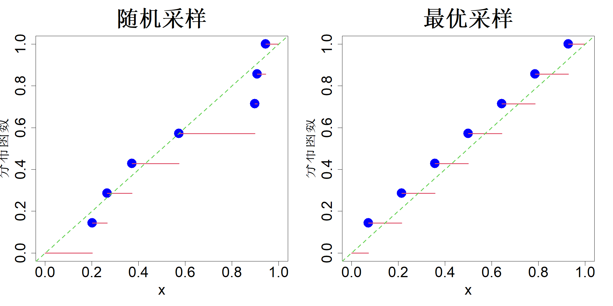

# 5 代表点

第 3 章的图 3.1 展示了从 $[0,1]^2$ 上的均匀分布中随机采样得到的 7 个点。我们曾指出，这些点并不适合用作实验设计，原因是其空间填充特性较差。然而，是否可以采样得到在空间中分布更加均匀的点？本章将详细探讨该问题，并由此引出均匀设计的概念。后续我们会对该概念进行推广，以从任意分布中获取代表点。这类代表点集并非直接用于函数逼近，但当目标为积分计算或不确定性传递时，它们具备特定的最优性质。

## 5.1 均匀设计

本节将重点介绍在 $[0,1]^p$ 均匀分布下的最优采样方法。关于均匀设计的更多细节可参阅方等人（2005）所著书籍。

### 5.1.1 均匀性

首先考虑一维变量的情形。假设我们从均匀分布 $\mathcal{U}[0,1]$ 中随机抽取七个样本值，经排序后得到：$D=\{0.202,0.266,0.372,0.573,0.898,0.908,0.945\}$。我们可以为每个样本分配 $1/n$ 的概率质量：

$$
P(x= x_i)=\frac{1}{n}
$$

由此得到其累积分布函数：

$$
F_n(x)=\frac{1}{n}\sum_{i=1}^{n}I\{x_i\le x\}
\tag{5.1}
$$

式中 $I(\cdot)$ 为指示函数，即若事件 $A$ 发生，则 $I(A)=1$，否则 $I(A)=0$。$F_n(x)$ 称为试验设计 $D$ 的经验分布函数，其图像如图 5.1 左子图所示。均匀随机变量的分布函数为：当 $x\in[0,1]$ 时，$F(X)=x$，该函数在同一幅图中以绿色虚线绘制。我们可以通过对比 $F_n(x)$ 与 $F(x)$，衡量样本集 $D$ 与均匀分布变量的接近程度。其中一种度量为：

$$
\sup_{x\in[0,1]}|F_n(x)-F(x)|
$$

该度量在数值数学中称为星偏差，在统计学中等价于柯尔莫哥洛夫‑斯米尔诺夫拟合优度检验统计量。已有研究证明（方、王，1993，第 16 页）

$$
\left\{\frac{i-0.5}{n}\right\}_{i=1}^{n}
$$

可以使星偏差达到最小。该结果与式 (4.12) 中的极小极大设计完全一致，充分建立起其与空间填充设计之间的联系。最优设计（即均匀设计）对应的经验分布绘制于图 5.1 的右子图。

> **图 5.1**：7 个随机采样点（左）与最优采样点（右）的经验分布函数

{width=67%}

现在来考虑高维情形。和之前一样，对于设计 $D=\{\boldsymbol{x}_1,\dots,\boldsymbol{x}_n\}$，其中 $\boldsymbol{x}_i\in[0, 1]^p$，我们可以定义其经验分布：

$$
F_n(\boldsymbol{x})=\frac{1}{n}\sum_{i=1}^{n}I(\boldsymbol{x}_i\le\boldsymbol{x})
$$

式中 $\sum_{i=1}^{n}I(\boldsymbol{x}_i\le\boldsymbol{x})$ 就是落在 $p$ 维超立方体 $[\boldsymbol{0},\boldsymbol{x}]=[0,x_1]\times\cdots\times[0,x_p]$ 内的样本点数量。星偏差定义为：

$$
\mathcal{S}\mathcal{D}(D)=\sup_{\boldsymbol{x}\in[0,1]^p}|F_n(\boldsymbol{x})-F(\boldsymbol{x})|
$$

其中 $F(\boldsymbol{x})=x_1x_2\cdots x_p$。

遗憾的是，当 $p\ge2$ 时，星偏差的极小元完全不清楚。事实上，当 $p\ge2$ 时，其计算甚至都并不容易。一种更便于计算的度量是星 $L_2$ 偏差，其定义为

$$
\mathcal{S}\mathcal{L}_2(D)=\int_{[0,1]^p}\{F_n(\boldsymbol{x})-F(\boldsymbol{x})\}^2\mathrm{d}\boldsymbol{x}
$$

该度量等价于用于检验均匀分布拟合优度的克拉默‑冯·米泽斯统计量。沃诺克（1972）给出了计算星 $L_2$ 偏差的显式表达式：

$$
\mathcal{S}\mathcal{L}_2=\frac{1}{3^p}-\frac{2^{1-p}}{n}\sum_{i=1}^n\prod_{l=1}^p\left(1-x_{il}^2\right)+\frac{1}{n^2}\sum_{i=1}^n\sum_{j=1}^n\prod_{l=1}^p\{1-\max(x_{il},x_{jl})\}
\tag{5.2}
$$

尽管均匀设计能够很好地逼近 $[0,1]^p$ 上的均匀分布，但它们在逼近给定函数方面的最优性尚不明确。不过，若目标是对函数进行积分，均匀设计确实具备优良的最优性性质，这将在下一节展开讨论。