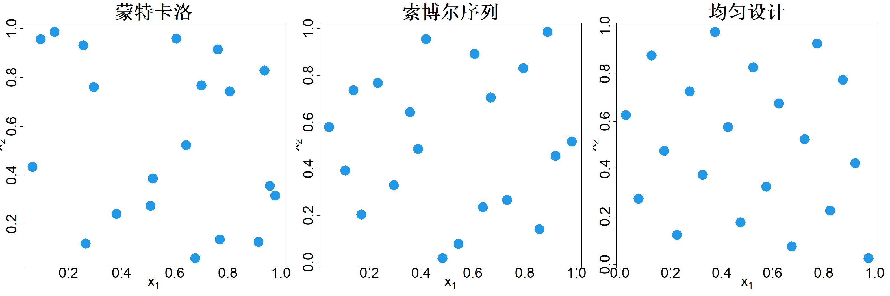
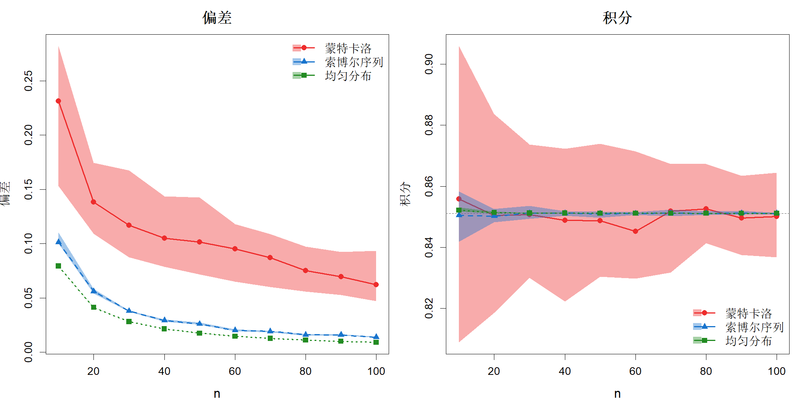

### 5.1.2 积分

假设我们的目标是对函数进行积分：

$$
I=\int_{[0,1]^p} h(\boldsymbol{x})\mathrm{d}\boldsymbol{x}
\tag{5.3}
$$

对于一维积分，可以使用常见的数值积分方法，例如梯形法则或辛普森法则。这类方法本质上将积分近似为

$$
\widehat{I}=\sum_{i=1}^{n} w_i h(x_i)
\tag{5.4}
$$

其中 $\{x_1,\dots,x_n\}$ 为积分节点，$w_i$ 为对应权重。已知梯形法则的积分绝对误差 $|\widehat{I}-I|$ 为 $\mathcal{O}(1/n^2)$，辛普森法则的积分绝对误差为 $\mathcal{O}(1/n^3)$。但在高维情形下，该收敛速度会大幅下降。为说明这一点，考虑利用张量积构造 $p$ 维下的 $m$ 点积分公式，此时总共需要 $n=m^p$ 次函数求值。这意味着，以函数求值次数衡量，梯形法则的收敛阶降为 $\mathcal{O}(1/n^{2/p})$，辛普森法则降为 $\mathcal{O}(1/n^{3/p})$。因此，这类方法并不适用于高维积分。

评估式 (5.3) 的另一种思路是，注意到 $I$ 可以表示为均匀随机变量的期望：

$$
I = \mathrm{E}\{h(X)\}
$$

其中 $X \sim \mathcal{U}[0,1]^p$。均值的一个简单估计为样本均值：

$$
\widehat{I} = \frac{1}{n}\sum_{i=1}^{n}h(\boldsymbol{x}_i)
$$

式中 $\boldsymbol{x}_i \stackrel{\text{iid}}{\sim} \mathcal{U}[0,1]^p$，$i = 1,\dots,n$。根据强大数定律，当 $n \to \infty$ 时，$\widehat{I}$ 几乎必然收敛于 $I$。实际上，可求得 $\widehat{I}$ 的方差为

$$
\mathrm{var}\{\widehat{I}\} = \frac{1}{n^2}\sum_{i=1}^{n}\mathrm{var}\{h(\boldsymbol{x}_i)\} = \frac{\tau^2}{n}
$$

其中 $\tau^2 = \mathrm{var}\{h(\boldsymbol{X})\}$。因此，$I$ 的 $95\%$ 置信区间可构造为 $\widehat{I} \pm 2\tau/\sqrt{n}$。换言之，积分误差以 $\mathcal{O}_P(1/\sqrt{n})$ 的速率趋于零。虽然对于一维积分，该收敛速率相较于梯形法则或辛普森法则并不占优，但当维度 $p$ 大于 4 或 6 时，它在高维积分问题中表现要好得多。关于蒙特卡洛方法的详细内容可参阅罗伯特等人（2010）所著书籍。

奥黑根（1987）对将蒙特卡洛方法用于积分运算提出了批评，但真正关键的是样本点的“均匀性”，而非“随机性”。积分误差的科克斯马‑赫拉瓦卡不等式（尼德赖特，1992）体现了这一点：

$$
|\widehat{I}-I| \le \mathcal{S}\mathcal{D}(D)V(h)
$$

式中 $V(h)$ 为函数 $h$ 的变差度量。因此，通过最小化点集相对于均匀分布的偏差度量，就能够对任意函数 $h$ 最小化积分误差的上界。上述推导建立在再生核希尔伯特空间理论之上。如 2.2.2 节与 2.2.3 节所述，由于再生核希尔伯特空间理论与高斯过程联系十分紧密，我们将采用统计学视角，借助高斯过程来阐述相关细节（布里奥尔等人，2019）。

假设

$$
h(\boldsymbol{x})\sim\mathrm{GP}(\mu,\tau^2K(\boldsymbol{x},\cdot))
$$

其中 $\mathrm{cov}\{h(\boldsymbol{u}),h(\boldsymbol{v})\}=\tau^2K(\boldsymbol{u},\boldsymbol{v})$。于是，

$$
\begin{align*}
\mathrm{E}\{\widehat{I}-I\}&=\mathrm{E}\left\{\frac{1}{n}\sum_{i=1}^nh(\boldsymbol{x}_i)-\int_{[0,1]^p}h(\boldsymbol{x})\mathrm{d}\boldsymbol{x}\right\}\\
&=\frac{1}{n}\sum_{i=1}^n\mu-\int_{[0,1]^p}\mu \mathrm{d}\boldsymbol{x}\\
&=\mu-\mu=0
\end{align*}
$$

因此方差为

$$
\begin{align*}
\mathrm{var}\{\widehat{I}-I\}&=\mathrm{var}\left\{\frac{1}{n}\sum_{i=1}^nh(\boldsymbol{x}_i)-\int_{[0,1]^p}h(\boldsymbol{x})\mathrm{d}\boldsymbol{x}\right\}\\
&=\mathrm{E}\left\{\frac{1}{n}\sum_{i=1}^nh(\boldsymbol{x}_i)-\int_{[0,1]^p}h(\boldsymbol{x})\mathrm{d}\boldsymbol{x}\right\}^2\\
&=\mathrm{E}\left\{\frac{1}{n}\sum_{i=1}^n\int_{[0,1]^p}\left[h(\boldsymbol{x})-h(\boldsymbol{x}_i)\right]\mathrm{d}\boldsymbol{x}\right\}^2\\
&=\frac{1}{n^2}\mathrm{E}\left\{\sum_{i=1}^n\sum_{j=1}^n\int_{[0,1]^p}\left[h(\boldsymbol{x})-h(\boldsymbol{x}_i)\right]\mathrm{d}\boldsymbol{x}\int_{[0,1]^p}\left[h(\boldsymbol{x})-h(\boldsymbol{x}_j)\right]\mathrm{d}\boldsymbol{x}\right\}\\
&=\frac{1}{n^2}\mathrm{E}\left\{\sum_{i=1}^n\sum_{j=1}^n\int_{[0,1]^p}\int_{[0,1]^p}\left[h(\boldsymbol{u})-h(\boldsymbol{x}_i)\right]\left[h(\boldsymbol{v})-h(\boldsymbol{x}_j)\right]\mathrm{d}\boldsymbol{u}\mathrm{d}\boldsymbol{v}\right\}\\
&=\frac{1}{n^2}\sum_{i=1}^n\sum_{j=1}^n\int_{[0,1]^p}\int_{[0,1]^p}\mathrm{E}\left\{\left[h(\boldsymbol{u})-h(\boldsymbol{x}_i)\right]\left[h(\boldsymbol{v})-h(\boldsymbol{x}_j)\right]\right\}\mathrm{d}\boldsymbol{u}\mathrm{d}\boldsymbol{v}
\end{align*}
$$

注意到

$$
\begin{align*}
&\mathrm{E}\left\{\left[h(\boldsymbol{u})-h(\boldsymbol{x}_i)\right]\left[h(\boldsymbol{v})-h(\boldsymbol{x}_j)\right]\right\}\\
&=\mathrm{cov}\left\{h(\boldsymbol{u})-h(\boldsymbol{x}_i),\,h(\boldsymbol{v})-h(\boldsymbol{x}_j)\right\}\\
&=\tau^2K(\boldsymbol{u},\boldsymbol{v})-\tau^2K(\boldsymbol{u},\boldsymbol{x}_j)-\tau^2K(\boldsymbol{v},\boldsymbol{x}_i)+\tau^2K(\boldsymbol{x}_i,\boldsymbol{x}_j)
\end{align*}
$$

于是

$$
\begin{align*}
&\int_{[0,1]^p}\int_{[0,1]^p}\mathrm{E}\{\left[h(\boldsymbol{u})-h(\boldsymbol{x}_i)\right]\left[h(\boldsymbol{v})-h(\boldsymbol{x}_j)\right]\}\mathrm{d}\boldsymbol{u}\mathrm{d}\boldsymbol{v}\\
&=\tau^2\left\{\int_{[0,1]^p}\int_{[0,1]^p}K(\boldsymbol{u},\boldsymbol{v})\mathrm{d}\boldsymbol{u}\mathrm{d}\boldsymbol{v}-\int_{[0,1]^p}K(\boldsymbol{x},\boldsymbol{x}_j)\mathrm{d}\boldsymbol{x}-\int_{[0,1]^p}K(\boldsymbol{x},\boldsymbol{x}_i)\mathrm{d}\boldsymbol{x}+K(\boldsymbol{x}_i,\boldsymbol{x}_j)\right\}
\end{align*}
$$

由此可得

$$
\mathrm{var}\{\widehat{I}-I\}=\tau^2\mathcal{K}(D)
$$

其中

$$
\mathcal{K}(D)=\int_{[0,1]^p}\int_{[0,1]^p}K(\boldsymbol{u},\boldsymbol{v})\mathrm{d}\boldsymbol{u}\mathrm{d}\boldsymbol{v}
-\frac{2}{n}\sum_{i=1}^n\int_{[0,1]^p}K(\boldsymbol{x},\boldsymbol{x}_i)\mathrm{d}\boldsymbol{x}
+\frac{1}{n^2}\sum_{i=1}^n\sum_{j=1}^nK(\boldsymbol{x}_i,\boldsymbol{x}_j)
\tag{5.5}
$$

称为核偏差（Hickernell，1998a，1999）。

希克内尔还通过选取不同类型的核函数推导得到了多种偏差度量。例如，式 (5.2) 中的星型 $L_2$ 偏差可以通过使用布朗片核函数

$$
K(\boldsymbol{u},\boldsymbol{v})=\prod_{l=1}^{p}\{1-\max(u_l,v_l)\}
$$

得到。希克内尔（1998a,b）同时发现，$\mathcal{S}\mathcal{D}(D)$ 与 $\mathcal{S}\mathcal{L}_2(D)$ 均无法生成投影性质优良的点集。为此，他提出了如下两种偏差度量：

$$
\begin{align*}
\mathcal{C}\mathcal{L}_2(D)=& \left(\frac{13}{12}\right)^p-\frac{2}{n}\sum_{i=1}^{n}\sum_{l=1}^{p}\left\{1+\frac12|x_{il}-0.5|-\frac12(x_{il}-0.5)^2\right\} \\
&+\frac{1}{n^2}\sum_{i=1}^{n}\sum_{j=1}^{n}\sum_{l=1}^{p}\left\{1+\frac12|x_{il}-0.5|+\frac12|x_{jl}-0.5|-\frac12|x_{il}-x_{jl}|\right\}
\tag{5.6}
\end{align*}
$$

以及

$$
\mathcal{W}(D)=-\left(\frac43\right)^p+\frac{1}{n^2}\sum_{i=1}^{n}\sum_{j=1}^{n}\sum_{l=1}^{p}\left\{\frac32-|x_{il}-x_{jl}|+(x_{il}-x_{jl})^2\right\}
\tag{5.7}
$$

二者分别称为中心化 $L_2$ 偏差与环绕偏差。它们可分别由核函数

$$
K(\boldsymbol{u},\boldsymbol{v})=\prod_{l=1}^{p}\left\{1+\frac12|u_l-0.5|+\frac12|v_l-0.5|-\frac12|u_l-v_l|\right\}
$$

和

$$
K(\boldsymbol{u},\boldsymbol{v})=\prod_{l=1}^{p}\left\{\frac32-|u_l-v_l|+(u_l-v_l)^2\right\}
$$

得到。

最小化偏差测度并非易事。因此，拟蒙特卡罗（QMC）领域的大部分研究都聚焦于生成低偏差点集。这类点集采用数论方法进行构造（方和王，1993），生成速度较快。对于任意 $\epsilon>0$，这些点集可以达到接近 $\mathcal{O}(1/n^{1-\epsilon})$ 的收敛速度，远优于蒙特卡罗方法 $\mathcal{O}(1/\sqrt{n})$ 的收敛速度。关于拟蒙特卡罗方法的更多细节可参阅莱奥巴赫与皮利希沙默（2014）以及欧文（2013）的著作。图 5.2 的中间子图展示了借助 R 语言包 spacefillr（摩根‑沃尔，2025）生成的、定义在 $[0,1]^2$ 上包含 20 个点的索博尔序列。该程序包实现的一类索博尔序列具备更优的二维投影性质（乔和郭，2008）。显而易见，相较于该图左侧子图展示的 20 点蒙特卡罗样本，它在 $[0,1]^2$ 空间内分布得更加均匀。

> **图 5.2**：在二维单位正方形 $[0, 1]^2$ 内，包含 20 个采样点的蒙特卡洛样本（左）、索博尔序列（中）以及均匀设计（右）

{width=100%}

虽然低差异序列生成速度快且应用广泛，但并不适合计算机代码每次求值成本很高的计算机试验。对于计算代价高昂的函数 $h$，可以花费一定时间优化差异度量，以此得到适用于积分的最优样本集。可以采用一些交换算法最小化差异度量，这类算法与用于最大最小拉丁超立方设计、最大投影拉丁超立方设计的算法类似，可参见金等人（2005）的研究。图 5.2 右侧子图展示了由 SFDesign 程序包（王与约瑟夫，2025c）得到的定义在 $[0,1]^2$ 上、共 20 个样本点的均匀设计，该均匀设计实现了环绕差异最小化。从可视化效果来看，与索博尔序列相比，该设计具备更优异的空间填充性与均匀性。从定量角度，该均匀设计的环绕差异值 $\mathcal{W}(D)=0.0412$，远小于索博尔序列的 $\mathcal{W}(D)=0.0591$ 以及蒙特卡洛样本的 $\mathcal{W}(D)=0.1810$。

举个例子，考虑计算如下二维积分的问题：

$$
I=\int_{0}^{1}\int_{0}^{1}\mathrm{e}^{-(x_1-0.5)^2-(x_2-0.5)^2}\mathrm{d}x_1\mathrm{d}x_2
$$

该积分可通过解析积分求得 $I = \pi\left\{\Phi\left(0.5\sqrt{2}\right)-\Phi\left(-0.5\sqrt{2}\right)\right\}^2=0.8511$，其中 $\Phi(\cdot)$ 为标准正态分布函数。下面考虑采用样本均值法对该积分进行估计，样本由三种方法生成：蒙特卡洛法、索博尔序列以及均匀设计。我们将样本量 $n$ 以 10 为步长，从 10 变化至 100；对每个 $n$ 重复生成 30 组样本。因此，对每个 $n$，三种方法各自可以得到 30 个不同的积分估计值。图 5.3 右侧子图绘制了各方法结果的中位数，以及 $5\%$ 和 $95\%$ 分位数（阴影区域）；图左侧子图给出对应的环绕偏差 $\mathcal{W}(D)$。可以看到，蒙特卡洛（MC）方法的环绕偏差最大，均匀设计的环绕偏差最小。虽然蒙特卡洛样本的平均结果接近积分真实值，但结果波动很大；均匀设计在真实值附近的波动最小。这就是更优试验设计（更小偏差值）带来的优势，能够更好地应对最坏情形。

> **图5.3**：三种采样方法（蒙特卡洛、索博尔序列、均匀设计）对应的环绕偏差（左）与二维积分计算结果（右）

{width=67%}