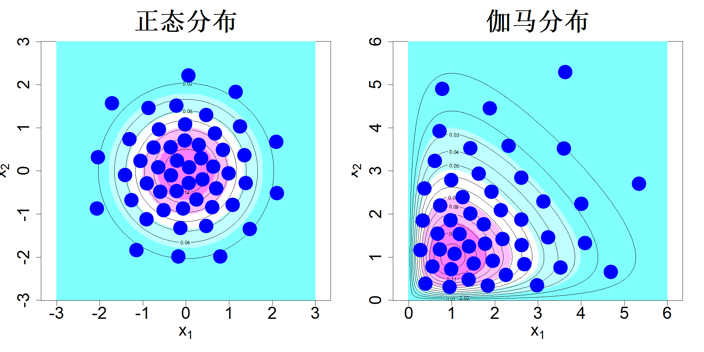
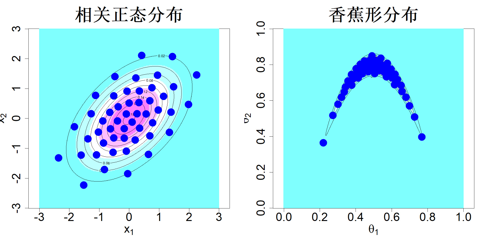

### 5.2.2 支撑点

要获取一般类型分布的代表点，我们可以参照 5.1 节的做法，定义一个拟合优度统计量，并逆向推导该方法以求得最优样本。但如前文所述，柯尔莫哥洛夫‑斯米尔诺夫、克拉默‑冯·米泽斯、安德森‑达林等常用拟合优度测度在高维情形下计算困难，难以开展优化。为此，马克与约瑟夫（2018c）提出采用基于能量距离度量的拟合优度测度，该测度便于计算与优化。

塞凯伊与里佐（2013）提出了如下能量距离，用于度量两个分布 $F$ 和 $G$ 之间的“距离”：

> **定义 5.1**：设 $F$ 与 $G$ 为非空集合 $\mathcal{X}\subseteq\mathbb{R}^p$ 上的两个分布函数，且均具有有限均值；令 $\boldsymbol{X},\boldsymbol{X}'\stackrel{\text{iid}}{\sim}G$，$\boldsymbol{Y},\boldsymbol{Y}'\stackrel{\text{iid}}{\sim}F$。则 $F$ 与 $G$ 之间的能量距离定义为：$$\mathcal{E}(F,G)\equiv2\mathrm{E}\|\boldsymbol{X}-\boldsymbol{Y}\|-\mathrm{E}\|\boldsymbol{X}-\boldsymbol{X}'\|-\mathrm{E}\|\boldsymbol{Y}-\boldsymbol{Y}'\|\tag{5.9}$$

当 $G=F_n$，即 $\{\boldsymbol{x}_i\}_{i=1}^n\subseteq\mathcal{X}$ 的经验分布函数时，该能量距离变为：

$$
\mathcal{E}(F,F_n)=\frac{2}{n}\sum_{i=1}^n\mathrm{E}\|\boldsymbol{x}_i-\boldsymbol{Y}\|_2-\frac{1}{n^2}\sum_{i=1}^n\sum_{j=1}^n\|\boldsymbol{x}_i-\boldsymbol{x}_j\|_2-\mathrm{E}\|\boldsymbol{Y}-\boldsymbol{Y}'\|_2
\tag{5.10}
$$

该式可作为拟合优度统计量，用于检验样本 $\{\boldsymbol{x}_1,\dots,\boldsymbol{x}_n\}$ 是否服从分布 $F$。马克与约瑟夫（2018c）并未将其用作拟合优度统计量，而是提出寻找能够尽可能拟合给定分布 $F$ 的最优样本。他们将这类样本称作该分布的支撑点，其正式定义如下。

> **定义 5.2**：设 $\mathcal{X}\subseteq\mathbb{R}^p$ 上给定分布 $F$ 具有有限均值，则 $F$ 的支撑点定义为： $$\argmin_{D}\mathcal{E}(F,F_n)=\argmin_{D}\left\{\frac{2}{n}\sum_{i=1}^{n}\mathrm{E}\|\boldsymbol{x}_i-\boldsymbol{X}\|-\frac{1}{n^2}\sum_{i=1}^{n}\sum_{j=1}^{n}\|\boldsymbol{x}_i-\boldsymbol{x}_j\|\right\}\tag{5.11}$$ 其中 $\boldsymbol{X}\sim F$，$F_n$ 为点集 $D=\{\boldsymbol{x}_i\}_{i=1}^{n}\subseteq\mathcal{X}$ 的经验分布函数。

此外，马克与约瑟夫（2018c）得出了如下重要结论。

> **定理 5.1**：设 $\boldsymbol{X}\sim F$，$\boldsymbol{X}_n\sim F_n$，其中 $F_n$ 为式 (5.11) 中支撑点的经验分布函数。则 $\boldsymbol{X}_n\stackrel{d}{\to}\boldsymbol{X}$，记号 $\stackrel{d}{\to}$ 依分布收敛。

该定理证明了使用支撑点作为分布 $F$ 的代表性样本是合理的。尽管依分布收敛仅在 $n\to\infty$ 时成立，但依据能量距离测度，对于任意给定的 $n$，支撑点都能提供最优的代表性样本。

从设计角度来看，5.11 中的公式可作如下解释。通过最小化第一项 $\sum_{i=1}^{n}\mathrm{E}\|\boldsymbol{x}_i-\boldsymbol{Y}\|$，可以最小化每个样本点到 $F$ 的期望欧氏距离，以此保证所有设计点都贴近目标分布。同理，通过最大化第二项 $\sum_{i=1}^{n}\sum_{j=1}^{n}\|\boldsymbol{x}_i-\boldsymbol{x}_j\|$，能够最大化各设计点两两之间的距离之和，从而让样本点在试验区域 $\mathcal{X}$ 内相互分散开来。对于均匀分布 $F=\mathcal{U}[0,1]^p$，这两个优化目标与我们在第 4 章介绍的极小极大设计和极大极小设计的目标十分相近。

马克与约瑟夫（2018c）还针对绝对积分误差证明了如下科克斯马‑赫拉瓦卡型不等式：

$$
|\widehat{I}-I|\le V(h)\sqrt{\mathcal{E}(F,F_n)}
$$

该式表明可通过使用支撑点将误差的上界最小化。此外，在一定正则性条件下，他们证明对任意 $\epsilon>0$，有

$$
|\widehat{I}-I|=\mathcal{O}\left(\frac{1}{\sqrt{n}(\log n)^\epsilon}\right)
$$

这说明支撑点的收敛速率优于蒙特卡洛样本。尽管收敛速率上的理论提升幅度不大，但马克和约瑟夫（2018c）发现实际应用中其收敛速率几乎可以达到 $\mathcal{O}(1/n)$。

为对接高斯过程框架（马克、约瑟夫，2025），假设 $h(\boldsymbol{x})$ 服从布朗运动，满足：

$$
\mathrm{E}\{h(\boldsymbol{u})-h(\boldsymbol{v})\}=0,\quad \mathrm{var}\{h(\boldsymbol{u})-h(\boldsymbol{v})\}=\tau^2\|\boldsymbol{u}-\boldsymbol{v}\|
\tag{5.12}
$$

布朗运动是非平稳高斯过程的一种特例，也被称为本征克里金（马瑟龙，1963）。张与阿普利（2014）将其推广应用于计算机实验领域。此时

$$
\begin{align*}
\mathrm{E}\{\widehat{I}-I\}&=\mathrm{E}\left\{\frac{1}{n}\sum_{i=1}^n h(\boldsymbol{x}_i)-\int h(\boldsymbol{x})\mathrm{d}F(\boldsymbol{x})\right\}\\
&=\frac{1}{n}\sum_{i=1}^n\int \mathrm{E}\{h(\boldsymbol{x}_i)-h(\boldsymbol{x})\}\mathrm{d}F(\boldsymbol{x})=0
\end{align*}
$$

因此，沿用 5.1.2 节中的相同推导步骤，可得方差：

$$
\begin{align*}
\mathrm{var}\{\widehat{I}-I\}&=\mathrm{var}\left\{\frac{1}{n}\sum_{i=1}^n h(\boldsymbol{x}_i)-\int h(\boldsymbol{x})\mathrm{d}F(\boldsymbol{x})\right\}\\
&=\frac{1}{n^2}\sum_{i=1}^n\sum_{j=1}^n\iint \mathrm{E}\left\{\left[h(\boldsymbol{u})-h(\boldsymbol{x}_i)\right]\left[h(\boldsymbol{v})-h(\boldsymbol{x}_j)\right]\right\}\mathrm{d}F(\boldsymbol{u})\mathrm{d}F(\boldsymbol{v})\\
&=\frac{1}{n^2}\sum_{i=1}^n\sum_{j=1}^n\iint \mathrm{E}\left\{\left[h(\boldsymbol{u})-h(\boldsymbol{x}_i)\right]\left[h(\boldsymbol{v})-h(\boldsymbol{x}_i)\right]\right\}\mathrm{d}F(\boldsymbol{u})\mathrm{d}F(\boldsymbol{v})\\
&\quad -\frac{1}{n^2}\sum_{i=1}^n\sum_{j=1}^n\iint \mathrm{E}\left\{\left[h(\boldsymbol{u})-h(\boldsymbol{x}_i)\right]\left[h(\boldsymbol{x}_j)-h(\boldsymbol{x}_i)\right]\right\}\mathrm{d}F(\boldsymbol{u})\mathrm{d}F(\boldsymbol{v})
\end{align*}
$$

注意：对任意 $\boldsymbol{x}_i$，有

$$
\mathrm{cov}\left\{h(\boldsymbol{u})-h(\boldsymbol{x}_i),h(\boldsymbol{v})-h(\boldsymbol{x}_i)\right\}=\frac{\tau^2}{2}\left\{\|\boldsymbol{u}-\boldsymbol{x}_i\|+\|\boldsymbol{v}-\boldsymbol{x}_i\|-\|\boldsymbol{u}-\boldsymbol{v}\|\right\}
$$

于是

$$
\begin{align*}
\mathrm{var}\{\widehat{I}-I\}&=\frac{1}{n^2}\sum_{i=1}^n\sum_{j=1}^n\iint\left[\frac{\tau^2}{2}\left\{\|\boldsymbol{u}-\boldsymbol{x}_i\|+\|\boldsymbol{v}-\boldsymbol{x}_i\|-\|\boldsymbol{u}-\boldsymbol{v}\|\right\}\right]\mathrm{d}F(\boldsymbol{u})\mathrm{d}F(\boldsymbol{v})\\
&\quad -\frac{1}{n^2}\sum_{i=1}^n\sum_{j=1}^n\iint\left[\frac{\tau^2}{2}\left\{\|\boldsymbol{u}-\boldsymbol{x}_i\|+\|\boldsymbol{x}_j-\boldsymbol{x}_i\|-\|\boldsymbol{u}-\boldsymbol{x}_j\|\right\}\right]\mathrm{d}F(\boldsymbol{u})\mathrm{d}F(\boldsymbol{v})\\
&=\frac{\tau^2}{n}\sum_{i=1}^n\int\|\boldsymbol{u}-\boldsymbol{x}_i\|\mathrm{d}F(\boldsymbol{u})-\frac{\tau^2}{2n^2}\sum_{i=1}^n\sum_{j=1}^n\|\boldsymbol{x}_i-\boldsymbol{x}_j\|-\frac{\tau^2}{2}\iint\|\boldsymbol{u}-\boldsymbol{v}\|\mathrm{d}F(\boldsymbol{u})\mathrm{d}F(\boldsymbol{v})\\
&=\frac{\tau^2}{2}\mathcal{E}(F,F_n)
\end{align*}
$$

综上，当被积函数服从布朗运动时，支撑点能够最小化积分误差的方差（马克、约瑟夫，2025）。

使用能量距离的一大优势在于可以高效完成支撑点的优化。我们首先通过蒙特卡洛均值对式 (5.11) 中的期望做近似。假设我们拥有取自分布 $F$ 的大容量样本：$\{\boldsymbol{X}_1,\dots,\boldsymbol{X}_N\}$。此时待求解的最小化问题为：

$$
\frac{2}{nN}\sum_{i=1}^{n}\sum_{j=1}^{N}\|\boldsymbol{x}_i-\boldsymbol{X}_j\|-\frac{1}{n^2}\sum_{i=1}^{n}\sum_{j=1}^{n}\|\boldsymbol{x}_i-\boldsymbol{x}_j\|
\tag{5.13}
$$

此处的关键结论是：该目标函数是关于 $(\boldsymbol{x}_1,\cdots,\boldsymbol{x}_n)$ 的两个凸函数之差。该结构十分有价值，因为可以采用凸差规划（d.c. 规划）方法对该表达式开展优化。由于凸差规划的全局优化算法运算速度较慢，马克与约瑟夫（2018c）采用了名为凸‑凹过程的局部优化算法（尤尔和兰加拉詹，2003），该算法是统计领域广泛使用的极大化‑极小化技术的一类特例（兰格，2016）。若 $(\boldsymbol{x}_1^0,\dots,\boldsymbol{x}_n^0)$ 为当前迭代点，则可通过下式得到下一迭代点：

$$
\boldsymbol{x}_i=
\left(\sum_{j=1}^{N}\|\boldsymbol{x}_i^0-\boldsymbol{X}_j\|^{-1}\right)^{-1}
\left(\frac{N}{n}\sum_{j=1,j\ne i}^{n}\frac{\boldsymbol{x}_i^0-\boldsymbol{x}_j^0}{\|\boldsymbol{x}_i^0-\boldsymbol{x}_j^0\|}\sum_{j=1}^{N}\frac{\boldsymbol{X}_j}{\|\boldsymbol{x}_i^0-\boldsymbol{X}_j\|}\right)
\tag{5.14}
$$

其中 $i=1,\cdots,n$。迭代持续执行直至算法收敛。该算法的计算复杂度为 $\mathcal O(Nnp)$，借助极大化‑极小化算法的随机版本，可将复杂度降至 $\mathcal O(n^2p)$。该算法已在 R 语言软件包 support 中实现（马克，2018）。第 10.3 节将介绍一种速度更快、复杂度为 $\mathcal O(pN\log N)$ 的算法。

由二元正态分布与伽马分布生成的 50 个支持点如图 5.6 所示。显然，相比图 5.4 中通过均匀设计逆概率变换得到的样本，这些支持点的效果要好得多。变换操作会破坏变换后空间的空间填充特性，而支持点是在原始空间中完成优化，因此能够更好地表征目标分布。

> **图 5.6**：双变量正态分布（左）与伽马分布（右）的 50 个支撑点。图中同时展示了两类分布的图像与等高线

{width=67%}

考虑上一节讨论的相关二元正态分布。我们生成包含 10000 个点的蒙特卡洛样本，再借助支撑集包得到 50 个支撑点，结果如图 5.7 左图所示。显然，该点集的效果远优于图 5.5 中经罗森布拉特变换得到的点集。接下来考察式 (4.49) 中更为复杂的香蕉形后验密度示例，该例子中我们仅知晓密度的比例常数形式。本案例使用 R 包 adaptMCMC（沙伊德格，2024）实现的自适应梅特罗波利斯算法获取 10000 个样本，再基于这些样本求解 50 个支撑点。支撑点绘制于图 5.7 的右图，同样能够很好地表征底层分布。

> **图 5.7**：式 (5.8) 中相关二元正态分布的 50 个支撑点（左图）以及式 (4.49) 中香蕉形密度（右图）。同时展示了各分布的图像与等高线

{width=67%}

如果 $h(\boldsymbol{x})$ 中仅有少量变量是活跃的，那么正如 4.4 节与 4.5 节所讨论的，支撑点同样会出现投影问题，这会造成活跃维度的空间填充性质变差。马克与约瑟夫（2018b）借鉴最大投影设计的相关思路，拓展了支撑点框架。核心思想是采用如下有理二次核的乘积形式：

$$
K(\boldsymbol{u},\boldsymbol{v})=\prod_{l=1}^{p}\frac{1}{(u_l-v_l)^2+\lambda}
$$

其中 $\lambda>0$。参照式 (5.5) 中的核偏差进行推导，可得到如下定义。

> **定义 5.3**：设 $\mathcal{X}\subseteq\mathbb{R}^p$ 上给定分布 $F$ 具有有限均值，则 $F$ 的投影支撑点 $D=\{\boldsymbol{x}_i\}_{i=1}^n\subseteq\mathcal{X}$ 定义为：$$\argmin_{D}\left\{\frac{1}{n^2}\sum_{i=1}^{n}\sum_{j=1}^{n}\prod_{l=1}^{p}\frac{1}{(x_{il}-x_{jl})^2+\lambda}-\frac{2}{n}\sum_{i=1}^{n}\mathrm{E}\left[\prod_{l=1}^{p}\frac{1}{(x_{il}-X_l)^2+\lambda}\right]\right\}\tag{5.15}$$ 其中 $\boldsymbol{X}\sim F$ 且 $\lambda>0$。

考察 $F=\mathcal{U}[0,1]^p$ 的情形十分有趣。此时式 (5.15) 中的目标函数变为（马克与约瑟夫，2025）

$$
\frac{1}{n^2}\sum_{i=1}^{n}\sum_{j=1}^{n}\frac{1}{\prod_{l=1}^{p}\left[(x_{il}-x_{jl})^2+\lambda\right]}-\frac{2}{n\lambda^{p/2}}\sum_{i=1}^{n}\sum_{l=1}^{p}\left[\tan^{-1}\left(\frac{x_{il}}{\sqrt{\lambda}}\right)+\tan^{-1}\left(\frac{1-x_{il}}{\sqrt{\lambda}}\right)\right]
\tag{5.16}
$$

当 $\lambda$ 取值较小时，第一项与最大投影准则的目标函数一致；而第二项会将靠近边界的样本点拉向试验区域内部，从而让最大投影设计具备均匀性。

核群算法（陈等人，2012）是与支持点密切相关的一类方法。该算法为逐点顺序算法，形式如下：

$$
\boldsymbol{x}_{k+1}=\argmax_{\boldsymbol{x}}\left\{\mathrm{E}[K(\boldsymbol{x},\boldsymbol{X})]-\frac{1}{n+1}\sum_{i=1}^{n}K(\boldsymbol{x},\boldsymbol{x}_i)\right\},\quad k=1,\dots,n-1
$$

其中 $K(\boldsymbol{u},\boldsymbol{v})$ 为对称正定核函数，例如高斯核。相较于核群算法，支持点具备多项优势。第一，支持点通过凸差规划方法求解，相比逐点贪心算法，能够得到代表性质量高得多的样本集。第二，支持点采用基于距离的核函数，与极大极小、极小极大试验设计思路相近，具备良好的几何解释。此外，支持点所使用的欧几里得核不像高斯核那样包含长度尺度参数，因此得到的最优点集不会受这类参数选取的影响，鲁棒性更强。另一个概念——最大均值差异（MMD），基于再生核希尔伯特空间定义，现已成为机器学习领域的常用工具（格雷顿等人，2012）。最大均值差异与式 (5.5) 中的核差异密切相关，相关最新综述可参考奥茨（2021）。最大均值差异同样使用带有未知长度尺度参数的对称正定核函数，因此会受到参数设置不当的影响。这正是支持点的一大优势，支持点可看作鲁棒性更强的分布代表点集。

生成代表点的另一种方法是采用 4.1 节介绍的基于聚类的设计。这类点被称为均方误差代表点（方与王，1993）或主点（弗卢里，1990）。与支撑点不同，它们的经验分布无需收敛到目标分布（见式 (5.19)），因此需要为这些点赋予一定权重，以此修正分布产生的偏差。方等人（2025）新近出版的著作对该方法进行了阐述。