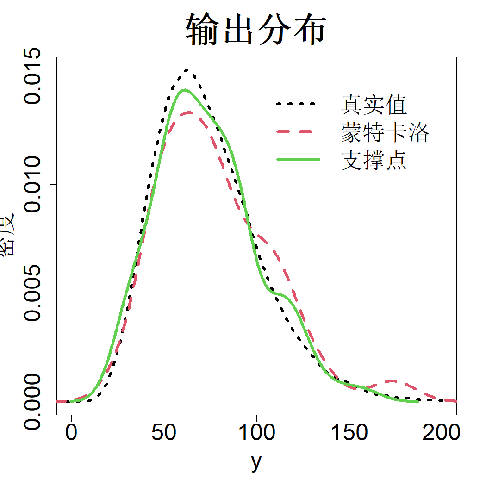

### 5.2.3 不确定性传播

考虑第一章中提及的加工问题。在该问题中，存在若干服从已知分布的输入变量。研究目标是将该输入不确定性通过高成本加工模拟器进行传递，得到输出量（刀具受力）的分布。

解决该不确定性传播问题有多种方法。第一种，我们可以生成大量服从分布 $F$ 的独立同分布蒙特卡洛样本 $\boldsymbol{x}_i$（$i=1,\dots,n$），将仿真器运行 $n$ 次，得到输出 $\{y_1,\dots,y_n\}$，其中 $y_i=h(\boldsymbol{x}_i)$。基于这组输出，我们可以得到 $h(\boldsymbol{x})$ 的经验分布或者其核密度估计。该方法计算成本较高，因此仅适用于仿真器运行开销低的场景。我们可以改用变换后的低差异序列替代蒙特卡洛样本，以此降低计算开销。还可以采用支撑点进一步缩减开销，相较于低差异序列，支撑点能够用更少的样本得到同等精度的输出分布。但倘若仿真器运行成本过高，则应当先借助高斯过程模型这类替代模型对其做近似处理。由于输入分布很可能是非均匀分布，我们可以选用 4.6 节介绍的投影支撑点或者最小能量设计作为试验设计。完成替代模型建模后，便可使用大量蒙特卡洛样本求解输出分布。

例如，考虑用于模拟钻孔中水流量（$y$）的函数（莫里斯等人，1993）：

$$
y=\frac{2\pi x_3(x_4-x_6)}{\log\left(\frac{x_2}{x_1}\right)\left[1+\frac{2x_7x_3}{\ln(x_2/x_1)x_2}+\frac{x_3}{x_5x_8}\right]}
$$

其中 8 个输入变量的不确定分布如表 5.1 所示。为便于说明，假设该钻孔模型计算成本较高，但尚未高到必须使用代理模型的程度。

> **表 5.1**：钻孔模型的输入变量及其对应的不确定性分布。此处 $\mathcal{L}\mathcal{N}$ 代表对数正态分布

|输入变量|符号|不确定性分布|
|:--:|:--:|:--:|
|钻孔半径|$x_1$|$\mathcal{N}(0.1,0.01618^2)$|
|影响半径|$x_2$|$\mathcal{LN}(7.71,1.0056^2)$|
|上部透射率|$x_3$|$\mathcal{U}[63070,115600]$|
|上部水头|$x_4$|$\mathcal{U}[990,1110]$|
|下部透射率|$x_5$|$\mathcal{U}[63.1,116]$|
|下部水头|$x_6$|$\mathcal{U}[700,820]$|
|钻孔长度|$x_7$|$\mathcal{U}[1120,1680]$|
|钻孔导水系数|$x_8$|$\mathcal{U}[9855,12045]$|

由于能量距离采用欧氏距离，因此不应直接在表 5.1 中各变量所定义的空间上生成支撑点。我们需要对变量做缩放处理，使欧氏距离中的平方差之和具备合理意义。注意：若 $X,X'$ 独立同分布，服从分布 $F$，则

$$
\mathrm{E}\{(X-X')^2\}=2\mathrm{var}\{X\}
$$

因此应当对变量进行缩放，使各变量方差相等，这可通过常规标准化方法实现。设 $\mu_i$ 和 $\sigma_i$ 分别为 $x_i$ 的均值与标准差，令

$$
z_i=\frac{x_i-\mu_i}{\sigma_i},\quad i=1,\dots,p
$$

可在该标准化空间内生成支撑点。得到支撑点后，再由 $x_i=\mu_i+\sigma_i z_i$ 换算得到原始空间中的支撑点。

对于钻孔模型，我们首先生成 100000 个蒙特卡罗（MC）样本。由于钻孔模型是易于求值的函数，我们可以对这 100000 个样本进行求值，并通过核密度估计得到输出分布，其结果如图 5.8 中黑色虚线所示。接下来考虑使用支撑点开展不确定性传播计算。首先，对 100000 个蒙特卡罗样本做标准化处理，借助 R 语言的 support 程序包（马克，2018）得到 $n=100$ 个支撑点 $\{z_j\}_{j=1}^{100}$。再通过变换公式 $x_{ji}=\mu_i+\sigma_iz_{ji}$ 将这些支撑点还原至原始量纲。在这 100 个点上对钻孔函数求值，将 $y_i$ 的核密度估计结果以绿色实线绘制在同一幅图中。可以看到，该结果能够很好地逼近由 100000 个蒙特卡罗样本得到的“真实”密度。作为对比，图中还以红色虚线给出 100 个蒙特卡罗样本对应的密度。不难看出，基于支撑点得到的密度估计更加贴近真实密度。

> **图 5.8**：采用 100 个蒙特卡洛样本（红色虚线）与 100 个支撑点（绿色实线）得到的钻孔函数输出分布。真实输出分布以黑色点线展示

{width=33%}