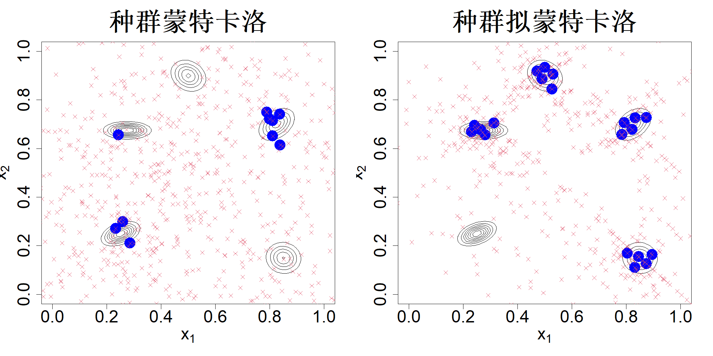

### 5.2.4 种群拟蒙特卡洛

考虑贝叶斯计算问题，我们希望从后验分布中获取样本 $D=\{\boldsymbol{x}_i\}_{i=1}^{n}$：

$$
f(\boldsymbol{x})=\frac{h(\boldsymbol{x})}{Z}
$$

其中 $h(\boldsymbol{x})$ 为未归一化的后验密度（似然函数与先验的乘积），$Z=\int h(\boldsymbol{x})\mathrm{d}\boldsymbol{x}$ 为归一化常数。由于计算 $Z$ 需要求解高维积分，通常采用马尔可夫链蒙特卡洛（MCMC）方法完成采样，该方法无需获知 $Z$。马尔可夫链蒙特卡洛生成的样本存在相关性，因此需要大量样本才能收敛到目标分布。假设我们已得到该大规模样本 $\{\boldsymbol{X}_i\}_{i=1}^{N}$。为降低存储开销与后续计算量，通常会采用抽稀策略减少样本数量。该操作一般是从马尔可夫链蒙特卡洛链中每隔 $k$ 个样本选取一个（例如取 $k=10$）。借助支撑点方法（马克和约瑟夫，2018b）显然可以得到质量高得多的抽稀样本。但该方法需要取自未归一化后验分布的 $N$ 个样本，当 $h(\boldsymbol{x})$ 的计算成本很高时，该过程的开销有时会很大。

假设对 $h(\boldsymbol{x})$ 的评估成本很高，因此我们无法获得大规模的马尔可夫链蒙特卡罗（MCMC）样本。在 4.6.1 节中，我们采用最小能量设计（MED）来解决该问题。然而，与支撑点不同，最小能量设计无法保证得到规模为 $n$ 的最优样本。因此，相较于最小能量设计，使用支撑点可以得到对目标密度效果好得多的近似结果。为求解支撑点，我们需要求解如下优化问题：

$$
\min_{D}\left\{\frac{2}{n}\sum_{i=1}^{n}\int \|\boldsymbol{x}_i-\boldsymbol{X}\|\frac{h(\boldsymbol{X})}{Z}\mathrm{d}\boldsymbol{X}-\frac{1}{n^2}\sum_{i=1}^{n}\sum_{j=1}^{n}\|\boldsymbol{x}_i-\boldsymbol{x}_j\|\right\}
$$

遗憾的是，归一化常数 $Z$ 无法像在最小能量设计中那样从目标函数中分离出来，因此该优化问题难以直接求解。

假设我们能够从建议密度 $q(\boldsymbol{x})$ 中获取大样本。那么，上述优化问题可以写为：

$$
\min_{D}\left\{\frac{2}{n}\sum_{i=1}^{n}\int \|\boldsymbol{x}_i-\boldsymbol{X}\|\frac{h(\boldsymbol{X})}{Zq(\boldsymbol{X})}q(\boldsymbol{X})\mathrm{d}\boldsymbol{X}-\frac{1}{n^2}\sum_{i=1}^{n}\sum_{j=1}^{n}\|\boldsymbol{x}_i-\boldsymbol{x}_j\|\right\}
$$

其中

$$
Z=\int h(\boldsymbol{X})\mathrm{d}\boldsymbol{X}=\int\frac{h(\boldsymbol{X})}{q(\boldsymbol{X})}q(\boldsymbol{X})\mathrm{d}\boldsymbol{X}.
$$

设 $\boldsymbol{X}_1,\dots,\boldsymbol{X}_N \sim q(\boldsymbol{X})$。于是我们可以求解如下问题：

$$
\min_{D}\left\{\frac{2}{n}\sum_{i=1}^{n}\sum_{j=1}^{N}\|\boldsymbol{x}_i-\boldsymbol{X}_j\|w_j-\frac{1}{n^2}\sum_{i=1}^{n}\sum_{j=1}^{n}\|\boldsymbol{x}_i-\boldsymbol{x}_j\|\right\}
\tag{5.17}
$$

式中 $w_j$ 为重要性权重，定义为

$$
w_j=\frac{h(\boldsymbol{X}_j)/q(\boldsymbol{X}_j)}{\sum_{j=1}^{N}h(\boldsymbol{X}_j)/q(\boldsymbol{X}_j)}
$$

黄等人（2022）将式 (5.17) 得到的最优样本称为重要性支撑点（ISP）。

尽管式 (5.17) 可以高效求解，但在高维条件下寻找合适的重要性采样提议分布 $q(\boldsymbol{X})$ 并非易事。为此，黄等人（2022）提出将该思路融入种群蒙特卡洛（PMC）框架（卡佩等人，2004）。种群蒙特卡洛迭代执行三个步骤。算法以 $K$ 个样本作为初始值，我们可以在每个样本处构建一个正态分布，由此得到 $K$ 个提议分布：$q_1(\boldsymbol{X}),\dots,q_K(\boldsymbol{X})$。第一步为采样：从每一个提议分布中抽取 $J$ 个样本，总共得到 $KJ$ 个样本。第二步为加权：为全部样本计算重要性权重。最后一步为自适应更新：基于重要性权重，对 $KJ$ 个样本进行重采样，得到 $K$ 个新样本。该过程循环执行 $T$ 步，完整流程见算法 1。利用这些带权重的样本，我们可以通过下式对积分 $I=\int h(x)f(x)\mathrm{d}x$ 进行估计：

$$
\widehat{I}^{PMC}=\frac{1}{TKJ}\sum_{t=1}^{T}\sum_{k=1}^{K}\sum_{j=1}^{J}w_{k,j}^{(t)}h(x_{k,j}^{(t)})/\widehat{Z}
$$

其中 $\widehat{Z}=\sum_{t=1}^{T}\sum_{k=1}^{K}\sum_{j=1}^{J}w_{k,j}^{(t)}/TKJ$。

> **算法 1**：种群蒙特卡洛
> - **目标分布**：$f=h/Z$，其中 $Z$ 为未知归一化常数。
> - **初始化**：为初始建议分布设置参数 $\{q^{(1)}_k=\mathcal{N}(\cdot|\mu^{(1)}_k,\Sigma)\}_{k=1}^K$。对 $t=1,\dots,T$ 执行：
>   - **采样**：从每个建议分布 $k=1,\dots,K$ 中抽取 $J$ 个样本 $$x^{(t)}_{k,j}\sim q^{(t)}_k,\quad j=1,\dots,J,\quad k=1,\dots,K$$ 由此共生成 $KJ$ 个模拟样本。
>   - **加权**：计算确定性混合权重 $$w^{(t)}_{k,j}=\frac{h(x^{(t)}_{k,j})}{K^{-1}\sum_{i=1}^Kq^{(t)}_i(x^{(t)}_{k,j}|\mu^{(t)}_i,\Sigma)},\quad j=1,\dots,J,\quad k=1,\dots,K$$ 并按如下方式归一化权重 $$\overline{w}^{(t)}_{k,j}=\frac{w^{(t)}_{k,j}}{\sum_{i=1}^K\sum_{l=1}^Jw^{(t)}_{i,l}}$$
>   - **自适应更新**：执行重采样更新建议分布中心 $$\mu^{(t+1)}_k\stackrel{\text{iid}}{\sim}\sum_{k=1}^K\sum_{j=1}^J\overline{w}^{(t)}_{k,j}\delta_{x^{(t)}_{k,j}},\quad k=1,\dots,K$$
> - **返回**：$\{(x^{(t)}_{k,j},w^{(t)}_{k,j})\}_{t=1}^T{}_{k=1}^K{}_{j=1}^J$，其中 $w^{(t)}_{k,j}$ 为未归一化权重。

黄等人（2022）的核心思路是在式 (5.17) 的自适应步骤中采用重要性支持点重采样。这 $K$ 个支持点能够更好地表征 $KJ$ 个样本，从而为新的提议分布提供更优质的中心点。他们将这套改进后的方法命名为种群拟蒙特卡洛（PQMC）。黄等人（2022）还针对采样与加权步骤提出了若干优化方案，本文在此不再赘述具体细节。

举个例子，考虑如下混合正态分布：

$$
f(x)=\frac{1}{5}\sum_{i=1}^{5}\mathcal{N}(\boldsymbol{x};\mu_i,\boldsymbol{\Sigma}_i)
$$

其中 $\mu_1=(0.250,0.250)'$，$\mu_2=(0.500,0.900)'$，$\mu_3=(0.825,0.700)'$，$\mu_4=(0.275,0.675)'$，$\mu_5=(0.850,0.150)'$，$\boldsymbol{\Sigma}_1=40^{-2}[2,0.6;0.6,1]$，$\boldsymbol{\Sigma}_2=40^{-2}[2,-0.4;-0.4,2]$，$\boldsymbol{\Sigma}_3=40^{-2}[2,0.8;0.8,2]$，$\boldsymbol{\Sigma}_4=40^{-2}[3,0;0,0.5]$，$\boldsymbol{\Sigma}_5=40^{-2}[2,-0.1;-0.1,2]$。令 $K=20$，$J=10$，$T=4$。该设置下总共需要进行 800 次密度求值。图 5.9 展示了种群蒙特卡洛（采用多项式重采样）与种群拟蒙特卡洛的样本以及最终重采样得到的中心点集合。可以看到，相较于种群蒙特卡洛，种群拟蒙特卡洛的样本与提议中心点很好地分布在高密度区域。因此，种群拟蒙特卡洛得到的加权样本质量远高于种群蒙特卡洛。

> **图 5.9**：该混合正态示例中，来自种群蒙特卡洛（左图）与种群拟蒙特卡洛（右图）的 800 个样本（红色叉号）以及最终的候选中心集合（蓝色实心圆）

{width=67%}