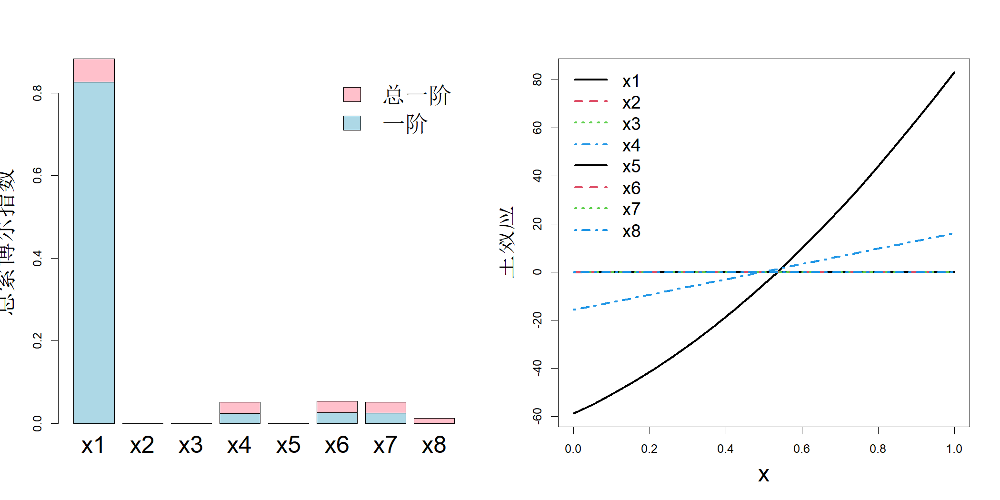

# 6 筛选设计

稀疏性在绝大多数系统中都十分常见，也就是说，即便一个系统包含数百个因子，但其中只有少数因子会对输出结果产生重要影响。在前两章中，我们学习了一类试验设计，这类设计可以覆盖全部因子构成的空间，而不考虑各个因子效应的大小。但倘若我们能够事先知晓哪些是重要因子，就可以合理调配资源，仅针对重要因子所构成的空间开展试验。我们之前介绍过最大投影设计，该设计通过对所有可能情况取平均，保证在低维子空间上具备良好的投影性质。例如，图 4.11 展示了一个 5 因子、50 次试验的最大投影设计。该设计在所有二维子空间上都能给出尚可的投影效果，但也做出了一定妥协。倘若我们事先就知道只有 $x_4$ 和 $x_5$ 是重要因子，那么试验效果还可以大幅提升。本章将介绍能够快速识别重要因子的试验设计方法，即筛选设计。

## 6.1 敏感性分析

在开发筛选设计之前，我们首先需要了解如何量化因子的重要性。若函数为线性形式，即 $h(x) = \beta_0+\beta_1x_1+\dots+\beta_px_p$，在各 $x_i$ 的变异程度相同的前提下，可通过 $|\beta_i|$ 轻松量化各个因子的重要性。但当函数为非线性时，该工作就不再简单。下面将介绍两种量化因子重要性的方法：一种基于方差，另一种基于导数。

### 6.1.1 基于方差的灵敏度测度

索博尔（1990，1993）提出了基于方差的灵敏度指标，用于衡量因子的重要程度。为求解该指标，首先利用函数型方差分析对函数 $y=h(x)$（其中 $x\in[0,1]^p$）做分解：

$$
h(x)=h_0+\sum_{i=1}^{p}h_i(x_i)+\sum_{i<j}h_{ij}(x_i,x_j)+\dots+h_{12\dots p}(x_1,\dots,x_p)
\tag{6.1}
$$

为保证分解的唯一性，需满足条件：

$$
\int h_I(\boldsymbol{x}_I)\mathrm{d}x_k=0,\quad\forall\,k\in I
\tag{6.2}
$$

利用式 (6.2)，不难得到总体均值为

$$
h_0=\int h(\boldsymbol{x})\mathrm{d}\boldsymbol{x}
$$

第 $i$ 个主效应为

$$
h_i(x_i)=\int h(\boldsymbol{x})\mathrm{d}x_{\sim i}-h_0
$$

$x_i$ 与 $x_j$ 之间的二因子交互效应为

$$
h_{ij}(x_i,x_j)=\int h(\boldsymbol{x})\mathrm{d}\boldsymbol{x}_{\sim i,\sim j}-h_i(x_i)-h_j(x_j)-h_0
$$

依此类推，其中记号 $x_{\sim i}$ 表示除 $x_i$ 之外的全部变量。当 $I_1\neq I_2$ 时，有

$$
\int h_{I_1}(\boldsymbol{x}_{I_1})h_{I_2}(\boldsymbol{x}_{I_2})\mathrm{d}\boldsymbol{x}=0
$$

因此式 (6.1) 中的所有项两两正交。于是

$$
\int h^2(\boldsymbol{x})\mathrm{d}\boldsymbol{x}=h_0^2+\sum_{i=1}^{p}\int h_i^2(x_i)\mathrm{d}x_i+\dots+\int h_{12\dots p}^2(x_1,\dots,x_p)\mathrm{d}\boldsymbol{x}
$$

记

$$
V=\int h^2(\boldsymbol{x})\mathrm{d}\boldsymbol{x}-h_0^2,\quad V_I=\int h_I^2(\boldsymbol{x}_I)\mathrm{d}\boldsymbol{x}_I
$$

则

$$
V=\sum_{i=1}^{p}V_i+\sum_{i<j}V_{ij}+\dots+V_{12\dots p}
$$

该式将总方差分解为由主效应、二因子交互效应等贡献的方差之和，与传统方差分析（ANOVA）形式一致。因此 $S_I=V_I/V$ 代表 $x_I$ 所能解释的 $h(\cdot)$ 的变异占比。该指标类似于线性回归中用于评价整体拟合效果的 $R^2$，但此处通过一组指标量化单个效应或一组效应的重要程度，这类指标被称为索博尔灵敏度指数。特别地，

$$
S_i=\frac{V_i}{V},\quad i=1,\dots,p
\tag{6.3}
$$

称为一阶索博尔灵敏度指数。

$S_i$ 数值较大，代表 $x_i$ 对输出的影响较大。不过，即便 $S_i$ 数值很小，我们也不能忽略 $x_i$。这是因为尽管 $x_i$ 的主效应较小，但它与其他因素之间可能存在不可忽视的交互效应。因此，为量化 $x_i$ 的重要程度，应当把所有包含 $x_i$ 的方差项相加，得到总方差（本间和萨泰利，1996）：

$$
V_i^{\text{tot}}=V_i+\sum_{j\neq i}V_{ij}+\dots
$$

不难看出，上式等价于：

$$
V_i^{\text{tot}}=V-V_{\sim i}
$$

据此可定义索博尔总指数：

$$
T_i=\frac{V_i^{\text{tot}}}{V}=1-\frac{V_{\sim i}}{V}
\tag{6.4}
$$

如果 $T_i$ 数值很小，则可以判定该因素不重要。

索博尔指数的计算并不简单，因为其涉及高维积分。蒙特卡洛方法常用于高维积分计算。首先从 $p$ 维均匀分布中抽取 $m$ 个随机向量：

$$
\boldsymbol{a}_i\stackrel{\text{iid}}{\sim}\mathcal{U}[0,1]^p,\;i=1,\dots,m
$$

这等价于从一元均匀分布中抽取 $mp$ 个样本 $\{a_{ij}\}$，其中 $i=1,\dots,m$，$j=1,\dots,p$。我们将所有样本整理为矩阵 $\boldsymbol{A}=(\boldsymbol{a}'_1,\dots,\boldsymbol{a}'_m)'$，该矩阵可看作一个 $m\times p$ 的随机设计矩阵。

总体均值的蒙特卡洛估计可按如下方式得到：

$$
\widehat{h}_0=\frac{1}{m}\sum_{i=1}^{m}h(\boldsymbol{a}_i)
$$

根据强大数定律，该估计会以 $\mathcal{O}(1/\sqrt{m})$ 的收敛速度收敛到真实值 $h_0$。上一章介绍过的拟蒙特卡洛方法可实现接近 $\mathcal{O}(1/m)$ 的收敛速度，该方法同样可在此处使用。主效应的蒙特卡洛估计可由下式求得：

$$
\widehat{h}_i(x_i)=\frac{1}{m}\sum_{j=1}^{m}h(a_{j1},\dots,x_i,\dots,a_{jp})-\widehat{h}_0
$$

同理，也可以计算高阶交互效应。

总方差 $V=\int h^2(\boldsymbol{x})\mathrm{d}\boldsymbol{x} - h_0^2=\int\{h(\boldsymbol{x})-h_0\}^2\mathrm{d}\boldsymbol{x}$ 可估计为

$$
\widehat V=\frac{1}{m-1}\sum_{i=1}^{m}\{h(\boldsymbol{a}_i)-\widehat h_0\}^2
\tag{6.5}
$$

同理，$V_1=\int h_1^2(x_1)\mathrm{d}x_1$ 的无偏估计可以写为

$$
\begin{align*}
\widehat V_1&=\frac{1}{m-1}\sum_{i=1}^{m}\widehat h_1^2(a_{i1})\\
&=\frac{1}{m-1}\sum_{i=1}^{m}\left(\frac{1}{m}\sum_{j=1}^{m}h(a_{i1},a_{j2},\dots,a_{jp})-\widehat h_0\right)^2
\end{align*}
$$

$\widehat V_2,\dots,\widehat V_p$ 可按同样方式得到。上述每一个估计都需要对 $h(\cdot)$ 做 $m^2$ 次求值，当 $m$ 较大时计算成本很高。因此，需要效率更高的估计方法来计算主效应与高阶交互效应的方差。索博尔（1993）提出了若干新颖的求解方法，这类方法也被称作冻结‑选取法（达·维加等人，2021）。在介绍这些方法之前，我们先利用期望算子与方差算子重新书写各指标。

主效应可以写为

$$
\begin{align*}
h_i(x_i)&=\int h(\boldsymbol{x})\mathrm{d}\boldsymbol{x}_{\sim i}-h_0\\
&=\mathrm{E}\{h(\boldsymbol{x})|\boldsymbol{x}_i\}-\mathrm{E}\{h(\boldsymbol{x})\}
\end{align*}
$$

于是，

$$
\begin{align*}
V_i=\int h_i^2(x_i)\mathrm{d}x_i
=\mathrm{var}\{h_i(x_i)\}
=\mathrm{var}\{\mathrm{E}[h(\boldsymbol{x})|\boldsymbol{x}_i]\}
\end{align*}
$$

简化计算的核心思路是利用条件方差公式交换期望与方差算子：

$$
\mathrm{var}\{h(\boldsymbol{x})\}=\mathrm{var}\{\mathrm{E}[h(\boldsymbol{x})|\boldsymbol{x}_i]\}+\mathrm{E}\{\mathrm{var}[h(\boldsymbol{x})|\boldsymbol{x}_i]\}
$$

因此，

$$
V_i=V-\mathrm{E}\{\mathrm{var}[h(\boldsymbol{x})|\boldsymbol{x}_i]\}
$$

假设我们有两次函数求值 $h(\boldsymbol{a})$ 和 $h(\boldsymbol{b})$，其中 $\boldsymbol{a},\boldsymbol{b}\stackrel{\text{iid}}{\sim}\mathcal{U}[0,1]^p$，则方差的无偏估计为

$$
\begin{align*}
\widehat{\mathrm{var}}\{h(\boldsymbol{x})\}&=\left(h(\boldsymbol{a})-\frac{h(\boldsymbol{a})+h(\boldsymbol{b})}{2}\right)^2+\left(h(\boldsymbol{b})-\frac{h(\boldsymbol{a})+h(\boldsymbol{b})}{2}\right)^2\\
&=\frac12\{h(\boldsymbol{a})-h(\boldsymbol{b})\}^2
\end{align*}
$$

若需要固定 $x_i$ 的取值来估计条件方差，则将向量 $\boldsymbol{b}$ 的第 $i$ 个分量替换为 $a_i$，记该向量为 $\boldsymbol{b}^{(i)}$。于是

$$
\widehat{\mathrm{var}}\{h(\boldsymbol{x})|\boldsymbol{x}_i=a_i\}=\frac12\{h(\boldsymbol{a})-h(\boldsymbol{b}^{(i)})\}^2
$$

对多组样本求取方差估计再取平均，可以得到 $\mathrm{E}\{\mathrm{var}[h(\boldsymbol{x})|\boldsymbol{x}_i]\}$ 的更优估计。令 $\boldsymbol b_i\stackrel{\text{iid}}{\sim}\mathcal{U}[0,1]^p$，$i=1,\dots,m$，将其按行构成矩阵 $\boldsymbol B=(\boldsymbol b_1',\dots,\boldsymbol b_m')'$。已知已有函数求值结果 $h(\boldsymbol A)=(h(\boldsymbol{a}_1),\dots,h(\boldsymbol{a}_m))'$，该结果曾用于计算式 (6.5) 中的总方差。接下来进行一组新的函数求值 $h(\boldsymbol B^{(\boldsymbol{A}_i)})=\left(h(\boldsymbol{b}_1^{(i)}),\dots,h(\boldsymbol{b}_m^{(i)})\right)'$，其中 $\boldsymbol b_j^{(i)}$ 是将向量 $\boldsymbol b_j$ 的第 $i$ 个分量替换为 $\boldsymbol a_j$ 的第 $i$ 个分量得到的向量，即

$$
\boldsymbol B^{(\boldsymbol{A}_i)}=
\begin{bmatrix}
b_{11}&\cdots&a_{1i}&\cdots&b_{1p}\\
\vdots&\vdots&\vdots&\vdots&\vdots\\
b_{m1}&\cdots&a_{mi}&\cdots&b_{mp}
\end{bmatrix},\quad i=1,\dots,p
$$

也就是说，$\boldsymbol B^{(\boldsymbol{A}_i)}$ 是将矩阵 $\boldsymbol B$ 的第 $i$ 列替换为矩阵 $\boldsymbol A$ 的第 $i$ 列后得到的矩阵。

然后，第 $i$ 个主效应的方差可通过下式估计：

$$
\widehat{V}_i=\widehat{V}^{-1}\frac{1}{2m}\sum_{j=1}^m\left\{h(\boldsymbol{a}_j)-h(\boldsymbol{b}_j^{(i)})\right\}^2=\widehat{V}^{-1}\frac{1}{2m}\|h(\boldsymbol{A})-h(\boldsymbol{B}^{(\boldsymbol{A}_i)})\|^2
\tag{6.6}
$$

该方法由扬森（1999）提出，萨尔泰利等人（2010）对其做了进一步完善。该计算仅需 $2m$ 次函数求值。因此，全部因子的一阶索博尔指数可通过 $m(p+1)$ 次函数求值完成计算，计算开销相当合理。

同理，为计算索博尔总效应指数，首先将 $V_i^{\text{tot}}$ 写为：

$$
\begin{align*}
V_i^{\text{tot}} &= V - V_{\sim i}\\
&= \mathrm{var}\{h(\boldsymbol{x})\} - \mathrm{var}\{\mathrm{E}[h(\boldsymbol{x})|\boldsymbol{x}_{\sim i}]\}\\
&= \mathrm{E}\{\mathrm{var}[h(\boldsymbol{x})|\boldsymbol{x}_{\sim i}]\}.
\end{align*}
$$

为求解该条件方差，需要固定向量 $\boldsymbol{a}_j$ 除第 $i$ 个分量以外的所有取值，并将其第 $i$ 个分量替换为 $\boldsymbol{b}_j$ 的第 $i$ 个分量，记该向量为 $\boldsymbol{a}_j^{(i)}$。接下来开展新一轮函数求值：$h(\boldsymbol{A}^{(\boldsymbol{B}_i)}) = (h(\boldsymbol{a}_1^{(i)}),\dots,h(\boldsymbol{a}_m^{(i)}))'$，其中 $\boldsymbol{A}^{(\boldsymbol{B}_i)}$ 表示将矩阵 $\boldsymbol{A}$ 的第 $i$ 列替换为矩阵 $\boldsymbol{B}$ 的第 $i$ 列后得到的矩阵。由此可得到估计式（扬森，1999）：

$$
\widehat{V}_i^{\text{tot}}=\frac{1}{2m}\sum_{j=1}^{m}\{h(\boldsymbol{a}_j)-h(\boldsymbol{a}_j^{(i)})\}^2=\frac{1}{2m}\|h(\boldsymbol{A})-h(\boldsymbol{A}^{(\boldsymbol{B}_i)})\|^2
\tag{6.7}
$$

因此，对全部 $p$ 个输入因子求解索博尔总效应指数，共需要 $m(p+1)$ 次函数求值。目前还有许多其他高效算法可用于求解一阶与总效应敏感性指数，相关细节可参阅萨尔泰利（2008）以及达·维加等人（2021）的著作。

举个例子，考虑模拟钻孔水流的函数（莫里斯等人，1993）：

$$
y=\frac{2\pi x_3(x_4-x_6)}{\log\left(\frac{x_2}{x_1}\right)\left[1+\frac{2x_7x_3}{\log(x_2/x_1)x_1^2x_8}+\frac{x_3}{x_5}\right]}
$$

其中输入变量为：钻孔半径 $x_1$，取值区间 $[0.05, 0.15]\mathrm{m}$；影响半径 $x_2$，取值区间 $[100, 50000]\mathrm{m}$；上层含水层透射率 $x_3$，取值区间 $[63070, 115600]\mathrm{m^2/yr}$；上层含水层测压水头 $x_4$，取值区间 $[990, 1110]\mathrm{m}$；下层含水层透射率 $x_5$，取值区间 $[63.1, 116]\mathrm{m^2/yr}$；下层含水层测压水头 $x_6$，取值区间 $[700, 820]\mathrm{m}$；钻孔长度 $x_7$，取值区间 $[1120, 1680]\mathrm{m}$；钻孔水力传导系数 $x_8$，取值区间 $[9855, 12045]\mathrm{m/yr}$。输出响应 $y$ 为水流量，单位为 $\mathrm{m^3/yr}$。一阶索博尔指数与总索博尔指数可通过 R 语言 sensitivity 程序包中的 soboljansen 函数计算得到（约斯等人，2024）。本文对矩阵 A、B 均采用 10000 个蒙特卡洛采样点。图 6.1 左侧面板以柱状图形式展示了估算得到的总索博尔指数。每根柱子分为两部分：浅蓝色代表 $S$（用于量化主效应），粉色代表 $T-S$（用于量化交互效应）。可以看出，钻孔半径 $x_1$ 是最重要的影响因子；因子集合 $\{x_4, x_6, x_7, x_8\}$ 具备不可忽略的影响，而 $\{x_2, x_3, x_5\}$ 的影响可以忽略。

> **图 6.1**：（左）钻孔函数的索博尔总指数。一阶指数以浅蓝色显示，总指数与一阶指数的差值以粉色显示。（右）主效应图

{width=67%}

对于计算密集型模型，基于蒙特卡洛方法估计索博尔指数的计算成本会很高。一种降低计算负担的方法是，先采用空间填充设计对计算机模型进行求值，再利用高斯过程模型对其做近似处理。实际上，若采用乘积高斯相关函数，主效应与一阶索博尔指数的解析表达式可以很容易推导得到（奥克利和奥黑根，2004；陈等人，2005）。但对于高阶灵敏度指数，对应的计算公式会变得较为繁杂。在拟合得到高斯过程模型后，使用蒙特卡洛方法计算灵敏度指数会简便得多。针对钻孔函数，我们采用样本量 $n=80$ 的最大投影设计开展试验，并借助 rkriging 工具包拟合了带有高斯相关函数的高斯过程模型（黄和约瑟夫，2024）。估计得到的主效应绘制于图 6.1 的右侧子图。该图的可视化结果与前文计算得到、展示在同一幅图左侧子图中的一阶指数保持一致。不过该方法存在若干局限：（1）空间填充设计在估计索博尔指数时未必高效或最优；（2）针对高维问题，可能需要规模极大的空间填充设计；（3）高斯过程模型对高维问题的拟合效果可能并不理想。受限于上述不足，本章后续将构建专门面向灵敏度指数估计的筛选设计。