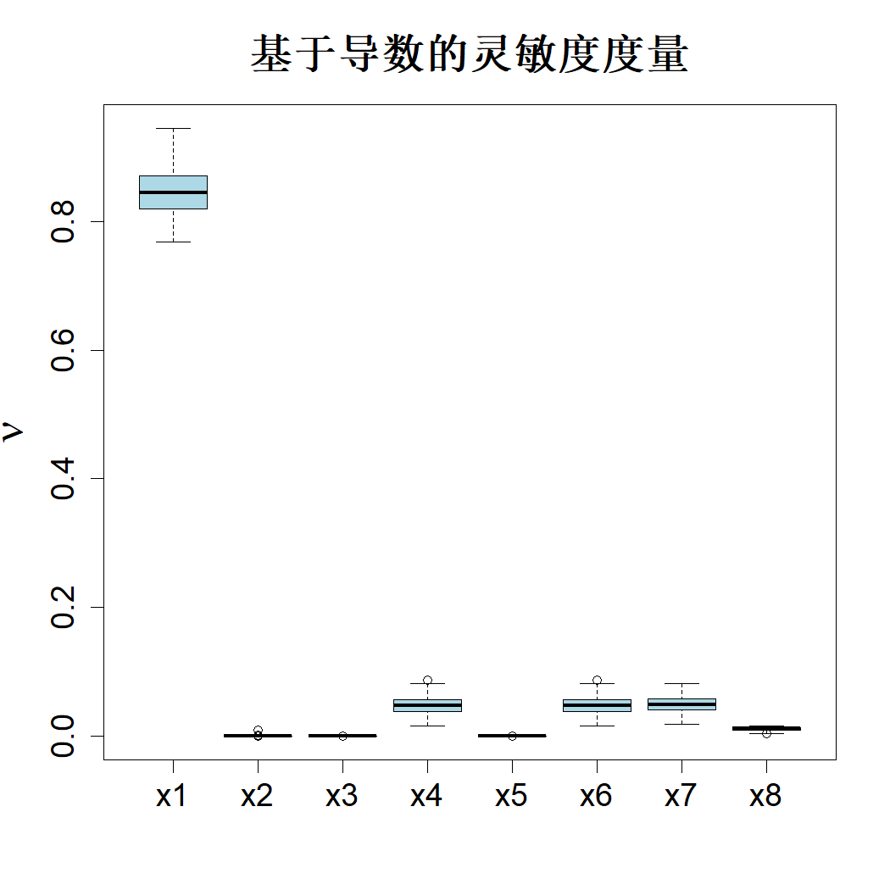
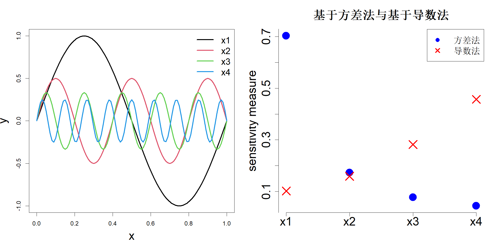

### 6.1.2 基于导数的灵敏度度量

函数 $h(\boldsymbol{x})$ 在 $x_i=x_i^0$ 处关于 $x_i$ 的局部灵敏度，可通过在 $x_i=x_i^0$ 处求导得到的偏导数 $\partial h(\boldsymbol{x})/\partial x_i$ 进行度量。基于该局部灵敏度，可定义一种全局度量指标（索博尔与库切连科，2009）：

$$
\nu_i=\int_{[0,1]^p}\left(\frac{\partial h(\boldsymbol{x})}{\partial x_i}\right)^2\mathrm{d}\boldsymbol{x}
\tag{6.8}
$$

索博尔和库切连科（2009）给出了该指标与索博尔总效应指数之间的如下关系：

$$
T_i \le \frac{\nu_i}{\pi^2 V}
\tag{6.9}
$$

若 $\nu_i=0$，则 $T_i=0$。因此，不重要因子的 $\nu_i\approx0$，可利用该性质筛选剔除不重要因子。复杂模型的导数可采用有限差分法求解，并可在单位超立方体的多个采样点上重复计算。设 $\boldsymbol{a}_j \stackrel{\text{iid}}{\sim} U(0,1)^p$，其中 $j=1,\dots,m$。则 $\nu_i$ 可通过下式估计：

$$
\widehat{\nu}_i=\frac{1}{m}\sum_{j=1}^{m}\left(\frac{\widehat{\partial h(\boldsymbol{x})}}{\partial x_i}\right)^2_{\boldsymbol{x}=\boldsymbol{a}_j}
$$

假定至少存在一个 $\widehat{\nu}_i>0$，可采用如下归一化形式量化因子的重要度：

$$
\overline{\nu}_i=\frac{\widehat{\nu}_i}{\sum_{j=1}^{p}\widehat{\nu}_j}
$$

再次考察钻孔函数。假设我们取 $m=4$ 个样本。可借助 R 语言 sensitivity 程序包中的 delsa 函数完成该估计（约斯等人，2024）。图 6.2 以箱线图展示了 100 次重复试验得到的灵敏度估计结果。可以看到，该方法正确识别出 $\{x_2,x_3,x_5\}$ 为非重要因子。由于仅使用 4 个样本，该计算的运算速度也远快于总索博尔指数的计算。

> **图 6.2**：钻孔函数的基于导数的灵敏度指数，该估计过程在 $[0,1]^8$ 范围内采用四类样本重复执行 100 次

{width=33%}

尽管对于钻孔函数而言，基于导数的灵敏度分析方法可以正确识别出 $x_1$ 为最重要因子，但遗憾的是，一般情况下较大的 $\nu_i$ 并不代表因子 $i$ 具备重要性。为理解这一点，考虑一个包含四个因子的简单可加函数：

$$
h(x)=\sum_{k=1}^{4}\frac{1}{k}\sin\left(\{k^2+1\}\pi x_k\right)
$$

该函数的图像见图 6.3 左图。四个因子的索博尔总灵敏度指标与基于导数的灵敏度度量绘制于该图的右图。可以看到，索博尔总指标判定 $x_1$ 为最重要因子，$x_4$ 为最不重要因子；而基于导数的度量给出的因子重要性排序则完全相反。从函数图像中不难看出原因：模型输出对 $x_1$ 变化表现平滑，但影响幅度很大；而对 $x_4$ 的变化波动剧烈，但其整体变异程度很小。该实例表明：基于导数的灵敏度度量虽可用于因子筛选，但不能依据其结果对因子的重要性进行排序。

> **图 6.3**：（左）四维可加正弦函数图像；（右）四个因子对应的索博尔总指标与 $\nu_i$ 值

{width=67%}