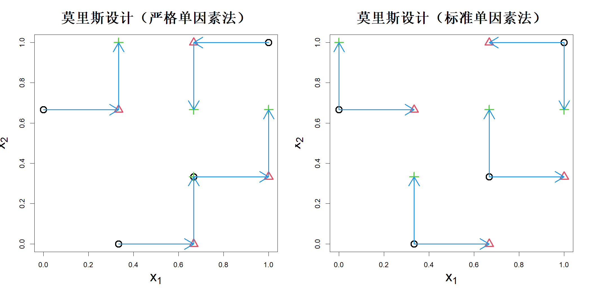
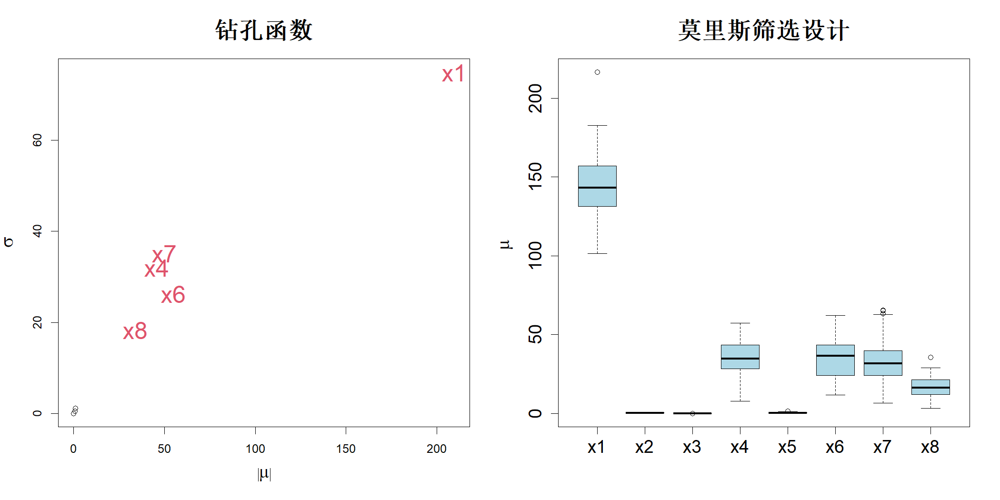

## 6.2 莫里斯筛选设计

图 6.1 所示钻孔函数的总索博尔指数通过 $10000\times(8+1)=90000$ 次函数求值计算得到。这样处理是可行的，因为钻孔函数的求值成本较低。但对于计算开销大的模型，则无法采用该方式。我们能否构建一种试验设计方法，仅通过少量函数求值就能识别出重要影响因子？莫里斯（1991）提出了一种基于单因素轮换（OFAT）设计的方法。一般而言，由于单因素轮换设计估计效率低下，且无法估计交互效应，在统计学文献中对其评价不高。不过莫里斯的思路是采用一组单因素轮换设计，以此克服上述部分缺陷。

莫里斯筛选法可说明如下：定义基本效应，通过单次变动一个因子来估计各因子的局部灵敏度。设 $\boldsymbol{x}_i(\Delta)=(x_1,\dots,x_i\pm\Delta,\dots,x_p)'$，其中 $\Delta$ 取正号或负号需满足 $x_i+\Delta\in[0,1]$ 或 $x_i-\Delta\in[0,1]$。则 $p$ 个基本效应定义为：

$$
d_i(\boldsymbol{x})=\frac{h(\boldsymbol{x}_i(\Delta))-h(\boldsymbol{x})}{\Delta},\quad i=1,\dots,p
$$

当 $\Delta \to 0$ 时，$d_i(\boldsymbol{x})$ 收敛于 $h(\boldsymbol{x})$ 的导数，这表明基于导数的灵敏度度量与莫里斯筛选法之间存在紧密联系。事实上，索博尔与库切连科（2009）提出的基于导数的度量正是受莫里斯方法启发得到。但由于莫里斯方法实际采用较大的 $\Delta$ 值，其计算结果是基于方差的方法与基于导数的方法之间的一种折中。

从具有 $L$ 个层级的规则网格 $\{0, 1/(L-1), \dots, 1\}^p$ 中随机选取 $m$ 个 $\boldsymbol{x}$，用于计算基本效应，其中 $\Delta$ 取 $1/(L-1)$ 的整数倍。图 6.4 左图展示了 $m=L=4$、$p=2$ 且 $\Delta=1/(L-1)$ 的算例。该示意图采用了丹尼尔（1973）分类中的“严格”单因子一次变动（OFAT）设计，每一次试验都基于上一次试验开展。也可采用该图右侧所示的“标准”单因子一次变动（OFAT）设计，所有变量调整均从标准基准试验出发（图中以黑色圆点表示）。实际应用中“严格”版本使用更为普遍（萨泰利，2008；达·韦加等人，2021）。

> **图 6.4**：莫里斯设计，左侧为严格单因素法，右侧为标准单因素法。箭头展示了单因素法的结构

{width=67%}

设 $d_i(j)$ 为变量 $x_i$ 在 $x=x_j$ 处的基本效应，其中 $j=1,\dots,m$。随后，我们可以计算下述汇总统计量以分析各因子的全局效应：

$$
\mu_i=\frac{1}{m}\sum_{j=1}^{m}d_i(j),\quad\sigma_i=\sqrt{\frac{1}{m-1}\sum_{j=1}^{m}\left(d_i(j)-\mu_i\right)^2}
$$

依据这两个统计量，可将因子效应划分为：（1）可忽略效应（$|\mu_i|$ 小且 $\sigma_i$ 小）；（2）线性可加效应（$|\mu_i|$ 大且 $\sigma_i$ 小）；（3）非线性效应和/或交互效应（$\sigma_i$ 大）。

坎波隆戈等人（2007）对 $d_i(j)$ 取绝对值，提出了另一个统计量：

$$
\mu_i^*=\frac{1}{m}\sum_{j=1}^{m}|d_i(j)|
\tag{6.10}
$$

该统计量与基于导数的灵敏度测度 $\int\left|\partial h(\boldsymbol{x})/\partial x_i\right|\mathrm{d}\boldsymbol{x}$ 相关。

再次考察钻孔函数。假设取 $L=m=4$，步长 $\Delta=3/(L-1)$。函数总调用次数为 $m(p+1)=36$。我们可以使用 R 语言 sensitivity 包中的 morris 函数（约斯等人，2024）生成试验设计并计算基本效应。$\mu^*$ 相对于 $\sigma$ 的散点图如图 6.5 左图所示。可以看到，该方法正确识别出 $x_1$ 为影响最大的因子，其次是 $\{x_7,x_4,x_6,x_8\}$。该方法仅需 36 次函数调用，而采用蒙特卡洛方法计算总索博尔指数需要 90000 次函数调用，效率十分突出。由于莫里斯筛选设计存在较强随机性，我们将该实验重复 100 次，结果以箱线图形式绘制在图 6.5 右图。可见该方法能够成功筛选出不重要因子 $\{x_2,x_3,x_5\}$。

> **图 6.5**：（左）钻孔函数的莫里斯筛选设计结果。（右）100 次重复实验得到的 $\mu^*$ 箱线图

{width=67%}

尽管莫里斯筛选法不像基于蒙特卡洛的索博尔设计那样具备强随机性，但该方法仍然存在随机性：用于单因素逐次试验（OFAT）的 $m$ 个基准点是从试验区域内随机选取的，并且单因素逐次试验中变量的调整顺序同样是随机的。这种随机性会生成空间填充特性较差的试验设计，不利于后续开展试验。坎波隆戈等人（2007）提出通过最大化各单因素逐次试验之间的距离来提升空间填充性能。两组单因素逐次试验之间的距离定义为两组试验所有样本点两两之间距离的总和。孙等人（2013）研究了其他可行的距离度量方式。但正如第 4 章中所讨论的，采用最大化最小距离或距离总和的方式，会将样本点推向试验区域边界，进而造成样本点投影效果变差。坎波隆戈等人（2011）提出采用索博尔点这类拟随机序列（详见下一章）作为基准运行点，搭配标准单因素逐次试验设计（该文献中将其称为径向设计），替代传统严格的单因素逐次试验设计。普霍尔（2009）尝试采用单纯形设计替代单因素逐次试验设计以改善投影效果，但该方法需要拟合线性模型来估计效应，会引入偏差。另一项针对莫里斯筛选设计的改进方案，即最大单因子逐次（MOFAT）试验设计，将在下一节展开详细阐述。