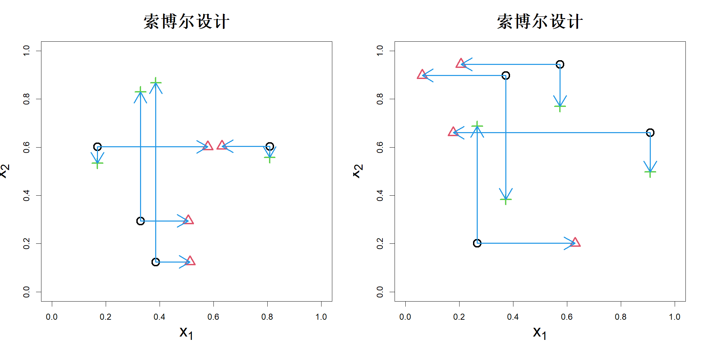
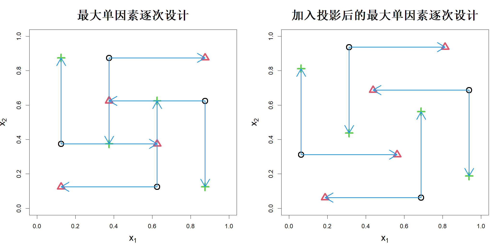
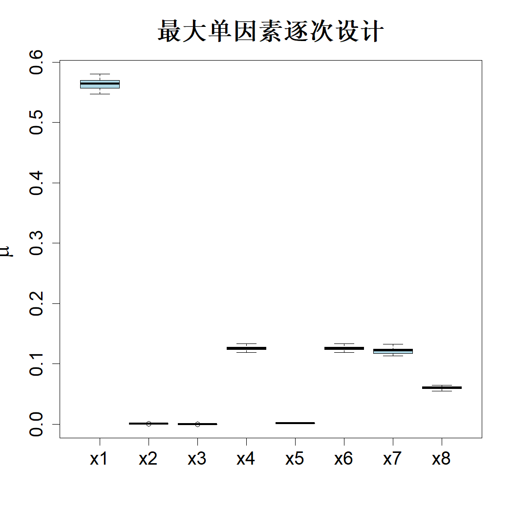

## 6.3 最大单因素逐次设计

肖等人（2023）指出，用于估计总索博尔指数的基于蒙特卡洛的索博尔设计可以看作是一组标准单因素轮换试验（OFAT）。如 6.1.1 节所述，为估计总索博尔指数，首先需要生成两个随机矩阵 $\boldsymbol{A}=(a_{ij})_{m\times p}$ 与 $\boldsymbol{B}=(b_{ij})_{m\times p}$，其中 $a_{ij}$、$b_{ij}$ 独立同分布服从均匀分布 $U(0,1)$。随后试验设计矩阵为：

$$
\boldsymbol{D}=\begin{bmatrix}\boldsymbol{A}\\\boldsymbol{A}^{(1)}\\\vdots\\\boldsymbol{A}^{(p)}\end{bmatrix}
\tag{6.11}
$$

式中 $\boldsymbol{A}^{(i)}$ 表示将矩阵 $\boldsymbol{A}$ 的第 $i$ 列替换为 $\boldsymbol{B}$ 的第 $i$ 列得到的矩阵，是前文所用记号 $\boldsymbol{A}^{(\boldsymbol{B}_i)}$ 的简写。提取 $\boldsymbol{A},\boldsymbol{A}^{(1)},\dots,\boldsymbol{A}^{(p)}$ 的第一行并组合为一套试验设计，即可得到第一组单因素轮换试验设计。同理，提取这些矩阵的第二行，得到第二组单因素轮换试验，以此类推。例如，取 $m=4$、$p=2$。图 6.6 展示了一套 12 次试验的两组实现，其中 $\boldsymbol{A}$、$\boldsymbol{A}^{(1)}$ 和 $\boldsymbol{A}^{(2)}$ 分别用黑色圆点、红色三角形与绿色加号表示，箭头标注出单因素轮换试验的结构。

> **图 6.6**：两种基于蒙特卡洛的索博尔设计实现。通过箭头展示单因素逐次变换（OFAT）结构

{width=67%}

尽管索博尔设计可以看作是单因素一次（OFAT）试验的集合，但它与莫里斯筛选设计存在若干区别：（1）莫里斯方法支持任意类型的单因素一次试验设计（严格型或标准型），而索博尔设计必须为标准型；（2）莫里斯设计始终由 $m$ 组单因素一次试验构成，而索博尔设计仅当对所有 $i$ 和 $j$ 均满足$\boldsymbol{A}_j\neq\boldsymbol{A}^{(i)}_j$时，才退化为 $m$ 组单因素一次试验，该条件在蒙特卡洛样本中恒成立（但拟随机样本不满足）；（3）莫里斯设计包含 $mp$ 个随机值，而索博尔设计需要两个大小为 $m\times p$ 的随机矩阵，因此拥有 $2mp$ 个随机值；（4）从构造形式来看，莫里斯设计的步长 $\Delta$ 始终为常数，而索博尔设计的步长 $\Delta$ 是变化的。

从图 6.6 可以明显看出，右侧面板的索博尔设计优于左侧面板展示的设计。因此，我们可以尝试采用一些优化技术改进索博尔设计。本文将介绍肖等人（2023）提出的方法。

由式 (6.7) 与 (6.10) 可见，$V_{\text{tot},i}$ 与 $\mu^*_i$ 均为用于近似若干期望的样本均值。索博尔（2001）采用蒙特卡洛样本计算该均值。因此，矩阵 $\boldsymbol A$ 与 $\boldsymbol A^{(i)}$ 的第 $i$ 列应当是取自区间 $[0,1]$ 的两组独立均匀样本。能够最小化与均匀分布偏差的规模为 $m$ 的最优均匀样本为 $\{0.5/m,1.5/m,\dots,(m-0.5)/m\}$（方和王，1993）。据此，我们可将 $\boldsymbol A$ 与 $\boldsymbol A^{(i)}$ 的第 $i$ 列取为该 $m$ 个数值的两组随机置换。该处理使 $\boldsymbol A$、$\boldsymbol A^{(i)}$（$i=1,\dots,k$）成为拉丁超立方设计（麦凯等人，1979）。

由于拉丁超立方设计存在众多可选方案，我们可以尝试选取能够提升重要因子识别能力的方案。一种可行思路是选取拉丁超立方设计，使总索博尔指数或 $\mu^*_i$ 最大化，因为二者数值越大，越有助于识别重要因子。但该方式依赖于底层响应曲面。由于开展实验前我们并不知晓响应曲面，因此实验设计应当做到无论响应曲面形式如何，都可以取得良好效果。为此，在评估某一设计的有效性时，我们可以假定该响应曲面是某一随机过程的一个实现。

假定 $h(\boldsymbol{x})$ 为布朗运动（张与阿普利，2014），满足

$$
\mathrm{E}\{h(\boldsymbol{u})-h(\boldsymbol{v})\}=0,\quad\mathrm{var}\{h(\boldsymbol{u})-h(\boldsymbol{v})\}=\tau^{2}\|\boldsymbol{u}-\boldsymbol{v}\|_{w}
\tag{6.12}
$$

其中 $\|\boldsymbol{u}-\boldsymbol{v}\|_{w}=\sum_{i=1}^{p}w_{i}(u_{i}-v_{i})^{2}$，且 $\sum_{i=1}^{p}w_{i}=1$，对 $i=1,\dots,p$ 有 $w_{i}\ge0$。布朗运动是 2.1.4 节所讨论高斯过程的一类特例，但其协方差函数是非平稳的。此处，$w_{i}$ 可看作第 $i$ 个因子的重要性度量。假设按照式 (6.11) 的试验方案开展试验，则由式 (6.7) 可得：

$$
\begin{align*}
\mathrm{E}(\widehat{V}_{i}^{\mathrm{tot}})&=\frac{1}{2m}\sum_{j=1}^{m}\mathrm{E}\{h(\boldsymbol{A}_{j})-h(\boldsymbol{A}_{j}^{(i)})\}^{2}\\
&=\frac{1}{2m}\sum_{j=1}^{m}\mathrm{var}\{h(\boldsymbol{A}_{j})-h(\boldsymbol{A}_{j}^{(i)})\}\\
&=\frac{\tau^{2}}{2m}\sum_{j=1}^{m}\|\boldsymbol{A}_{j}-\boldsymbol{A}_{j}^{(i)}\|_{w}\\
&=\frac{\tau^{2}\sqrt{w_{i}}}{2m}\sum_{j=1}^{m}|\boldsymbol{A}_{ji}-\boldsymbol{A}_{ji}^{(i)}|
\tag{6.13}
\end{align*}
$$

上式最后一步推导基于如下事实：矩阵 $\boldsymbol{A}$ 与 $\boldsymbol{A}^{(i)}$ 的第 $j$ 行仅在因子 $i$ 处存在差异，这是单因素逐次（OFAT）设计独有的性质。由于 $\widehat{T}_{i}$ 与 $\widehat{V}_{i}^{\mathrm{tot}}$ 成正比，我们可以通过最大化 $\sum_{j=1}^{m}|\boldsymbol{A}_{ji}-\boldsymbol{A}_{ji}^{(i)}|$ 实现索博尔总效应指数最大化，该求和项代表矩阵 $\boldsymbol{A}$ 与 $\boldsymbol{A}^{(i)}$ 第 $i$ 列之间的 $L_1$ 距离。定义最大单因素逐次（MOFAT）设计为试验方案 $\boldsymbol{D}$：对全部 $i=1,\dots,p$，最大化

$$
\sum_{j=1}^{m}|\boldsymbol{A}_{ji}-\boldsymbol{A}_{ji}^{(i)}|
$$

其中 $\boldsymbol{A}$、$\boldsymbol{A}^{(i)}$（$i=1,\dots,p$）均为拉丁超立方设计（LHD）。由该定义可以得到最大单因素逐次设计的如下最优性结论。

> **定理 6.1**：若响应曲面是布朗运动场的一个实现，其均值与方差函数由式 (6.12) 给出，则最大单因素逐次设计可使 $\widehat{V}_i^{\text{tot}}$（$i=1,\dots,p$）的期望值达到最大。

寻找最大单因素逐次设计需要对 $2mp$ 个变量（即矩阵 $\boldsymbol A$ 和 $\boldsymbol B$ 的元素）进行优化，当 $m$ 和 $p$ 较大时，该优化的计算成本会很高。该优化可按如下方式简化。定义如下变换：

$$
\psi_m(x)=x-\left\lfloor\frac{m}{2}\right\rfloor+mI\left(x<\frac{m+1}{2}\right)
\tag{6.14}
$$

其中 $\lfloor x\rfloor$ 表示不超过 $x$ 的最大整数，指示函数 $I\left(x<\frac{1+m}{2}\right)$ 在 $x<\frac{1+m}{2}$ 时取 1，否则取 0。现在，给定一个拉丁超立方设计 $\boldsymbol A$，利用 $B_{ij}=\psi_m(A_{ij})$ 构造矩阵 $\boldsymbol B$，其中 $\boldsymbol A$ 与 $\boldsymbol B$ 的 $m$ 个水平编码为 $\{1,2,\dots,m\}$。肖等人（2023）证明，通过这两个矩阵 $\boldsymbol A$ 与 $\boldsymbol B=\psi(\boldsymbol A)$ 构造得到式 (6.11) 中的设计 $\boldsymbol D$ 是一个最大单因素逐次设计。因此，唯一的计算开销来自构造设计 $\boldsymbol A$，对此我们可以使用最大最小距离拉丁超立方设计或最大投影拉丁超立方设计。

图 6.7 的左侧面板展示了一个 $m=4$、$p=2$ 的最大单因素逐次设计示例，该示例可通过 R 软件包 MOFAT 生成（肖和约瑟夫，2022）。可以看出，相较于图 6.4 中的莫里斯设计以及图 6.6 中的索博尔设计，最大单因素逐次设计能够以更优的方式对实验区域进行探索。

> **图 6.7**：最大单因素逐次设计（左侧）以及加入投影后的最大单因素逐次设计（右侧）。单因素逐次设计结构用箭头标出

{width=67%}

最大单因素逐次设计中每个因子仅包含 $m$ 个水平：$\{0.5/m,1.5/m,\dots,(m-0.5)/m\}$。除因子筛选外，若还需要开展响应曲面建模，可按如下方式调整集合 $\boldsymbol{A}$ 与 $\boldsymbol{B}$ 中的取值，优化最大单因素逐次设计的投影性质：对于 $i=1,\dots,m$：

$$
x_i\leftarrow
\begin{cases}
x_i-\frac{0.25}{m},&x_i<0.5\\
x_i+\frac{0.25}{m},&x_i\ge0.5\\
x_i,&\text{其他}
\end{cases}
\tag{6.15}
$$

$$
x_i\leftarrow
\begin{cases}
x_i+\frac{0.25}{m},&x_i<0.5\\
x_i-\frac{0.25}{m},&x_i\ge0.5\\
x_i,&\text{其他}
\end{cases}
\tag{6.16}
$$

若集合 $\boldsymbol{A}$ 采用式 (6.15)，则集合 $\boldsymbol{B}$ 应当采用式 (6.16)，反之亦然。该选取可依据最大最小 $L_1$ 距离准则完成。调整后的最大单因素逐次设计如图 6.7 右侧子图所示。可以看到，此时两个因子均拥有 8 个水平，而原始设计仅为 4 个水平。

再次考察钻孔函数。我们取 $m=4$，因此最大单因素逐次设计需要 $4\times(8+1)=36$ 次运算。图 6.8 展示了 100 次重复实验得到的 $\mu^*$ 箱线图。可以看到，最大单因素逐次设计明确识别出变量 $\{x_1,x_4,x_6,x_7,x_8\}$ 为重要变量，$\{x_2,x_3,x_5\}$ 为非重要变量。最大单因素逐次设计几乎是确定性的，但最大单因素逐次软件包中使用的极大极小拉丁超立方设计存在非唯一性，由此带来了一定随机性。该结果与图 6.5 中莫里斯筛选设计的结果保持一致。不过，最大单因素逐次的结果波动要小得多，能够更为明确地区分重要变量与非重要变量。

> **图 6.8**：将最大单因素逐次设计应用于钻孔函数的实验结果。图中展示了经过 100 次重复实验得到的 $\mu^*$ 的箱线图

{width=33%}