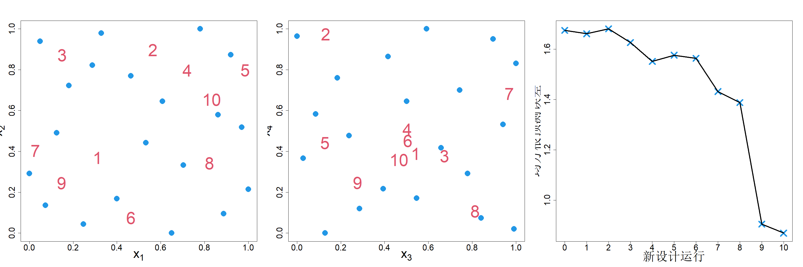
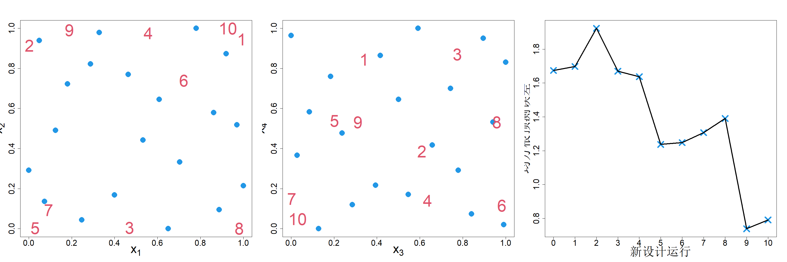

### 7.1.1 基于预测的序贯设计

假设我们已按照试验设计 $D_n=\{\boldsymbol{x}_1,\dots,\boldsymbol{x}_n\}$ 依次完成 $n$ 次试验，其中 $\boldsymbol{x}_i\in\mathcal{X}=[0,1]^p$，并观测得到数据 $\boldsymbol{y}_n=(y_1,\dots,y_n)'$。我们的目标是最优选择下一次试验的试验点，即 $\boldsymbol{x}_{n+1}$。记 $y=h(\boldsymbol{x})$ 为计算机模型。对底层函数假设高斯过程先验：$h(\boldsymbol{x})\sim\mathrm{GP}(\mu,\tau^2R(\cdot))$。若我们在下一次试验中观测到 $y_{n+1}$，则后验分布为：

$$
h(\boldsymbol{x})|D_{n+1},\boldsymbol{y}_{n+1},\boldsymbol{\theta}\sim\mathcal{N}\left(\widehat{y}_{n+1}(\boldsymbol{x};\boldsymbol{\theta}),\,s^2_{n+1}(\boldsymbol{x};\boldsymbol{\theta})\right)
$$

其中

$$
\begin{align*}
\widehat{y}_{n+1}(\boldsymbol{x};\boldsymbol{\theta})&=\mu+\boldsymbol{r}_{n+1}(\boldsymbol{x})'\boldsymbol{R}_{n+1}^{-1}(\boldsymbol{y}_{n+1}-\mu\boldsymbol{1}_{n+1})\\
s^2_{n+1}(\boldsymbol{x};\boldsymbol{\theta})&=\tau^2\left\{1-\boldsymbol{r}_{n+1}(\boldsymbol{x})'\boldsymbol{R}_{n+1}^{-1}\boldsymbol{r}_{n+1}(\boldsymbol{x})\right\}
\end{align*}
$$

式中 $\boldsymbol{r}_{n+1}(\boldsymbol{x})=\{R(\boldsymbol{x}-\boldsymbol{x}_i)\}_{i=1}^{n+1}$，$\boldsymbol{R}_{n+1}=\{R(\boldsymbol{x}_i-\boldsymbol{x}_j)\}_{i,j=1}^{n+1}$，$\boldsymbol{\theta}$ 为相关参数。

选择 $\boldsymbol{x}_{n+1}$ 的一种合理方法是，对所有 $\boldsymbol{x}\in\mathcal{X}=[0,1]^p$ 最小化 $s^2_{n+1}(\boldsymbol{x})$。基于正态性假设，$s^2_{n+1}(\boldsymbol{x})$ 与 $y_{n+1}$ 相互独立。这为我们的序贯策略带来极大简化，因为只有完成实验之后我们才能获知 $y_{n+1}$。在第 3 章中，我们讨论过两种情形：在集合 $\mathcal{X}$ 上最小化平均方差（积分均方误差，IMSE）或是最小化最大方差（极大极小均方误差，MMSE）。我们首先考虑积分均方误差（IMSE）的情形。此时序贯设计策略为

$$
\boldsymbol{x}_{n+1}\leftarrow\argmin_{\boldsymbol{x}_{n+1}}\int s^2_{n+1}(\boldsymbol{x})\mathrm{d}\boldsymbol{x}
\tag{7.1}
$$

其中

$$
s^2_{n+1}(\boldsymbol{x})=\mathrm{E}\{s^2(\boldsymbol{x}_{n+1};\boldsymbol{\theta})\mid D_{n+1},\boldsymbol{y}_{n+1}\}+\mathrm{var}\{\widehat y_{n+1}(\boldsymbol{x};\boldsymbol{\theta})\mid D_{n+1},\boldsymbol{y}_{n+1}\}
$$

求解参数 $\boldsymbol{\theta}$ 的后验分布计算成本很高。一种常用处理方式是忽略这类不确定性，将 $\boldsymbol{\theta}$ 固定为完成 $n$ 次实验后的估计值。由此得到如下近似：

$$
s^2_{n+1}(\boldsymbol{x})\approx s^2(\boldsymbol{x}_{n+1};\widehat{\boldsymbol{\theta}}_n)
$$

式 (7.1) 中目标函数的计算成本可能较高，原因有两点：（1）需要对 $\boldsymbol{R}_{n+1}$ 求逆；（2）该积分可能是高维积分。我们可以按如下方式解决第一个问题。由式 (2.19) 可知，给定数据集，$h(\boldsymbol{x})$ 与 $y_{n+1}$ 的联合分布为二元正态分布，其方差为

$$
\begin{align*}
&\mathrm{var}\left(\left.\begin{bmatrix}h(\boldsymbol{x})\\y_{n+1}\end{bmatrix}\middle|D_n\right., \boldsymbol{y}_n\right)\\
&=\tau^2\begin{bmatrix}
1-\boldsymbol{r}_n(\boldsymbol{x})'\boldsymbol{R}_n^{-1}\boldsymbol{r}_n(\boldsymbol{x}_{n+1})&R(\boldsymbol{x}-\boldsymbol{x}_{n+1})-\boldsymbol{r}_n(\boldsymbol{x})'\boldsymbol{R}_n^{-1}\boldsymbol{r}_n(\boldsymbol{x}_{n+1})\\
R(\boldsymbol{x}-\boldsymbol{x}_{n+1})-\boldsymbol{r}_n(\boldsymbol{x})'\boldsymbol{R}_n^{-1}\boldsymbol{r}_n(\boldsymbol{x}_{n+1})&1-\boldsymbol{r}_n(\boldsymbol{x}_{n+1})'\boldsymbol{R}_n^{-1}\boldsymbol{r}_n(\boldsymbol{x}_{n+1})
\end{bmatrix}
\end{align*}
$$

结合引理 2.2，可以得到

$$
s_{n+1}^2(\boldsymbol{x})=s_n^2(\boldsymbol{x})-\tau^2\frac{\left\{R(\boldsymbol{x}-\boldsymbol{x}_{n+1})-\boldsymbol{r}_n(\boldsymbol{x})'\boldsymbol{R}_n^{-1}\boldsymbol{r}_n(\boldsymbol{x}_{n+1})\right\}^2}{1-\boldsymbol{r}_n(\boldsymbol{x}_{n+1})'\boldsymbol{R}_n^{-1}\boldsymbol{r}_n(\boldsymbol{x}_{n+1})}
\tag{7.2}
$$

该式便于计算。据此，式 (7.1) 可简化为（格拉梅西和李，2009）

$$
\begin{align*}
\boldsymbol{x}_{n+1}&\leftarrow\argmin_{\boldsymbol{x}_{n+1}}\left(\int s_n^2(\boldsymbol{x})\mathrm{d}\boldsymbol{x}-\tau^2\int\frac{\left\{R(\boldsymbol{x}-\boldsymbol{x}_{n+1})-\boldsymbol{r}_n(\boldsymbol{x})'\boldsymbol{R}_n^{-1}\boldsymbol{r}_n(\boldsymbol{x}_{n+1})\right\}^2}{1-\boldsymbol{r}_n(\boldsymbol{x}_{n+1})'\boldsymbol{R}_n^{-1}\boldsymbol{r}_n(\boldsymbol{x}_{n+1})}\mathrm{d}\boldsymbol{x}\right)\\
&\equiv\argmax_{\boldsymbol{x}_{n+1}}\frac{\int\{R(\boldsymbol{x}-\boldsymbol{x}_{n+1})-\boldsymbol{r}_n(\boldsymbol{x})'\boldsymbol{R}_n^{-1}\boldsymbol{r}_n(\boldsymbol{x}_{n+1})\}^2\mathrm{d}\boldsymbol{x}}{1-\boldsymbol{r}_n(\boldsymbol{x}_{n+1})'\boldsymbol{R}_n^{-1}\boldsymbol{r}_n(\boldsymbol{x}_{n+1})}
\tag{7.3}
\end{align*}
$$

徐等人（2000）将该策略称为主动学习‑科恩算法（ALC），因为它与神经网络中使用的同类策略存在关联（科恩，1996）。对于高斯等部分相关函数，分子中的高维积分可以写出显式表达式；但一般情形下，可采用蒙特卡洛、拟蒙特卡洛或者 5.1.2 节所述的均匀设计做近似计算。关于该方法的高效实现细节可参考比努瓦等人（2019）。需要重点说明：序贯设计点依赖于已观测数据 $\boldsymbol{y}_n$，这种依赖关系是通过估计得到的相关参数 $\widehat{\boldsymbol{\theta}}_n$ 建立的。这正是此类序贯设计和第 4 章中式 (4.20)、式 (4.27) 等序贯构造设计的核心区别。

考虑式 (4.28) 给出的布兰宁函数，但额外引入两个冗余变量 $x_3$ 与 $x_4$。此时试验区域为四维空间，然而仅有 $x_1$ 和 $x_2$ 会对输出产生影响。假设采用 20 次试验的最大投影设计作为初始设计，借助 R 软件包 rkriging（黄和约瑟夫，2024）对数据拟合带有高斯相关函数的高斯过程模型。随后依据式 (7.3) 选取下一个设计点，其中分子部分的积分采用 $100p$ 的索博尔候选点集做近似计算。式 (7.3) 的最大化求解通过从上述同一组候选点中挑选最优点实现近似处理。持续执行该流程，我们一共新增 10 个点，且每一步都更新高斯过程模型。图 7.2 的左子图与中子图分别展示有效子空间 $(x_1,x_2)$ 和无效子空间 $(x_3,x_4)$ 上的样本点。可以观察到，样本点在有效维度上的空间填充性优于无效维度。该图右侧子图给出基于 4000 个点计算得到的均方根预测误差（RMSE），结果表明随着向设计中不断增加样本点，模型预测效果得到提升。

> **图 7.2**：采用积分均方误差准则（主动学习‑科恩法）对含有两个非活动变量的布兰宁函数进行序贯设计

{width=100%}

我们也可以考虑加入下一个设计点，以最小化最大预测方差（MMSE）：

$$
\begin{align*}
\boldsymbol{x}_{n+1}&\leftarrow\argmin_{\boldsymbol{x}_{n+1}}\max_{\boldsymbol{x}\in\mathcal{X}}s^2_{n+1}(\boldsymbol{x})
\tag{7.4}\\
&=\argmin_{\boldsymbol{x}_{n+1}}\max_{\boldsymbol{x}\in\mathcal{X}}\left\{1-\boldsymbol{r}_n(\boldsymbol{x})'\boldsymbol{R}_n^{-1}\boldsymbol{r}_n(\boldsymbol{x})-\frac{\{R(\boldsymbol{x}-\boldsymbol{x}_{n+1})-\boldsymbol{r}_n(\boldsymbol{x})'\boldsymbol{R}_n^{-1}\boldsymbol{r}_n(\boldsymbol{x}_{n+1})\}^2}{1-\boldsymbol{r}_n(\boldsymbol{x}_{n+1})'\boldsymbol{R}_n^{-1}\boldsymbol{r}_n(\boldsymbol{x}_{n+1})}\right\}
\end{align*}
$$
采用该策略得到的设计点与均方根误差（RMSE）如图 7.3 所示。与采用积分均方误差（IMSE）准则的序贯设计相比，MMSE 准则会将设计点向边界处推移。

> **图 7.3**：采用最小均方误差准则对含有两个无效变量的布兰宁函数进行序贯设计

{width=100%}