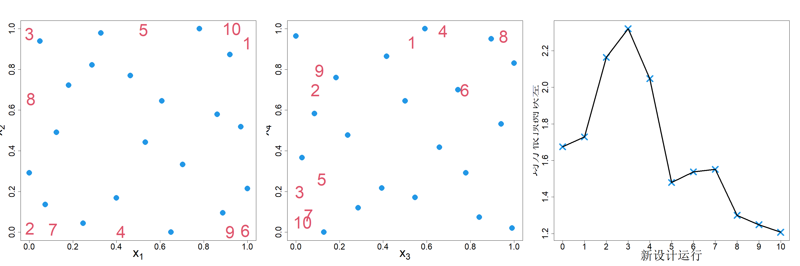

### 7.1.2 基于熵的序贯设计

现在我们来考虑 3.2 节讨论的最大熵设计。在高斯过程模型下，寻找 $n$ 个点的设计准则是最大化 $|\boldsymbol{R}_n|$。因此，寻找下一个设计点的序贯设计策略为：

$$
\boldsymbol{x}_{n+1}\leftarrow\argmax_{\boldsymbol{x_{n+1}}}|\boldsymbol{R}_{n+1}|
\tag{7.5}
$$

利用分块矩阵行列式的结论（引理 2.1），可得：

$$
|\boldsymbol{R}_{n+1}|=\begin{vmatrix}
\boldsymbol{R}_n&\boldsymbol{r}_n(\boldsymbol{x_{n+1}})\\
\boldsymbol{r}_n(\boldsymbol{x_{n+1}})'&1
\end{vmatrix}=|\boldsymbol{R}_n|\{1-\boldsymbol{r}_n(\boldsymbol{x_{n+1}})'\boldsymbol{R}_n^{-1}\boldsymbol{r}_n(\boldsymbol{x_{n+1}})\}
$$

于是式 (7.5) 转化为：

$$
\boldsymbol{x}_{n+1}\leftarrow\argmax_{\boldsymbol{x_{n+1}}}\{1-\boldsymbol{r}_n(\boldsymbol{x_{n+1}})'\boldsymbol{R}_n^{-1}\boldsymbol{r}_n(\boldsymbol{x_{n+1}})\}
\tag{7.6}
$$

也就是说，下一个样本点选取在预测不确定性最大的位置。该策略最初由麦凯（1992）针对主动学习提出，因此被称为麦凯主动学习算法（ALM）（徐等人，2000）。该思路与求解 D‑最优设计所使用的算法也存在紧密联系（费奥多罗夫，1972）。

再次回顾上一节讨论过的带有两个冗余变量的布兰宁函数。采用式 (7.6) 得到的设计点与均方根误差如图 7.4 所示。可以观察到设计点向边界靠拢。该现象符合预期，因为如 4.3 节所述，采用高斯相关函数的最大熵设计会生成最大最小距离设计，而这类设计的特点就是将样本点推向边界。宋与约瑟夫（2025）近期研究表明，在式 (7.15) 中使用乘积逆多二次（MIM）核函数能够缓解该问题，该核函数可获得更优的低维投影效果。研究同时发现，相较于最大投影这类空间填充设计，将最大单因素逐次设计作为初始设计可得到更好的结果。这一现象可能源于最大单因素逐次设计能够对长度尺度参数实现精准估计。

> **图 7.4**：基于熵准则的序贯设计（麦克凯主动学习），针对带有两个非活跃变量的布兰宁函数

{width=100%}

相较于基于预测的序贯设计，麦凯主动学习算法的一大优势是计算速度。在 2.1 吉赫兹的台式机上，采用主动学习‑科恩算法（使用 400 个拟蒙特卡洛点近似积分）生成 10 个序贯设计点耗时 44.12 秒，基于最小均方误差（MMSE）的设计耗时 57.28 秒，而麦凯主动学习算法仅耗时 0.27 秒。但上述所有方法都倾向于将样本点在试验区域内均匀分布，该现象源于高斯过程模型（普通克里金）的常数方差假设。若采用异方差高斯过程模型，例如复合高斯过程（巴和约瑟夫，2012）或深度高斯过程（绍尔等人，2023），则可以得到更优的序贯设计，能够在响应面变化剧烈、具有研究价值的区域布置更多样本点。王和约瑟夫（2025a）的研究中近期提出了一种基于式 (2.52) 有理克里金的异方差改进方案。