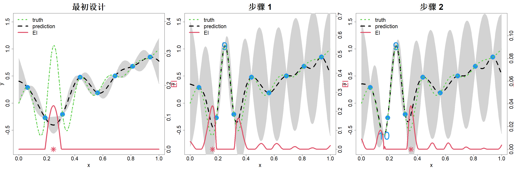

## 7.2 优化

假设我们的目标是对计算成本高昂的黑箱函数 $h(\boldsymbol{x})$（$\boldsymbol{x}\in\mathcal{X}$）进行优化。不失一般性，我们将该优化视作极小化问题，且令 $\mathcal{X}=[0,1]^p$。因此，优化目标为：

$$
\min_{\boldsymbol{x}\in[0,1]^p}h(\boldsymbol{x})
\tag{7.7}
$$

这是一个带边界约束的非线性优化问题。在优化领域的相关文献中，存在大量求解该问题的算法，大致可分为局部优化算法与全局优化算法两类。牛顿法、内尔德‑米德单纯形法等局部优化算法从可行域内的某一点出发，最终收敛到距离初始点较近的局部最优解。与之不同，模拟退火算法、遗传算法这类全局优化算法在特定条件下能够收敛至全局最优解。局部与全局算法都需要对 $h(\boldsymbol{x})$ 进行大量求值运算，并且全局类算法通常比局部优化算法需要更多次求值。因此，当 $h(\boldsymbol{x})$ 是计算代价高昂的计算机模型时，这类算法无法直接用于求解式 (7.7)。

我们需要一种全局优化方法，能够以尽可能少的 $h(\boldsymbol{x})$ 求值次数求解式 (7.7)。其中一种思路是：在 $[0,1]^p$ 内选取小规模试验设计 $\{\boldsymbol{x}_1,\dots,\boldsymbol{x}_n\}$，对 $i=1,\dots,n$ 计算 $y_i=h(\boldsymbol{x}_i)$，随后采用易于求值的代理模型 $\widehat h_n(\boldsymbol{x})$（例如高斯过程（GP）模型的后验均值）对其进行近似。接着我们可以通过最小化该代理模型得到下一个设计点，即 $\boldsymbol{x}_{n+1}=\argmin_{\boldsymbol{x}}\widehat h_n(\boldsymbol{x})$。该流程可以循环执行，每一步完成后更新代理模型，直至收敛。但新增的样本点很容易聚集在初始试验设计得到的最优解附近，使得代理模型的近似效果几乎得不到提升。因此，若初始代理模型的近似效果较差，该方法大概率会失效。

高斯过程模型的一个优良特性是，我们可利用其方差估计 $s^2(\boldsymbol{x})$，对序贯设计每一步的近似误差进行概率化量化。因此，如果我们能够提出一种可以兼顾优化与代理模型近似这两个目标的方法，就能够引导该方法收敛至全局最优解。这类方法是真实存在的，由于高斯过程采用贝叶斯框架，因此被称作贝叶斯优化方法。将随机过程应用于全局优化的思路可追溯至库什纳（1964）。关于贝叶斯优化的更多详细内容，可以参阅弗雷泽（2018）的综述论文，或是加内特（2023）所著的书籍。

贝叶斯优化相关的文献数量庞大。本文将重点介绍最常用的一种贝叶斯优化方法——期望改进法。该方法由琼斯等人于 1998 年首次提出，其理论基础源于莫库斯 1978 年的早期研究。更多详细内容可参阅琼斯 2001 年发表的综述论文。

假设我们按照试验设计 $D_n=\{\boldsymbol{x}_1,\dots,\boldsymbol{x}_n\}$ 依次完成了 $n$ 次试验，观测得到数据 $\boldsymbol{y}_n=(y_1,\dots,y_n)'$。对潜在函数给定高斯过程先验：$h(\boldsymbol{x})\sim\mathrm{GP}(\mu,\tau^2R(\cdot))$。则后验分布为：

$$
h(\boldsymbol{x})|D_n,\boldsymbol{y}_n\sim\mathcal{N}(\widehat{y}_n(\boldsymbol{x}),s_n^2(\boldsymbol{x}))
\tag{7.8}
$$

其中，与前文一致：

$$
\begin{align*}
\widehat{y}_n(\boldsymbol{x})&=\mu+\boldsymbol{r}_n(\boldsymbol{x})'\boldsymbol{R}_n^{-1}(\boldsymbol{y}_n-\mu\boldsymbol{1}_n)\\
s_n^2(\boldsymbol{x})&=\tau^2\{1-\boldsymbol{r}_n(\boldsymbol{x})'\boldsymbol{R}_n^{-1}\boldsymbol{r}_n(\boldsymbol{x})\}
\end{align*}
$$

式中 $\boldsymbol{r}_n(\boldsymbol{x})=\{R(\boldsymbol{x}-\boldsymbol{x}_i)\}_{i=1}^n$，$\boldsymbol{R}_n=\{R(\boldsymbol{x}_i-\boldsymbol{x}_j)\}_{i,j=1}^n$。令 $h_{\mathrm{min}}^{(n)}=\min \boldsymbol{y}_n$，定义改进函数：

$$
I(\boldsymbol{x})=\max\{h_{\mathrm{min}}^{(n)}-h(\boldsymbol{x}),0\}
$$

因此，若选取的 $x$ 满足 $h(\boldsymbol{x})<h_{\mathrm{min}}^{(n)}$，则获得改进；否则无改进。故而我们应当选取使改进最大化的 $\boldsymbol{x}$。但由于无法获知全部 $\boldsymbol{x}$ 对应的 $h(\boldsymbol{x})$，无法直接实现该目标。不过我们可以借助式 (7.8) 对其进行带不确定性的预测，由此得到 $I(\boldsymbol{x})$ 的分布。鉴于 $I(\boldsymbol{x})$ 的计算存在不确定性，选取下一个试验点的合理思路是最大化 $I(\boldsymbol{x})$ 的期望，即：

$$
\boldsymbol{x}_{n+1}=\argmax_{\boldsymbol{x}}\mathrm{E}\{I(\boldsymbol{x})\big|D_n,\boldsymbol{y}_n\}
$$

琼斯等人（1998）给出了期望改进（EI）的显式表达式，该表达式能够加快优化速度，其推导过程如下：

$$
\begin{align*}
\mathrm{EI}&=\mathrm{E}\{I(\boldsymbol{x})|D_n,\boldsymbol{y}_n\}=\int_{-\infty}^{\infty}\max\{h_{\mathrm{min}}^{(n)}-y,0\}\phi(y;\widehat{h}_n(\boldsymbol{x}),s^2_n(\boldsymbol{x}))\mathrm{d}y\\
&=\int_{-\infty}^{h_{\mathrm{min}}^{(n)}}\{h_{\mathrm{min}}^{(n)}-y\}\phi(y;\widehat{h}_n(\boldsymbol{x}),s^2_n(\boldsymbol{x}))\mathrm{d}y\\
&=\int_{-\infty}^{(h_{\mathrm{min}}^{(n)}-\widehat{h}_n(\boldsymbol{x}))/s_n(\boldsymbol{x})}\{h_{\mathrm{min}}^{(n)}-\widehat{h}_n(\boldsymbol{x})-s_n(\boldsymbol{x})z\}\phi(z)\mathrm{d}z\\
&=(h_{\mathrm{min}}^{(n)}-\widehat{h}_n(\boldsymbol{x}))\Phi\left(\frac{h_{\mathrm{min}}^{(n)}-\widehat{h}_n(\boldsymbol{x})}{s_n(\boldsymbol{x})}\right)+s_n(\boldsymbol{x})\phi\left(\frac{h_{\mathrm{min}}^{(n)}-\widehat{h}_n(\boldsymbol{x})}{s_n(\boldsymbol{x})}\right)
\end{align*}
$$

式中 $\phi(\cdot)$ 与 $\Phi(\cdot)$ 分别代表标准正态概率密度函数与标准正态分布函数。由此，期望改进算法可以写为

$$
\boldsymbol{x}_{n+1}=\argmax_{\boldsymbol{x}}\{s_n(\boldsymbol{x})[u_n(\boldsymbol{x})\Phi(u_n(\boldsymbol{x}))+\phi(u_n(\boldsymbol{x}))]\}
\tag{7.9}
$$

其中 $u_n(\boldsymbol{x})=\{h_{\mathrm{min}}^{(n)}-\widehat{h}_n(\boldsymbol{x})\}/s_n(\boldsymbol{x})$。对其求导可得

$$
\frac{\partial\mathrm{EI}}{\partial\widehat{h}_n(\boldsymbol{x})}=-\Phi(u_n(\boldsymbol{x}))<0,\quad\frac{\partial\mathrm{EI}}{\partial s_n(\boldsymbol{x})}=\phi(u_n(\boldsymbol{x}))>0
$$

该结果表明期望改进随 $\widehat{h}_n(\boldsymbol{x})$ 单调递减，随 $s_n(\boldsymbol{x})$ 单调递增。因此，可以通过选取使 $\widehat{h}_n(\boldsymbol{x})$ 最小或者使 $s_n(\boldsymbol{x})$ 最大的点实现期望改进最大化；正如 7.1.2 节所述，前者服务于优化（利用），后者服务于代理模型近似（探索）。实际上，期望改进很好地平衡了这两个目标，有助于序贯设计收敛到全局最优解（布尔，2011）。

举个例子，考虑对式 (2.1) 中的一维函数做极小化处理。取 $\{(i-.5)/n\}_{i=1}^{n}$ 作为初始试验设计，设置 $n=8$ 个样本点。图 7.5 左图展示了试验点、真实函数，以及利用 rkriging（黄与约瑟夫，2024）拟合得到的高斯过程（GP）模型。该图同时给出期望改进（EI），其坐标轴位于绘图区域右侧。期望改进在 $x=0.25$ 处取得最大值，该点将作为新增的第 9 个试验点 $x_9$。但遗憾的是，该点恰恰是原函数的极大值点！出现这类错误的原因在于代理近似模型的拟合效果可能较差。加入该点后得到的高斯过程模型如图 7.5 的中间子图所示。此时期望改进算法可正确定位全局最优点，其位置约为 $x=0.16$。同一张图的右侧子图展示了再迭代一步的结果，算法识别出了次优极小点。此外，也可以在每一步同时添加两个或更多样本点，该方法称为批量序贯设计。该策略在可使用并行计算的场景下尤为实用。关于将单点期望改进算法拓展至批量序贯设计的若干有效启发式策略，可参阅金斯布尔热等人（2010）的研究。

> **图 7.5**：对式 (2.1) 中的一维函数执行期望改进最小化算法的两次迭代

{width=100%}

需要指出 EI 算法存在一项数值实现问题。在某次迭代过程中，新增采样点可能会与已有采样点距离极近，这会导致相关矩阵 $\boldsymbol{R}_n$ 出现病态。如前文 2.2.3 节所述，规避该问题的一种简易方法是向矩阵 $\boldsymbol{R}_n$ 的对角元添加一个较小的块金值 $\lambda>0$，也就是使用 $\boldsymbol{R}_n+\lambda\boldsymbol{I}_n$ 替代 $\boldsymbol{R}_n$。但该处理会使得设计点处的方差 $s_n^2(\boldsymbol{x})$ 不为零，进而造成新增设计点与已有设计点过于接近。避免该问题的一种手段是在式 (7.9) 的优化过程中采用候选点集，候选点需分布分散且远离已有设计点（格拉马西等人，2022）。另一种处理方式是按照兰詹等人（2011）的研究，采用稳定性更高的方式计算 $\boldsymbol{R}_n^{-1}$。令

$$
\boldsymbol{A}=(\boldsymbol{R}+\lambda I)^{-1}
$$

该矩阵可以实现高精度求解。而我们的目标是求解 $\boldsymbol{B}=\boldsymbol{R}^{-1}$。注意到

$$
\begin{align*}
\boldsymbol{B}&=(\boldsymbol{R}+\lambda\boldsymbol{I}-\lambda\boldsymbol{I})^{-1}\\
&=\boldsymbol{A}(I-\lambda\boldsymbol{A})^{-1}\\
&=\boldsymbol{A}(I+\lambda\boldsymbol{A}+\lambda^2\boldsymbol{A}^2+\cdots)\\
&=\boldsymbol{A}\bigl(I+\lambda\boldsymbol{A}\{I+\lambda\boldsymbol{A}+\cdots\}\bigr)\\
&=\boldsymbol{A}\bigl(I+\lambda\boldsymbol{A}\{I-\lambda\boldsymbol{A}\}^{-1}\bigr)\\
&=\boldsymbol{A}(I+\lambda\boldsymbol{B})
\end{align*}
$$

由此可以得到 $\boldsymbol{R}^{-1}$ 的迭代求解公式：

$$
\boldsymbol{B}_{k+1}=\boldsymbol{A}(I+\lambda\boldsymbol{B}_k),k=1,2,\dots
$$

取初值 $\boldsymbol{B}_1=\boldsymbol{A}$。当 $\lambda$ 取值较小时，仅需少数几次迭代，$\boldsymbol{B}_k$ 便可收敛至 $\boldsymbol{R}^{-1}$，R 语言程序包 rkriging 已实现该算法（黄和约瑟夫，2024）。