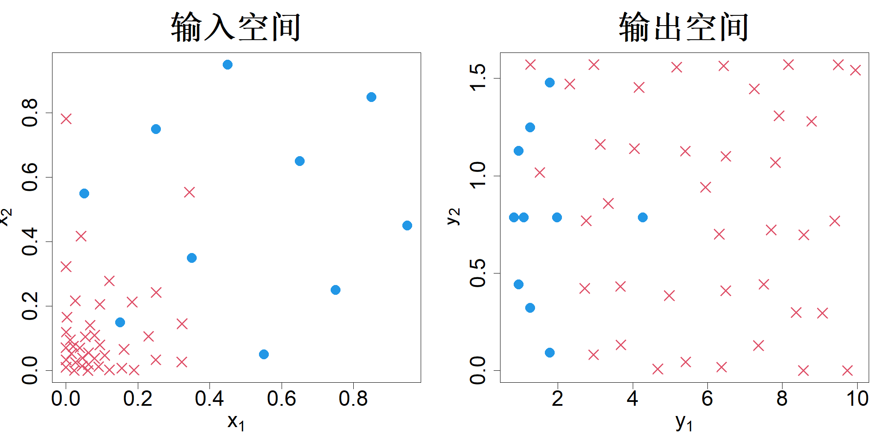

## 7.3 逆向设计

在许多工程问题中，目标是得到能够使产品具备特定性能的设计方案。请注意，在本节中，“设计”一词会交替使用：在工程术语中指产品设计，在统计术语中指试验设计，二者的区别可通过上下文加以区分。假定采用 $q$ 个性能指标（输出）$\boldsymbol y=(y_1,\dots,y_q)'$ 评价产品性能，$\boldsymbol x=(x_1,\dots,x_p)'$ 为 $p$ 个设计变量（输入）。设第 $i$ 个输出与输入变量满足关系 $y_i=h_i(\boldsymbol x)$，其中 $\boldsymbol x\in \mathcal X=[0,1]^p$，$i=1,\dots,q$。目标是找到输入设计 $\boldsymbol x^*$，使其得到给定输出 $\boldsymbol y^*$。令 $w_i$ 表示分配给第 $i$ 个输出的权重，用于衡量该输出的重要程度。于是，可通过求解如下优化问题得到逆设计：

$$
\boldsymbol x^*=\argmin_{\boldsymbol x}\|\boldsymbol y^*-\boldsymbol h(\boldsymbol x)\|_{\boldsymbol{w}}
\tag{7.10}
$$

式中，$\boldsymbol h(\boldsymbol x)=(h_1(\boldsymbol x),\dots,h_q(\boldsymbol x))'$，$\|\boldsymbol u-\boldsymbol v\|_{\boldsymbol{w}}=\sqrt{\sum_{i=1}^{q}w_i(u_i-v_i)^2}$，$\sum_{i=1}^{q}w_i=1$，且对 $i=1,\dots,q$ 有 $w_i\ge 0$。

如果 $h_i(\boldsymbol{w})$ 中有一个或多个函数的计算代价很高，那么式 (7.10) 中的优化计算成本将会高到难以承受。在这种情况下，我们可以采用上一节介绍的贝叶斯优化方法。接下来假设我们希望求解逆设计，以得到若干组不同的目标性能 $\boldsymbol{y}^*_1,\dots,\boldsymbol{y}^*_N$。当 $N$ 很大时，执行 $N$ 次贝叶斯优化会十分繁琐。此外，该方法的效率也较低，因为各次优化过程所采用的序贯设计可能存在重叠，进而造成计算资源的浪费。一种效率更高的思路是求解下述问题的 $N$ 个局部最优解：

$$
\min_{\boldsymbol{x}}\max_{i=1:N}\|\boldsymbol{y}^*_i-\boldsymbol{h}(\boldsymbol{x})\|_{\boldsymbol{w}}
$$

然而，求解多个最优解本身并非易事。

如果用户能够在连续空间 $\mathcal{Y}$ 中指定任意目标，上述问题会变得更加棘手。事实上，这种情况在工程设计中十分常见。举一个具体例子，参考克里希纳等人（2022）研究的声学超表面设计问题，该研究旨在对反射与透射声波的振幅和相位实现独立调控。实验可借助 COMSOL 的全波仿真完成，仿真在给定若干边界条件下求解亥姆霍兹波动方程。在水下通信、全息成像这类应用场景中，用户可能需要反射声波与透射声波具备各不相同的振幅、相位参数，此时就需要快速给出能够实现上述目标的超表面设计方案。克里希纳等人（2022）尝试通过求解下述问题得到 $N$ 组设计方案：针对集合 $D=\{\boldsymbol{x}_1,\dots,\boldsymbol{x}_N\}$，最小化

$$
\max_{\boldsymbol{y}\in\mathcal{Y}}\min_{i}\|\boldsymbol{y}-\boldsymbol{h}(\boldsymbol{x}_i)\|_{\boldsymbol{w}}
\tag{7.11}
$$

该式等价于在输出空间 $\mathcal{Y}$ 中求解极小极大设计 $\{\boldsymbol{y}_1,\dots,\boldsymbol{y}_N\}$，其中 $\boldsymbol{y}_i=\boldsymbol{h}(\boldsymbol{x}_i)$。但该问题求解难度很高，原因在于空间 $\mathcal{Y}$ 是未知的，且 $\boldsymbol{y}$ 只能通过计算成本高昂的函数 $\boldsymbol{h}(\boldsymbol{x})$ 获取观测值。一旦得到输出空间内的极小极大设计，对于任意给定目标 $\boldsymbol{y}^*$，就可以求得 $i^*=\argmin_i\|\boldsymbol{y}^*-\boldsymbol{y}_i\|_{\boldsymbol{w}}$，并将对应的设计 $\boldsymbol{x}_{i^*}$ 作为问题解。简单来说，$\{(\boldsymbol{x}_1,\boldsymbol{y}_1),\dots,(\boldsymbol{x}_N,\boldsymbol{y}_N)\}$ 可以看作一张查找表。

克里希纳等人（2022）提出了一种序列扰动算法用于求解逆设计问题。该方法的思路是从一个初始设计出发，通过全波仿真得到输出结果。下一步确定输出空间中的最大间隙，该间隙设置为略大于已观测输出的凸包。确定最大间隙后，对输入空间内对应的点施加扰动，期望经过扰动后的点能够产生输出以填补该间隙。重复该流程，直至输出空间的最大间隙小于设定容差。王等人（2024）针对该算法提出了改进方案。贝廷格等人（2008）提出了一种基于高斯过程模型的逆设计方法。与之不同，序列扰动算法无需进行任何模型拟合，因此运算速度很快，适合生成大规模设计方案。克里希纳等人（2022）为达到声学输出的目标精度，需要开展 24000 次全波仿真，但该数值仅为 $7\times7$ 网格下 $563\times10^{12}$ 种声学超表面可行设计总量的极小一部分。这充分体现了序列设计方法的优势。

举例说明，参考王等人（2024）给出的一个简单算例，取 $p=q=2$：

$$
y_1=\frac{1}{\sqrt{x_1^2+x_2^2+0.01}},\quad y_2=\tan^{-1}\left(\frac{x_2}{x_1}\right)
$$

我们在输入空间中采用包含 10 个样本点的最大投影拉丁超立方设计（LHD）。输出空间对应的样本点以蓝色实心圆展示于图 7.6 的右侧子图。算法识别出最大间隙，并对输入空间中对应的样本点施加扰动。关于最大间隙的识别方法以及扰动的执行方式，详见王等人（2024）的文献。该算法已在 R 语言程序包 OSFD 中实现（王与约瑟夫，2024）。上述过程迭代执行 40 步，迭代生成的样本点在同一张图中以红色叉号标出。可以看到，相较于初始设计覆盖的区域，输出空间内的样本点覆盖范围得到了显著扩张。为实现该效果，新增的输入样本点大多集中分布在输入空间的左下角。如果不借助序贯设计算法，很难发现这一规律。

> **图 7.6**：针对该逆设计问题，在输入空间内以 10 个点的最大投影拉丁超立方设计（蓝色实心圆）为初始样本，通过序列扰动算法新增了 40 个设计点（红色叉号）

{width=67%}

我们可以看到，尽管图 7.6 中的输出点能够填满整个空间，但输入点高度聚集。如果我们的目标是同时构建正向模型与逆向模型，那么输入空间和输出空间都应当具备空间填充特性。可以通过在输入、输出空间的空间填充性能上做出一定权衡来实现该目标。卢与安德森‑库克（2021）以及巴顿和莫里斯（2025）阐述了如何基于两阶段模型方法实现这一效果。王和约瑟夫（2025b）改进了巴顿与莫里斯（2025）的方法，提出了一种完全序贯、不依赖模型的输入‑输出空间填充设计。

有趣的是，为逆向设计开发的序列扰动算法还有其他应用。以第一章中介绍的克里希纳等人（2024）的晶体结构预测案例为例。输入空间为单一晶体结构原子构型的笛卡尔坐标，输出为采用密度泛函理论（DFT）计算得到的势能。但由于势能在原子平移、旋转以及置换操作下保持不变，笛卡尔坐标体系并不适用于模型构建。因此，需要借助指纹表征技术，将笛卡尔坐标转换为一组特征。由于势能的高斯过程模型是基于这些特征拟合得到的，特征空间内的样本点需要具备空间填充特性。相较于密度泛函理论计算，指纹表征的运算速度更快，但仍存在不可忽略的计算开销，这导致在特征空间中生成具备空间填充特性的样本点十分困难。对此，我们可以使用序列扰动算法，将特征空间视作输出空间，笛卡尔坐标空间视作输入空间。