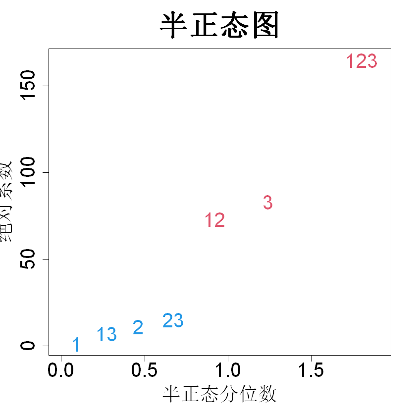

# 8 部分因子试验设计

物理实验与计算机实验在诸多方面存在差异。首先，物理实验成本高昂。例如，建造火箭并研究其性能的成本，远高于在计算机上开展模拟实验。但许多物理系统过于复杂，无法在计算机中建立贴合现实的模型，因此物理实验必不可少。其次，物理实验的输出结果需要借助仪器进行测量，而仪器无法实现任意精度。因此，物理实验获取的数据会受到测量噪声的干扰，计算机实验的输出则与之不同，能够以较高精度完成计算。此外，物理系统中存在大量已知或未知的变量，这些变量在实验过程中无法得到控制。它们会在实验期间发生变化，造成输出结果出现波动，这在我们看来同样表现为输出噪声。因此，实验人员必须采用重复试验、随机化、区组化等方法专门处理这类噪声，而这些手段对于计算机实验并不适用。第三，开展物理实验难度大且耗费时间。举例来说，若要调整熔炉内的温度，可能需要等待数小时；而在计算机实验中，我们只需输入新的温度数值，参数就会立刻完成变更。受以上种种因素影响，物理实验的运行次数通常较少。线性模型能够很好地基于这类数量少且带有噪声的数据估计响应面。因此，绝大多数关于物理实验的文献都围绕线性回归模型展开。不过，正如 1.3 节所指出的，线性回归模型难以刻画模型的不确定性，故而在构建最优实验设计方面存在一定局限。本章将简要回顾基于线性模型的实验设计，并探讨高斯过程模型能够如何辅助物理实验的设计与分析工作。

## 8.1 两级设计

已有大量优秀的物理实验相关教材采用线性回归模型，例如博克斯等人（1978）、米（2009）、莫里斯（2010）、劳森（2014）、迪恩等人（2017）、蒙哥马利（2017）、吴与滨田（2021）等，此处仅列举部分。因此，本文仅梳理部分基础概念，借此建立与计算机实验设计之间的联系，并提出一种适用于物理实验的高斯过程回归方法。想要了解物理实验的更多细节，读者可参阅上述著作。若需要该主题更深层次的理论阐述，可参考蒙哥马利和吴（2007）以及程（2016）。

大多数物理实验设计中，每个因子会设置两个或三个水平。这是因为如前文所述，实验的运行规模通常较小，且数据存在噪声。因此，具备线性或二次效应的模型或许可以很好地拟合响应曲面。为使该近似效果良好，我们可将因子的取值范围设置得不宜过大。物理实验选用两水平或三水平的另一个原因是：实验中更改因子水平并不容易，且参数设置过程可能会产生误差。本节我们将重点介绍两水平设计。

假设我们有 $p$ 个因子 $x_1,\dots,x_p$，每个因子取两个水平，采用 $n$ 次试验的设计 $D$ 开展实验。全因子设计需要 $n=2^p$ 次试验，当 $p$ 较大时，在绝大多数实际场景中该试验成本难以承受。因此，我们重点关注满足 $n\ll2^p$ 的设计，即仅使用全因子设计的一部分试验，这类设计称为部分因子设计。

由于每个变量仅有两个水平，我们可以考虑拟合仅包含主效应的线性回归模型：

$$
y=\beta_0+\beta_1x_1+\cdots+\beta_px_p+\epsilon
\tag{8.1}
$$

其中 $\epsilon\stackrel{\text{iid}}{\sim}\mathcal{N}(0,\sigma^2)$。考虑一次无重复实验，令 $\boldsymbol{y}=(y_1,\dots,y_n)'$ 为观测数据。于是，如同式 (2.32)，我们可以得到参数估计：

$$
\widehat{\boldsymbol{\beta}} = (\boldsymbol{X}'\boldsymbol{X})^{-1}\boldsymbol{X}'\boldsymbol{y}
$$

式中 $\boldsymbol{X}=[\boldsymbol1,D]$ 为模型矩阵。我们应当如何选取设计矩阵 $D$，才能让该估计量具备良好的性能？

在 2.2.1 节中，我们介绍了选择最优设计的若干准则。假设我们采用 D‑最优设计：

$$
\max_{D}|\boldsymbol{X}'\boldsymbol{X}|
$$

一般情况下，我们可以使用 2.2.1 节介绍的费多罗夫交换算法（费多罗夫，1972）这类优化算法求解最优设计。但对于部分样本量 $n$，可以采用更为简便的方式构造最优设计。下面给出一条实用结论（拉奥，1973，第 236 页）。

> **定理 8.1**：当矩阵 $\boldsymbol{X}$ 的列向量相互正交时，$|\boldsymbol{X}'\boldsymbol{X}|$ 取得最大值。

为证明这一点，将模型矩阵作如下分块：$\boldsymbol{X}=[\boldsymbol{x}_i\boldsymbol{X}_{(i)}]$。然后，利用引理 2.1：

$$
\begin{align*}
|\boldsymbol{X}'\boldsymbol{X}|&=
\begin{vmatrix}
\boldsymbol{x}'_i\boldsymbol{x}_i&\boldsymbol{x}'_i\boldsymbol{X}_{(i)}\\
\boldsymbol{X}'_{(i)}\boldsymbol{x}_i&\boldsymbol{X}'_{(i)}\boldsymbol{X}_{(i)}
\end{vmatrix}\\
&=|\boldsymbol{X}'_{(i)}\boldsymbol{X}_{(i)}|\{\boldsymbol{x}'_i\boldsymbol{x}_i-\boldsymbol{x}'_i\boldsymbol{X}_{(i)}(\boldsymbol{X}'_{(i)}\boldsymbol{X}_{(i)})^{-1}\boldsymbol{X}'_{(i)}\boldsymbol{x}_i\}\\
&\le|\boldsymbol{X}'_{(i)}\boldsymbol{X}_{(i)}|\boldsymbol{x}'_i\boldsymbol{x}_i
\end{align*}
$$

其中最后一步的不等式由 $\boldsymbol{x}'_i\boldsymbol{X}_{(i)}(\boldsymbol{X}'_{(i)}\boldsymbol{X}_{(i)})^{-1}\boldsymbol{X}'_{(i)}\boldsymbol{x}_i\ge0$ 这一事实得到。因此，当

$$
\boldsymbol{x}'_i\boldsymbol{X}_{(i)}(\boldsymbol{X}'_{(i)}\boldsymbol{X}_{(i)})^{-1}\boldsymbol{X}'_{(i)}\boldsymbol{x}_i=0
$$

时取到该上界。由于 $\boldsymbol{X}'_{(i)}\boldsymbol{X}_{(i)}$ 为正定矩阵，该等式成立的条件是 $\boldsymbol{x}'_i\boldsymbol{X}_{(i)}=0$，这意味着对所有满 $i\neq j$ 的下标，均有 $\boldsymbol{x}'_i\boldsymbol{x}_j=0$。

不失一般性，我们可以将两个水平取为 $‑1$ 和 $1$。此时，为使每一列都与截距列 $1$ 正交，设计矩阵的每一列中 $‑1$ 与 $1$ 的数量必须相等。此外，若要让设计矩阵的两列相互正交，则数对

$$
\{(-1,-1),(-1,1),(1,-1),(1,1)\}
$$

的出现次数必须相同。

举一个包含四个因子 $x_1$、$x_2$、$x_3$ 和 $x_4$ 的例子。假设实验者仅能完成 8 次试验。此时我们需要全因子设计的 1/2 部分实施，该设计记为 $2^{4-1}$ 设计。要构造该设计，可先建立 $x_1$、$x_2$、$x_3$ 的全因子设计，再将 $x_4$ 的列赋值为这三个因子列的乘积：$\{x_1x_2,x_1x_3,x_2x_3,x_1x_2x_3\}$。这种构造方式得到的是正则设计；关于非正则设计的构造方法可参见吴与滨田（2021，第 8 章）。令 $\boldsymbol{d}_i$ 表示设计矩阵 $\boldsymbol{D}$ 的第 $i$ 列，$\boldsymbol{d}_i\boldsymbol{d}_j$ 表示第 $i$ 列与第 $j$ 列的逐元素乘积。令 $\boldsymbol{d}_4=\boldsymbol{d}_1\boldsymbol{d}_2\boldsymbol{d}_3$ 得到的设计如表 8.1 所示。不难验证模型矩阵 $\boldsymbol{X}=[\boldsymbol{1}D]$ 是正交矩阵，因此该设计对于式 (8.1) 中模型的参数估计具有 D 最优性。若采用赋值 $\boldsymbol{d}_4=\boldsymbol{d}_1\boldsymbol{d}_2$，将得到另一个 $2^{4-1}$ 设计，在 D 最优性准则下，该设计与前一个设计效果相当。

> **表 8.1**：$2^{4-1}$ 试验设计与数据

|运行次数|$x_1$|$x_2$|$x_3$|$x_4$|$y$|
|:--:|--:|--:|--:|--:|:--:|
|1|-1|-1|-1|-1|504|
|2|-1|-1|1|1|984|
|3|-1|1|-1|1|928|
|4|-1|1|1|-1|808|
|5|1|-1|-1|1|992|
|6|1|-1|1|-1|784|
|7|1|1|-1|-1|464|
|8|1|1|1|1|976|

倘若式 (8.1) 中的模型设定有误该如何处理？一种可行方案是采用如下完整模型：

$$
\begin{align*}
y&=\alpha_0+\alpha_1x_1+\cdots+\alpha_px_p\\
&+\alpha_{12}x_1x_2+\cdots+\alpha_{p-1,p}x_{p-1}x_p\\
&+\alpha_{123}x_1x_2x_3+\cdots+\alpha_{p-2,p-1,p}x_{p-2}x_{p-1}x_p\\
&+\cdots\\
&+\alpha_{12\cdots p}x_1x_2\cdots x_p+\delta
\tag{8.2}
\end{align*}
$$

其中 $\delta$ 独立同分布，服从正态分布 $\mathcal{N}(0,\tau^2)$。尽管该模型新增了大量项，但模型依旧可能存在设定错误，原因是该模型并未纳入二次、三次效应这类非线性项。不过，由于我们限定采用二水平试验设计，这类非线性项无法纳入考量。

遗憾的是，完整模型包含 $2p$ 个系数，远大于部分因子设计的试验次数。因此，无法利用该数据对该模型进行估计。处理该问题的方法有很多。我们可以使用惩罚回归方法，例如套索回归（蒂布希拉尼，1996），也可以对系数设置信息先验，采用贝叶斯回归（奇普曼等人，1997）。在探讨这些更为复杂的方法之前，我们将介绍一些传统分析方法，以此获取对构建最优试验设计至关重要的理解。

在 $2^{p−k}$ 正规部分因子试验设计中，可以拟合包含 $p−k$ 个因子的完整模型。以表 8.1 中的 $2^{4−1}$ 设计为例。我们可以对任意三个因子，例如 $\{x_1,x_2,x_3\}$ 拟合完整模型：

$$
y=\beta_0+\beta_1x_1+\beta_2x_2+\beta_3x_3+\beta_{12}x_1x_2+\beta_{13}x_1x_3+\beta_{23}x_2x_3+\beta_{123}x_1x_2x_3+\epsilon
\tag{8.3}
$$

由该模型可得

$$
\widehat{\boldsymbol{\beta}}=(\boldsymbol{X}'\boldsymbol{X})^{-1}\boldsymbol{X}'\boldsymbol{y}=(805,-1,-11,83,-73,-7,15,165)'
$$

图 8.1 为系数绝对值的半正态图。可以看出系数 $\widehat{\beta}_{123}$、$\widehat{\beta}_3$ 与 $\widehat{\beta}_{12}$ 显著，该结果可通过伦思法予以验证（伦思，1989）。

> **图 8.1**：不包含 $x_4$ 的式 (8.3) 中模型绝对系数的半正态图

{width=33%}

然而，我们想要拟合的模型为：

$$
\boldsymbol{y}=\boldsymbol{F}\boldsymbol{\alpha}+\boldsymbol{\delta}
$$

其中 $\boldsymbol{F}$ 是对应四个因子 $\{x_1,x_2,x_3,x_4\}$ 全模型的模型矩阵。在等式两边左乘 $(\boldsymbol{X}'\boldsymbol{X})^{-1}\boldsymbol{X}'$，可得：

$$
\widehat{\boldsymbol{\beta}}=(\boldsymbol{X}'\boldsymbol{X})^{-1}\boldsymbol{X}'y=(\boldsymbol{X}'\boldsymbol{X})^{-1}\boldsymbol{X}'\boldsymbol{F}\boldsymbol{\alpha}+\widetilde{\boldsymbol{\delta}}
$$

式中 $\widetilde{\boldsymbol{\delta}}=(\boldsymbol{X}'\boldsymbol{X})^{-1}\boldsymbol{X}'\boldsymbol{\delta}$。对其化简，得到显著系数满足的方程组：

$$
\begin{align*}
\widehat{\beta}_{123}&=\alpha_4+\alpha_{123}+\widetilde{\delta}_{123}=165\\
\widehat{\beta}_{3}&=\alpha_3+\alpha_{124}+\widetilde{\delta}_{3}=83\\
\widehat{\beta}_{12}&=\alpha_{12}+\alpha_{34}+\widetilde{\delta}_{12}=-73
\end{align*}
$$

如何通过以上三个方程求解六个系数？由于 $\widetilde{\delta}$ 是零均值误差项，可以将其忽略。但我们无法将 $\alpha_4$ 与 $\alpha_{123}$、$\alpha_3$ 与 $\alpha_{124}$、$\alpha_{12}$ 与 $\alpha_{34}$ 分离开。这些系数不可识别，在试验设计术语中称为混杂。我们可以借助效应层级等经验准则解除这类混杂。效应层级准则（吴与滨田，2021，第 168 页）指出：（1）低阶效应比高阶效应更有可能显著；（2）同阶效应显著的可能性相同。依据该准则可得：

$$
\begin{align*}
\widehat{\alpha}_4&=165\\
\widehat{\alpha}_3&=83\\
\widehat{\alpha}_{12}+\widehat{\alpha}_{34}&=-73
\end{align*}
$$

遗憾的是，效应层级准则无法处理最后一组混杂，因为 $\alpha_{12}$ 与 $\alpha_{34}$ 阶次相同。此时可以采用另一项准则——效应遗传准则（滨田与吴，1992）。效应遗传准则认为：若某交互效应显著，则至少它的一个父主效应应当显著。由于 $x_1$、$x_2$ 的主效应不显著，$x_3$、$x_4$ 的主效应显著，观测到的 $‑73$ 效应很可能来源于 $x_3$ 与 $x_4$ 的二因子交互作用。由此得到 $\widehat{\alpha}_{34}=-73$。最终模型为：

$$
\widehat{y}=805+165x_4+83x_3-73x_3x_4
$$

该模型看上去合理，但分析过程中完全舍弃了 $\alpha_{12}$、$\alpha_{123}$ 和 $\alpha_{124}$，仍存在疑点。下一节将重新讨论该问题，采用另一种更可靠的方式处理混杂问题。

倘若重要效应之间不存在别名（混杂）关系，上述分析就是准确的。因此，我们应当合理设计试验，规避或尽可能降低重要效应之间的别名关系。对于标准的 $2^{p−k}$ 二水平部分析因设计，无需计算别名矩阵 $(\boldsymbol{X}'\boldsymbol{X})^{−1}\boldsymbol{X}'\boldsymbol{F}$，就可以简便理解其别名结构。我们再次考察表 8.1 中的 $2^{4−1}$ 设计，该设计由生成元 $\boldsymbol{d}_4=\boldsymbol{d}_1\boldsymbol{d}_2\boldsymbol{d}_3$ 构造得到。由于 $\boldsymbol{d}_4\boldsymbol{d}_4=\boldsymbol{1}$，等式两边同时乘以 $\boldsymbol{d}_4$，可以得到该设计的定义关系：$\boldsymbol{1}=\boldsymbol{d}_1\boldsymbol{d}_2\boldsymbol{d}_3\boldsymbol{d}_4$。该定义关系表明，矩阵 $\boldsymbol{F}$ 中对应 $\alpha_0$ 与 $\alpha_{1234}$ 的两列完全相同，因此这两个系数互为别名。$2^{4−1}$ 设计其余 7 组别名可按如下方式得到：

$$
\begin{align*}
\boldsymbol{d}_1&=\boldsymbol{d}_2\boldsymbol{d}_3\boldsymbol{d}_4\\
\boldsymbol{d}_2&=\boldsymbol{d}_1\boldsymbol{d}_3\boldsymbol{d}_4\\
\boldsymbol{d}_3&=\boldsymbol{d}_1\boldsymbol{d}_2\boldsymbol{d}_4\\
\boldsymbol{d}_4&=\boldsymbol{d}_1\boldsymbol{d}_2\boldsymbol{d}_3\\
\boldsymbol{d}_1\boldsymbol{d}_2&=\boldsymbol{d}_3\boldsymbol{d}_4\\
\boldsymbol{d}_1\boldsymbol{d}_3&=\boldsymbol{d}_2\boldsymbol{d}_4\\
\boldsymbol{d}_2\boldsymbol{d}_3&=\boldsymbol{d}_1\boldsymbol{d}_4
\end{align*}
$$

由上述式子可以推得，$\alpha_1$ 与 $\alpha_{234}$ 互为别名，$\alpha_2$ 与 $\alpha_{134}$ 互为别名，以此类推。接下来考虑另一个由生成元 $\boldsymbol{d}_4=\boldsymbol{d}_1\boldsymbol{d}_2$ 构造的 $2^{4−1}$ 设计，其定义关系为 $\boldsymbol{1}=\boldsymbol{d}_1\boldsymbol{d}_2\boldsymbol{d}_4$。我们可以沿用前述方法求出其余 7 组别名，并将其与上一个设计的别名结构对比，以此评判两种设计的优劣。由于全部别名均由定义关系导出，只需对比 $\boldsymbol{1}=\boldsymbol{d}_1\boldsymbol{d}_2\boldsymbol{d}_3\boldsymbol{d}_4$ 与 $\boldsymbol{1}=\boldsymbol{d}_1\boldsymbol{d}_2\boldsymbol{d}_4$ 即可。可以看到，第一个设计的定义字长度为 4，第二个设计的定义字长度为 3。因此，第一个设计的主效应与三因子交互作用互为别名；而第二个设计的主效应会和二因子交互作用互为别名。根据效应层级原理，二因子交互作用相比三因子交互作用更容易具备实际显著性。故而第一个设计的别名混杂程度弱于第二个设计，这说明我们应当优先选用第一个设计。

再举一例，考虑一个六因子的 $2^{6‑2}$ 设计，它是完全析因 $2^6$ 设计的 1/4 部分。要构造该设计，可先对前四个因子构建一个 16 次试验的完全析因设计，再将最后两个因子分配为由前四个因子相乘得到的列。假设生成元取 $\boldsymbol{d}_5=\boldsymbol{d}_1\boldsymbol{d}_2\boldsymbol{d}_3\boldsymbol{d}_4$ 与 $\boldsymbol{d}_6=\boldsymbol{d}_1\boldsymbol{d}_2\boldsymbol{d}_3$，则定义关系为 $\boldsymbol{1}=\boldsymbol{d}_1\boldsymbol{d}_2\boldsymbol{d}_3\boldsymbol{d}_4\boldsymbol{d}_5=\boldsymbol{d}_1\boldsymbol{d}_2\boldsymbol{d}_3\boldsymbol{d}_6$。由于 $\boldsymbol{d}_1\boldsymbol{d}_2\boldsymbol{d}_3\boldsymbol{d}_4\boldsymbol{d}_5$ 和 $\boldsymbol{d}_1\boldsymbol{d}_2\boldsymbol{d}_3\boldsymbol{d}_6$ 均等于 $\boldsymbol{1}$，二者的乘积也等于 $\boldsymbol{1}$。因此，将两式相乘，可得到定义对比子群：

$$
\boldsymbol{1}=\boldsymbol{d}_1\boldsymbol{d}_2\boldsymbol{d}_3\boldsymbol{d}_4\boldsymbol{d}_5=\boldsymbol{d}_1\boldsymbol{d}_2\boldsymbol{d}_3\boldsymbol{d}_6=\boldsymbol{d}_4\boldsymbol{d}_5\boldsymbol{d}_6
$$

我们可以由该定义对比子群推导出其余 15 个别名关系。定义对比子群中长度较短的字属于“危险字”，因为它们会造成低阶效应之间发生别名混淆。因此，将设计的分辨度定义为定义对比子群中字的最小长度。由此可知，上述设计的分辨度为 3。显然，我们希望选用分辨度尽可能高的设计，这是博克斯与亨特（1961）提出的准则。再考虑另一个 $2^{6‑2}$ 设计，其生成元为 $\boldsymbol{d}_5=\boldsymbol{d}_1\boldsymbol{d}_2\boldsymbol{d}_3$、$\boldsymbol{d}_6=\boldsymbol{d}_1\boldsymbol{d}_2\boldsymbol{d}_4$，对应的定义对比子群为：

$$
\boldsymbol{1}=\boldsymbol{d}_1\boldsymbol{d}_2\boldsymbol{d}_3\boldsymbol{d}_5=\boldsymbol{d}_1\boldsymbol{d}_2\boldsymbol{d}_4\boldsymbol{d}_6=\boldsymbol{d}_3\boldsymbol{d}_4\boldsymbol{d}_5\boldsymbol{d}_6
$$

该设计的分辨度为 4，因此性能优于前一个设计。

对于规模更大的设计，会存在许多分辨率相同的设计方案。因此，我们需要对最大分辨率准则做进一步改进，以此选出最优设计。为此，定义设计 $D$ 的字长模式为：

$$
W(D)=(A_1(D),A_2(D),A_3(D),\dots,A_p(D))
\tag{8.4}
$$

其中 $A_i(D)$ 为长度等于 $i$ 的字的数量。考察两个 $2^{7‑2}$ 设计：

$$
\begin{align*}
D_1&:\boldsymbol{d}_6=\boldsymbol{d}_1\boldsymbol{d}_2\boldsymbol{d}_3\boldsymbol{d}_4,&\boldsymbol{d}_7=\boldsymbol{d}_1\boldsymbol{d}_2\boldsymbol{d}_3\boldsymbol{d}_5\\
D_2&:\boldsymbol{d}_6=\boldsymbol{d}_1\boldsymbol{d}_2\boldsymbol{d}_3,&\boldsymbol{d}_7=\boldsymbol{d}_1\boldsymbol{d}_4\boldsymbol{d}_5\tag{8.5}
\end{align*}
$$

二者的字长模式分别为 $W(D_1)=(0,0,0,1,2,0,0)$ 与 $W(D_2)=(0,0,0,2,0,1,0)$。由此可见，两个设计的分辨率均为 4。但可以发现，第一个设计仅有 1 个长度为 4 的字，而第二个设计有 2 个长度为 4 的字。直观来看，字的数量越少，与低阶效应发生混淆的数量就越少，因此第一个设计表现更优。弗里斯与亨特（1980）将这种情况描述为：第一个设计的偏差小于第二个设计。如果不存在其他设计的偏差比某一给定设计更小，则称该设计具有最小偏差。换言之，可以通过依次最小化 $A_1,A_2,A_3,\dots,A_p$，得到最小偏差设计。

在 $2^{p−k}$ 设计中，除去定义对比子群外，共有 $n-1=2^{p−k}-1$ 个别名组。对这些别名组做如下排序：前 $p$ 个别名组包含主效应，其余组别包含二因子交互作用或更高阶交互作用。记 $m_i(D)$ 为第 $i$ 个别名组内的二因子交互作用个数，$i=1,\dots,n-1$。程等人（1999）针对分辨度为 3 及以上的设计（即满足 $A_1(D)=A_2(D)=0$ 的设计）证明了如下结论：

$$
\begin{align*}
A_3(D)&=\frac13\left\{\binom{p}{2}-\sum_{i=p+1}^{n-1}m_i(D)\right\}\\
A_4(D)&=\frac16\left\{\sum_{i=1}^{n-1}m_i^2(D)-\binom{p}{2}\right\}
\end{align*}
$$

由于最小偏差设计会依次最小化 $A_3(D)$ 与 $A_4(D)$，该设计会最大化不和主效应发生别名混淆的二因子交互作用数量；在此前提下，进一步最小化各个二因子交互作用别名组规模的平方和。换言之，最小偏差设计能够减少二因子交互作用对主效应的干扰，并且尽量将二因子交互作用均匀分配至各个别名组。因此，当我们无法预知哪些二因子交互作用会显著时，最小偏差设计具备稳健性，是实际应用中的优良选择。

可以通过组合搜索求得最小偏差设计，但该方法计算成本较高（徐，2002）。小规模的最小偏差设计已收录于吴与滨田（2021，第5章）的表格中，也可通过 R 语言软件包 FrF2 快速获取（格伦平，2023）。