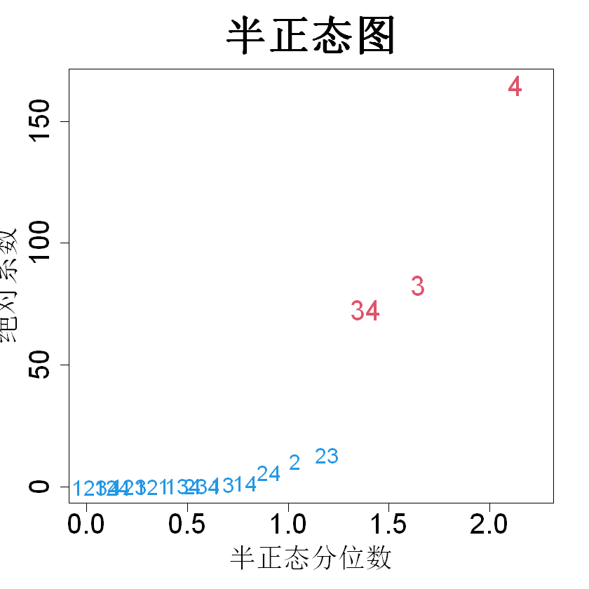

## 8.2 贝叶斯式启发设计

表 8.2 展示了铸造疲劳实验的试验设计与数据（滨田和吴，1992）。该设计属于非正则设计，由 12 次运行的正交表（也称为普拉克特‑伯曼设计，见吴与滨田，2021，第 8 章）的前 7 列构造得到。设 $\boldsymbol{X}$ 为式 (8.1) 中主效应模型对应的模型矩阵，$\boldsymbol{F}$ 为式 (8.2) 中全模型对应的模型矩阵。于是 $\boldsymbol{X}$ 是 12×8 矩阵，$\boldsymbol{F}$ 是 12×128 矩阵。本例中的别名矩阵 $(\boldsymbol{X}'\boldsymbol{X})^{-1}\boldsymbol{X}'\boldsymbol{F}$ 结构十分复杂，存在大量非零元素。因此，沿用正则设计所用的分析方法，无法处理二因子及更高阶交互效应，需要一套完全不同的策略来估计这些效应。滨田与吴（1992）提出一种前向变量选择策略，该策略融入了效应层级原则与效应遗传原则。可分别在袁等人（2007）、崔等人（2010）以及辛格和施图夫肯（2024）的文献中查阅基于最小角回归（LARS）、套索（lasso）以及高斯‑丹齐格选择器算法对该策略的拓展研究。关于各类变量选择策略的对比可参考凯恩与曼达尔（2020）。

> **表 8.2**：铸造疲劳实验的设计矩阵与数据

|运行次数|$x_1$|$x_2$|$x_3$|$x_4$|$x_5$|$x_6$|$x_7$|$y$|
|:--:|--:|--:|--:|--:|--:|--:|--:|:--:|
|1|1|1|-1|1|1|1|-1|6.058|
|2|1|-1|1|1|1|-1|-1|4.733|
|3|-1|1|1|1|-1|-1|-1|4.625|
|4|1|1|1|-1|-1|-1|1|5.899|
|5|1|1|-1|-1|-1|1|-1|7.000|
|6|1|-1|-1|-1|1|-1|1|5.752|
|7|-1|-1|-1|1|-1|1|1|5.682|
|8|-1|-1|1|-1|1|1|-1|6.607|
|9|-1|1|-1|1|1|-1|1|5.818|
|10|1|-1|1|1|-1|1|1|5.917|
|11|-1|1|1|-1|1|1|1|5.863|
|12|-1|-1|-1|-1|-1|-1|-1|4.809|

估计完整模型的另一种方法是采用贝叶斯框架，因为效应层级与遗传原则可视为开展数据分析前就已掌握的先验信息。设完整模型 (8.2) 中 $\boldsymbol{\alpha}=(\alpha_0,\alpha_1,\dots,\alpha_{12\cdots p})$ 的先验分布为 $\boldsymbol{\alpha}\sim\mathcal{N}(\boldsymbol{\mu},\boldsymbol{\Sigma})$，其中 $\boldsymbol{\mu}$ 是长度为 $2^p$ 的向量，$\boldsymbol{\Sigma}$ 为 $2^p\times2^p$ 矩阵。可以精心选取 $\boldsymbol{\mu}$ 与 $\boldsymbol{\Sigma}$ 的元素，以体现效应层级和遗传先验。但该操作几乎无法实现，因为需要设定的参数数量过多。看待该问题的另一种思路是：对 $\boldsymbol{\beta}$ 设置先验，会为底层输入‑输出函数 $h(\boldsymbol{x})\sim\mathcal{N}(\boldsymbol{f}(\boldsymbol{x})'\boldsymbol{\mu},\boldsymbol{f}(\boldsymbol{x})'\boldsymbol{\Sigma} \boldsymbol{f}(\boldsymbol{x}))$ 生成先验，式中 $\boldsymbol{f}(\boldsymbol{x})=(1,x_1,\dots,x_1x_2\cdots x_p)$。不过我们掌握一种效果好得多的函数先验设定方式，即本书第一、二部分大量使用的高斯过程（GP）先验。于是我们可以先对函数设定高斯过程先验，再反向推导出 $\boldsymbol{\beta}$ 的先验分布。这种方式要简便得多，因为高斯过程先验仅需指定均值参数 $\boldsymbol{\mu}$、方差参数 $\tau^2$ 以及少量相关参数 $\boldsymbol{\theta}$。

设

$$
h(\boldsymbol{x})\sim\mathrm{GP}(\mu,\tau^2R(\cdot))
$$

其中 $R(\cdot)$ 为相关函数。假定式 (8.2) 中的完整模型为真实模型：

$$
h(\boldsymbol{x})=\mu+\boldsymbol{f}(\boldsymbol{x})'\boldsymbol{\alpha}
\tag{8.6}
$$

式中 $\boldsymbol{f}(\boldsymbol{x})=(1,x_1,\dots,x_1x_2\cdots x_p)'$。注意此处我们将 $\mu$ 与 $\alpha_0$ 分离开，此举仅为得到 $\boldsymbol{\alpha}$ 的简化表达式。令 $\boldsymbol{h}=(h_1,\dots,h_{2^p})'$ 表示在 $2^p$ 个全因子设计点处的函数取值。于是 $\boldsymbol{h}=\mu\boldsymbol{1}+\boldsymbol{F}\boldsymbol{\boldsymbol{\alpha}}$。因此，

$$
\boldsymbol{\boldsymbol{\alpha}}=\boldsymbol{F}^{-1}(\boldsymbol{h}-\mu\boldsymbol{1})
$$

由于 $\boldsymbol{h}\sim\mathcal{N}(\mu\boldsymbol{1},\tau^2\boldsymbol{R})$，可得（约瑟夫，2006a）：

$$
\boldsymbol{\boldsymbol{\alpha}}\sim\mathcal{N}\left(\boldsymbol{0},\tau^2\boldsymbol{F}^{-1}\boldsymbol{R}(\boldsymbol{F}^{-1})'\right)
\tag{8.7}
$$

其中 $\boldsymbol{0}$ 是长度为 $2^p$ 的零向量，$\boldsymbol{R}$ 的定义见式 (2.13)。该分布可作为 $\boldsymbol{\boldsymbol{\alpha}}$ 的先验分布。

假定乘积相关函数：

$$
R(\boldsymbol{u}-\boldsymbol{v})=\prod_{i=1}^{p}\boldsymbol{R}_i(u_i-v_i)
\tag{8.8}
$$

于是式 (8.7) 可做如下简化。由于 $2^p$ 全因子设计可通过对 $p$ 个因子的设计做克罗内克积得到：

$$
\boldsymbol{F}=\boldsymbol{F}_1\otimes \boldsymbol{F}_2\otimes\cdots\otimes \boldsymbol{F}_p=\bigotimes_{i=1}^{p}\boldsymbol{F}_i
$$

其中 $\otimes$ 表示克罗内克积，且

$$
\boldsymbol{F}_i=\begin{bmatrix}1&-1\\1&1\end{bmatrix}
$$

设

$$
\boldsymbol{R}_i=\begin{bmatrix}1&R_i(2)\\R_i(2)&1\end{bmatrix},\quad i=1,\dots,p
$$

在乘积相关结构下

$$
\boldsymbol{R}=\boldsymbol{R}_1\otimes \boldsymbol{R}_2\otimes\cdots\otimes \boldsymbol{R}_p=\bigotimes_{i=1}^{p}\boldsymbol{R}_i
$$

利用克罗内克积的性质（见引理 9.1），可得

$$
\begin{align*}
\tau^2\boldsymbol{F}^{-1}R(\boldsymbol{F}^{-1})'&=\tau^2\left(\bigotimes_{i=1}^{p}\boldsymbol{F}_i\right)^{-1}\left(\bigotimes_{i=1}^{p}\boldsymbol{R}_i\right)\left(\left(\bigotimes_{i=1}^{p}\boldsymbol{F}_i\right)^{-1}\right)'\\
&=\tau^2\bigotimes_{i=1}^{p}\boldsymbol{F}_i^{-1}\boldsymbol{R}_i(\boldsymbol{F}_i^{-1})'\\
&=\tau^2\bigotimes_{i=1}^{p}\frac12\begin{bmatrix}1+R_i(2)&0\\0&1-R_i(2)\end{bmatrix}\\
&=\xi^2\bigotimes_{i=1}^{p}\begin{bmatrix}1&0\\0&\gamma_i\end{bmatrix},
\end{align*}
$$

式中

$$
\xi^2=\frac{\tau^2}{2^p}\prod_{i=1}^{p}\{1+R_i(2)\},\quad\gamma_i=\frac{1-R_i(2)}{1+R_i(2)}
$$

由此得到如下结论（约瑟夫，2006a）。

> **定理 8.2**：对于两水平试验设计，由乘积相关结构下的高斯过程导出的式 (8.6) 中 $\boldsymbol{\alpha}$ 的先验分布如下：$$\begin{align*}\alpha_0&\sim\mathcal{N}(0,\xi^2)\\\alpha_i&\sim\mathcal{N}(0,\xi^2\gamma_i)\quad\forall i\\\alpha_{ij}&\sim\mathcal{N}(0,\xi^2\gamma_i\gamma_j)\quad\forall i,j\\&\vdots\\\alpha_{12\dots p}&\sim\mathcal{N}(0,\xi^2\gamma_1\gamma_2\cdots\gamma_p)\\\end{align*}$$ 且上述所有变量相互独立。

由于对所有 $i$ 均有 $\gamma_i \in(0,1)$，因此主效应的方差会小于 $\alpha_0$ 的方差。同理，双因子交互效应的方差会小于主效应的方差，以此类推。因此，该先验服从效应层级原则。此外，若 $\gamma_i$ 或 $\gamma_j$ 中任意一个取值很小，则 $\mathrm{var}\{\alpha_{ij}\}=\xi^2\gamma_i\gamma_j$ 同样会很小。这意味着双因子交互效应只有在其对应的任一主效应显著时才会显著。因此，该先验同时服从效应遗传原则。换言之，效应层级原则与效应遗传原则内嵌于具备乘积相关结构的高斯过程（GP）之中。

因此，我们得到贝叶斯线性模型：

$$
\begin{align*}
\boldsymbol{y}|\boldsymbol{\alpha}&\sim\mathcal{N}(\mu\boldsymbol{1}+\boldsymbol{X}\boldsymbol{\alpha},\sigma^2\boldsymbol{I})\\
\boldsymbol{\alpha}&\sim\mathcal{N}(\boldsymbol{0},\xi^2\boldsymbol{\Gamma})
\end{align*}
$$

其中 $\boldsymbol{X}$ 是基于 $n$ 次部分因子试验设计 $D$ 构造得到的 $n\times2p$ 阶模型矩阵；$\boldsymbol{\Gamma}$ 为对角矩阵，其对角元按定理 8.2 给出：对应 $\alpha_0$ 的对角元为 1，第 $i$ 个主效应对应的对角元为 $\boldsymbol{\gamma}_i$，以此类推。$\boldsymbol{\alpha}$ 的后验分布为：

$$
\begin{align*}
\boldsymbol{\alpha}|\boldsymbol{y}&\sim\mathcal{N}(\{\boldsymbol{X}'\boldsymbol{X}+\lambda\boldsymbol{\Gamma}^{-1}\}^{-1}\boldsymbol{X}'\{\boldsymbol{y}-\mu\boldsymbol{1}\},\sigma^2\{\boldsymbol{X}'\boldsymbol{X}+\lambda\boldsymbol{\Gamma}^{-1}\}^{-1})\\
&=\mathcal{N}(\boldsymbol{\Gamma}\boldsymbol{X}'\{\boldsymbol{X}\boldsymbol{\Gamma}\boldsymbol{X}'+\lambda\boldsymbol{I}\}^{-1}\{\boldsymbol{y}-\mu\boldsymbol{1}\},\xi^2\boldsymbol{\Gamma}-\xi^2\boldsymbol{\Gamma}\boldsymbol{X}'\{\boldsymbol{X}\boldsymbol{\Gamma}\boldsymbol{X}'+\lambda\boldsymbol{I}\}^{-1}\boldsymbol{X}\boldsymbol{\Gamma})
\tag{8.9}
\end{align*}
$$

式中 $\lambda=\sigma^2/\xi^2$。此处给出的后验分布的两种等价形式由伍德伯里矩阵恒等式推导而来（彼得森、佩德森，2006，第 18 页）：

> **引理 8.1**：对于可进行乘法运算的矩阵 $\boldsymbol{A}$、$\boldsymbol{B}$、$\boldsymbol{U}$ 和 $\boldsymbol{V}$，$$(\boldsymbol{A}+\boldsymbol{U}\boldsymbol{B}\boldsymbol{V})^{-1}=\boldsymbol{A}^{-1}-\boldsymbol{A}^{-1}\boldsymbol{U}(\boldsymbol{B}^{-1}+\boldsymbol{V}\boldsymbol{A}^{-1}\boldsymbol{U})^{-1}\boldsymbol{V}\boldsymbol{A}^{-1}$$

再次考虑表 8.1 给出的 $2^{4‑1}$ 设计与对应数据。为简化计算，令 $\sigma^2=0$。利用 rkriging（黄与约瑟夫，2024），采用高斯相关函数 $R(\boldsymbol{u}-\boldsymbol{v})=\exp\left\{-0.5\sum_{i=1}^{p}(u_i-v_i)^2/\theta_i^2\right\}$ 对该数据拟合高斯过程（GP），得到 $\mu=805$，$\tau^2=408413$，以及 $\boldsymbol{\theta}=(100,26.8,2.2,4.1)'$。据此求得 $\gamma=(.01,.04,.43,.24)'$。将式 (8.9) 中 $\boldsymbol{\alpha}$ 除去截距项的后验均值绘制为半正态图，见图 8.2。可以看出 $\alpha_4$、$\alpha_3$ 与 $\alpha_{34}$ 显著，该结果与 8.1 节的分析结论一致。

> **图 8.2**：式 (8.9) 中系数绝对后验均值的半正态图

{width=33%}

我们可以看到，在贝叶斯分析中混叠问题得到了自动解决。为理解该现象，考察 $\alpha_4$ 与 $\alpha_{123}$ 之间的混叠关系：

$$
\alpha_4+\alpha_{123}=165
$$

此处忽略误差项 $\widetilde{\delta}_{123}$，因为假定 $\sigma^2$ 为 0。$\alpha_4$ 的先验方差与 $\gamma_4=0.24$ 成正比，$\alpha_{123}$ 的先验方差与 $\gamma_1\gamma_2\gamma_3=0.00016$ 成正比。后验均值按照二者的先验方差将 165 拆分为两项：

$$
\alpha_4=\frac{0.24}{0.24+0.00016}\times165,\quad\alpha_{123}=\frac{0.00016}{0.24+0.00016}\times165
$$

因此，$\alpha_4$ 分得 165 中的绝大部分数值，使其在贝叶斯分析中成为显著效应。其余 15 组混叠项也会出现同样的情况。

更一般地，考虑一个 $2^{p-k}$ 设计。设 $(\hat{\beta}_0,\dots,\hat{\beta}_{n-1})'$ 为包含 $p-k$ 个因子的全模型的估计系数，其中 $n=2^{p-k}$。令 $J_0(D)$ 表示定义对比子群中各效应的指标集合，$J_j(D)(j=1,\dots,n-1)$ 表示其余别名关系的指标集合。对于 $2^{p-k}$ 设计的正部分（所有设计生成元符号均为正），约瑟夫（2006a）证明：对任意 $I\in J_j(D)$，有

$$
\alpha_I\sim\mathcal{N}\left(\frac{\prod_{i\in I}\gamma_i}{\sum_{I\in J_j(D)}\prod_{i\in I}\gamma_i+\lambda/n}\hat{\beta}_j,\xi^2\prod_{i\in I}\gamma_i-\frac{\xi^2\left(\prod_{i\in I}\gamma_i\right)^2}{\sum_{I\in J_j(D)}\prod_{i\in I}\gamma_i+\lambda/n}\right)
\tag{8.10}
$$

式中 $\gamma_0=1$。由后验均值可以看出，被估计的别名效应会按照先验方差的比例，分解为该别名关系内的各个效应。若后验方差较小，则我们的估计结果较为精确。因此，我们应当把实验设计得使后验方差尽可能小。由于 $2^{p-k}$ 设计的全部别名关系均由定义对比子群导出，我们只需重点考察 $\alpha_0$ 的后验方差：

$$
\mathrm{var}\{\alpha_0|\boldsymbol{y}\}=\xi^2-\frac{\xi^2}{\sum_{I\in J_0(D)}\prod_{i\in I}\gamma_i+\lambda/n}
$$

考虑 $\gamma_1=\cdots=\gamma_p=\gamma$ 的情形，该情形对应高斯过程具有各向同性相关函数。此时

$$
\sum_{i\in J_0(D)}\prod_{i\in I}\gamma_i=1+\sum_{i=1}^{p}\gamma^i A_i(D)
$$

其中 $(A_1(D),A_2(D),\dots,A_p(D))$ 为设计 $D$ 的字长模式。于是，最小化 $\mathrm{var}\{\alpha_0|\boldsymbol{y}\}$ 等价于最小化 $\sum_{i=1}^{p}\gamma^i A_i(D)$，该式是字长模式的加权平均，低阶效应被赋予更高权重。这与最小偏差设计联系紧密，最小偏差设计的构造方式是依次最小化 $A_1(D),A_2(D),\dots,A_p(D)$。事实上，当 $\gamma$ 取值较小时，可以证明最小偏差设计能够最小化 $\sum_{i=1}^{p}\gamma^i A_i(D)$。因此

$$
D^*(\gamma)=\argmin_{D}\sum_{i=1}^{p}\gamma^i A_i(D)
$$

可以视作最小偏差设计的贝叶斯版本。该方法的一个缺陷是必须给定 $\gamma$ 的取值才能得到设计。康与约瑟夫（2009）基于多项真实实验的分析，建议在没有其他先验信息时取 $\gamma=1/3$。

我们回到对 $2^{4-1}$ 设计的分析。此前我们忽略了各效应之间的相关性，因此半正态图分析可能会出现偏差。约瑟夫（2006a）尝试采用向前变量选择策略解决该问题。于与约瑟夫（2025a）近期提出，在遗传约束（袁等人，2009）下，利用非负压缩估计（布雷曼，1995）筛选重要效应。非负压缩估计需要系数的初始估计值，该初始值可选取贝叶斯后验均值。R 语言程序包 HiGarrote（于和约瑟夫，2025b）实现了该方法，得到模型：

$$
\widehat{y}=805+150.1x_4+53.2x_3-39.1x_3x_4
$$

该模型与 8.1 节中先前识别出的模型十分接近，但系数向 0 收缩，这是非负压缩估计的固有特性。

现在考察表 8.2 中的铸件疲劳实验。传统主效应分析仅判定 $x_6$ 为重要变量，决定系数 $R^2=0.45$；而 HiGarrote 方法判定 $\{x_6,x_6x_7\}$ 为高度显著变量，$\{x_4,x_7,x_4x_7\}$ 为潜在显著变量，对应的 $R^2=0.96$。尽管贝叶斯分析相比传统分析表现更优，但该方法存在一个注意事项：只有当相关参数的估计效果良好时，方法才能取得理想结果。这并非易事，因为在数据量较小时，式 (2.46) 中的似然函数可能存在多峰。HiGarrote 程序包采用多初始点结合基于梯度的优化算法求解式 (2.46) 的全局最优解，实践表明该方案效果良好。