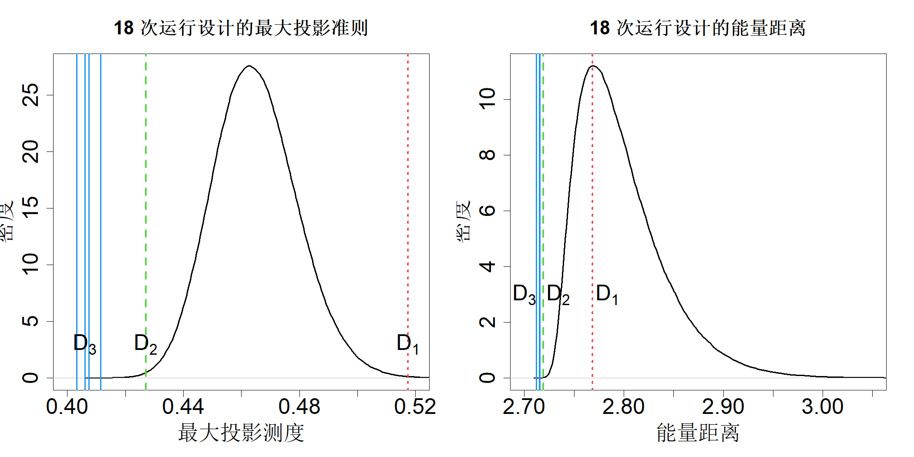

## 8.3 两级以上的设计

包含两个以上水平的实验十分常见，三水平实验尤其普遍。这是因为开展实验通常是为了改进现有系统，该系统中因子 $x$ 当前的运行取值为 $m$。工程师可能无法确定应当调低还是调高该因子。因此，工程师会希望在实验中选取两个水平：$m−\Delta$ 与 $m+\Delta$。但实验中同样必须纳入取值 $m$，以此获得对照基准，用于和现有工况进行比对，由此便得到三水平集合 $\{m−\Delta,m,m+\Delta\}$。本章中，我们将这三个水平记作 $\{1,2,3\}$ 或是 $\{0,0.5,1\}$。

一个包含三个水平的因子可以使用两个虚拟变量来表示：$d_1$ 和 $d_2$。可通过多种编码体系设定它们的取值，例如处理编码、赫尔默特编码以及正交多项式编码，具体如下所示（法拉维，2015，第 219 页）。

|$x$|$d_1$|$d_2$|
|:--:|---:|---:|
|1|0|0|
|2|1|0|
|3|0|1|

|$x$|$d_1$|$d_2$|
|:--:|---:|---:|
|1|-1|-1|
|2|1|-1|
|3|0|2|

|$x$|$d_1$|$d_2$|
|:--:|---:|---:|
|1|-1|1|
|2|0|-2|
|3|1|1|

同样，一个具有四个水平的因子可以使用三个虚拟变量来表示。四水平因子的三种编码方案（处理编码、赫尔默特编码以及正交多项式编码）如下所示。

|$x$|$d_1$|$d_2$|$d_3$|
|:--:|---:|---:|---:|
|1|0|0|0|
|2|1|0|0|
|3|0|1|0|
|4|0|0|1|

|$x$|$d_1$|$d_2$|$d_3$|
|:--:|---:|---:|---:|
|1|-1|-1|-1|
|2|1|-1|-1|
|3|0|-1|-1|
|4|0|2|3|

|$x$|$d_1$|$d_2$|$d_3$|
|:--:|---:|---:|---:|
|1|-3|1|-1|
|2|-1|-1|3|
|3|1|-1|-3|
|4|3|1|1|

徐与吴（2001）推广了最小偏差准则，用于各因子水平数不等的部分因子试验设计的最优选取。该研究基于唐与邓（1999）的前期工作，后者针对二水平非正则设计求解最小偏差设计。假定因子 $x_i$ 具有 $L_i$ 个水平，其中 $L_i=2,3,\dots$。第 $i$ 个因子可采用 $L_i-1$ 个虚拟变量表示。此时将全部方差分析模型写成式 (8.2) 的形式，用虚拟变量替代 $x_i$，并剔除同一因子内部虚拟变量之间的交互项。于是，对于给定的 $n$ 次试验设计 $D$，可得：

$$
\begin{align*}
\boldsymbol{y}&=\boldsymbol{X}\boldsymbol{\alpha}+\boldsymbol{\delta}\\
&=\boldsymbol{1}\alpha_0+\boldsymbol{X}^{(1)}\boldsymbol{\alpha}_1+\dots+\boldsymbol{X}^{(p)}\boldsymbol{\alpha}_p+\boldsymbol{\delta}
\end{align*}
$$

式中，$\boldsymbol{X}$ 为 $n\times\prod_{i=1}^{p}L_i$ 的全模型矩阵；$\boldsymbol{X}^{(1)}$ 是 $\boldsymbol{X}$ 中包含主效应列的子矩阵；$\boldsymbol{X}^{(i)}$，$i=2,\dots,p$ 则对应 $i$ 因子交互作用的子矩阵。

假设我们采用正交编码方案来获取虚拟变量，例如赫尔默特编码或正交多项式编码。对虚拟变量进行缩放处理，使得 $\boldsymbol{X}^{(1)}$ 的各列长度为 $n$。定义

$$
A_j(D)=\frac{1}{n^2}\lVert\boldsymbol{1}'\boldsymbol{X}^{(j)}\rVert^2,\quad j=1,\dots,p
$$

向量 $(A_1(D),\dots,A_p(D))$ 称为设计 $D$ 的广义字长模式。徐与吴（2001）提出的广义最小偏差准则，即依次最小化 $A_1(D),\dots,A_p(D)$。该准则对于两水平正规设计退化为原始最小偏差准则，对于两水平非正规设计则退化为唐与邓（1999）的最小 $G_2$‑偏差准则。

传统上，水平数大于二的试验采用正交表进行设计（拉奥，1947），田口玄一（1987）推动了正交表在工业试验中的广泛应用。关于正交表的详细内容可参阅赫达亚特等人（1999）的著作。

> **定义 8.1**：强度为 $t$ 的正交表 $\mathrm{OA}(n,L_1^{m_1},\dots,L_r^{m_r},t)$ 是一个 $n\times(m_1+\dots+m_r)$ 矩阵，其中 $m_i$ 列具有 $L_i$ 个水平，使得对于任意 $t$ 列，所有可能的水平组合在矩阵中出现的次数均相等。

表 8.1 中的二水平正规设计与表 8.2 中的非正规设计均为正交表的特例。徐与吴（2001）证明了如下结论。

> **定理 8.3**：设计 $D$ 是强度为 $t$ 的正交阵列，当且仅当 $A_1(D)=\cdots=A_t(D)=0$。

假设一名工程师想要对 4 个三水平因子开展试验，可开展的试验预算为 18 次。表 8.3 与表 8.4 分别给出试验次数为 9 和 18 的两张正交表 $\mathrm{OA}(9,3^4)$ 与 $\mathrm{OA}(18,2^13^7)$（按照惯例，强度为 2 的正交表会省略关于 t 的记号）。这两张正交表由 R 语言 DoE.base 程序包中的 oa.design 函数生成（格伦普英，2025）。由于该工程师最多可做 18 次试验，有两种可选方案：一是使用 $\mathrm{OA}(9,3^4)$ 并设置两次重复试验；二是将 4 个因子分配到 $\mathrm{OA}(18,2^13^7)$ 的第 2‑8 列中任意 4 列。想要精准估计各因子效应，哪一种方案更优？要解答该问题，我们可以计算这两组设计的广义字长模式。借助 DoE.base 包中的 GWLP 函数，第一种方案得到广义字长模式 $W(D_1)=(0,0,8,0)$；若在 18 次试验的正交表里把 4 个因子分配至第 2‑5 列，第二种方案得到 $W(D_2)=(0,0,3.5,0)$。显然，第二种设计效果要好得多。但该 18 次试验正交表含有 7 个三水平列，因此我们可以构造多种四因子设计。若将因子分配到第 3‑6 列，得到的广义字长模式为 $W(D_3)=(0,0,2,1.5)$，该设计实际上就是广义最小偏差设计（徐与吴，2001）。

> **表 8.3**：$\mathrm{OA}(9,3^4)$

|运行次数|1|2|3|4|
|:--:|--:|--:|--:|--:|
|1|1|1|1|1|
|2|1|2|3|2|
|3|1|3|2|3|
|4|2|1|3|3|
|5|2|2|2|1|
|6|2|3|1|2|
|7|3|1|2|2|
|8|3|2|1|3|
|9|3|3|3|1|

> **表 8.4**：$\mathrm{OA}(18,2^13^7)$

|运行次数|1|2|3|4|5|6|7|8|
|:--:|--:|--:|--:|--:|--:|--:|--:|--:|
|1|1|1|1|1|1|1|1|1|
|2|1|1|2|2|2|2|2|2|
|3|1|1|3|3|3|3|3|3|
|4|1|2|1|1|2|2|3|3|
|5|1|2|2|2|3|3|1|1|
|6|1|2|3|3|1|1|2|2|
|7|1|3|1|2|1|3|2|3|
|8|1|3|2|3|2|1|3|1|
|9|1|3|3|1|3|2|1|2|
|10|2|1|1|3|3|2|2|1|
|11|2|1|2|1|1|3|3|2|
|12|2|1|3|2|2|1|1|3|
|13|2|2|1|2|3|1|3|2|
|14|2|2|2|3|1|2|1|3|
|15|2|2|3|1|2|3|2|1|
|16|2|3|1|3|2|3|1|2|
|17|2|3|2|1|3|1|2|3|
|18|2|3|3|2|1|2|3|1|

正如 4.5.2 节所述，因子可以是定性因子或定量因子。该区别对二水平设计没有影响，但会作用于水平数大于二的设计。这是因为对于定性因子，水平的顺序无关紧要；而对于定量因子，设计的几何结构会随水平排序方式的不同而发生改变（程与叶，2004）。以 18 次试验的广义最小偏差设计 $D_3$ 为例，假设全部四个因子均为连续因子，通过对三个水平重新排序，可以由 $D_3$ 衍生出若干种设计。由于调换行与列不会改变设计本身，我们仅需对后三列做水平置换，由此可得到 $(3!)^3$ 种设计。但其中一半设计在几何意义上等价，因为水平顺序 $(1,2,3)$ 与 $(3,2,1)$ 会生成几何同构的设计。因此，我们实际只需生成 $(3!/2)^3$ 种设计。为研究这些设计的空间填充性质，我们可以按照式 (4.42) 计算离散因子的最大投影准则：

$$
\mathrm{MP}(D)=\left(\frac{1}{\binom{n}{2}}\sum_{i=1}^{n-1}\sum_{j=i+1}^{n}\frac{1}{\prod_{k=1}^{p}\left\{\left(\frac{x_{ik}-x_{jk}}{1/L_k}\right)^2+1\right\}}\right)^{1/p}
$$

该准则可借助 R 软件包 SFDesign 中的 maxpro.crit 函数进行计算（王与约瑟夫，2025c）。在全部 27 个准则值中，仅有 4 个互不相同，在图 8.3 左子图中以实心竖线标出。由此可见，水平置换会影响设计的空间填充效果。作为对比，图中同时以虚线和点线分别标出 $\mathrm{MP}(D_2)$ 与 $\mathrm{MP}(D_1)$，二者的数值远高于广义最小偏差设计的最大投影指标。我们还从 $3^4$ 全因子设计中抽取 18 行，生成一百万组 18 次试验的设计，其最大投影指标的分布密度绘制于同一幅图中。可以看到，4 组互不相同的广义最小偏差设计表现优于这一百万组随机生成的设计。针对这些设计，以全因子设计为参照计算式 (5.10) 定义的能量距离，结果展示在图 8.3 的右子图中，所得结论保持一致。

> **图 8.3**：该密度图展示了 100 万组随机生成的 18 次试验设计对应的最大投影准则（左侧）与能量距离准则（右侧）。正交阵列 D1、D2、D3 的准则值分别以点竖线、虚竖线和实竖线表示。图中同时展示了对 D3 水平重排序后得到的各类不同准则数值

{width=67%}

有趣的是，设计 $D_1$（即 $\mathrm{OA}(9,3^4)$，每个试验点重复运行两次）的表现要差于大多数随机生成的 18 次试验设计。这表明在部分因子试验中重复试验并无益处，这多少有些反直觉，因为重复试验被视作试验的一项基本原则（吴与滨田，2021，第 1.3 节）。造成该现象的原因可能是我们假设噪声方差 $\sigma^2$ 已知，且我们的重点是精准估计均值模型。然而 $\sigma^2$ 仅为单个参数，仅通过对单个试验点重复就可以完成估计。如果我们还需要像稳健参数设计试验那样，将方差建模为输入变量的函数，那么每个试验点都进行重复才会发挥作用（吴与滨田，2021，第11章）。比努瓦等人（2019）针对异方差高斯过程模型拟合场景，研究了重复试验的应用。

周与徐（2014）在广义字长模式与空间填充测度之间建立了如下理论联系。

> **定理 8.4**：假设 $$\phi(D)=\frac{1}{n^2}\sum_{i=1}^{n}\sum_{j=1}^{n}\prod_{k=1}^{p}f(x_{ik},x_{jk})$$ 为空间填充测度，其中函数 $f(\cdot,\cdot)$ 满足：对任意 $x\neq y\in[0,1]$，有 $$f(x,y)\ge 0,\quad f(x,x)+f(y,y)>f(x,y)+f(y,x)$$ 那么对于具有 $L$ 个水平的 $n$ 次运行 $p$ 因子设计，在全部水平置换下计算得到的 $\phi(D)$ 的平均值 $$\overline{\phi}(D)=\left[\frac{c_1(c_2+L-1)}{L^2(L-1)}\right]^p\sum_{i=0}^{p}\left(\frac{c_2-1}{c_2+L-1}\right)^iA_i(D)$$ 式中 $c_1=\sum_{k=0}^{L-1}\sum_{l\neq k}f(k,l)$，$c_2=(L-1)\sum_{k=0}^{L-1}f(k,k)/c_1$，且 $A_0(D)=1$。

该结果表明，依次最小化 $A_1(D)$、$A_2(D)$……能够生成具备优良空间填充度量的设计。因此，为获取性能良好的空间填充部分因子设计，周与徐（2014）提出了如下两步法：（1）构造广义最小偏差设计；（2）对该设计的水平进行重排序，提升其空间填充特性。广义最小偏差设计可通过 R 语言程序包 DoE.base（格罗姆平，2025）得到。

传统上，响应面设计（迈尔斯等人，2016）常用于连续因子，例如中心复合设计（CCD）（博克斯与威尔逊，1951）。针对四因子的小型中心复合设计可按如下方式构建：首先采用 3 分辨度的部分因子设计（不含四字母交互项）作为立方点；再为每个因子添加两个轴点，之后向设计中补充若干中心点。对于实验区域 $[-1,1]^p$，因子 $x_i$ 的两个轴点可表示为 $(0,\dots,\pm\alpha,\dots,0)$，其中 $\pm\alpha$ 位于第 $i$ 个位置。通常取 $\alpha=n_c^{1/4}$，$n_c$ 为立方点的数量。但该取值仅适用于球形实验区域。对于立方体区域下的中心复合设计，可令 $\alpha=1$，这类设计称为面心中心复合设计。中心点是长度为 $p$ 的全零向量。以由生成元 $x_4=x_1x_2$ 的 $2^{4-1}$ 设计搭配两个中心点所构造的面心中心复合设计为例，该中心复合设计共包含 $8+8+2=18$ 次试验。计算得到其最大投影准则值为 0.47，能量距离为 2.73，二者均高于图 8.3 中的 $D_2$ 与 $D_3$。由此可见，中心复合设计的空间填充性质劣于空间填充正交阵列。莫里斯（2000）提出一类三水平设计：该类设计在小型二水平部分因子设计基础上，依次生成最大最小距离设计点进行扩充。这类设计的空间填充指标通常优于中心复合设计，但并不具备采用周与徐（2014）两步法得到的空间填充正交阵列所拥有的模型稳健性。

在实验设计中兼顾定量与定性因素的另一种方法，是采用上一节介绍的贝叶斯方法。约瑟夫与德拉尼（2007）针对水平数大于二的因子，借助式 (8.7) 推导得到模型参数的先验分布。余和约瑟夫（2025a）的研究给出了结合该类先验分布与非负绞罚法的实验分析。约瑟夫等人（2009）阐述了如何利用这些先验分布，构造适用于二水平与四水平因子、基于贝叶斯思想的最小偏差设计。康和约瑟夫（2009）运用上述先验分布，为稳健参数设计实验完成单数组的最优选取。