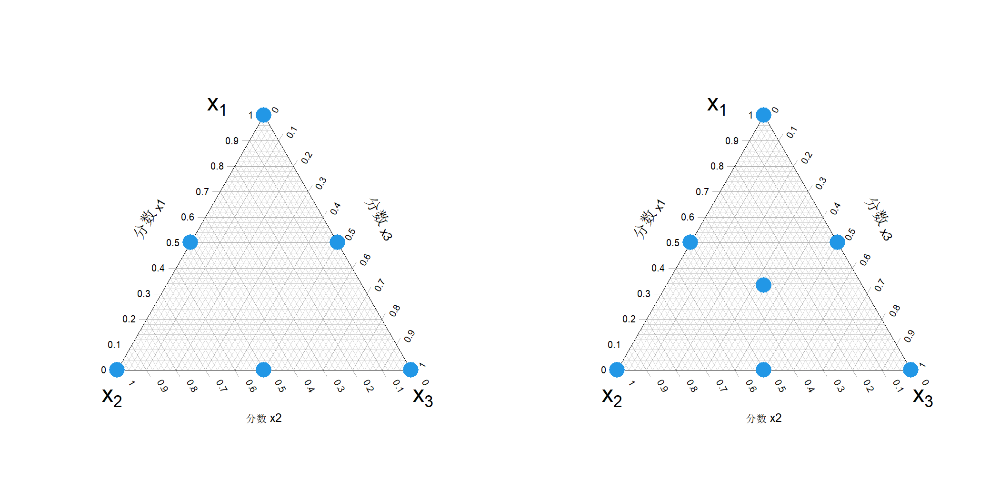
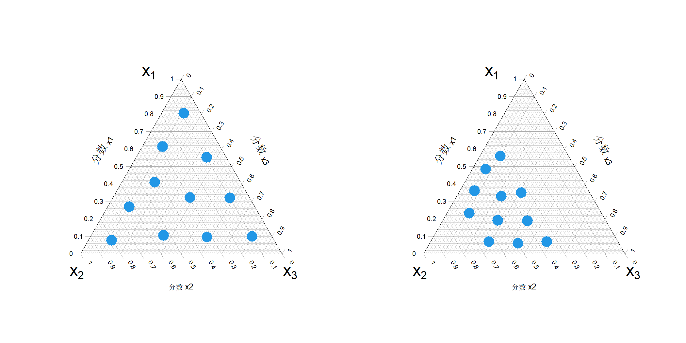

## 8.4 混合设计

许多产品是通过混合或调配多种组分或原料制成的，例如洗发水或涂料。关于混料试验的设计与分析的详细内容可参见康奈尔（1990）、劳森（2014）以及迈尔斯等人（2016）的著作。尽管文献中报道的绝大多数混料试验属于物理试验（皮佩尔，2006），但我们很快会发现，第二部分介绍的设计方法对这类试验十分适用。

设混合物中含有 $p$ 个组分，$x_i\in[0,1]$ 表示第 $i$ 个组分的占比。于是必有

$$
\sum_{i=1}^{p}x_i=1
\tag{8.11}
$$

因此，我们需要在如下区域内设计试验：

$$
\mathcal{S}=\left\{\boldsymbol{x}\in[0,1]^p:\sum_{i=1}^{p}x_i=1\right\}
$$

虽然我们已在 4.5.1 节与 4.6.2 节讨论过约束区域下构造空间填充设计的相关方法，但这些方法仅对不等式约束有效。式 (8.11) 中的等式约束使得集合 $\mathcal{S}$ 成为 $p$ 维空间内的 $(p-1)$ 维流形，给候选样本的生成带来了困难。

$p$ 分量单形格子设计（谢费，1958）记为 $\mathrm{SLD}(p,m)$，该设计通过对每个因子取 $m+1$个等间隔数值：

$$
\left\{0,\frac{1}{m},\frac{2}{m},\dots,1\right\}
$$

构建而成。利用这些水平可以构造全因子设计，共包含 $(m+1)^p$ 个试验点。但其中大量试验点会落在可行域 $S$ 之外。因此，仅保留落在可行域 $S$ 内的点，由此得到单形格子设计。举例：考虑三组分混合物的单形格子设计，取 3 个等间隔水平，即 $p=3$、$m=2$。构造 $\mathrm{SLD}(3,2)$ 时，先构建 $3^3$ 全因子设计，剔除所有可行域 $S$ 以外的点，得到 6 个试验点：

$$
\mathrm{SLD}(3,2)：\{(1,0,0),(0,1,0),(0,0,1),(0.5,0.5,0),(0.5,0,0.5),(0,0.5,0.5)\}
$$

该组点在图 8.4 左图的单形坐标系（三元相图）中给出。一般情况下，$\mathrm{SLD}(p,m)$ 的试验点数量为 $\binom{p+m-1}{m}$。该设计可借助 R 语言 mixexp 程序包生成（劳森与威尔登，2024）。

> **图 8.4**：（左）两级单形格子设计；（右）两级单形重心设计

{width=67%}

谢费（1963）还提出了另一种称为单形‑重心设计的方案。由 $p$ 个组分构成的单形‑重心设计记为 $\mathrm{SCD}(p)$，包含 $p$ 个纯组分、$\binom{p}{2}$ 个二元混合物、$\binom{p}{3}$ 个三元混合物等，以及整体重心点 $(1/p,\dots,1/p)$。因此，设计点总数为 $2^p-1$。三组分的单形‑重心设计共有 7 个点：

$$
\mathrm{SCD}(3):\left\{(1,0,0),(0,1,0),(0,0,1),(0.5,0.5,0),(0.5,0,0.5),(0,0.5,0.5),\left(\frac13,\frac13,\frac13\right)\right\}
$$

如图 8.4 右侧子图所示。该设计也可通过 mixexp 程序包生成。

当 $p$ 取值较大时，单纯格点设计（SLD）与单纯形中心设计（SCD）的试验次数会变得十分庞大，难以实现。此外，单纯格点设计和单纯形中心设计的样本点大多集中在边界处，无法在单纯形 $S$ 内部实现均匀分布。为此，王与方（1990）提出在单纯形上使用均匀设计。借助逆概率变换方法，他们证明：若 $\boldsymbol{u}\in U(0,1)^{p-1}$，则通过下述变换（参见方与王（1993，第 5 章））

$$
\begin{align*}
x_1&=1-u_1^{1/(p-1)}\\
x_i&=\left(\prod_{j=1}^{i-1}u_j^{1/(p-j)}\right)\left\{1-u_i^{1/(p-i)}\right\},\quad i=2,\dots,p-1\\
x_p&=\prod_{j=1}^{p-1}u_j^{1/(p-j)}
\tag{8.12}
\end{align*}
$$

得到的 $\boldsymbol{x}$ 服从单纯形上的均匀分布。据此，我们可以先采用 5.1 节介绍的方法生成 $[0,1]^p$ 空间内的均匀设计，再通过式 (8.12) 的变换，得到单纯形 $S$ 上的均匀设计。

然而，正如博尔科夫斯基与皮佩尔（2009）所指出的，当各组分存在额外约束条件时，该变换方法效果可能不佳。可参见表 8.6 中 16 组分玻璃混合物实验里的八项约束条件。在更为复杂的实验（例如混合之混合实验，康等人，2011）中，约束条件会变得愈发复杂。因此，需要一种更为灵活的方法来构造均匀设计。宁等人（2011）提出，利用式（8.12）在约束区域内生成候选点，再采用基于聚类的方法得到最终设计。但聚类步骤会改变数据分布，所得设计点未必满足均匀性。我们可以采用 5.2.2 节介绍的支撑点来获取性能良好的均匀设计。

我们将通过一个简单示例来讲解该方法。首先，考虑一个无任何约束的三分量混料设计问题，我们需要生成 11 个点。首先使用 R 语言包 spacefillr（摩根‑沃尔，2025）生成 10000 个索博尔点，再利用式 (8.12) 将其转换为集合 $S$ 上的均匀点。接着，借助 R 语言包 support（马克，2018）计算支撑点，结果如图 8.5 左图所示。接下来引入约束条件：

$$
0.3\le x_1+x_2\le0.7
$$

我们可以剔除约束区域以外的点，得到约 4010 个可行候选点。由这些候选点得到的支撑点如图 8.5 右图所示，该设计效果表现良好。

> **图 8.5**：单纯形中无任何附加约束（左侧）与存在约束（右侧）条件下的 11 个支撑点

{width=67%}