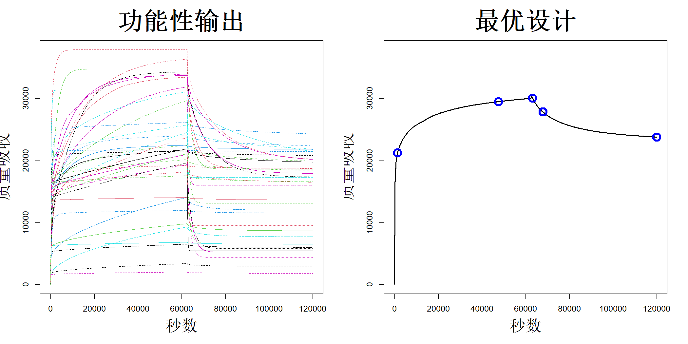

### 9.1.2 计算开销大的模型

当基于物理的模型 $h$ 计算成本较高时，例如式 (9.1) 中的反应‑扩散模型，式 (9.11) 或 (9.13) 中的优化过程会变得十分耗时且难以实现。因此，在求解最优设计之前，我们需要开展计算机实验，并采用代理模型对 $h$ 进行近似。

与物理实验不同，在计算机实验中我们既可以修改输入变量，也可以修改校准参数。设 $\boldsymbol{z}=(\boldsymbol{x}',\boldsymbol{\eta}')'$，$D_1=\{\boldsymbol{z}_1,\dots,\boldsymbol{z}_N\}$ 为该计算机实验的试验设计。我们可以采用第 3‑7 章介绍的方法来构建该实验设计。令 $\boldsymbol{y}=(y_1,\dots,y_N)'$ 为实验输出。和前文一致，假设 $h(\boldsymbol{z})\sim\mathrm{GP}(\mu,\tau^2R(\cdot))$。则后验均值为：

$$
\begin{align*}
\widehat{h}(\boldsymbol{x};\boldsymbol{\eta})&=\widehat{\mu}+\boldsymbol{r}(\boldsymbol{z})'\boldsymbol{R}^{-1}(\boldsymbol{y}-\widehat{\mu}\boldsymbol{1}_N)\\
&=\widehat{\mu}+\sum_{i=1}^{N}c_iR(\boldsymbol{z}-\boldsymbol{z}_i)
\end{align*}
$$

其中 $\boldsymbol{c}=\boldsymbol{R}^{-1}(\boldsymbol{Y}-\widehat{\mu}\boldsymbol{1}_N)$ 在乘积相关结构 $R(\cdot)=\prod_{l=1}^{p}R_l^x(\cdot)\prod_{l=1}^{q}R_l^{\eta}(\cdot)$ 下，对校准参数的偏导数可简便求得：

$$
\begin{align*}
\frac{\partial}{\partial\eta_j}\widehat{h}(\boldsymbol{x};\boldsymbol{\eta})&=\sum_{i=1}^{N}c_i\frac{\partial}{\partial\eta_j}R(\boldsymbol{z}-\boldsymbol{z}_i),\\
&=\sum_{i=1}^{N}c_iR(\boldsymbol{z}-\boldsymbol{z}_i)\frac{\partial}{\partial\eta_j}\log R_j^{\eta}(\eta_j-\eta_{ij}),\quad j=1,\dots,q
\end{align*}
$$

该偏导数也可通过有限差分法与理查森外推法做数值计算，R 语言包 numDeriv 已经实现了上述算法（吉尔伯特和瓦拉丹，2019）。此时，利用式 (9.11) 或式 (9.13) 就可以高效生成最优试验设计。

考虑式 (9.1) 中的反应‑扩散模型。为简化分析，我们探讨仅利用时间变量（即 $x=t$）对物理实验开展最优设计的方法。首先，需要开展计算机实验以近似该反应‑扩散模型。为此，黄等人（2021）针对五个校准参数 $\eta=(\log D_0,C_s,C_0^\text{polymer},K',\log k)'$ 采用 50 次试验的最大投影设计，其中 $D_0\in[10^{-12},10^{-9}]$，$C_s\in[4\times10^{-3},5\times10^{-3}]$，$C_0^\text{polymer}\in[5\times10^{3},6\times10^{-3}]$，$K'\in[500,2500]$，$k\in[10^{-3},10]$。对每组试验求解式 (9.1)，可得到质量吸收量关于时间的函数响应。输出结果如图 9.1 左图所示，其中 $\tau=62500$ 秒。每个函数输出对应 6601 个时间点，因此数据点总数为 $50\times6601=330050$。针对如此大规模的数据拟合高斯过程（GP）模型会带来较高的计算开销。本书第四部分将介绍数据压缩技术以及适用于大数据的近似高斯过程模型拟合方法。不过，由于输出具备函数型特性，此处可以采用一种效率更高的方法（洪等人，2015）。

> **图 9.1**：（左）50 次最大投影运行的反应‑扩散模型输出结果。（右）$\boldsymbol{\eta}=\boldsymbol{\eta}^0$ 以及局部 D‑最优设计下的输出结果（蓝色圆圈）

{width=67%}

令 $N=50$，$M=6601$，$\boldsymbol{Y}$ 为 $N\times M$ 的输出矩阵。拟合高斯过程（GP）模型的主要难题源于相关矩阵 $\boldsymbol{R}$ 的规模，该矩阵维度为 $NM\times NM$。借助克罗内克积，我们可将计算复杂度从 $\mathcal{O}(M^3N^3)$ 降至 $\mathcal{O}(M^3+N^3)$，计算开销得到大幅缩减。以下矩阵代数相关结论十分有用（彼得森和佩德森，2006，第 60 页），其中部分结论我们已在第 8 章中使用过。

> **引理 9.1**：设 $\boldsymbol{A}$ 为 $N\times N$ 矩阵，$\boldsymbol{B}$ 为 $M\times M$ 矩阵，$\boldsymbol{Y}$ 为 $N\times M$ 矩阵。定义克罗内克积与向量化算子：$$\boldsymbol{A}\otimes\boldsymbol{B}=\begin{bmatrix}A_{11}\boldsymbol{B}&\cdots&A_{1N}\boldsymbol{B}\\\vdots&\ddots&\vdots\\A_{N1}\boldsymbol{B}&\cdots&A_{NN}\boldsymbol{B}\end{bmatrix},\quad\mathrm{vec}(\boldsymbol{Y})=\begin{pmatrix}\boldsymbol{Y}_1\\\vdots\\\boldsymbol{Y}_M\end{pmatrix}$$ 其中 $\boldsymbol{Y}_i$ 是 $\boldsymbol{Y}$ 的第 $i$ 列。则：（1）$(\boldsymbol{A}\otimes\boldsymbol{B})'=\boldsymbol{A}'\otimes\boldsymbol{B}'$。（2）$(\boldsymbol{A}\otimes\boldsymbol{B})^{-1}=\boldsymbol{A}^{-1}\otimes\boldsymbol{B}^{-1}$。（3）$|\boldsymbol{A}\otimes\boldsymbol{B}|=|\boldsymbol{A}|^M|\boldsymbol{B}|^N$。（4）$(\boldsymbol{B}'\otimes\boldsymbol{A})\mathrm{vec}(\boldsymbol{Y})=\mathrm{vec}(\boldsymbol{A}\boldsymbol{Y}\boldsymbol{B})$。

令 $\boldsymbol{R}_\eta$ 为对应校准参数的 $N\times N$相关矩阵，$\boldsymbol{R}_t$ 为对应时间变量的 $M\times M$ 相关矩阵。于是，在乘积相关结构下，$\boldsymbol{R}=\boldsymbol{R}_t\otimes\boldsymbol{R}_\eta$，其中 $\boldsymbol{R}$ 是 $\mathrm{vec}(\boldsymbol{Y})$ 的相关矩阵。此时，如第 2 章所述，我们可以对高斯过程（GP）模型参数做如下估计：

$$
\begin{align*}
\widehat{\mu}&=\frac{\boldsymbol{1}_{NM}'\boldsymbol{R}^{-1}\mathrm{vec}(\boldsymbol{Y})}{\boldsymbol{1}_{NM}'\boldsymbol{R}^{-1}\mathrm{vec}(\boldsymbol{1}_N\boldsymbol{1}_M')}\\
&=\frac{\boldsymbol{1}_{NM}'(\boldsymbol{R}_t^{-1}\otimes\boldsymbol{R}_\eta^{-1})\mathrm{vec}(\boldsymbol{Y})}{\boldsymbol{1}_{NM}'(\boldsymbol{R}_t^{-1}\otimes\boldsymbol{R}_\eta^{-1})\mathrm{vec}(\boldsymbol{1}_N\boldsymbol{1}_M')}\\
&=\frac{\boldsymbol{1}_{NM}'\mathrm{vec}(\boldsymbol{R}_\eta^{-1}\boldsymbol{Y}\boldsymbol{R}_t^{-1})}{\boldsymbol{1}_{NM}'\mathrm{vec}(\boldsymbol{R}_\eta^{-1}\boldsymbol{1}_N\boldsymbol{1}_M'\boldsymbol{R}_t^{-1})}
\end{align*}
$$

$$
\begin{align*}
\widehat{\tau}^2&=\frac{1}{NM}(\mathrm{vec}(\boldsymbol{Y})-\widehat{\mu}\boldsymbol{1}_{NM})'(\boldsymbol{R}_t^{-1}\otimes\boldsymbol{R}_\eta^{-1})(\mathrm{vec}(\boldsymbol{Y})-\widehat{\mu}\boldsymbol{1}_{NM})\\
&=\frac{1}{NM}(\mathrm{vec}(\boldsymbol{Y})-\widehat{\mu}\boldsymbol{1}_{NM})'\mathrm{vec}\{\boldsymbol{R}_\eta^{-1}(\boldsymbol{Y}-\widehat{\mu}\boldsymbol{1}_N\boldsymbol{1}_M')\boldsymbol{R}_t^{-1}\}
\end{align*}
$$

相关参数 $\boldsymbol{\theta}=(\boldsymbol{\theta}_\eta',\theta_t')'$ 的估计为：

$$
\begin{align*}
\widehat{\boldsymbol{\theta}}&=\argmin_{\boldsymbol{\theta}}\{NM\log\tau^2+\log|\boldsymbol{R}|\}\\
&=\argmin_{\boldsymbol{\theta}}\{NM\log\tau^2+M\log|\boldsymbol{R}_\eta|+N\log|\boldsymbol{R}_t|\}
\end{align*}
$$

预测器可化简为：

$$
\begin{align*}
\widehat{h}(t;\boldsymbol{\eta})&=\widehat{\mu}+(\boldsymbol{r}_t(t)\otimes\boldsymbol{r}_\eta(\boldsymbol{\eta}))'(\boldsymbol{R}_t^{-1}\otimes\boldsymbol{R}_\eta^{-1})(\mathrm{vec}(\boldsymbol{Y})-\widehat{\mu}\boldsymbol{1}_{NM})\\
&=\widehat{\mu}+(\boldsymbol{r}_t(t)'\otimes\boldsymbol{r}_\eta(\boldsymbol{\eta})')\mathrm{vec}\{\boldsymbol{R}_\eta^{-1}(\boldsymbol{Y}-\widehat{\mu}\boldsymbol{1}_N\boldsymbol{1}_M')\boldsymbol{R}_t^{-1}\}\\
&=\widehat{\mu}+\boldsymbol{r}_\eta(\boldsymbol{\eta})'\boldsymbol{R}_\eta^{-1}(\boldsymbol{Y}-\widehat{\mu}\boldsymbol{1}_N\boldsymbol{1}_M')\boldsymbol{R}_t^{-1}\boldsymbol{r}_t(t)
\tag{9.14}
\end{align*}
$$

尽管计算量已经得到大幅缩减，但当 $M$ 取值较大时（本例中 $M=6601$），计算依旧开销巨大。若在等间隔时间点观测函数输出，则可借助指数相关函数进一步简化该计算（洪等人，2015）：

$$
R_t(t_i-t_j)=\exp\left(-\frac{|t_i-t_j|}{\theta_t}\right)
$$

设 $M$ 个时间点为 $\{0,1/(M-1),\dots,1\}$，并令 $\rho=\exp\{-1/((M-1)\theta_t)\}$，则：

$$
\boldsymbol{R}_t=\begin{bmatrix}
1&\rho&\rho^2&\cdots&\rho^{M-1}\\
\rho&1&\rho&\cdots&\rho^{M-2}\\
\vdots&\vdots&\vdots&\ddots&\vdots\\
\rho^{M-1}&\rho^{M-2}&\rho^{M-3}&\cdots&1
\end{bmatrix}
$$

对于该矩阵，其逆矩阵与行列式可显式求出：

$$
\boldsymbol{R}_t^{-1}=\begin{bmatrix}
1&-\rho&0&\cdots&0\\
-\rho&1+\rho^2&-\rho&\cdots&0\\
\vdots&\vdots&\vdots&\ddots&\vdots\\
0&0&0&\cdots&1
\end{bmatrix}
$$

且 $|\boldsymbol{R}_t|=(1-\rho^2)^M$。这一处理将计算复杂度从 $\mathcal{O}(N^3+M^3)$ 降至 $\mathcal{O}(N^3+MN^2)$。

遗憾的是，这 6601 个时间点并非等间距分布，这是因为在区间 $[0,5000]$ 内采集了更多数值，以便准确捕捉响应的快速变化。为简化计算，我们从区间 $[0,120000]$ 中采样 1001个等间距点，并通过最近邻预测器得到每次运行对应的响应值。此时我们便可利用式 (9.14) 中 $\boldsymbol{R}_t^{-1}$的显式表达式，高效完成输出预测。

由于需要估计五个校准参数，五点设计大概率为最优设计。设 $\boldsymbol{\eta}^0=(0.5,\dots,0.5)'$ 为初始猜测值，其中试验区域被缩放至 $[0,1]^5$。随后可借助 ICAOD 程序包（马苏迪等人，2022），由式 (9.11) 得到局部 D‑最优设计。设计点展示于图 9.1 的右侧面板，叠加在由 $\boldsymbol{\eta}=\boldsymbol{\eta}^0$ 生成的响应结果之上。对于该设计，当 $i=1,\dots,5$ 时，$w_i\approx0.2$。可以看出，这些设计点的位置符合直观逻辑，似乎能够捕捉函数输出的部分显著特征。但在该特定应用场景中，工程师可以测得全部时间域内的质量吸收量。在其他应用场景下，谨慎选取时间点十分关键。例如，在二氧化硫混合过程中，必须采集样品送至实验室，再通过滴定法测定浓度，该过程耗费大量人力与时间。因此，二氧化硫的浓度仅能在少数选定时间点进行观测。

可通过

$$
\widehat{\boldsymbol{\eta}}=\argmin_{\boldsymbol{\eta}}\sum_{i=1}^{n}\{y_i-\widehat{h}(t_i;\boldsymbol{\eta})\}^2
$$

估计校准参数，其中 $\widehat{h}(t;\boldsymbol{\eta})$ 由式 (9.14) 给出，$\boldsymbol{y}=(y_1,\dots,y_n)'$ 为物理实验的输出结果。但由于 $\widehat{h}(t;\boldsymbol{\eta})$ 仅基于 50 次运算得到，该函数近似结果可能不够精确。黄等人（2021）采用贝叶斯优化，通过在试验设计中序贯增加运算次数求解 $\widehat{\boldsymbol{\eta}}$。与 7.2 节介绍的方法不同，他们对 $h(t;\eta)$ 建立高斯过程模型，而非对误差平方和建模。事实上，他们结合函数主成分分析，提出期望改进算法，用以高效最小化 $\int\{y(t)-h(t;\eta)\}^2\mathrm{d}t$。关于该方法的另一项实际应用可参见黄等人（2025）的研究。