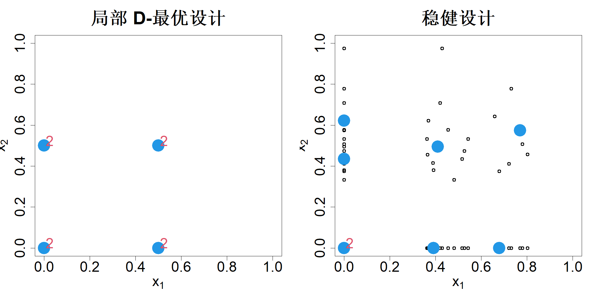

## 9.2 稳健设计

为求得最优设计，我们必须对未知校准参数做出初始猜测。倘若猜测有误，得到的设计就可能达不到最优效果。我们还假设基于物理的模型为真实模型，但实际情况中几乎不会如此。因此，在假定该模型为真实模型的前提下得到的最优设计，其实际效果可能远非最优。本节将介绍如何得到兼顾参数与模型不确定性的鲁棒设计。

### 9.2.1 参数不确定性

考虑式 (9.12) 中的双因子指数模型。德特等人（2022）证明 D‑最优设计为

$$
D=\begin{bmatrix}
0&0\\1/\eta_1&0\\
0&1/\eta_2\\1/\eta_1&1/\eta_2
\end{bmatrix}
$$

其中 $i=1,\dots,4$ 时权重 $w_i=1/4$。在上一节中，我们假定 $\boldsymbol{\eta}=(0,2,2)'$，生成了局部 D‑最优设计。显然，$\eta_0$ 的选取不会影响结果，但 $\eta_1$ 与 $\eta_2$ 的选取至关重要。

假设我们的试验预算为 8 次运行。那么，初始猜测值 $\boldsymbol{\eta}^0=(0,2,2)'$ 对应的局部 D‑最优设计将包含 4 个试验点，每个点重复 2 次，如图 9.2 左侧子图所示。现假设采用以下分布描述我们对参数的不确定性：$\eta_1\sim\mathcal{U}(1,3)$，$\eta_2\sim\mathcal{N}(2,1/2^2)$。我们可以从上述不确定性分布中抽取 $N$ 个样本，并得到对应的局部 D‑最优设计。由于求解一般情形下的局部 D‑最优设计计算量较大，我们可以利用式 (5.11) 中的支撑点获取少量优质代表性样本，以此降低计算开销。这 $N$ 组局部 D‑最优设计点以黑色圆圈形式呈现在图 9.2 右侧子图中。可以观察到这些设计点差异很大，这表明由 $\boldsymbol{\eta}^0=(0,2,2)'$ 生成的局部 D‑最优设计效果可能很差。

> **图 9.2**：（左）双因子指数模型的 8 次局部 D‑最优设计，每个试验点重复两次。（右）对参数不确定性具有鲁棒性的 8 次试验设计

{width=67%}

我们应当如何寻找对参数误设定具备鲁棒性的最优设计？德罗尔与斯坦伯格（2006）提出了一种简易思路：通过 $k$ 均值算法对 $4N$ 个点做聚类，以此获取鲁棒设计。该场景下所有点权重均等，因此聚类方法能够生效。但一般而言，局部 D‑最优设计中的各个点权重可以互不相同。此外，聚类操作会扭曲原始分布，可能无法生成可以良好代表该分布的样本点。为此，克里希纳等人（2022）提出采用式 (5.17) 中的重要支持点（黄等人，2022）求解鲁棒设计，并按照 $w\leftarrow w/N$ 调整权重。由此得到的 8 个点如图 9.2 右侧子图所示，该组点可视为对参数不确定性具备鲁棒性。