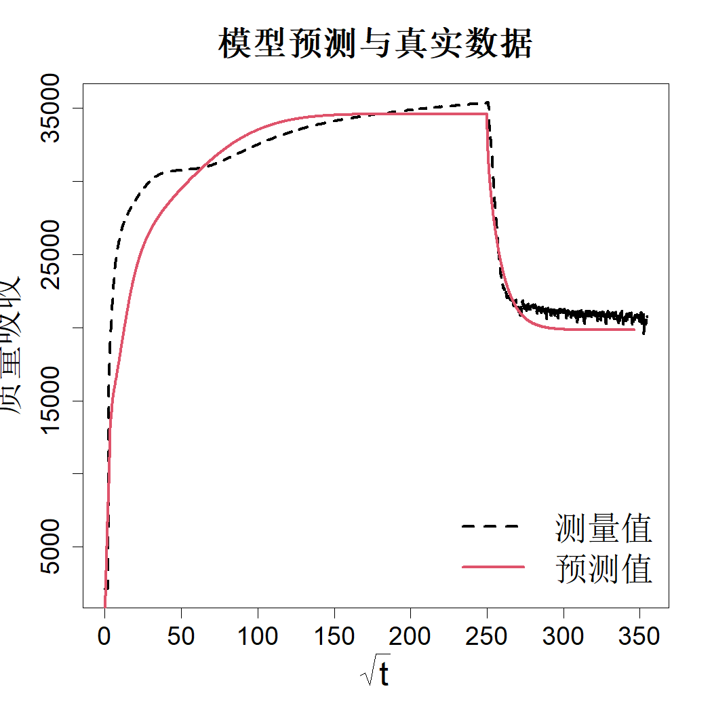
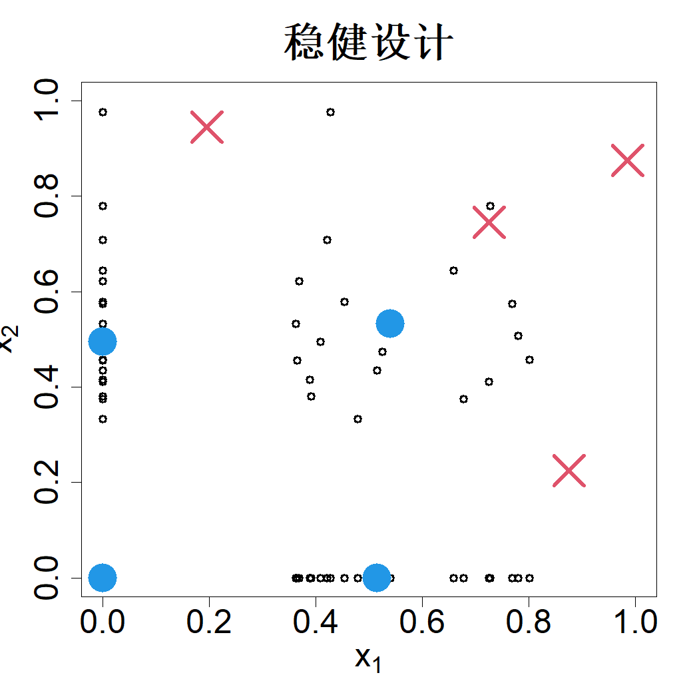

### 9.2.2 模型不确定性

正如乔治·博克斯的名言所述：“所有模型都是错误的，但其中部分模型具备实用价值”，模型 $h(x; \eta^*)$ 极有可能并非真实模型 $\mu(x)$。出现该情况的原因是，为简化建模工作、使其在数学层面易于处理，研究过程中做出了若干假设。部分假设在实际场景中未必成立，因此即便校准参数选取到最优，最终得到的模型也可能与现实情况不符。以气相渗透工艺为例：在 8.7 托蒸气压、130 摄氏度条件下，厚度为 483 纳米的聚合物薄膜的实测吸质数据，已在图 9.3 中重新给出。图中同时绘制了采用黄等人（2021）提出的贝叶斯函数优化方法估计参数后，反应‑扩散模型得到的预测结果。尽管预测结果整体与实测数据相吻合，但仍能看到明显偏差，尤其在吸附过程的初始阶段。

> **图 9.3**：物理实验测得的质量吸附量与经校准的反应‑扩散模型预测值

{width=33%}

任等人（2021）指出了造成模型偏差的若干潜在原因。推导反应‑扩散模型所采用的一项关键假设是可以忽略聚合物的溶胀与弛豫效应。然而，原位光谱椭偏测试结果清晰表明，渗透过程中会出现厚度变化。但该效应难以开展数学建模，因此被予以忽略。另一项建模假设为吸附过程产生的热量可以忽略不计，而在实际场景中该假设同样未必成立。

人们可以探究模型出现偏差的潜在原因，修正错误假设，并尝试构建更优的基于物理机理的模型。这是常规的工程处理思路，但该方法耗时可能过长。一种更简便的方案是针对观测得到的偏差拟合统计模型。肯尼迪与奥黑根（2001）提出采用高斯过程对偏差进行建模：

$$
\mu(\boldsymbol{x})=h(\boldsymbol{x};\boldsymbol{\eta}^*)+\delta(\boldsymbol{x}),\quad\delta(\boldsymbol{x})\sim\mathrm{GP}(0,\tau^2R(\cdot))
$$

据此，物理实验的数据可通过下式建模：

$$
y=h(\boldsymbol{x};\boldsymbol{\eta})+\delta(\boldsymbol{x})+\epsilon,\quad\delta(\boldsymbol{x})\sim\mathrm{GP}(0,\tau^2R(\cdot)),\quad\epsilon\stackrel{\text{iid}}{\sim}\mathcal{N}(0,\sigma^2)
\tag{9.15}
$$

借助该模型，可从数据中同时估计校准参数与模型偏差。需要注意，该模型包含数据的两类不确定性来源：$\delta(\boldsymbol{x})$ 表征因物理机理缺失带来的不确定性，$\epsilon$ 表征未知随机效应。在不确定性量化相关文献（德尔·基乌尔吉安、迪特莱夫森，2009）中，前者称为认知不确定性，后者称为随机不确定性。认知不确定性可通过在模型中补充更多物理机理或者采集更多数据得以降低；而随机不确定性无法消除，除非能够定位随机现象的来源（约瑟夫等人，2024）。

尽管肯尼迪‑奥哈根模型的预测效果较好，但拓与吴（2015，2016）指出，由于 $\boldsymbol{\eta}$ 与 $\delta(\boldsymbol{x})$ 之间存在不可识别性，校准参数的估计结果可能很差。普卢姆利（2017）提出采用正交高斯过程（普卢姆利与约瑟夫，2018）来解决该可识别性问题。顾与王（2018）、拓（2019）以及张与王（2025）也提出了处理模型校准中可识别性问题的其他方法。相关最新综述可参见宋与拓（2024）。一种更为简便的方法是采用两阶段流程进行模型拟合：首先利用最小二乘法估计校准参数，再对残差拟合高斯过程（约瑟夫与梅尔科特，2009；王等人，2017）。为清晰说明该方法，首先考虑解析模型的情形。此时 $\boldsymbol{\eta}$ 的最小二乘估计可按式 (9.7) 求得。残差表达式为：

$$
e_i=y_i-h(\boldsymbol{x}_i;\widehat{\boldsymbol{\eta}}),\quad i=1,\dots,n
$$

接下来按照 2.2.3 节所述，对数据集 $\{(\boldsymbol{x}_i,e_i)\}_{i=1}^n$ 拟合零均值高斯过程回归，可得：

$$
\begin{align*}
\widehat{\tau}^2&=\frac{1}{n}\boldsymbol{e}'(\boldsymbol{R}+\lambda\boldsymbol{I})^{-1}\boldsymbol{e}\\
(\widehat{\lambda},\widehat{\boldsymbol{\theta}})&=\argmin_{\lambda,\boldsymbol{\theta}}\{n\log\widehat{\tau}^2+\log|\boldsymbol{R}+\lambda\boldsymbol{I}|\}
\end{align*}
$$

其中 $\lambda=\sigma^2/\tau^2$。那么，新位置 $\boldsymbol{x}$ 

$$
\mu(\boldsymbol{x})|\boldsymbol{y}\sim\mathcal{}{N}(\widehat{y}(\boldsymbol{x}),s^2(\boldsymbol{x}))
$$

式中

$$
\begin{align*}
\widehat{y}(\boldsymbol{x})&=h(\boldsymbol{x};\widehat{\boldsymbol{\eta}})+\boldsymbol{r}(\boldsymbol{x})'(\boldsymbol{R}+\widehat{\lambda}\boldsymbol{I})^{-1}(\boldsymbol{y}-\boldsymbol{h}(\widehat{\boldsymbol{\eta}}))\\
s^2(\boldsymbol{x})&=\widehat{\tau}^2\{1+\widehat{\lambda}-\boldsymbol{r}(\boldsymbol{x})'(R+\widehat{\lambda}\boldsymbol{I})^{-1}\boldsymbol{r}(\boldsymbol{x})\}
\end{align*}
$$

该方法虽然简便，但忽略了 $\boldsymbol{\eta}$ 估计过程中存在的不确定性。不过相比于不可识别模型给出错误的 $\boldsymbol{\eta}$ 估计值，该问题的影响相对更小。

如果 $h$ 是计算成本很高的模型，我们可以先得到替代模型 $\widehat{h}(\boldsymbol{x};\boldsymbol{\eta})$，再沿用前述两阶段流程开展计算。但该方法会忽略替代模型预测结果中存在的不确定性。肯尼迪与奥黑根（2001）阐述了如何针对 $h$ 采用高斯过程，将这类不确定性纳入最终预测当中。张与约瑟夫（2014）以及约瑟夫和严（2015）提出了一种处理上述不确定性的近似方法，该方法可以无缝嵌入到两阶段流程中。

让我们回到试验设计问题。受两阶段方法的启发，克里希纳等人（2022）提出了一种用于求解抵御模型不确定性的稳健设计的简便思路。在上一节中，我们已经了解了如何求解用于估计校准参数的稳健设计，记该设计为 $D_\eta$。在第 4 章中，我们学习了用于拟合高斯过程（GP）模型的空间填充设计，这类设计对相关参数的错误设定具备稳健性。假设总试验次数预算为 $n$ 次，其中 $n_1$ 次已经用于 $D_\eta$ 设计。那么我们可以选取规模为 $n-n_1$ 次试验的空间填充设计，对 $D_\eta$ 设计进行扩充。下面我们将通过一个实例对该方法进行说明。

再次考虑式 (9.12) 中的双因子指数模型。假设我们共有 8 次试验预算。图 9.4 展示了 4 次试验（蓝色实心圆点），这些试验采用重要性支持点得到，而该支持点由局部 D‑最优设计生成，生成过程的样本满足 $\eta_1\sim\mathcal{U}(1,3)$ 与 $\eta_2\sim\mathcal{N}(2,1/2^2)$。剩余 4 次试验可通过式 (4.27) 中的序贯最大投影方法获取，借助 MaxPro 程序包中的 MaxProAugment 函数即可轻松生成（巴与约瑟夫，2018），这部分试验在图 9.4 中以红色叉号表示。该设计对参数不确定性与模型不确定性均具备稳健性。

> **图 9.4**：双因子指数模型的八组稳健设计。蓝色实心圆点为基于局部 D‑最优设计采用重要支撑点得到的试验点，该类试验点对参数不确定性具备稳健性。红色叉号为采用序列最大投影方法得到的试验点，可抵御模型不确定性带来的影响

{width=33%}

序贯设计是模型校准中一种颇具吸引力的方案。详见威廉姆斯等人（2011）、兰詹等人（2011）、卡斯蒂略等人（2019）以及叙雷尔等人（2024）的研究。