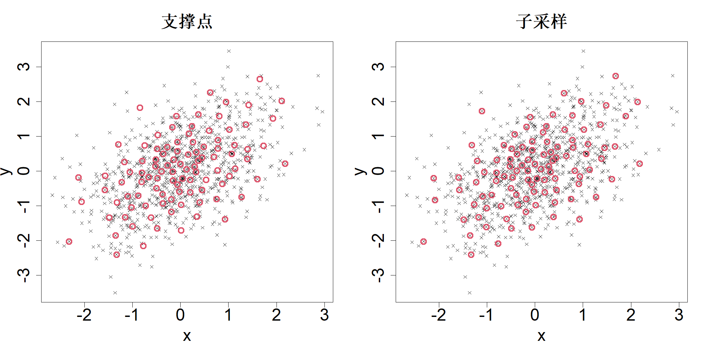
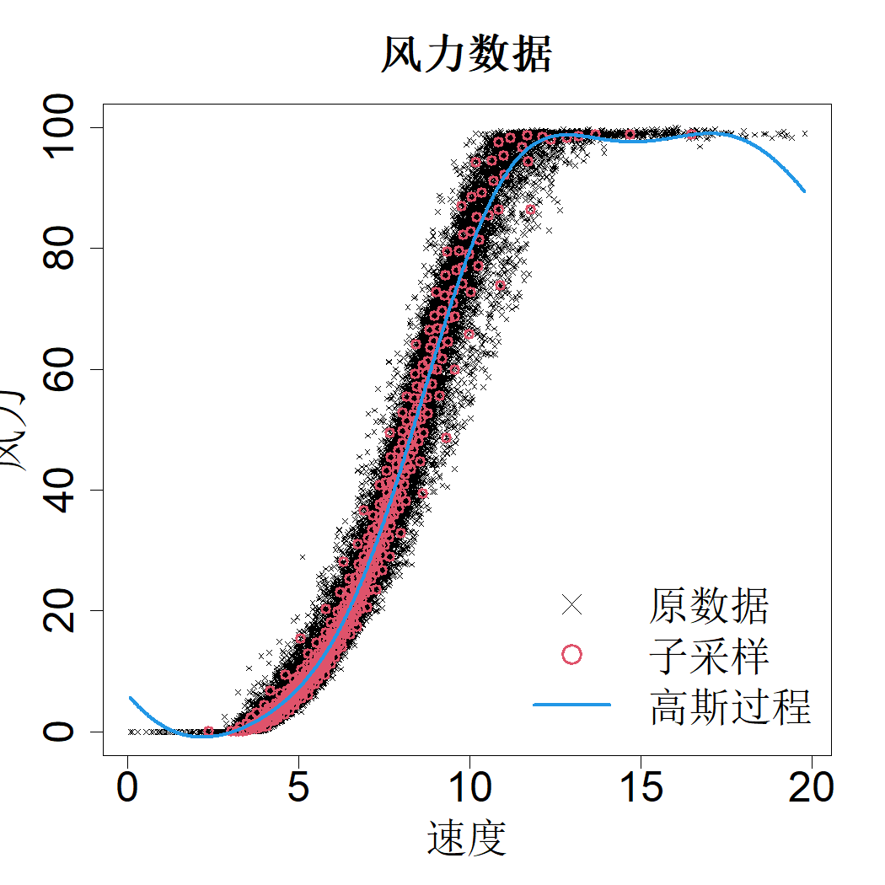

# 10 数据子采样

到目前为止，我们一直在探讨数据的采集来源问题。本章将讨论另一类问题：数据已经完成采集，但数据量过大，难以存储与分析，因此我们需要从中选取数据子集。选取子集时，我们希望尽可能少地丢失大数据中包含的信息。这与实验设计问题十分相似，但二者存在两点主要区别。第一，实验设计问题中的实验空间通常是连续的，而数据子集选择问题里的空间是离散的，因为大数据将我们的选择限定在有限个样本当中。第二，开展实验设计时无法获取响应变量，而在数据子集选择问题中，我们已经拥有响应变量。

## 10.1 基于支持点的子采样

由于我们手头的数据是总体的一个样本，该数据的子集也可看作子样本。获取子样本的一种常用方法是对数据矩阵的部分行进行均匀随机选取。但正如我们此前在实验设计问题中所看到的，随机样本的效果时好时坏。我们需要采用更优的抽样方法，以获得更加稳定可靠的结果。针对线性回归模型拟合，王等人（2019）提出通过最大化 D‑最优准则来选取样本。然而，该子样本仅对所假设的线性模型最优。倘若我们需要拟合其他模型，例如随机森林或者高斯过程模型，那么选取得到的该子样本将不再具备最优性。机器学习领域关于核心集的相关研究文献日益增多（费尔德曼，2019），但这类研究同样大多聚焦于特定参数模型。鉴于统计建模属于迭代过程，选取子样本时不依赖特定模型就显得至关重要。

实现该目标的一种可行方法是选取与原始数据集分布一致的子样本。此时，我们基于该子样本计算得到的所有特征，都将与原始数据集的特征大致相符。倘若能够实现分布的最优匹配，使用该子样本时的信息损失就会极小。因此，我们可以采用第 5 章介绍的相关技术，获取最优的代表性样本（陈等人，2012；马克和约瑟夫，2018c、b；商等人，2023）。

设数据集为 $\mathcal{D}=\{\boldsymbol{Z}_i=(\boldsymbol{X}_i,\boldsymbol{Y}_i)\}_{i=1}^{N}$，包含 $p$ 个输入变量与 $q$ 个输出变量。我们的目标是得到子样本 $S=\{\boldsymbol{z}_i=(\boldsymbol{x}_i,\boldsymbol{y}_i)\}_{i=1}^{n}$，满足 $n<N$，使得该子样本的经验分布尽可能贴近数据集的经验分布。首先对所有变量做标准化处理，使其方差为 1，保证欧氏距离具备有效意义。随后可采用能量距离（塞凯伊等人，2004）度量两个经验分布之间的距离：

$$
\mathrm{E\mathcal{D}}(\mathcal{S},\mathcal{D})=\frac{2}{nN}\sum_{i=1}^{n}\sum_{j=1}^{N}\|\boldsymbol{z}_i-\boldsymbol{Z}_j\|-\frac{1}{n^2}\sum_{i=1}^{n}\sum_{j=1}^{n}\|\boldsymbol{z}_i-\boldsymbol{z}_j\|-\frac{1}{N^2}\sum_{i=1}^{N}\sum_{j=1}^{N}\|Z_i-Z_j\|
$$

据此，可通过如下方式得到基于支撑点的子样本（马克、约瑟夫，2018c）：

$$
\mathcal{S}^{*}=\underset{\boldsymbol{z}_1,\cdots,\boldsymbol{z}_n\in \mathcal{D}}{\argmin}\left\{\sum_{i=1}^{n}\sum_{j=1}^{N}\|\boldsymbol{z}_i-\boldsymbol{Z}_j\|-\frac{1}{n^2}\sum_{i=1}^{n}\sum_{j=1}^{n}\|\boldsymbol{z}_i-\boldsymbol{z}_j\|\right\}
\tag{10.1}
$$

式 (5.13) 与式 (10.1) 的主要区别在于：前者执行连续优化，后者执行离散优化。因此，求解式 (5.13) 所使用的凸差规划方法无法直接套用。离散优化问题本身求解难度通常要大得多。获取子样本的核心初衷是降低处理大规模数据集的计算开销；倘若求解子样本的过程耗时过高，则该做法便失去意义。规避该问题的一种思路：先借助凸差规划，在数据集张成的连续空间内快速求解支撑点；再利用最近邻算法，从原始数据集中挑选距离上述支撑点最近的数据点。但简单的最近邻匹配方式会出现样本点重复选取的问题。为此，约瑟夫与瓦卡伊尔（2022）提出逐次单点最近邻算法，一旦某个数据点被选中，就将其从候选数据集内剔除。该算法已在 R 语言程序包 SPlit 的 subsample 函数中实现（瓦卡伊尔等人，2022），该函数借助 k‑d 树实现高效的最近邻匹配。

举个例子，观察图 10.1 中的 1000 个点（黑色叉号）。通过凸差规划得到的 100 个支撑点如左图所示，可以看到这些点并未落在原始数据点上。右图展示了采用序列最近邻算法得到的点，该结果是原始数据的一个子样本。基于支撑点的子采样（第 187 页）中，最近邻分配可能会对数据分布造成轻微失真，但该失真可以忽略不计。

> **图 10.1**：（左侧）通过连续优化得到的支撑点。（右侧）采用序列最近邻算法获取的子样本

{width=67%}

现在来研究基于风速预测风力发电机输出功率的问题（丁，2019）。数据集 1 包含 39195 条以 10 分钟为时间间隔采集的数据，相关数据绘制于图 10.2。假设我们希望为该数据拟合高斯过程模型。但该数据量对于高斯过程模型而言过大。为此，我们采用基于支撑点的子采样方法抽取 1% 的数据，并借助 rkriging 工具包，使用高斯相关函数拟合高斯过程模型（普通克里金模型）（黄与约瑟夫，2024）。数据降维耗时约 2 秒，在 392 个数据点上完成模型拟合耗时不足 1 秒，因此整体拟合可在 3 秒以内完成。若使用原始数据集进行拟合需要耗费数天时间，可见该方法大幅节约了计算时间。预测结果如图10.2所示。遗憾的是，模型在低风速与高风速区间的预测效果并不理想，这也是平稳高斯过程模型的一个公认问题。平稳高斯过程的常数均值假设会造成“均值回归”现象，即在数据稀疏区域，预测结果会趋向先验均值（约瑟夫，2006b）。我们将在第 11 章再次探讨该问题，说明如何对高斯过程模型进行改进，从而提升大数据集下的预测效果。

> **图 10.2**：该图展示了从规模为 39195 的风电数据集中抽取的 392 个子样本，以及利用该子样本拟合得到的高斯过程（GP）模型

{width=33%}

基于支撑点采样的另一项应用是随机规划中的场景缩减（杜帕科娃等人，2003）。设 $\{\boldsymbol{\Psi}_i\}_{i=1}^N$ 为随机变量 $\boldsymbol{\Psi}$ 的场景集合。此时随机优化问题可简化为：

$$
\min_{\boldsymbol{x}}\mathrm{E}[h(\boldsymbol{x};\boldsymbol{\Psi})]\approx \min_{\boldsymbol{x}}\left\{\frac{1}{N}\sum_{i=1}^{N}h(\boldsymbol{x};\boldsymbol{\Psi}_i)\right\}\approx \min_{\boldsymbol{x}}\left\{\frac{1}{n}\sum_{i=1}^{n}h(\boldsymbol{x};\boldsymbol{\psi}_i)\right\}
$$

其中 $\{\boldsymbol{\psi}_i\}_{i=1}^n$ 是该场景集合的一个子样本。由于 $n\ll N$，采用场景子样本开展优化，相比使用全部场景集，计算速度会大幅提升。巴里等人（2022）将该方法用于电网优化，克纳普等人（2023）将其应用于等离子体辐射探测器的优化。