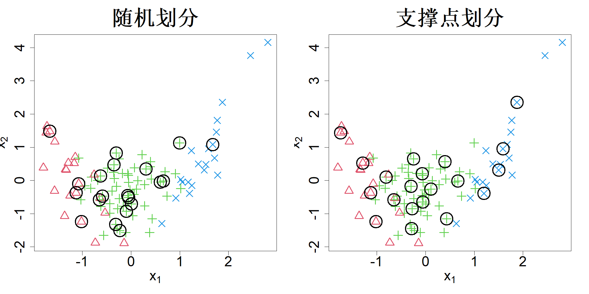

## 10.2 数据划分

假设我们有多个能够很好解释数据的模型。那么，我们应当将哪个模型投入实际部署？解答该问题的最优办法是部署全部模型，再从中挑选表现优异的模型，但在实际场景中该方案几乎无法实现。规避该问题的一种常用手段是把数据划分为两部分：训练集与测试集。随后仅使用训练数据拟合模型，借助测试数据选出最优模型。倘若模型部署到实际场景后数据分布保持不变（即不存在协变量偏移），我们获取的测试数据分布应当与完整数据集保持一致。从数据矩阵中随机抽取部分样本便是实现该要求的一种方式。举例来说，如果我们想要按照 80:20 的比例划分数据，可以随机抽取 20% 的样本构成测试集，剩余 80% 的样本作为训练集。然而，随机抽样会让测试结果产生过大波动，导致模型选择结果不可靠。

显然，我们可以利用空间填充设计的思想来挑选优质测试集，使其均匀覆盖整个数据集。有意思的是，空间填充设计最早的应用之一，便是从给定数据集中选取测试集。斯尼（1977）对式 (4.20)（肯纳德与斯通，1969）中的序贯最大最小设计做出改进，以此求解最优测试集。正如前文所见，最大最小设计会将样本点推向边界，由此得到的测试集分布相比原始数据集会离散得多。斯尼的思路是，将式 (4.20) 里逐点贪心选取样本点的操作，在训练集与测试集之间交替执行。该算法名为 DUPLEX，能够生成质量好得多的测试集。但约瑟夫与瓦卡伊尔（2022）的研究表明，DUPLEX 算法生成测试集的分布依旧可能和原始数据集差异显著。为保留原始数据分布并获得分布良好的测试集，约瑟夫与瓦卡伊尔（2022）提出采用上一节介绍的基于支撑点的子采样算法，并将该算法命名为 SPlit。尽管该算法和数据子采样所用算法一致，但二者的设计出发点完全不同，且该算法同样适用于小规模数据集。

举例来说，我们采用约瑟夫与瓦卡伊尔（2022）构建的包含 100 个样本点的合成数据集。该数据集含有两个输入变量（$x_1$ 和 $x_2$）以及一个具有三个类别的分类输出变量 $y$。图 10.3 绘制了该数据集，三类样本分别用红色三角形、绿色加号和蓝色叉号表示。假设我们需要按照 80:20 的比例对该数据集进行划分。R 语言 SPlit 包中的 SPlit 函数（瓦卡伊尔等人，2022）会采用 8.3 节介绍的赫尔默特编码自动处理分类变量，通过凸差规划计算支撑点，并利用序列最近邻算法筛选出子样本。由此得到的 20 个测试样本点展示在图 10.3 的右侧子图中，左侧子图则为随机划分得到的测试集。可以看出，相较于随机划分的测试集，支撑点划分得到的测试集分布更加均衡，也更能代表原始数据集。这有助于更精准地计算泛化误差，也能够让最优模型的选取过程具备更高的稳定性。

> **图 10.3**：通过随机采样（左侧）和支撑点划分（右侧）选取的测试点（圆形）。三种响应类别分别以红色三角形、绿色加号和蓝色叉号表示

{width=67%}