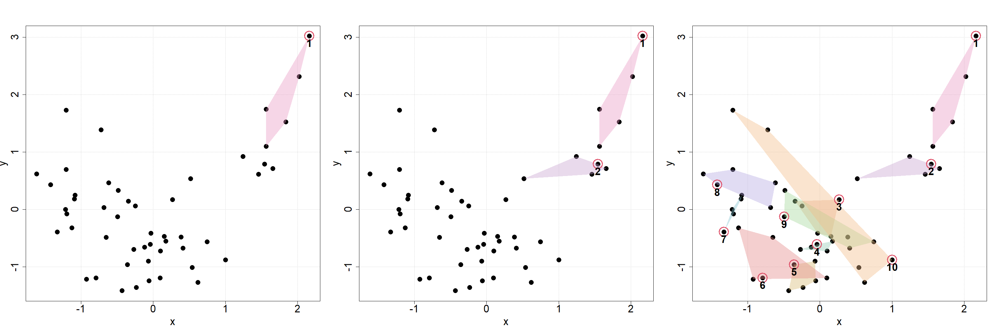
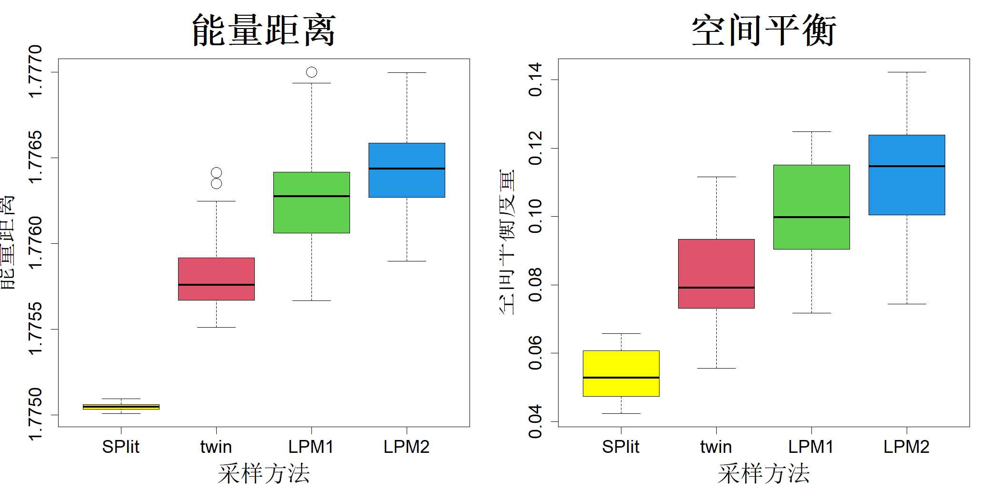

## 10.3 数据孪生

从 $N$ 个数据点中选取 $n$ 个支持点的计算复杂度为 $\mathcal{O}(pn(n+N)m/P)$，其中 $m$ 为凸差规划所用的迭代次数，$P$ 为可用于并行计算的处理器核心数。构建 kd‑树的平均复杂度为 $\mathcal{O}(pN\log N)$。因此，基于支持点的子采样或拆分操作的平均复杂度为 $\mathcal{O}(pN\log N+pn(n+N)m/P)$。令 $\gamma=n/N$为拆分比率，该比率通常取值区间为 $(0,0.5]$（Joseph，2022）。由此整体复杂度可简化为

$$
\mathcal{O}\left(pN\log N+\frac{mp\gamma N^2}{P}\right)
$$

该复杂度随 $N$ 呈二次增长，因此支撑点划分算法无法应用于大规模数据集。瓦卡伊尔与约瑟夫（2022a）提出了一种算法来突破这一计算瓶颈，具体介绍如下。

至此，我们讨论的是从规模为 $N$ 的大型数据集 $\mathcal{D}$ 中选出规模为 $n$ 的小子集 $\mathcal{S}$。$\mathcal{S}$ 的补集为数据集 $\overline{\mathcal{S}}$，其规模为 $N-n$。两组数据集经验分布之间的能量距离可按下式计算：

$$
\begin{align*}
\mathrm{ED}(\mathcal{S},\overline{\mathcal{S}})&=\frac{2}{n(N-n)}\sum_{i=1}^{n}\sum_{j=1}^{N-n}\|\boldsymbol{z}_i-\boldsymbol{v}_j\|-\frac{1}{n^2}\sum_{i=1}^{n}\sum_{j=1}^{n}\|\boldsymbol{z}_i-\boldsymbol{z}_j\|\\
&\quad-\frac{1}{(N-n)^2}\sum_{i=1}^{N-n}\sum_{j=1}^{N-n}\|\boldsymbol{v}_i-\boldsymbol{v}_j\|
\end{align*}
$$

式中 $\mathcal{S}=\{\boldsymbol{z}_i\}_{i=1}^{n}$，$\overline{\mathcal{S}}=\{\boldsymbol{v}_i\}_{i=1}^{N-n}$。此时，我们不再追求最小化 $\mathrm{ED}(\mathcal{S},\mathcal{D})$，转而考虑最小化 $\mathrm{ED}(\mathcal{S},\overline{\mathcal{S}})$。该操作能够让集合 $\mathcal{S}$ 与集合 $\overline{\mathcal{S}}$ 在统计意义上保持相似，故此瓦卡伊尔和约瑟夫（2022a）将二者称作孪生集。值得注意的是，存在如下恒等式：

$$
\mathrm{ED}(\mathcal{S},\mathcal{D})=\left(\frac{N-n}{N}\right)^2\mathrm{ED}(\mathcal{S},\overline{\mathcal{S}})
\tag{10.2}
$$

因此，最小化 $\mathrm{ED}(\mathcal{S},\overline{\mathcal{S}})$ 与最小化 $\mathrm{ED}(\mathcal{S},\mathcal{D})$ 会得到完全一致的结果。尽管如此，孪生集思路为该优化问题提供了全新视角，可基于该视角设计启发式算法求解该问题。

首先，注意 $\mathrm{ED}(\mathcal{S},\overline{\mathcal{S}})$ 包含三项。因此，可以通过以下方式实现 $\mathrm{ED}(\mathcal{S},\overline{\mathcal{S}})$ 的最小化：（1）让 $\mathcal{S}$ 与 $\overline{\mathcal{S}}$ 相互靠近，（2）分散 $\mathcal{S}$，以及（3）分散 $\overline{\mathcal{S}}$。我们将通过一个简单示例说明如何实现这些相互冲突的目标。以图 10.4 中的 50 个数据点为例。假设我们要将该数据集划分为 40 个训练点和 10 个测试点。将标记为 “1” 的点作为第一个测试点。选取距离它最近的四个点，并将其划分至训练集，以此让 $\mathcal{S}$ 与 $\overline{\mathcal{S}}$ 相互靠近。接下来，在这四个点中找出距离 “1” 最远的点，再选取距离该最远点最近的点作为 “2”，即第二个测试点，以此实现 $\overline{\mathcal{S}}$ 的分散。可以持续执行该算法，直至得到 10 个测试集点，结果如图的右侧子图所示。全部计算均可借助 kd‑树完成，平均计算复杂度为 $\mathcal{O}(pNlogN)$，相较于支撑点划分算法，计算开销大幅降低。但从右侧子图可以看到，后续迭代过程中各点的凸包开始出现重叠，导致测试点的选取效果有所下降。即便如此，瓦卡伊尔与约瑟夫（2022a）的研究表明，当样本量 $N$ 较大时，孪生算法得到的测试集效果与支撑点划分算法相当，甚至更优。

> **图 10.4**：用于从 50 个点中选取 10 个点的孪生算法的第一次、第二次以及第十次迭代

{width=100%}

再次来看包含 39195 个数据点的风电数据集。孪生抽样算法可通过 R 语言软件包 twinning（瓦卡伊尔与约瑟夫，2022b）以及一个 Python 软件包实现。使用孪生抽样算法从 39195 个数据点中选取 392 个数据点仅需约 0.02 秒，速度是支撑点划分算法的 100 倍。

由于孪生法运算速度极快，因此可以高效应用于其他数据科学场景，例如将数据集划分为多个子集，以实现交叉验证或者分治算法流程。关于利用孪生法加速计算成本高昂的基于交叉验证的估计流程的相关应用，可参见约瑟夫等人（2024）的研究。

在调查抽样中，对于存在空间趋势的总体，人们希望选取在总体范围内分布均匀的样本。这种分布均匀的样本被称为空间平衡样本，在实验设计文献中等同于空间填充设计。调查抽样文献中有多种方法可以获取空间平衡样本，详细内容可参考蒂耶（2006）的著作。为与这些方法开展对比，我们采用模拟数据集：$\boldsymbol{X}_i\stackrel{\text{iid}}{\sim}\mathcal{N}_2(\boldsymbol{0},\boldsymbol{I})$，其中 $i=1,\dots,1000$。假设我们要从该数据集中抽取 $n=100$ 个样本点 $\{\boldsymbol{x}_i\}_{i=1}^{n}$，每个点的入样概率相等。本文考虑格拉夫斯特伦等人（2012）提出的局部枢轴法 1 与局部枢轴法 2，两种方法均在 R 语言程序包 BalancedSampling 中实现（格拉夫斯特伦和普伦蒂乌斯，2024）。我们将这两种方法与支撑点划分、孪生算法进行对比，采用两项评价指标：能量距离，以及空间平衡度量，其定义为：

$$
\mathrm{SB}=\frac{1}{n}\sum_{i=1}^{n}\left(n_i-\frac{N}{n}\right)^2
$$

式中，$n_i$ 为样本点 $x_i$ 对应的沃罗诺伊区域内的数据点数量，满足 $\sum_{i=1}^{n}n_i=N=1000$。如果样本实现完全空间平衡，则对所有 $i=1,\dots,n$ 均有 $n_i=N/n$，此时 $\mathrm{SB}=0$。实际应用中一般无法达到该理想状态，但 $\mathrm{SB}$ 取值越小，代表空间平衡效果越好。图 10.5 展示了各算法重复运行 30 次后，两项指标的箱线图。可以看出，相比于两种局部枢轴法，支撑点划分与孪生算法得到的样本空间平衡效果显著更优。客观来讲，局部枢轴法可以处理入样概率不等的数据点，而支撑点划分和孪生算法不具备该能力。如果在基于支撑点的子抽样中需要使用不等入样概率，可以借助式 (5.17) 中的重要性支撑点来实现。

> **图 10.5**：支撑点划分法、孪生法与局部枢轴法用于空间均衡抽样。能量距离与空间均衡度量的数值越小，代表样本分布越分散，能够较好地代表总体

{width=67%}