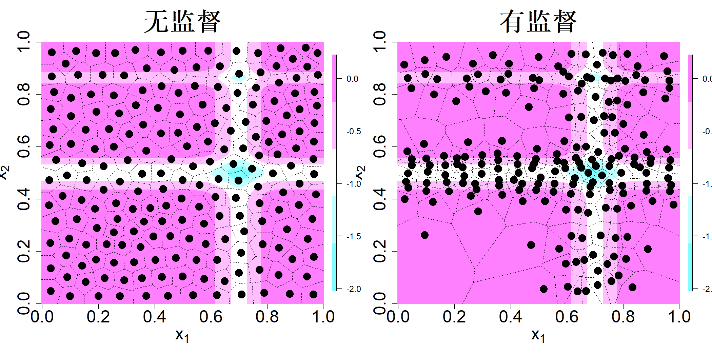

## 10.4 有监督压缩

尽管数据集包含响应信息，但除了确保子样本

$$
\mathcal{S}=\{(\boldsymbol{x}_i,\boldsymbol{y}_i)\}_{i=1}^n
$$

的联合分布与数据集

$$
\mathcal{D}=\{(\boldsymbol{X}_i,\boldsymbol{Y}_i)\}_{i=1}^n
$$

的联合分布保持一致外，我们并未利用这些响应信息来筛选子样本。不过，如果获取子样本的目的是构建预测模型，那么依据响应中的信息来挑选样本是合理的。以图 10.2 中的风电数据为例：当风速低于 3 米/秒或高于 13 米/秒时，输出功率几乎没有变化，因此只需选取风速区间 [3,13] 内的数据构成子样本就足够了。该做法建立在一个前提之上：我们所采用的建模方法能够刻画输入‑输出关系的这种非平稳特性。如图 10.2 所示，平稳高斯过程显然无法很好地处理该数据集。此时我们就需要使用可以处理非平稳特性的高斯过程模型，例如树结构高斯过程（格拉梅西和李，2008）或者复合高斯过程（巴和约瑟夫，2012）。

假设我们有一个连续标量输出。记基于子样本拟合得到的模型为 $y=\widehat{h}(\boldsymbol{x}|S)$。在平方误差损失下，我们的目标是通过

$$
\min_{\mathcal{S}}L=\sum_{i=1}^{N}\{Y_i-\widehat{h}(\boldsymbol{X}_i|S)\}^2
\tag{10.3}
$$

求解最优子样本。在执行该优化之前，我们需要选定 $\widehat{h}$。如果选择线性回归模型，那么得到的最优子样本仅对该选定的线性模型最优，在其他模型上效果可能较差。因此，为了让子样本对模型选择具备鲁棒性，我们需要为 $\widehat{h}$ 选用非参数回归模型。但如果选用树模型或者复合高斯过程，其估计与计算成本很高，求解最优子样本所需耗时会过大，从而失去实用价值。因此，我们需要选取灵活且计算速度快的简单非参数模型。约瑟夫与马克（2021）为此提出采用最近邻法（1‑NN）。

最近邻预测器定义为：

$$
\widehat{h}(\boldsymbol{x}|\mathcal{S})=y_i
$$

其中 $i=\argmin_{j=1:n}\|\boldsymbol{x}-\boldsymbol{x}_j\|$。因此，对于给定点集 $\{\boldsymbol{x}_1,\dots,\boldsymbol{x}_n\}$，我们可以将数据集的索引集（即 $\{1,\dots,N\}$）划分为若干索引集 $I_i,i=1,\cdots,n$，每个 $I_i$ 收集数据集中距离点 $x_i$ 最近的所有样本索引：

$$
I_i=\{j:\|\boldsymbol{X}_j-\boldsymbol{x}_i\|<\|\boldsymbol{X}_j-\boldsymbol{x}_{i'}\|,\forall i'\ne i\},\quad i=1,\cdots,n
\tag{10.4}
$$

显然有 $\bigcup_{i=1}^{n}I_i=\{1,\dots,N\}$，且当 $i\ne j$ 时 $I_i\cap I_j=\varnothing$。式 (10.4) 中的最近邻区域与我们在第 4 章大量使用的沃罗诺伊区域完全一致。于是，式 (10.3) 中的损失函数可以化简为：

$$
\begin{align*}
L&=\sum_{i=1}^{n}\sum_{j\in I_i}\{Y_j-\widehat{h}(\boldsymbol{X}_j|\mathcal{S})\}^2\\
&=\sum_{i=1}^{n}\sum_{j\in I_i}\{Y_j-y_i\}^2
\end{align*}
$$

将损失 $L$ 关于 $\{y_1,\dots,y_n\}$ 求极小，可得到熟知的解：

$$
y_i=\frac{\sum_{j\in I_i}Y_j}{N_i}=\overline{Y}_i
$$

其中 $N_i$ 为第 $i$ 个簇内的样本数量。由此，式 (10.3) 的优化问题简化为：

$$
\min_{\boldsymbol{x}_1,\dots,\boldsymbol{x}_n}L=\sum_{i=1}^{n}\sum_{j\in I_i}\{Y_j-\overline{Y}_i\}^2
\tag{10.5}
$$

尽管该优化问题形式上与 k‑均值聚类十分相似，但二者本质完全不同：本问题需要在输入空间求解最优划分，而非在输出空间求解。

约瑟夫和马克（2021）提出了一种序列算法来近似求解 (10.5) 式。该算法首先利用 k 均值生成若干个点（通常为两个）。随后，算法找出误差平方和 $\sum_{j \in I_i}\{Y_j-\overline{Y}_i\}^2$ 最大的聚类。将该聚类拆分为两个聚类，不断迭代，直至得到目标聚类数量。

考虑一份基于米哈伊维奇函数并加入部分噪声生成的模拟数据集，形式如下：

$$
Y_i=-\sum_{k=1}^{2}\sin(\pi X_{ik})\sin^{20}(k\pi X_{ik}^2)+\epsilon_i
$$

其中 $\boldsymbol{X}_i\stackrel{\text{iid}}{\sim}\mathcal{U}(0,1)^2$，$\epsilon_i\stackrel{\text{iid}}{\sim}\mathcal{N}(0,0.01^2)$，$i=1,\dots,N$。取 $N=10000$，假设我们希望将该数据集压缩至规模 $n=100$。约瑟夫与马克（2021）提出的算法在 R 软件包 supercompress（黄与约瑟夫，2022）中实现。这 100 个样本点及其沃罗诺伊（Voronoi）区域如图 10.6 右侧子图所示。作为对比，该图左侧子图展示了采用 k 均值算法完成的无监督样本点选取。可以看到，k 均值算法将样本点均匀散布在输入区域内，而有监督压缩算法则在响应变量变化剧烈的区域选取更多样本点，在变化平缓的区域选取更少样本点。因此，k 均值算法得到的沃罗诺伊区域大小基本一致，而有监督压缩算法得到的沃罗诺伊区域在高变化区域更小，在低变化区域更大。显然，对于能够捕捉函数非平稳特性的模型，使用有监督压缩选出的样本点效果会远优于 k 均值选出的样本点。从定量角度来看，最近邻预测器在无监督样本集下的均方根预测误差为 $0.1556$，在有监督样本集下为 $0.0996$，预测精度提升 $36\%$。不过，有监督压缩算法的计算复杂度为 $\mathcal{O}(pnN\log N)$，这使得它相比用于数据降维的无监督孪生算法运算速度要慢得多。

> **图 10.6**：从 10000 个样本中分别通过 k 均值算法（左）与有监督压缩算法（右）选出 100 个样本点。样本点叠加在用于生成数据的米哈伊维奇函数图像之上

{width=67%}