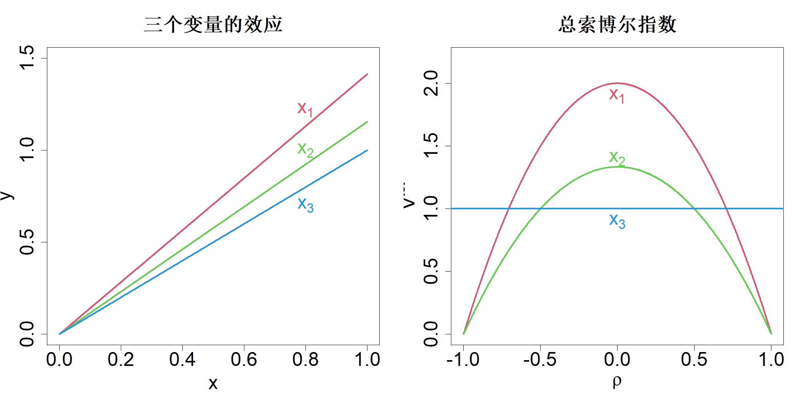
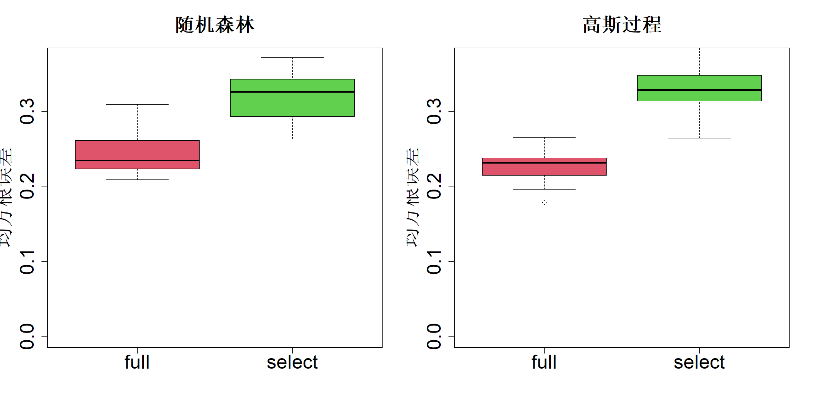

# 11 数据分析

数据分析的一个主要目标是识别对输出结果产生影响的重要输入变量，并利用这些重要变量构建预测模型。传统上，试验设计并不被视作一种数据分析技术，而是当作数据采集与规划的工具。本章旨在说明，我们在前面章节所探讨的试验设计及其相关技术可应用于数据分析与预测建模。我们将会看到，将这些技术审慎地融入数据分析与建模工作中，能够得到更优质、更高效的结果，在处理大数据时效果尤为突出。

## 11.1 因子选择与排序

变量选择被视为统计学中最重要的研究课题之一。由于需要对黑盒统计模型与机器学习模型进行解读和解释，该课题近来重新受到关注。变量选择在相关文献中已有很长的研究历史，而该方向研究至今尚未形成定论，也说明了其研究难度。幸运的是，我们已经在第 6 章为构建变量选择方法奠定了必要的理论基础。我们可以借助全局敏感性指数量化变量的重要程度，并将其用于变量筛选与排序。但在数据分析问题中，我们仅拥有数据集 $\{(\boldsymbol{x}^{^{(i)}}, y^{^{(i)}})\}_{i=1}^N$，其中 $\boldsymbol{x}^{^{(i)}}\in\mathrm{R}^p$。这代表我们无法获取计算机模型，也不掌握变量的分布情况，这极大提升了该问题的复杂程度。

要理解数据分析问题中度量因子重要性所面临的各类难题，我们首先回顾第 6 章介绍过的部分概念。我们用于因子筛选的核心指标之一是总索博尔指数（霍马与萨泰利，1996）。设 $y=h(\boldsymbol{x})$，$\boldsymbol{x}\in[0,1]^p$ 为输入‑输出关系，我们假定该关系已知，或至少可以借助计算机代码，由给定输入值得到对应输出。将 $\boldsymbol{x}$ 视作服从均匀分布的随机变量，即 $\boldsymbol{x}\sim\mathcal{U}(0,1)^p$，则第 $i$ 个因子的总索博尔指数定义为：

$$
T_i=\frac{V_i^{\mathrm{tot}}}{V}=\frac{\mathrm{E}\{\mathrm{var}[h(\boldsymbol{x})|\boldsymbol{x}_{\sim i}]\}}{\mathrm{var}\{h(\boldsymbol{x})\}}
\tag{11.1}
$$

我们曾提出基于蒙特卡洛与试验设计的方法来估计该指数，当 $T_i$ 取值较大时判定因子重要，$T_i$ 取值较小时判定因子不重要。但在实际数据分析问题中，情况存在诸多不同：（1）输入‑输出关系是未知的；（2）输入变量的联合分布与条件分布未知，且很可能偏离均匀分布；（3）数据含有噪声，还可能属于非结构化数据，无法通过试验设计采集新样本；（4）输入变量未必相互独立。

我们可以利用非参数回归或机器学习技术，通过数据对未知的输入‑输出关系进行估计，以此尝试解决第一个问题。但该方法实施难度大、耗时长，在数据量庞大的情况下尤为突出。此外，估计过程产生的误差会使重要性度量出现偏差。同理，我们可以借助密度估计来处理第二个问题，但密度估计本身就是一项艰巨的工作，在高维问题中更是如此。倘若前两个问题能够得到解决，我们就可以利用已估计得到的函数与分布来解决第三个问题。

这里我们将介绍另一种方法，用以同时处理前三个问题。不过，关于相关输入变量的第四个问题十分关键，因为它会对索博尔指数的有效性提出质疑，因此在采用该方法之前需要对此展开讨论。倘若变量之间不相互独立，那么我们用于方差分解的正交性条件将不再成立，作为索博尔指数理论基础的函数方差分析也会失效。举个例子：

$$
\begin{align*}
&y=2x_1+2\sqrt{3}x_2+x_3
\tag{11.2}\\
&\begin{bmatrix}x_1\\x_2\end{bmatrix}
\sim\mathcal{N}\left(\begin{bmatrix}0\\0\end{bmatrix},
\begin{bmatrix}1&\rho\\\rho&1\end{bmatrix}\right),x_3\sim\mathcal{N}(0,1)
\end{align*}
$$

由于该模型为可加模型，各变量的影响效果可以直观呈现，如图 11.1 左图所示。如果忽略变量间的相关性，显然 $x_1$ 是最重要的变量，$x_2$ 次之，$x_3$ 重要性最低。但当相关系数 $|\rho|$ 取值较大时，若模型中已经包含 $x_1$，再加入 $x_2$ 并不会带来增益，反之亦然。鉴于 $x_1$ 比 $x_2$ 更为重要，我们可以选用 $(x_1,x_3)$ 构建预测模型，舍弃 $x_2$。

> **图 11.1**：式 (11.2) 中模型的三个变量的效应（左侧）及其总索博尔指数（右侧）

{width=67%}

现在我们来看这个简单线性模型的总索博尔指数。由于式 (11.1) 中的分母对所有变量均为常数，我们只需考虑分子 $V_i^{\mathrm{tot}}$。其结果为：

$$
V_1^{\mathrm{tot}}=4(1-\rho^2),\quad V_2^{\mathrm{tot}}=\frac{4}{3}(1-\rho^2),\quad V_3^{\mathrm{tot}}=1
$$

绘制于图 11.1 的右侧子图。当相关性较小，即 $|\rho|<0.5$ 时，总索博尔指数与我们的直观认知一致：$x_1\succ x_2\succ x_3$，其中“$\succ$”表示“比……更重要”。但当相关性较高时，总索博尔指数的结果就显得不合常理。事实上，当 $|\rho|\to1$ 时，$x_1$ 与 $x_2$ 的总索博尔指数趋近于零，意味着这两个变量都不重要。但实际情况显然并非如此！

现有文献中已提出诸多方法，旨在解决输入变量存在相关性时总索博尔指数存在的缺陷。其中一种主流方法是借助博弈论中的沙普利值计算重要性测度（欧文，2014；宋等人，2016），该方法可看作是在所有可能的变量子集上计算得到的总索博尔指数的加权平均值（韦迪内利和沃瑟曼，2024）。另一种颇具价值的方法是由博尔戈诺沃（2007）提出的基于条件密度的灵敏度测度。更多详细内容可参阅达·韦加等人（2021，第 5 章）的专著及其引用的相关文献。

哈特与格雷莫（2018）提出了关于总索博尔指数的全新视角：若从模型中剔除某一变量，同时固定其余所有变量，总索博尔指数可看作该情形下的 $L_2$ 近似误差。为理解这一点，首先注意，当剔除变量 $x_i$ 时，对函数 $y=h(\boldsymbol{x})$ 进行近似的最优模型可写为：

$$
h_{\sim i}(\boldsymbol{x}_{\sim i})=\argmin_{g(\boldsymbol{x}_{\sim i})}\mathrm{E}\{h(\boldsymbol{x})-g(\boldsymbol{x}_{\sim i})\}^2=\mathrm{E}\{h(\boldsymbol{x})|\boldsymbol{x}_{\sim i}\}
$$

采用该最优形式后，近似误差为：

$$
\begin{align*}
\mathrm{E}\{h(\boldsymbol{x})-h_{\sim i}(\boldsymbol{x}_{\sim i})\}^2&=\mathrm{E}\{h(\boldsymbol{x})-\mathrm{E}[h(\boldsymbol{x})|\boldsymbol{x}_{\sim i}]\}^2\\
&=\mathrm{E}(\mathrm{E}\{h(\boldsymbol{x})-\mathrm{E}[h(\boldsymbol{x})|\boldsymbol{x}_{\sim i}]|\boldsymbol{x}_{\sim i}\}^2)\\
&=\mathrm{E}(\mathrm{var}\{h(\boldsymbol{x})|\boldsymbol{x}_{\sim i}\})\\
&=V_i^{\mathrm{tot}}
\end{align*}
$$

黄与约瑟夫（2025a）指出，总索博尔指数的这一解释与雷等人（2018）、威廉姆森等人（2021）以及韦尔迪内利和瓦瑟曼（2024）所提出的剔除协变量（LOCO）方法相一致。事实上，他们证明了如下结论。

> **定理 11.1**：总索博尔指标 $T_i=0$ 的充要条件是 $h(\boldsymbol{x})\perp\boldsymbol{x}_i|\boldsymbol{x}_{\sim i}$，即 $h(\boldsymbol{x})$ 与 $\boldsymbol{x}_i$ 在给定 $\boldsymbol{x}_{\sim i}$ 的条件下相互独立。

因此，尽管在变量存在相关性的情况下，总索博尔指数的绝对值可能没有实际意义，但仍可将其作为筛选因子的度量指标。

在将总索博尔指数用于因子筛选之前，我们需要提出一种可基于非结构化、存在相关性且含噪声的数据对其进行估计的方法。如前文所述，我们可以采用非参数回归方法，由数据估计得到底层模型。为降低模型拟合效果不佳所带来潜在偏差的发生概率，威廉姆森等人（2021）提出采用模型集成方案。但该方式会大幅提升方法的计算复杂度。为解决计算负担问题，同时保证模型具备鲁棒性，黄与约瑟夫（2025a）提出了一种与模型无关的总索博尔指数估计方法。该方法建立在布罗托等人（2020）针对纯净数据所提出的基于最近邻的估计流程之上。

首先注意，总索博尔指数的分子可采用双重蒙特卡洛估计器进行估计（宋等人，2016）：

$$
\widehat{V}_i^{\mathrm{tot}}=\frac{1}{N_O}\sum_{m=1}^{N_O}\left\{\frac{1}{N_I-1}\sum_{j=1}^{N_I}\left(h(\boldsymbol{x}^{(m)}_{\sim i},x^{(m,j)}_i)-\frac{1}{N_I}\sum_{l=1}^{N_I}h(\boldsymbol{x}^{(m)}_{\sim i},x^{(m,l)}_i)\right)^2\right\}
\tag{11.3}
$$

式中 $\{\boldsymbol{x}^{(m)}_{\sim i}\}_{m=1}^{N_O}$ 是取自 $\boldsymbol{x}_{\sim i}$ 分布的独立同分布样本；给定 $\boldsymbol{x}^{(m)}_{\sim i}$ 条件下，$\{x^{(m,j)}_i\}_{j=1}^{N_I}$ 服从条件分布 $x_i|\boldsymbol{x}_{\sim i}=\boldsymbol{x}^{(m)}_{\sim i}$，且为独立同分布样本。当 $N_I=2$ 时，该式退化为式 (6.7) 中的詹森‑索博尔估计器。由于函数 $h(\cdot)$ 未知，布罗托等人（2020）提出，将内层循环设计 $\{(\boldsymbol{x}^{(m)}_{\sim i},x^{(m,j)}_i)\}_{j=1}^{N_I}$ 替换为样本集 $\{\boldsymbol{x}^{(n)}\}_{n=1}^{N}$ 里 ${\sim i}$ 分量与 $\boldsymbol{x}^{(m)}_{\sim i}$ 最接近的 $N_I$ 个样本。更严谨地，设 $k^{(m)}_{\sim i}(j)$ 为下标，使得 $\boldsymbol{x}^{(k^{(m)}_{\sim i}(j))}_{\sim i}$ 是样本集合 $\{\boldsymbol{x}^{(n)}_{\sim i}\}_{n=1}^{N}$ 中距离 $\boldsymbol{x}^{(m)}_{\sim i}$ 第 $j$ 近的元素；若出现距离相等的情况，则通过随机选取处理。此时 $V_i^{\mathrm{tot}}$ 的双重蒙特卡洛估计器写作：

$$
\widehat{V}_i^{\mathrm{tot}}=\frac{1}{N_O}\sum_{m=1}^{N_O}\left\{\frac{1}{N_I-1}\sum_{j=1}^{N_I}\left(y^{(k^{(m)}_{\sim i}(j))}-\frac{1}{N_I}\sum_{l=1}^{N_I}y^{(k^{(m)}_{\sim i}(l))}\right)^2\right\}
\tag{11.4}
$$

对于外层循环蒙特卡洛，样本集 $\{\boldsymbol{x}^{(m)}_{\sim i}\}_{m=1}^{N_O}$ 既可以取全部样本 $\{\boldsymbol{x}^{(n)}_{\sim i}\}_{n=1}^{N}$；当样本总量 $N$ 较大时，也可以取自 $\{\boldsymbol{x}^{(n)}_{\sim i}\}_{n=1}^{N}$ 的随机子样本（允许放回或不放回抽样）。

现在假设输出受到加性随机误差的干扰：$y^{(i)}=h(\boldsymbol{x}^{(i)})+\epsilon_i$，其中 $\epsilon_i$ 独立同分布服从正态分布 $\mathcal{N}(0,\sigma^2)$。利用全空间进行最近邻搜索，可按照式 (11.4) 得到 $\sigma^2$ 的估计值：

$$
\widehat{\sigma}^2=\frac{1}{N_O}\sum_{m=1}^{N_O}\left\{\frac{1}{N_I-1}\sum_{j=1}^{N_I}\left(y^{(k^{(m)}_{1:p}(j))}-\frac{1}{N_I}\sum_{l=1}^{N_I}y^{(k^{(m)}_{1:p}(l))}
\right)^2\right\}
\tag{11.5}
$$

由于

$$
\mathrm{E}[\mathrm{var}\{y|\boldsymbol{x}_{\sim i}\}]=\mathrm{E}[\mathrm{var}\{h(\boldsymbol{x})+\epsilon|\boldsymbol{x}_{\sim i}\}]=V_i^{\mathrm{tot}}+\sigma^2
$$

据此可由式 (11.4) 得到 $V_i^{\mathrm{tot}}$ 的无偏估计：

$$
V_i^{\mathrm{tot}}=\frac{1}{N_O}\sum_{m=1}^{N_O}\left\{\frac{1}{N_I-1}\sum_{j=1}^{N_I}\left(y^{(k^{(m)}_{\sim i}(j))}-\frac{1}{N_I}\sum_{l=1}^{N_I}y^{(k^{(m)}_{\sim i}(l))}\right)^2\right\}-\widehat{\sigma}^2
\tag{11.6}
$$

该估计量无法保证取值非负。因此，若计算结果为负，则取 $V_i^{\mathrm{tot}}=0$。

上述估计量可用于构建前向选择算法，具体如下。由一组因子 $u$ 所解释的 $h(\boldsymbol{x})$ 的方差为：

$$
\begin{align*}
V_{u}&=\mathrm{var}[\mathrm{E}\{h(\boldsymbol{x})|\boldsymbol{x}_{u}\}]\\
&=\mathrm{var}\{h(\boldsymbol{x})\}-\mathrm{E}[\mathrm{var}\{h(\boldsymbol{x})|\boldsymbol{x}_{u}\}]\\
&=\mathrm{var}(y)-\mathrm{E}[\mathrm{var}\{h(\boldsymbol{x})+\epsilon|\boldsymbol{x}_{u}\}]
\end{align*}
$$

因此，$V_{u}$ 的估计式为：

$$
\widehat{V}_{u}=\widehat{\mathrm{var}}(y)-\frac{1}{N_O}\sum_{m=1}^{N_O}\left\{\frac{1}{N_I-1}\sum_{j=1}^{N_I}\left(y^{(k_{u}^{(m)}(j))}-\frac{1}{N_I}\sum_{l=1}^{N_I}y^{(k_{u}^{(m)}(l))}\right)^2\right\}
\tag{11.7}
$$

接下来可以逐个选取使 $\widehat{V}_{u}$ 最大化的因子。黄与约瑟夫（2025a）还采用后向消元法进一步优化该选择流程。前向选择与后向消元策略还能够缓解近邻方法中存在的维度灾难问题。他们将整套算法命名为基于总指标的因子重要性排序与选择（FIRST）。该算法已在 R 程序包 first（黄和约瑟夫，2025b）中实现。在黄与约瑟夫（2025a）开展的大量模拟实验中，基于总指标的因子重要性排序与选择在现有各类因子选择方法里，取得了最优的选择效果，同时运算速度也最快。

可通过逐个剔除基于总指标的因子重要性排序与选择方法指数最小的因子，并将剔除顺序反转，完成所选因子的排序。例如，考察式 (11.2) 中的线性模型。我们生成 1000 个 $\rho=0.9$ 的数据点。可借助 R 语言 first 程序包中的 first 函数得到总索博尔指数：$\widehat{T}^{\mathrm{tot}}_1=0.060$，$\widehat{T}^{\mathrm{tot}}_2=0.026$，$\widehat{T}^{\mathrm{tot}}_3=0.114$。据此，$x_2$ 重要性最低，将其剔除。此时仅保留 $x_1$ 与 $x_3$，计算得到 $\widehat{T}_1=0.886$、$\widehat{T}^{\mathrm{tot}}_3=0.109$。接下来剔除 $x_3$，仅剩余 $x_1$。由此得到因子排序：$x_1\succ x_3\succ x_2$，与预期结果一致。

现在来看一个真实数据集：叶（1998）提出的混凝土抗压强度数据集，该数据集可从 UCI 机器学习库获取（杜阿与格拉夫，2017）。该数据集包含 $N=1030$ 条样本，拥有 8 个连续预测变量，对应混凝土组分与龄期，还有 1 个响应变量：抗压强度。首先，借助 SPlit 方法（瓦卡伊尔等人，2022）按照 95:5 的比例将数据集划分为训练集与测试集。随后，分别使用全部 8 个预测变量，以及通过 FIRST 筛选得到的预测变量（约 4 个因子），在训练数据上拟合随机森林模型和采用高斯相关函数的高斯过程模型（OK）。随机森林通过 R 语言包 randomForest 完成拟合（廖和维纳，2002），高斯过程模型则使用 rkriging 包实现（黄与约瑟夫，2024）。之后在测试集上计算预测均方根误差（RMSE）。将上述流程重复 30 次，得到的均方根误差结果以箱线图形式呈现在图 11.2 中。尽管相较于使用全部预测变量，采用筛选后的预测变量得到的均方根误差数值更高，但考虑到仅使用了大约一半的预测变量，该表现仍属于可接受水平。

> **图 11.2**：采用全部八个预测变量，以及通过基于总指标的因子重要性排序与选择方法筛选得到的因子集，分别使用随机森林（左侧）与高斯过程（右侧），在混凝土数据集测试集上得到的均方根预测误差

{width=67%}