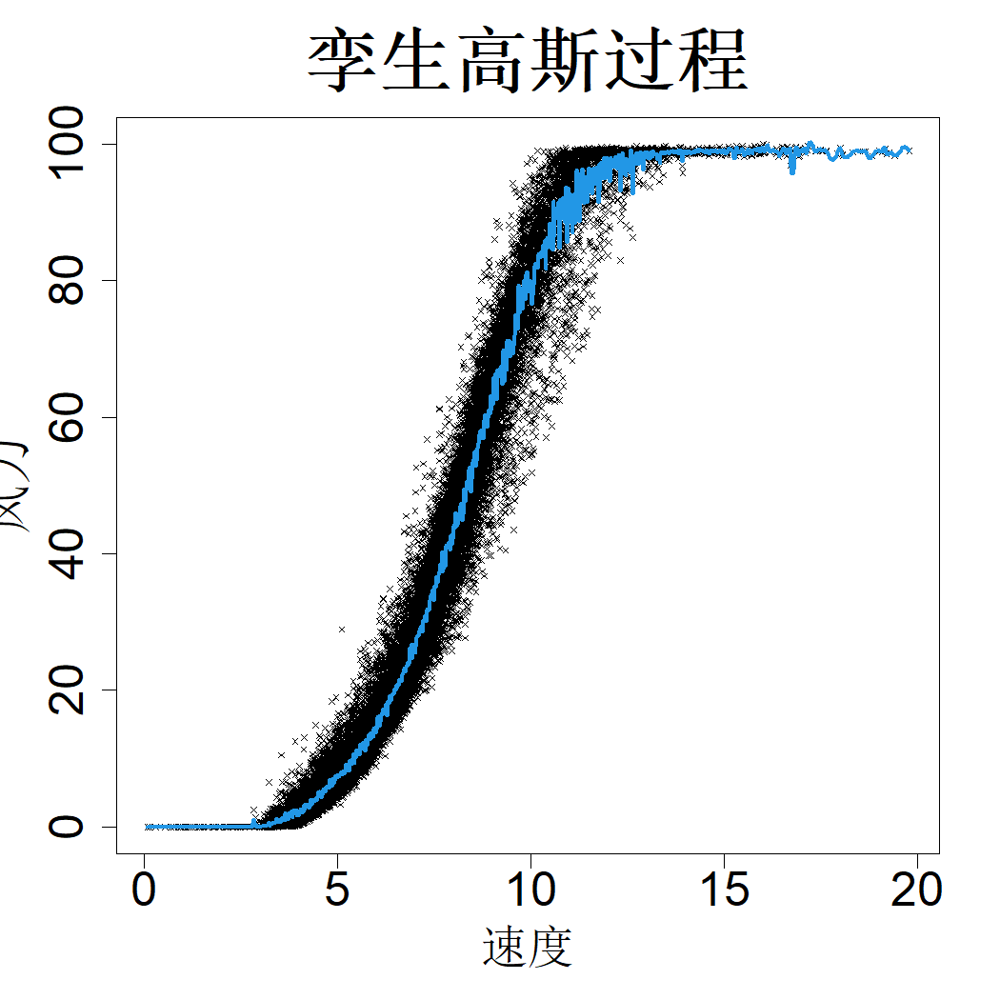

## 11.2 孪生高斯过程

考虑我们在 2.2.3 节中讨论的高斯过程回归问题：

$$
y=h(\boldsymbol{x})+\epsilon,\quad h(\boldsymbol{x})\sim\mathrm{GP}(\mu,\tau^2R(\cdot)),\quad\epsilon\stackrel{\mathrm{iid}}{\sim}\mathcal{N}(0,\sigma^2)
$$

但本次使用大规模数据集 $(\boldsymbol{X}_N,\boldsymbol{Y}_N)=\{(\boldsymbol{X}^{(i)},\boldsymbol{Y}^{(i)})\}_{i=1}^N$。例如，在第 10 章中，我们接触到风电数据集（丁，2019），该数据集包含 $N=39195$ 个样本点。该数据规模超出了高斯过程模型的处理能力，因此我们借助支撑点抽取了 392 个样本点，并对高斯过程模型进行拟合。在主频 2.10 吉赫兹的台式计算机上，利用 rkriging 对该子样本完成拟合仅需约 0.3 秒。由于高斯过程模型的拟合计算复杂度为 $\mathcal{O}(N^3)$，我们可以估算出在完整数据集上完成拟合所需时间为 $0.3\times(39195/392)^3$，大约需要 3.5 天！由此可见，在该完整数据集上拟合高斯过程模型的计算成本极高。然而，如图 10.2 所示，基于子样本拟合得到的高斯过程模型效果并不理想。因此，有必要改进高斯过程方法以适配大规模数据集，这也是统计学与机器学习领域的热门研究方向（格拉马西，2020，第 9 章）。

高斯过程的计算瓶颈来源于需要对 $N\times N$ 维相关矩阵 $\boldsymbol{R}$ 求逆与计算行列式。因此，部分方法采用具有紧支撑相关函数的稀疏矩阵技术来简化上述计算（富勒等人，2006；考夫曼等人，2011），但该做法会损害高斯过程的预测性能。另一种方法是将数据区域划分为若干较小子区域，在各个子区域内拟合高斯过程，再整合预测结果（特雷斯普，2000；格拉马西和李，2008；曹和弗利特，2014），但该方法的预测结果会出现不连续问题。帕克与阿普利（2018）尝试通过在子区域边界引入伪观测值来解决不连续问题，代价是计算开销有所增加。处理大规模数据集的另一类思路是从全部区域中选取少量具有代表性的子样本，基于子样本拟合全局高斯过程，本文针对风电数据集便采用了该思路。该方法与稀疏高斯过程方法密切相关（基尼奥内罗-坎德拉和拉斯穆森，2005；斯内尔森和加拉马尼，2005；蒂西亚斯，2009）。对该方法的一种改进是在多个子样本上分别构建高斯过程并对结果取平均（特雷斯普，2000；戴森罗特和吴，2015；李和马克，2025）。格拉马西与阿普利（2015）提出根据预测位置选取部分数据点，以此拟合局部高斯过程。还有一种广为使用的方法是韦基亚近似（韦基亚，1988），该方法按照某种数据排序方式，将似然函数分解为若干单变量条件分布的乘积（卡茨富斯和吉尼斯，2021）。

由于可以通过试验设计方法获取全局和局部点子集，本文将介绍瓦卡伊尔与约瑟夫（2022a）提出的方法，该方法融合了全局与局部高斯过程（GP）近似方法。我们可以采用 10.3 节介绍的孪生采样法，从大型数据集中快速获取高质量子样本，再利用该子样本构建全局高斯过程模型。但如图 10.2 所示，该模型的预测误差可能较大。假设我们需要对风速约 20 米/秒时的功率进行预测，该数值附近存在大量数据点，我们本可以利用这些数据构建预测效果更优的模型。一种实现思路是求解全局高斯过程模型的残差，仅使用 20 米/秒附近的数据点拟合局部高斯过程模型，随后将局部高斯过程的预测值与全局高斯过程的预测值相加，得到最终预测结果。巴与约瑟夫（2012）研究表明，这类两阶段高斯过程预测器等价于将目标底层函数建模为两个高斯过程之和，这又等价于拟合单个高斯过程，其相关函数形式如下：

$$
R(\boldsymbol{\Delta})=(1-\lambda)G(\boldsymbol{\Delta})+\lambda L(\boldsymbol{\Delta})
\tag{11.8}
$$

式中 $G(\cdot)$ 为全局高斯过程的相关函数，$L(\cdot)$ 为局部高斯过程的相关函数，$\lambda\in[0,1]$ 为权重系数，用于权衡全局高斯过程与局部高斯过程的预测结果。基于孪生数据集 $D_g$、$D_l$ 以及孪生相关函数 $G(\cdot)$、$L(\cdot)$，瓦卡伊尔与约瑟夫（2024a）将该方法命名为孪生高斯过程。

将通过孪生法得到的 $n_g$ 个全局训练点记为 $D_g=\{\boldsymbol{x}_i\}_{i=1}^{n_g}$，将在预测点 $\boldsymbol{x}$ 周边获取的 $l$ 个局部训练点记为 $D_l(\boldsymbol{x})=\{X_{\mathcal{L}}(\boldsymbol{x})\}$，其中 $\mathcal{L}(\boldsymbol{x})$ 代表局部点索引集合。格拉马西与阿普利（2015）介绍了用于更精细地选取局部点的序贯设计方法，但为节约计算时间，我们省略该步骤。取而代之的是，对于给定测试位置 $\boldsymbol{x}$，我们在 $\{X_i\}_{i=1}^{N}\setminus D_g$ 中选取距离 $\boldsymbol{x}$ 最近的 $l$ 个近邻点得到 $D_l$，该操作可借助 kd‑树以 $\mathcal{O}(l\log l)$ 的时间复杂度高效完成。接下来我们在合并数据集 $D_c(\boldsymbol{x})=D_g\cup D_l(\boldsymbol{x})$ 上拟合高斯过程（GP），该数据集包含 $n=n_g+n_l$个样本点。为简化符号表达，下文将 $D_l(\boldsymbol{x})$ 简写为 $D_l$，将 $D_c(\boldsymbol{x})$ 简写为 $D_c$。

设 $\boldsymbol{Y}_c$ 为对应于 $\boldsymbol{D}_c$ 的 $n\times1$ 维响应值向量。于是，给定 $\boldsymbol{Y}_c$，我们可以得到后验分布：

$$
h(\boldsymbol{x})|\boldsymbol{Y}_c\sim\mathcal{N}(\widehat{y}(\boldsymbol{x}),s^2(\boldsymbol{x}))
$$

其中

$$
\begin{align*}
\widehat{y}(\boldsymbol{x})&=\widehat{\mu}_n+\boldsymbol{r}_c(\boldsymbol{x})'(\boldsymbol{R}_{cc}+\eta\boldsymbol{I}_n)^{-1}(\boldsymbol{Y}_c-\widehat{\mu}_n\boldsymbol{1}_n)\\
s^2(\boldsymbol{x})&=\widehat{\tau}_n^2[1+\eta-\boldsymbol{r}_c(\boldsymbol{x})'(\boldsymbol{R}_{cc}+\eta\boldsymbol{I}_n)^{-1}\boldsymbol{r}_c(\boldsymbol{x})]\\
\widehat{\mu}_n&=\frac{\boldsymbol{1}_n'(\boldsymbol{R}_{cc}+\eta\boldsymbol{I}_n)^{-1}\boldsymbol{Y}_c}{\boldsymbol{1}_n'(\boldsymbol{R}_{cc}+\eta\boldsymbol{I}_n)^{-1}\boldsymbol{1}_n}\\
\widehat{\tau}_n^2&=\frac{1}{n}(\boldsymbol{Y}_c-\widehat{\mu}_n\boldsymbol{1}_n)'(\boldsymbol{R}_{cc}+\eta\boldsymbol{I}_n)^{-1}(\boldsymbol{Y}_c-\widehat{\mu}_n\boldsymbol{1}_n)
\end{align*}
$$

式中 $\boldsymbol{r}_c(\boldsymbol{x})$ 为 $n\times1$ 维相关向量；$\boldsymbol{R}_{cc}$ 是利用相关函数 $R(\cdot)$ 得到的组合数据集 $\boldsymbol{Y}_c$ 对应的 $n\times n$ 维相关矩阵；$\eta=\sigma^2/\widehat{\tau}_n^2$。该方法的难点在于，需要在每个预测位置 $\boldsymbol{x}$ 处计算 $(\boldsymbol{R}_{cc}+\eta\boldsymbol{I}_n)^{-1}$，当测试集规模较大时，计算开销会很高。不过该计算可以按如下方式简化。首先，对矩阵 $\boldsymbol{R}_{cc}$ 做分块：

$$
\begin{align*}
\boldsymbol{R}_{cc}&=\begin{bmatrix}
\boldsymbol{R}_{gg} &\boldsymbol{R}_{gl}\\
\boldsymbol{R}_{lg} &\boldsymbol{R}_{ll}
\end{bmatrix}\\
&=\begin{bmatrix}
(1-\lambda)\boldsymbol{G}_{gg}+\lambda\boldsymbol{L}_{gg} & (1-\lambda)\boldsymbol{G}_{gl}+\lambda\boldsymbol{L}_{gl}\\
(1-\lambda)\boldsymbol{G}_{lg}+\lambda\boldsymbol{L}_{lg} & (1-\lambda)\boldsymbol{G}_{ll}+\lambda\boldsymbol{L}_{ll}
\end{bmatrix}
\end{align*}
$$

其中 $\boldsymbol{R}_{gg}$ 是对应于 $\boldsymbol{Y}_g$ 的 $n_g\times n_g$ 维相关矩阵，$\boldsymbol{R}_{ll}$ 是对应于 $\boldsymbol{Y}_l$ 的 $n_l\times n_l$ 维相关矩阵，$\boldsymbol{R}_{gl}=\boldsymbol{R}_{lg}'$ 为 $n_g\times n_l$ 维互相关矩阵。矩阵 $\boldsymbol{G}_{gg}$、$\boldsymbol{L}_{gg}$ 等可依据式 (11.8) 中的相关函数 $G(\cdot)$ 与 $L(\cdot)$ 按相同方式定义。接下来，利用分块矩阵求逆公式（引理 2.1）可得：

$$
(\boldsymbol{R}_{cc}+\eta\boldsymbol{I}_n)^{-1}=\begin{bmatrix}
\boldsymbol{\Sigma}_{gg}^{-1}+\boldsymbol{\Sigma}_{gg}^{-1}\boldsymbol{R}_{gl}\boldsymbol{S}^{-1}\boldsymbol{R}_{lg}\boldsymbol{\Sigma}_{gg}^{-1} & -\boldsymbol{\Sigma}_{gg}^{-1}\boldsymbol{R}_{gl}\boldsymbol{S}^{-1}\\
-\boldsymbol{S}^{-1}\boldsymbol{R}_{lg}\boldsymbol{\Sigma}_{gg}^{-1} &\boldsymbol{S}^{-1}\end{bmatrix}
\tag{11.9}
$$

式中 $\boldsymbol{\Sigma}_{gg}=\boldsymbol{R}_{gg}+\eta\boldsymbol{I}_g$，$\boldsymbol{S}=\boldsymbol{R}_{ll}-\boldsymbol{R}_{lg}\boldsymbol{\Sigma}_{gg}^{-1}\boldsymbol{R}_{gl}$。由于 $\boldsymbol{R}_{gg}=(1-\lambda)\boldsymbol{G}_{gg}+\lambda\boldsymbol{L}_{gg}$ 与测试位置 $\boldsymbol{x}$ 无关，$\boldsymbol{\Sigma}_{gg}^{-1}$ 可以在测试开始前预先计算。因此，每个测试位置仅需要对小规模的 $n_l\times n_l$ 矩阵 $\boldsymbol{S}$ 求逆，计算效率可以得到显著提升。

瓦卡伊尔与约瑟夫（2024a）提出针对 $G(·)$ 采用幂指数相关函数（见表 2.1）。其相关参数可仅利用全局数据集，按照式 (2.22) 进行计算。对于局部相关函数，他们建议采用温德兰德（2004）提出的温德兰德紧支撑径向函数：

$$
L(\boldsymbol{\Delta})=\left(\frac{q\|\boldsymbol{\Delta}\|}{\theta_{l}}+1\right)\max\left(0,\left(1-\frac{\|\boldsymbol{\Delta}\|}{\theta_{l}}\right)^{q}\right),\ q=\lfloor p/2\rfloor+3
$$

式中 $\lfloor u\rfloor$ 表示不大于 $u$ 的最大整数。该局部相关函数仅包含一个超参数 $\theta_{l}$，可将其设置为式 (4.8) 所定义的 $D_g$ 填充距离。该设置能够保证：对于任意测试点 $\boldsymbol{x}$，至少存在一个全局训练点，使得二者之间的局部核处于激活状态；即对任意 $\boldsymbol{x}$，均存在 $\boldsymbol{x}_i\in D_g$，满足 $L(\boldsymbol{x}-\boldsymbol{x}_i)>0$。

再次考虑包含 $N=39195$ 个样本点的风电数据集。孪生高斯过程在 R 语言的 twingp 程序包中实现（瓦卡伊尔与约瑟夫，2024b）。默认设置下，该方法取 $n_g\approx\sqrt{N}$、$n_l=25$，使得高斯过程（GP）拟合的计算复杂度为 $\mathcal{O}(N^{1.5})$。在含有 1000 个等间距样本点的测试集上得到的预测结果如图 11.3 所示。虽然该预测结果不如图 10.2 中的预测曲线平滑，但预测精度要高得多。整体的拟合与预测耗时不到 0.20 秒，这充分说明孪生高斯过程能够高效地对大规模数据集开展高斯过程拟合。

> **图 11.3**：对于风电数据集，孪生高斯过程的预测结果以实线展示

{width=33%}